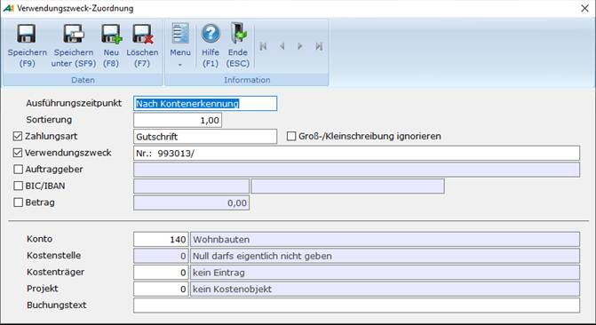

# VWZ-Zuordnung

<!-- source: https://amic.de/hilfe/vwzzuordnung.htm -->

Hauptmenü > Mahn-/Zahl-/Zinswesen > Zahlungsverkehr > e-Clearing > Funktion ***VWZ-Zuordnung* F11**

Direktsprung **[ECL]**

Es kommt vor, dass im Verwendungszweck Formulierungen vorkommen, die keine Kontonummer beinhalten, jedoch einem festen Konto zuzuordnen sind ("Miete Bürogebäude", "Zinsgutschrift",....). Oder man will für bestimmte Auftraggeber die Konten nach Gutschrift und Lastschrift teilen. Für diese Anforderungen kann man hier – getrennt für Gutschrift und Lastschrift – Konten hinterlegen, die bei der automatischen Kontierung **F6** herangezogen werden.

Der obere Teil dient dazu, die Bestandteile zu bestimmen, welche zur Identifikation verwendet werden sollen. Die Haken in der linken Spalte besagen, welches dieser Kriterien aktiv zur Bestimmung herangezogen wird. Es muss mindestens ein Haken aktiv sein. Im Beispiel oben wird also nach einer Lastschrift über 19,94 Euro von ADDVISION-WESLEY gesucht.

| | Beschreibung |
| --- | --- |
| Ausführungszeitpunkt | Hier kann „Vor Kontenerkennung“ oder „Nach Kontenerkennung“ angegeben werden. Standardeinstellung ist „Nach Kontenerkennung“.  
 |
| Sortierung  
    
 | In dieser Reihenfolge werden die Zuordnungen zur Bestimmung des Kontos herangezogen. Kann das Konto bestimmt werden, werden die folgenden VWZ-Zuordnungen ignoriert. Hat man zum Beispiel zwei Verwendungszweckzuordnungen eingerichtet, der erste so wie oben abgebildet und beim zweiten - bei dem dann Sortierung auf 2 steht - nur den Auftraggeber aktiviert, so werden die Lastschriften über 19,94 dem Konto aus der ersten Verwendungszweckzuordnung zugeordnet, alle anderen Zeilen mit diesem Auftraggeber gehen auf das Konto der zweiten Zuordnung,  
 |
| Zahlungsart | Man kann die Suche so trennen, dass sie nur für Lastschriften oder nur für Gutschriften gelten.  
 |
| Groß-/Kleinschreibung ignorieren | Diese Einstellung gilt für die Felder Verwendungszweck und Auftraggeber  
 |
| Verwendungszweck | Hier können Texte, die im Verwendungszweck enthalten sein müssen, eingegeben werden.  
 |
| Auftraggeber | Dieser Wert entspricht dem Feld hinter der Kontonummer auf der Maske zum manuellen Erfassen der Kontonummer. Es werden die Datensätze erkannt, bei denen der Auftraggeber genau stimmt – also nicht wie beim Verwendungszweck, wo nur ein Teil passen muss.  
 |
| BLZ/Konto | Bankleitzahl und Kontonummer, wie sie in der ersten Zeile des Kontoauszuges abgebildet sind. Es müssen immer beide Felder eingetragen werden. Hier kann auch BIC und IBAN eingetragen werden.  
 |
| Betrag  
 | Der Betrag muss exakt dem auf dem Kontoauszug entsprechen. |
| Konto  
 | Das Konto, dem der Betrag zugeordnet wird. Gibt man hier als Konto ein Sachkonto an, so lassen sich auch Kostenstellen, Kostenträger und ggf. Kostenobjekte entsprechend den Einstellungen im Sachkontenstamm angeben. Eine Auswahl ist mit F3 möglich.  
 |
| Kostenstelle | Ist das Konto ein Sachkonto, so lässt sich hier die [Kostenstelle](../kostenrechnung/kostenstellen.md) eintragen. Eine Auswahl ist mit F3 möglich.  
 |
| Kostenträger | Ist das Konto ein Sachkonto, so lässt sich hier der [Kostenträger](../kostenrechnung/kostentraeger.md) eintragen. Eine Auswahl ist mit F3 möglich.  
 |
| Kostenobjekt  
 | Ist das Konto ein Sachkonto, so lässt sich hier das [Kostenobjekt](../kostenrechnung/kostenobjekte/index.md) eintragen. Eine Auswahl ist mit F3 möglich.  
 |
| Buchungstext | Hier kann ein Buchungstext hinterlegt werde. Wird bei der Kontenerkennung ein passender Satz in der VWZ-Zuordnung gefunden, wird der hier eingetragene Text in den e-Clearing-Beleg übernommen und so später bei der Übernahme in die Primanota verwendet.  
 |
