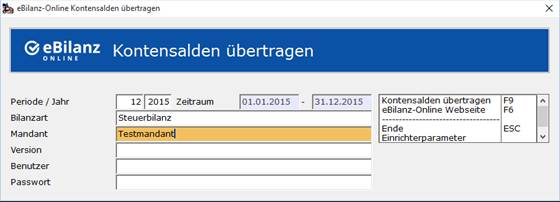

# eBilanz-Online Kontensalden übertragen

<!-- source: https://amic.de/hilfe/_ebilanz_online_kontensalden.htm -->

Hauptmenü > Abschlussarbeiten > e-Bilanz > eBilanz-Online Kontensalden

Direktsprung **[EBOK]**.

| Feld | Beschreibung |
| --- | --- |
| Periode / Jahr | Hier gibt man die Periode an, bis zu der die Salden übertragen werden sollen. Die Salden werden immer für alle Normalperioden und die Eröffnungsperiode des angegebenen Jahres bis zu der hier angegebenen Periode gebildet. Der Zeitraum ergibt sich aus dem Anfangsdatum und Enddatum aus dem Periodenstamm. Der Zeitraum muss mit dem Start-und Enddatum der periodenbezogenen Stammdaten in ebilanz-Online übereinstimmen.  |
| Bilanzart | Es können Sachkonten so gekennzeichnet werden, dass sie nur für eine Bilanzart (Handels-, Steuerbilanz bzw. für alle Bilanzarten) gelten. Hier kann man nun auswählen, aufgrund welcher Konten zusammengestellt werden.  Steuerbilanz: Alle Konten, die im Sachkontenstamm mit „Steuerbilanz“ oder „alle Bilanzarten“ gekennzeichnet sind. Handelsbilanz: Alle Konten, die im Sachkontenstamm mit „Handelsbilanz“ oder „alle Bilanzarten“ gekennzeichnet sind.  |
| Mandant | Hier wird die Mandantenbezeichnung aus dem Mandantenstamm vorgeschlagen. Diese Bezeichnung muss mit dem Mandantennamen der periodenbezogenen Stammdaten in eBilanz-Online übereinstimmen.  |
| Version | Die Bezeichnung der Version. Diese muss mit der Version der periodenbezogenen Stammdaten in eBilanz-Online übereinstimmen.  |
| Benutzer | Name eines unter eBilanz-Online eingerichteten Benutzers.  |
| Passwort | Passwort des Benutzers.  |

Sind alle Daten erfasst, können die ermittelten Kontensalden mit der Funktion ***„Kontensalden übertragen“*** **F9** direkt über einen Webservice an das eBilanz-Online übertragen werden. Mögliche Fehler wie z.B.:

- „Die periodenbezogenen Stammdaten wurden nicht gefunden (Zeitraum, Mandant oder Version überprüfen).“

  Mögliche Ursachen sind:

  1. Der Zeitraum, Mandant oder die Version stimmen nicht mit dem Vorgang(Periode) in ebilanz-Online überein.

  2. In ebilanz-Online muss erst noch ein entsprechender Vorgang(Periode) angelegt werden (siehe [Anlage eines Vorgangs](./einrichtung_auf_ebilanz_online.md#Anlage_eines_Vorgangs)).

- „Der Zugriff wurde verweigert. Bitte überprüfen Sie den Benutzer und das Passwort. Für weitere Informationen schauen Sie in die Online-Hilfe.“

  Mögliche Ursachen sind:

  1. Der Benutzer existiert nicht oder das Passwort ist inkorrekt.

  2. Der Benutzer wurde deaktiviert.

  3. Der Benutzer verfügt über keine entsprechenden Lese- und Schreibzugriffe.  
    

werden direkt angezeigt. Wenn alle Daten korrekt übertragen werden konnten, erscheint die Meldung

**„Die Übertragung war erfolgreich.“**

<strong>Hinweis:</strong> <em>Es werden lediglich die Salden übertragen. Die weitere Verarbeitung der Bilanz muss auf der Webseite von</em> [*eBilanz-Online*](http://www.ebilanzonline.de/) *geschehen.*

Nach erfolgreicher Übertragung findet man die Daten sofort auf eBilanz-Online wieder. Sie können unter Import „Kontensalden für Zuordnung“ und unter Jahresabschluss(GAAP-Modul) eingesehen werden.

Bei Verwendung von Firefox kann es notwendig sein, dass erst die Chronik gelöscht werden muss, um die aktuellen Daten unter Jahresabschluss(GAAP-Modul) zu sehen.
