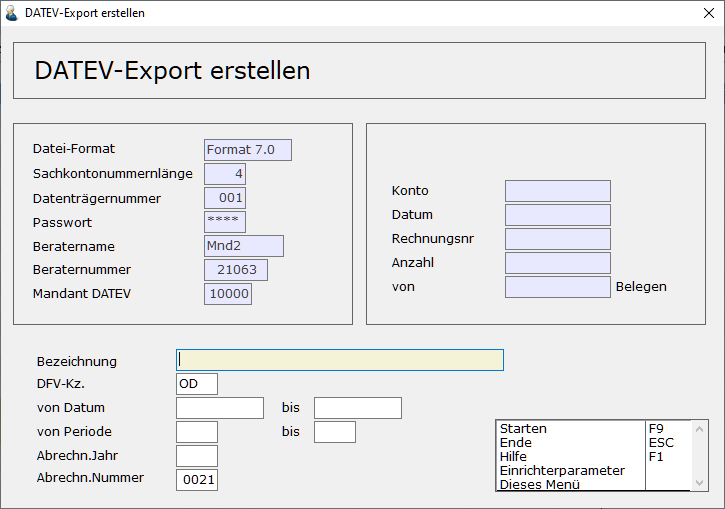

# DATEV-Export erstellen

<!-- source: https://amic.de/hilfe/datevexporterstellen.htm -->

Hauptmenü > Abschlussarbeiten > DATEV / Import / Export > DATEV-Export erstellen

 

Bei der Erstellung werden die Daten laut Eingrenzung zusammengesucht. Einmal übertragene Belege erhalten ein Kennzeichen und können somit nicht ein zweites Mal übertragen werden. Es finden auch einige Tests statt, ob die Daten im korrekt sind und dem von DATEV geforderten Format entsprechen.

Es wird nur der Export erstellt, wenn alle Belege in dem angewählten Bereich fehlerfrei gebucht sind.

Anzahl der Stellen des Betrages.

Anzahl der Stellen der Kontonummern.

Anzahl der Stellen der Kostenstellen.

| Feldname | Beschreibung |
| --- | --- |
| Bezeichnung  
 | Hier kann eine Bezeichnung zur besseren Wiedererkennung des DATEV_Exports eingegeben werden. Diese Bezeichnung wird nicht mit übertragen und ist somit nicht relevant für das Exportverfahren.  
 |
| DFV-Kz  
 | Dies ist das Namenskürzel. Es wird hier die Kurzbezeichnung des Benutzers vorgeschlagen, der den Export erstellt. Diese Information wird mit übertragen.  
 |
| Von/bis Datum  
 | Dieses Datum dient zur Abgrenzung des Zeitraums. Es werden alle Belege mit einem Belegdatum kleiner als das „bis Datum“ zusammengesucht, die noch nicht übertragen wurden. „Von Datum“ ist somit nur informatorisch zu sehen, da A.eins sicherstellen muss, dass nicht aus Versehen Belege nicht mit übertragen werden.  
 |
| Von/bis Periode und Abrechnungsjahr  
 | Die Periode und das Jahr werden wie das Datum zur Abgrenzung des Zeitraumes verwendet.  
 |
| Abrechn.Nummer  
 | Die Abrechnungsnummer ist eine laufende Nummer, die automatisch vom Programm hochgezählt wird, so dass man sich nicht darum kümmern muss. Sie kann jedoch überschrieben werden. Wird nur für die Formate OBE und KNE benötig und bei Verwendung der Formate 3.0 bzw. 7.0 nicht mehr abgefragt.  
 |

Beim Erstellen einer Datei für Buchungsstapel gilt folgende Empfehlung der DATEV: Erstellen Sie pro Buchungsperiode eine eigene Text-Datei, damit diese einzeln für die entsprechende Buchungsperiode verarbeitet werden können.
