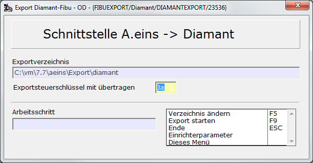
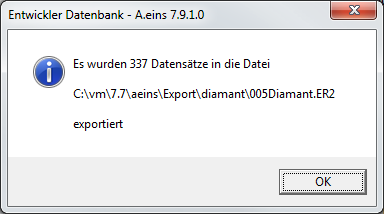

# Export Diamant-Finanzbuchhaltung

<!-- source: https://amic.de/hilfe/exportdiamantfinanzbuchhaltung.htm -->

Hauptmenü > Abschlussarbeiten > DATEV / Import / Export > Export > Variante Diamant

Direktsprung [FIEX]

Diese Variante „Diamant“ ist ein „nicht freigeschaltete Variante“ und daher erst dann zu sehen, wenn sie in der Anwendungsadministration ( Direktsprung ANW ) freigeschaltet wird.

Dem Export von Belegen aus der A.eins-Finanzbuchhaltung in die Diamant-Finanzbuchhaltung liegt eine Datenbankprozedur zugrunde, die die Daten in der Form bereitstellt, wie sie von der Importschnittstelle der Diamant-Finanzbuchhaltung erwartet werden. Dies hat den Vorteil, dass Änderungen kurzfristig nachgearbeitet werden können.

Es handelt sich um einen Belegexport - also nicht nur Offene Posten. Beim Belegexport werden alle Belege aus der Warenwirtschaft ( Einkaufsrechnungen, Einkaufsgutschriften, Ausgangsrechnungen, Ausgangsgutschriften, …), die bereits in die Fibu übertragen worden und gebucht worden sind, in eine Datei auf dem angegebenen Verzeichnis geschrieben. Es wird dabei der Fibu-Satz und der Gegenkontosatz erzeugt. Kostenrechnungsdaten werden nicht übergeben.

Das Verzeichnis lässt sich mit der Funktion Verzeichnis ändern F5 angeben. Es öffnet sich dann ein Dateiauswahl-Dialog, mit dessen Hilfe das Verzeichnis ausgewählt werden kann.

Wenn man den Schalter „Exportsteuerschlüssel mit übertragen“ auf **Ja** setzt, dann werden die im Steuersatz gepflegten Exportschlüssel übergeben, ansonsten bleibt das Feld leer und es wird nur der Steuersatz übertragen.

Bevor der eigentliche Export gestartet wird, werden eventuell vorhandene Dateien umbenannt. Sie bekommen als zusätzliche Endung die interne Nummer des letzten Exports. Diese Nummer findet man auch in der Relation Fibuvorgstamm und der Relation FibuvorgExport im Feld Fibuv_ExportIdent wieder, um eine Verbindung zwischen Daten und der Datei zu haben.

Nach dem Belegexport werden die exportierten Daten mit einem Merker und einem Eintrag in der Relation FibuvorgExport versehen, damit ein versehentliches doppeltest Exportieren nicht möglich ist. Es erscheint am Ende folgende Meldung:

