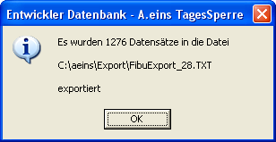

# Export IBM-Finanzwesen

<!-- source: https://amic.de/hilfe/exportibmfinanzwesen.htm -->

Hauptmenü > Abschlussarbeiten > DATEV / Import / Export > Export > Variante Belegexport IBM Finanzwesen

Direktsprung **[FIEX]**

Dem Export von Belegen aus der A.eins-Finanzbuchhaltung in das IBM-Finanzwesen (kurz FW) liegt eine Auswahlliste zugrunde, die die Daten in der Form bereitstellt, in der sie von der Importschnittstelle des FW erwartet werden. Dies hat den Vorteil, dass Änderungen im FW kurzfristig nachgearbeitet werden können. Zusätzlich zu den reinen OPs können auch noch die Kunden- bzw. Lieferantendaten und deren Anschriften exportiert werden. Dazu müssen folgende private SQLK’s eingerichtet werden:

DumpLiefData

DumpLiefAdrData

DumpKundData

DumpKundAdrData

Ob das Personenkonto als Kundenkonto oder als Lieferantenkonto betrachtet wird, geschieht über das Feld Kundtyp der Auswahlliste. Kundtyp=2 ist dann Kunde und alles andere ist Lieferant. Genauer Beschreibung zu den SQLK’s siehe Satzaufbau

Startet man den Export wird zuerst der Pfad und Dateiname abgefragt Vorgeschlagen wird bei ersten Mal das Verzeichnis „..\\Export“ und der Dateiname „FibuExport.txt“. Der Ausgewählte Pfad und Dateiname wird zwischengespeichert und bei der nächsten Verwendung dieses Programmteils wieder vorgeschlagen.

Achtung:

Der Dateiname wird zusätzlich mit der Nummer versehen, die im Fibuvorgstamm im Feld FiBuV_ExportIdent hinterlegt wird. Wenn man also EXPORT.TXT als Dateinamen angibt, wird der Name um die Nummer (z.B. 4377) erweitert, so dass der Dateiname EXPORT_4377.TXT lautet.

Nach erfolgreichem Export erscheint folgende Meldung:



<p class="just-emphasize">Satzaufbau</p>

Die Daten sind durch Komma getrennt und stehen in Hochkomma. Die Daten bestehen aus einem Vorsatz gefolgt von den eigentlichen Daten. Sie haben zurzeit folgende Struktur:

<p class="just-emphasize">Vorsatz:</p>

| Nr. | Name | Typ | Max. Länge | NK | Hinweis |
| --- | --- | --- | --- | --- | --- |
| 0 | Satzart | A | 7 | | AF1BA1 |
| 1 | Firmennummer | N | 2 | | Aus Mandantenstamm |
| 2 | Satzidentifikation | A | 20 | | Leer |
| 3 | Kurzbezeichnung | A | 20 | | Fest ‚Export’ |
| 4 | Belegdatum | D | | | Datum VSBDATUM aus der Auswahlliste |
| 5 | Textzeile 1 | A | 30 | | Leer |
| 6 | Textzeile 2 | A | 30 | | Leer |
| 7 | Textzeile 3 | A | 30 | | Leer |
| 8 | Textzeile 4 | A | 30 | | Leer |

<p class="just-emphasize">Buchungen:</p>

| Nr. | Name | Typ | Max. Länge | NK | Hinweis |
| --- | --- | --- | --- | --- | --- |
| 0 | Satzart | A | 7 | | AF1BG1 |
| 1 | Firmennummer | N | 2 | | Aus Mandantenstamm |
| 2 | Satzidentifikation | A | 20 | | Leer |
| 3 | Belegnummer | N | 7 | | |
| 4 | Belegdatum | D | | | |
| 5 | Konto Soll | N | 12 | | |
| 6 | Konto Haben | N | 12 | | |
| 7 | Betrag | N | 13 | 2 | |
| 8 | Steuer | A | 3 | | Muss umgesetzt werden. S.u. |
| 9 | OP-Nummer | N | 7 | | |
| 10 | Fremdbeleg | A | 20 | | |
| 11 | Menge | N | 13 | 4 | Immer 0 |
| 12 | Textschlüssel | A | 3 | | Wird z.Zt. nicht versorgt |
| 13 | Text Zeile 1 | A | 30 | | |
| 14 | Text Zeile 2 | A | 30 | | |
| 15 | Zahlungsbedingung | A | 3 | | Muss umgesetzt werden. S.u. |
| 16 | Fällig Netto | D | | | |
| 17 | Betrag Skonto 1 | N | 13 | 2 | |
| 18 | Fällig Skonto 1 | D | | | |
| 19 | Betrag Skonto 2 | N | 13 | 2 | Wird nicht versorgt |
| 20 | Fällig Skonto 2 | D | | | Wird nicht versorgt |
| 21 | Kostenstelle | A | 20 | | |
| 22 | Kostenträger | A | 20 | | Wird nicht versorgt |
| 23 | Ust-IdNr. | A | 15 | | |
| 24 | Ust-Id-Konto | N | 12 | | |
| 25 | ZM-Hinweis | A | 1 | | Wird nicht versorgt |
| 26 | Betrag | N | 13 | 2 | |
| 27 | Währung | A | 3 | | |

<p class="just-emphasize">Kundenkennzeichen ( SQLK DumpKundData ):</p>

| Nr. | Name | Typ | Max. Länge | NK | Hinweis |
| --- | --- | --- | --- | --- | --- |
| 0 | Satzart | A | 5 | | AF1K1 |
| 1 | Firmennummer | N | 2 | | Aus Mandantenstamm |
| 2 | Kundennummer | N | 12 | | SQLK : IBMNummer |
| 3 | Bezeichnung | A | 30 | | SQLK : KundBezeich |
| 4 | Kurzbezeichnung | A | 15 | | SQLK : KundMatch |
| 5 | Interner Hinweis | A | 30 | | Nicht FW |
| 6 | Interner Hinweis | A | 30 | | Nicht FW |
| 7 | Interner Hinweis | A | 30 | | Nicht FW |
| 8 | Interner Hinweis | A | 30 | | Nicht FW |
| 9 | Zahlungsbedingung | A | 3 | | SQLK : ZBED |
| 10 | Lieferbedingung | A | 3 | | Nicht FW |
| 11 | Lieferantennummer | A | 20 | | SQLK : FremdNummer |
| 12 | Rechnungsrabatt | N | 5 | 2 | Nicht FW |
| 13 | Steuerpflicht | A | 1 | | Nicht FW |
| 14 | EU Land | A | 2 | | Nicht FW |
| 15 | UST-IdNr | A | 15 | | SQLK : KundUstStatKennz |
| 16 | Buchungskennz. | A | 2 | | Nicht FW |
| 17 | Preisliste | N | 1 | | Nicht FW |
| 18 | Rechnungsempf. | N | 7 | | Nicht FW |
| 19 | Auftragssperre | A | 1 | | Nicht FW |
| 20 | LieferSperre | A | 1 | | Nicht FW |
| 21 | Sortierfeld 1 Bez. | A | 30 | | Wird nicht versorgt |
| 22 | Sortierfeld 1 | A | 20 | | Wird nicht versorgt |
| 23 | Sortierfeld 2 Bez. | A | 30 | | Wird nicht versorgt |
| 24 | Sortierfeld 2 | A | 20 | | Wird nicht versorgt |
| 25 | Sortierfeld 3 Bez. | A | 30 | | Wird nicht versorgt |
| 26 | Sortierfeld 3 | A | 20 | | Wird nicht versorgt |
| 27 | Sortierfeld 4 Bez. | A | 30 | | Wird nicht versorgt |
| 28 | Sortierfeld 4 | A | 20 | | Wird nicht versorgt |
| 29 | KontoArt | A | 10 | | SQLK : KontoArt |
| 30 | Mahnungstyp | A | 3 | | SQLK : Mahnungtyp |
| 31 | Mahnsperre | A | 1 | | SQLK: MahnSperre<br>( J = gesperrt, N = nicht gesp.) |
| 32 | Kreditlimit | N | 13 | 2 | SQLK : KundKredit |
| 33 | Währung | A | 3 | | SQLK : Waehrung<br>Für Kreditlimit z.B. DEM,EUR |

Das SQLK könnte folgendermaßen aussehen:

```sql
select IBMNummer,
       KundBezeich,
       (select first(KundMatch)
        from   KundenMatchCode
        where  KundId = k.kundid) as KundMatch,
       KundUstStatKennz,
       '???'                  ZBED,
       '????????????????????' LiefNummer,
       '??????????'           KontoArt,
       '???'                  MahnungTyp,
       if KundMahnSperr = 1 then 'J' else 'N' endif MahnSperre,
       KundKredit,
       (select WaehrIsoBezeich
        from   Waehrungsstamm
        where  Waehrnummer = k.Waehrnummer) Waehrung
from   temp_IBMDebitor i,
       Kundenstamm k
where  i.kundid = k.kundid
```

temp_IBMDebitor enthält alle in den Belegen vorkommenden Kunden exakt einmal. Die IBMNummer kommt aus der Auswahlliste.

<p class="just-emphasize">Kundenadressdaten (SQLK DumpKundAdrData):</p>

| Nr. | Name | Typ | Max. Länge | NK | Hinweis |
| --- | --- | --- | --- | --- | --- |
| 0 | Satzart | A | 5 | | AF1K2 |
| 1 | Firmennummer | N | 2 | | Aus Mandantenstamm |
| 2 | Kundennummer | N | 12 | | SQLK : IBMNummer |
| 3 | Adressart | A | 1 | | |
| 4 | Anrede | A | 30 | | |
| 5 | Name1 | A | 30 | | |
| 6 | Name2 | A | 30 | | |
| 7 | Name3 | A | 30 | | |
| 8 | Strasse | A | 30 | | |
| 9 | Land | A | 3 | | |
| 10 | PLZ | A | 8 | | |
| 11 | Ort | A | 30 | | |
| 12 | Zusatz | A | 30 | | |
| 13 | Telefon | A | 20 | | |
| 14 | Telefax | A | 20 | | |

Im SQLK heißen alle Felder wie der Name: Das SQLK könnte folgendermaßen aussehen:

```sql
select IBMNummer,
       ''            AdressArt,
       AdressAnrede  Anrede,
       AdressName    Name1,
       AdressVorName Name2,
       ''            Name3,
       AdressStrasse Strasse,
       ''            Land,
       AdressPLZ1    PLZ,
       AdressOrt     Ort,
       AdressZeile1  Zusatz,
       AdressTelefon Telefon,
       AdressTelefax Telefax
from   temp_IBMDebitor i, Kundenstamm k, Anschriftstamm a
where  i.kundid   = k.kundid
  and  a.AdressId = k.AdressIdHauptAdr
```

temp_IBMDebitor enthält alle in den Belegen vorkommenden Kunden exakt einmal. Die IBMNummer kommt aus der Auswahlliste.

<p class="just-emphasize">Lieferantendaten ( SQLK DumpLiefData):</p>

| Nr. | Name | Typ | Max. Länge | NK | Hinweis |
| --- | --- | --- | --- | --- | --- |
| 0 | Satzart | A | 5 | | AF1L1 |
| 1 | Firmennummer | N | 2 | | Aus Mandantenstamm |
| 2 | Lieferantennummer | N | 12 | | SQLK : IBMNummer |
| 3 | Bezeichnung | A | 30 | | SQLK : KundBezeich |
| 4 | Kurzbezeichnung | A | 15 | | SQLK : KundMatch |
| 5 | Interner Hinweis | A | 30 | | Nicht FW |
| 6 | Interner Hinweis | A | 30 | | Nicht FW |
| 7 | Interner Hinweis | A | 30 | | Nicht FW |
| 8 | Interner Hinweis | A | 30 | | Nicht FW |
| 9 | Zahlungsbedingung | A | 3 | | SQLK : ZBED |
| 10 | Lieferbedingung | A | 3 | | Nicht FW |
| 11 | Fremdkundennr. | A | 20 | | SQLK : FremdNummer |
| 12 | Rechnungsrabatt | N | 5 | 2 | Nicht FW |
| 13 | Steuerpflicht | A | 1 | | Nicht FW |
| 14 | UST-IdNr | A | 15 | | SQLK : KundUstStatKennz |
| 15 | Buchungskennz. | A | 2 | | Nicht FW |
| 16 | Preisliste | N | 1 | | Nicht FW |
| 17 | Rechnungsempf. | N | 7 | | Nicht FW |
| 18 | Sortierfeld 1 Bez. | A | 30 | | Wird nicht versorgt |
| 19 | Sortierfeld 1 | A | 20 | | Wird nicht versorgt |
| 20 | Sortierfeld 2 Bez. | A | 30 | | Wird nicht versorgt |
| 21 | Sortierfeld 2 | A | 20 | | Wird nicht versorgt |
| 22 | Sortierfeld 3 Bez. | A | 30 | | Wird nicht versorgt |
| 23 | Sortierfeld 3 | A | 20 | | Wird nicht versorgt |
| 24 | Sortierfeld 4 Bez. | A | 30 | | Wird nicht versorgt |
| 25 | Sortierfeld 4 | A | 20 | | Wird nicht versorgt |
| 26 | Leeres Feld | A | | | |
| 27 | Leeres Feld | A | | | |
| 28 | Leeres Feld | A | | | |
| 29 | KontoArt | A | 10 | | SQLK : KontoArt |
| 30 | Zahlungstyp | A | 3 | | SQLK : Zahlungtyp |
| 31 | Zahlsperre | A | 1 | | SQLK: ZahlSperre<br>( J = gesperrt, N = nicht gesp.) |
| 32 | Kreditlimit | N | 13 | 2 | SQLK : KundKredit |
| 33 | Währung | A | 3 | | SQLK : Waehrung<br>Für Kreditlimit z.B. DEM,EUR |

Das SQLK könnte folgendermaßen aussehen:

```sql
select IBMNummer,
       KundBezeich,
       (select first(KundMatch)
        from   KundenMatchCode
        where  KundId = k.kundid) as KundMatch,
       KundUstStatKennz,
       '???'                  ZBED,
       '????????????????????' FremdNummer,
       '??????????'           KontoArt,
       '???'                  ZahlungTyp,
       if KundZahlSperr = 1 then 'J' else 'N' endif ZahlSperre,
       KundKredit,
       (select WaehrIsoBezeich
        from   Waehrungsstamm
        where  Waehrnummer = k.Waehrnummer) Waehrung
from   temp_IBMKreditor i,
       Kundenstamm k
where  i.kundid = k.kundid
```

temp_IBMKreditor enthält alle in den Belegen vorkommenden Lieferanten exakt einmal. Die IBMNummer kommt aus der Auswahlliste.

<p class="just-emphasize">Lieferantenadressdaten (SQLK DumpLiefAdrData):</p>

| Nr. | Name | Typ | Max. Länge | NK | Hinweis |
| --- | --- | --- | --- | --- | --- |
| 0 | Satzart | A | 5 | | AF1K2 |
| 1 | Firmennummer | N | 2 | | Aus Mandantenstamm |
| 2 | Kundennummer | N | 12 | | SQLK : IBMNummer |
| 3 | Adressart | A | 1 | | |
| 4 | Anrede | A | 30 | | |
| 5 | Name1 | A | 30 | | |
| 6 | Name2 | A | 30 | | |
| 7 | Name3 | A | 30 | | |
| 8 | Strasse | A | 30 | | |
| 9 | Land | A | 3 | | |
| 10 | PLZ | A | 8 | | |
| 11 | Ort | A | 30 | | |
| 12 | Zusatz | A | 30 | | |
| 13 | Telefon | A | 20 | | |
| 14 | Telefax | A | 20 | | |

Im **[SQLK]** heißen alle Felder wie der Name: Das **[SQLK]** könnte folgendermaßen aussehen:

```sql
select IBMNummer,
       ''            AdressArt,
       AdressAnrede  Anrede,
       AdressName    Name1,
       AdressVorName Name2,
       ''            Name3,
       AdressStrasse Strasse,
       ''            Land,
       AdressPLZ1    PLZ,
       AdressOrt     Ort,
       AdressZeile1  Zusatz,
       AdressTelefon Telefon,
       AdressTelefax Telefax
from   temp_IBMKreditor i, Kundenstamm k, Anschriftstamm a
where  i.kundid   = k.kundid
  and  a.AdressId = k.AdressIdHauptAdr
```

temp_IBMKreditor enthält alle in den Belegen vorkommenden Kunden exakt einmal. Die IBMNummer kommt aus der Auswahlliste.

<p class="just-emphasize">Umsetzen Zahlungsbedingung und Steuer</p>

Die Werte für Steuer (8) und Zahlungsbedingung (15) müssen umgeschlüsselt werden, damit das IBM-Finanzwesen die korrekten Daten bekommt. Dabei werden die Werte für die Zahlungsbedingung in der schon aus dem Importverfahren bekannten Umsetzungstabelle (Direktsprung IMPUM) gepflegt. Hier ist die Schlüsselklasse 900 für vorgesehen.

Die Schlüssel für die Steuer werden im Steuersatzpfleger hinterlegt. Dort gibt es ein Feld <strong>Exportschlüssel,</strong> das dafür vorgesehen ist.

Es bleibt einem jedoch überlassen, sich eine private Ableitung zu bilden und die Zahlungsbedingung bzw. Steuer anders zu bestimmen.
