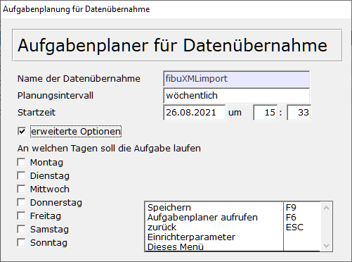
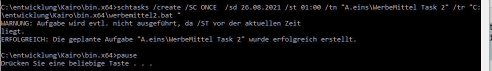
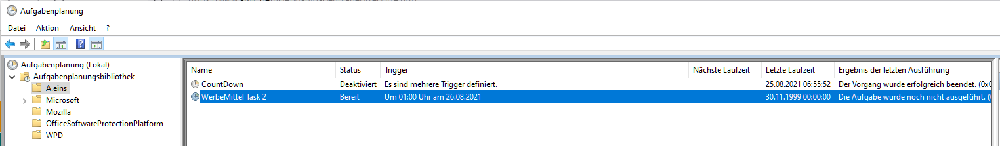

# Automation/Aufgabenplaner

<!-- source: https://amic.de/hilfe/automationaufgabenplaner.htm -->

Hauptmenü > Abschlussarbeiten > DATEV / Import / Export > Datenübernahme

Direktsprung [DUEB]

Im Pfleger, in dem man die Schnittstelle für die Datenübernahme definiert, existiert eine Funktion „Aufgabenplaner für Datenübernahme“. Der Aufgabenplaner erstellt für die Windows-Aufgabenplanung einen Eintrag. Voraussetzung dafür, dass der Auftrag zu der angegebenen Zeit ausgeführt wird, ist daher, dass der Rechner, auf dem dieser Job erstellt wurde zu dem Zeitpunkt läuft und der Anwender angemeldet ist – der Rechner kann natürlich trotzdem gesperrt sein.

 

| **Feld** | **Bedeutung** |
| --- | --- |
| Name der Datenübernahme | Der Name der Aufgabe ist die Bezeichnung der Datenübernahme-Schnittstelle. Dieser Name erscheint in Aufgabenplanung von Windows im Ordner A.eins. Damit dieser Name auf jeden Fall eindeutig ist, wird noch „Task 123“ an den Text angerhängt, wobei die Nummer der Datenübernahme ist (die DuebId). |
| Planungsintervall | • einmalig  
• täglich  
• wöchentlich  
• monatlich  
• stündlich  
• alle 5 Minuten  
• alle 10 Minuten  
• alle 15 Minuten  
• alle 30 Minuten  
 |
| Startzeit | Hier wird angegeben, an welchem Tag und um wieviel Uhr diese Aufgabe ausgeführt werden soll.  
 |
| Erweiterte Optionen | Unter den erweiterten Optionen kann noch der Wochentag ausgewählt werden, an dem die Aufgabe laufen soll. Diese Option steht nur zur Verfügung, wenn als Planungsintervall „wöchentlich“ oder „monatlich“ ausgewählt wurde.  
 |

Beim Speichern der Daten wird dann eine Batch-Datei ins Bin-Verzeichnis geschrieben und eine Aufgabe angelegt. Der Name der Batchdatei setzt sich aus dem Namen und der Ident der Schnittstellendefinition zusammen. Pro Schnittstellendefinition kann nur eine Aufgabe angelegt werden. Es erscheint folgender Dialog, in dem man kontrollieren kann, ob das Anlegen der Aufgabe funktioniert hat.

 

Anschließend findet man diese Aufgabe in der **Aufgabenplanung** von Windows in der Planungsbibliothek A.eins. Dort kann man kontrollieren, wann die Aufgabe gelaufen ist, sie beenden, löschen usw.

