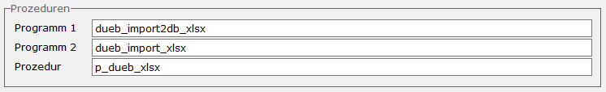

# FIBU-XLSX-Import

<!-- source: https://amic.de/hilfe/fibuxlsximport.htm -->

Hauptmenü > Abschlussarbeiten > DATEV / Import / Export > Datenübernahme

Direktsprung **[DUEB]**

Um für Excel-Dateien im xlsx-Format einen Datenimport in die Finanzbuchhaltung durchzuführen, kann eine Datenübernahme definiert werden. Es finden hier keine Tests statt, ob eine Datei bereits eingelesen wurde. Dies muss durch geeignete betriebliche Maßnahmen sichergestellt werden.

Um die Excel-Verarbeitung zu aktivieren, müssen im Block Prozeduren folgende Werte eingetragen werden:



Steht man im Feld „Programm 1“, so können mit F3 auch die hier einzutragenden Werte ausgewählt werden. „Programm 1“ und „Programm 2“ sind von AMIC bereitgestellte Funktionen, die die Verarbeitung steuern.

Das Programm „dueb_import2db_xlsx“ importiert die Dateien in das Formulararchiv. Gleichzeitig wird jede .xlsx-Datei in ein XML umgewandelt und in der Spalte „FA_XMLErweiterung“ der Tabelle Formulararchiv gespeichert. Im Archiv sind die importierten Dateien unter dem Belegtypen „Fibu-Datenübername XLSX“ wieder zu finden. Außerdem wird in der Tabelle „dueb_import“ die Fa_id und die Fa_mndnr des Archiveintrags vermerkt.

Das Programm „dueb_import_xlsx“ versucht mithilfe der unter „Prozedur“ eingetragenen privaten Datenbankprozedur die Daten zu verarbeiten. Dabei werden vor der Belegerstellung erst alle Daten auf Konsistenz geprüft und erst danach werden die Belege erstellt. Dadurch ist sichergestellt, dass nicht nur Teile aus der Datei verarbeitet werden.

In das Feld Prozedur muss eine private Prozedur eingetragen werden, die das XML aus der Spalte „FA_XMLErweiterung“ ausliest und alle erforderlichen Daten zurückliefert (siehe Resultset der Beispiel-Prozedur). Mit der Funktion ***Prozedur bearbeiten*** kann die Funktion direkt bearbeitet oder neu angelegt werden. Bei der Neuanlage wird ein Gerüst mit dem benötigten Resultset vorgegeben.

Beispieldaten:

```text
ident;telefon;mail;klasse;referenznr;beledatum;hauptkonto;gegenkonto;betrag;sh
1;0431
99020;Support@amic.de;ZA;ABC;20.09.2023;1010;10111;500;S
1;0431
99020;Support@amic.de;ZA;ABC;20.09.2023;1010;10123;200;S
1;0431
99020;Support@amic.de;ZA;ABC;20.09.2023;1010;10000;300;H
```

Beispiel Prozedur zum Einlesen der Beispieldaten. Zu bearbeiten ist in den meisten Fällen nur der individuelle Teil. In dem vorgegebenen Gerüst sind die Stellen mit TODO gekennzeichnet:

```sql
create procedure
p_dueb_xlsx  ( in in_fa_id integer , in in_fa_mndnr integer )
  result(

uebertragungsnummer  char(60),

uebertragungskennung char(30),

erstelltam
     date,

erstelltvon          char(20),

ident
    integer,

poszaehler
     integer,

fibuv_klasse         integer,

fibuv_herktyp        smallint,

fibuv_fremdnr        char(255),

numkreisnummer       integer,

fibuv_numnummer      integer,

fibuv_nummer         char(20),

fibuv_datum          date,

fibuv_eingangsdatum  date,

jahrnummer
    smallint,

perinummer
       integer,

hauptkonto
      integer,

hauptkoststel        integer,

hauptkstr
     integer,

fibuvp_haupttext     char(100),

FiBuV_PaginierNr     char(255),

mahndatum
       date,

mahnstufe
      integer,

gegenkonto
    integer,

koststelnummer       integer,

kstrnummer
     integer,

fibuvp_betrag        numeric(15,4),

fibuvp_sollhaben     integer,

fibuvp_valdatum      date,

zahlbednummer        integer,

fibuvp_skodatum      date,

fibuvp_skosatz       numeric(15,4),

fibuvp_skobetrag     numeric(15,4),

steuerklasse         integer,

steuergrnummer       integer,

steuerschluessel     integer,

steuerabdatum        date,

fibuvp_steuwert      numeric(15,4),

fibuvp_steusatz      numeric(15,4),

FiBuVP_Text          char(100),

SteuerGruppeTest     integer,

SteuerGruppeAusKu    integer
        )
begin
  declare
dc_err_notfound exception for sqlstate value '02000';
  declare dc_data long
varchar;
  declare local
temporary table tempImport
  (

ident
integer,

poszaehler
integer,

fibuv_klasse         integer,

fibuv_herktyp        smallint,

fibuv_fremdnr        char(255),

numkreisnummer       integer,

fibuv_numnummer      integer,

fibuv_nummer         char(20),

fibuv_datum          date,

fibuv_eingangsdatum  date,

jahrnummer
smallint,

perinummer
integer,

hauptkonto
integer,

hauptkoststel        integer,

hauptkstr
integer,

fibuvp_haupttext     char(100),

FiBuV_PaginierNr     char(255),

mahndatum
date,

mahnstufe
integer,

gegenkonto
integer,

koststelnummer       integer,

kstrnummer
integer,

fibuvp_betrag        numeric(15,4),

fibuvp_sollhaben     integer,

fibuvp_valdatum      date,

zahlbednummer        integer,

fibuvp_skodatum      date,

fibuvp_skosatz       numeric(15,4),

fibuvp_skobetrag     numeric(15,4),

steuerklasse         integer,

steuergrnummer       integer,

steuerschluessel     integer,

steuerabdatum        date,

fibuvp_steuwert      numeric(15,4),

fibuvp_steusatz      numeric(15,4),

FiBuVP_Text          char(100),

primary key
(ident, poszaehler)
  );

  set dc_data = (select FA_XmlErweiterung from
formulararchiv where fa_id = in_fa_id and fa_mndnr = in_fa_mndNr);

--Hier beginnt der Individuelle Teil:

  insert into
tempImport
  (
    ident,
    poszaehler,
    fibuv_klasse,
    fibuv_fremdnr,
    fibuv_datum,
    hauptkonto,
    gegenkonto,
    fibuvp_betrag,
    fibuvp_sollhaben
  )
  Select
    cast(ident as integer),

number(*),

(select
fibuv_klasse from fibuvorgklasse where
fibuv_klkurzbez=klKurz),
    fibuv_fremdnr,
    cast(fibuv_datum as date),
    cast(hauptkonto as integer),
    cast(gegenkonto as integer),
    cast(trim(betrag) as numeric (15,4)),
    (if sollhaben='S' then 1 else 2
endif)
  from openxml( dc_data,
'//Excel/Worksheets/Worksheet/Rows/Row')
  with
  (

zeile
integer   '@idx',
    ident
           char(10)  './A' ,
    klKurz
           char(20)  './D' ,

fibuv_fremdnr     char(255)
'./E' ,

fibuv_datum       char(20)  './F' ,

hauptkonto        char(20)  './G' ,

gegenkonto        char(20)  './H' ,

betrag            char(20)  './I' ,

sollhaben         char(1)   './J'
  )
  as daten
  where zeile
>
1;
-- ggf. die Überschriftszeie überlesen

-- Hier endet der Individuelle Teil:

  select
    in_fa_id
as
uebertragungsnummer,

in_fa_mndnr as uebertragungskennung,

today(*),

USER,

ident,

poszaehler,

fibuv_klasse,

fibuv_herktyp,
--Ist der Herkunftstyp nicht angegeben, wird 30 für Import eingetragen. Eigene
Herkunftstypen sollten ab 100 beginnen

fibuv_fremdnr,

numkreisnummer,

fibuv_numnummer,
    fibuv_nummer,

fibuv_datum,

fibuv_eingangsdatum,

jahrnummer,

perinummer,

hauptkonto,

hauptkoststel,

hauptkstr,

fibuvp_haupttext,

FiBuV_PaginierNr,

mahndatum,

mahnstufe,

gegenkonto,

koststelnummer,

kstrnummer,

fibuvp_betrag,

fibuvp_sollhaben,

fibuvp_valdatum,

zahlbednummer,

fibuvp_skodatum,

fibuvp_skosatz,

fibuvp_skobetrag,

steuerklasse,

steuergrnummer,

steuerschluessel,

steuerabdatum,

fibuvp_steuwert,

fibuvp_steusatz,

FiBuVP_Text,
     0
as SteuerGruppeTest,
     0
as SteuerGruppeAusKu

from
tempImport

order by
ident, poszaehler;
end
```

Der eigentliche Import läuft dann über die Standardschnittstelle. Die Bedeutung und Besonderheiten der Spalten ist unter „[Resultset der FIBU-Datenübernahme](./resultset_der_fibu_datenuebernahme.md)“ beschrieben.
