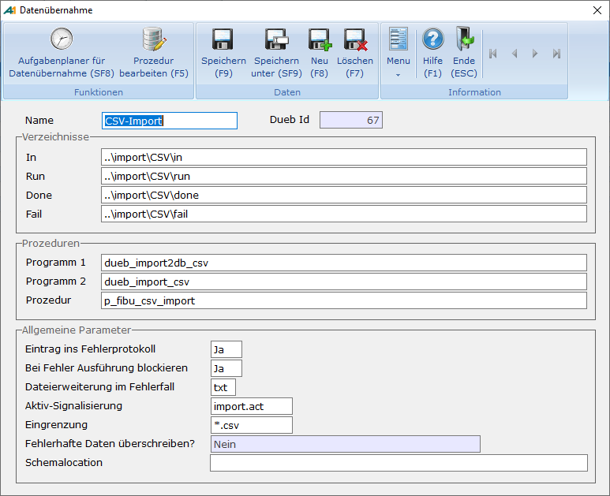
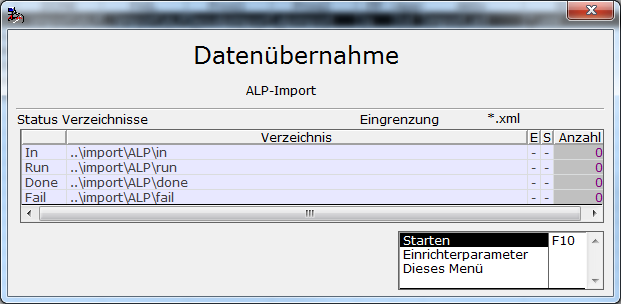

# Datenübernahme-Schnittstelle

<!-- source: https://amic.de/hilfe/datenbernahmeschnittstelle.htm -->

Hauptmenü > Abschlussarbeiten > DATEV / Import / Export > Datenübernahme

Direktsprung **[DUEB]**

Diese Schnittstelle ist eine allgemeine technische Lösung um Dateien gesichert einzulesen. In dieser Auswahlliste kann man die Schnittstelle definieren und ausführen.

Einrichtung

<table class="AMIC-Tabelle" style="WIDTH: 100%; BORDER-COLLAPSE: collapse" cellspacing="0" cellpadding="0" width="100%" border="0"><tbody><tr><td style="WIDTH: 19.36%; BACKGROUND: #005d5b; PADDING-BOTTOM: 0pt; PADDING-TOP: 0pt; PADDING-LEFT: 5.4pt; PADDING-RIGHT: 5.4pt" width="19%">
Feld
</td><td style="WIDTH: 80.64%; BACKGROUND: #005d5b; PADDING-BOTTOM: 0pt; PADDING-TOP: 0pt; PADDING-LEFT: 5.4pt; PADDING-RIGHT: 5.4pt" width="80%" colspan="2">
Besonderheiten
</td></tr><tr style="HEIGHT: 13.65pt"><td style="BORDER-TOP: medium none; HEIGHT: 13.65pt; BORDER-RIGHT: white 1.5pt solid; WIDTH: 19.36%; BACKGROUND: #bad9d9; BORDER-BOTTOM: medium none; PADDING-BOTTOM: 0pt; PADDING-TOP: 0pt; PADDING-LEFT: 5.4pt; BORDER-LEFT: medium none; PADDING-RIGHT: 5.4pt" valign="top" width="19%">
Name
</td><td style="BORDER-TOP: medium none; HEIGHT: 13.65pt; BORDER-RIGHT: medium none; WIDTH: 80.24%; BACKGROUND: #bad9d9; BORDER-BOTTOM: medium none; PADDING-BOTTOM: 0pt; PADDING-TOP: 0pt; PADDING-LEFT: 5.4pt; BORDER-LEFT: medium none; PADDING-RIGHT: 5.4pt" valign="top" width="80%">
Dies ist die eindeutige Bezeichnung des Übernahmeverfahrens, über die dann auf die Definition zugegriffen wird.
</td><td style="BORDER-TOP: medium none; BORDER-RIGHT: medium none; BORDER-BOTTOM: medium none; PADDING-BOTTOM: 0pt; PADDING-TOP: 0pt; PADDING-LEFT: 0pt; BORDER-LEFT: medium none; PADDING-RIGHT: 0pt" width="3"></td></tr><tr style="HEIGHT: 13.65pt"><td style="BORDER-TOP: medium none; HEIGHT: 13.65pt; BORDER-RIGHT: white 1.5pt solid; WIDTH: 19.36%; BACKGROUND: #eff7f7; BORDER-BOTTOM: medium none; PADDING-BOTTOM: 0pt; PADDING-TOP: 0pt; PADDING-LEFT: 5.4pt; BORDER-LEFT: medium none; PADDING-RIGHT: 5.4pt" valign="top" width="19%">
Verzeichnisse
</td><td style="BORDER-TOP: medium none; HEIGHT: 13.65pt; BORDER-RIGHT: medium none; WIDTH: 80.24%; BACKGROUND: #eff7f7; BORDER-BOTTOM: medium none; PADDING-BOTTOM: 0pt; PADDING-TOP: 0pt; PADDING-LEFT: 5.4pt; BORDER-LEFT: medium none; PADDING-RIGHT: 5.4pt" valign="top" width="80%">
Es müssen vier Verzeichnisse eingetragen werden:

<b>In: </b>&nbsp;Die einzulesenden Dateien werden in dieses Verzeichnis gestellt. Der Name der Dateien ist dabei nicht wichtig, da alle Dateien in dem Verzeichnis verarbeitet werden. Er kann aber unter „Eingrenzung“ näher definiert werden.

<b>Run:</b> Wenn eine Datei in Arbeit ist, steht sie in diesem Verzeichnis.

<b>Done: </b>Ist<b> </b>die Verarbeitung Fehlerfrei abgelaufen, dann wird die Datei in dieses Verzeichnis verschoben.

<b>Fail: </b>Im Fehlerfall kommt die Datei in dieses Verzeichnis.

Existieren die Verzeichnisse noch nicht, wird vom Programm versucht diese anzulegen.
</td><td style="BORDER-TOP: medium none; BORDER-RIGHT: medium none; BORDER-BOTTOM: medium none; PADDING-BOTTOM: 0pt; PADDING-TOP: 0pt; PADDING-LEFT: 0pt; BORDER-LEFT: medium none; PADDING-RIGHT: 0pt" width="3"></td></tr><tr style="HEIGHT: 13.65pt"><td style="BORDER-TOP: medium none; HEIGHT: 13.65pt; BORDER-RIGHT: white 1.5pt solid; WIDTH: 19.36%; BACKGROUND: #bad9d9; BORDER-BOTTOM: medium none; PADDING-BOTTOM: 0pt; PADDING-TOP: 0pt; PADDING-LEFT: 5.4pt; BORDER-LEFT: medium none; PADDING-RIGHT: 5.4pt" valign="top" width="19%">
Programm 1
</td><td style="BORDER-TOP: medium none; HEIGHT: 13.65pt; BORDER-RIGHT: medium none; WIDTH: 80.24%; BACKGROUND: #bad9d9; BORDER-BOTTOM: medium none; PADDING-BOTTOM: 0pt; PADDING-TOP: 0pt; PADDING-LEFT: 5.4pt; BORDER-LEFT: medium none; PADDING-RIGHT: 5.4pt" valign="top" width="80%">
Dieses Programm ist eine JPL-Funktion. Wenn man als Parameter %F angibt, so wird dort der Dateiname übergeben. Die Funktion muss den Wert 0 (S_OK) zurückliefern, wenn die Verarbeitung fehlerfrei war. Ein Wert größer 0 beendet das Einlesen aller Dateien, egal ob noch Dateien im <b>In-</b>Verzeichnis stehen oder nicht. Ein Wert kleiner 0 beendet nur das Einspielen der aktuellen Datei.

Von AMIC stehen mehrere Programme bereit, die hier per F3 ausgewählt werden können.
</td><td style="BORDER-TOP: medium none; BORDER-RIGHT: medium none; BORDER-BOTTOM: medium none; PADDING-BOTTOM: 0pt; PADDING-TOP: 0pt; PADDING-LEFT: 0pt; BORDER-LEFT: medium none; PADDING-RIGHT: 0pt" width="3"></td></tr><tr style="HEIGHT: 13.65pt"><td style="BORDER-TOP: medium none; HEIGHT: 13.65pt; BORDER-RIGHT: white 1.5pt solid; WIDTH: 19.36%; BACKGROUND: #eff7f7; BORDER-BOTTOM: medium none; PADDING-BOTTOM: 0pt; PADDING-TOP: 0pt; PADDING-LEFT: 5.4pt; BORDER-LEFT: medium none; PADDING-RIGHT: 5.4pt" valign="top" width="19%">
Programm 2
</td><td style="BORDER-TOP: medium none; HEIGHT: 13.65pt; BORDER-RIGHT: medium none; WIDTH: 80.24%; BACKGROUND: #eff7f7; BORDER-BOTTOM: medium none; PADDING-BOTTOM: 0pt; PADDING-TOP: 0pt; PADDING-LEFT: 5.4pt; BORDER-LEFT: medium none; PADDING-RIGHT: 5.4pt" valign="top" width="80%">
Eine zweite optionale Prozedur, die nur aufgerufen wird, wenn die Funktion unter Progamm 1 fehlerfrei ausgeführt wurde. Die Funktion muss den Wert 0 (S_OK) zurückliefern, wenn die Verarbeitung fehlerfrei war. Ein Wert ungleich 0 bricht nur die Verarbeitung dieser Daten ab.
</td><td style="BORDER-TOP: medium none; BORDER-RIGHT: medium none; BORDER-BOTTOM: medium none; PADDING-BOTTOM: 0pt; PADDING-TOP: 0pt; PADDING-LEFT: 0pt; BORDER-LEFT: medium none; PADDING-RIGHT: 0pt" width="3"></td></tr><tr style="HEIGHT: 13.65pt"><td style="BORDER-TOP: medium none; HEIGHT: 13.65pt; BORDER-RIGHT: white 1.5pt solid; WIDTH: 19.36%; BACKGROUND: #bad9d9; BORDER-BOTTOM: medium none; PADDING-BOTTOM: 0pt; PADDING-TOP: 0pt; PADDING-LEFT: 5.4pt; BORDER-LEFT: medium none; PADDING-RIGHT: 5.4pt" valign="top" width="19%">
Prozedur
</td><td style="BORDER-TOP: medium none; HEIGHT: 13.65pt; BORDER-RIGHT: medium none; WIDTH: 80.24%; BACKGROUND: #bad9d9; BORDER-BOTTOM: medium none; PADDING-BOTTOM: 0pt; PADDING-TOP: 0pt; PADDING-LEFT: 5.4pt; BORDER-LEFT: medium none; PADDING-RIGHT: 5.4pt" valign="top" width="80%">
Für den <a class="topic-link" href="./fibu_csv_import.md">CSV-Import</a> und den <a class="topic-link" href="./fibu_xlsx_import.md">XLSX-Import</a> müssen hier private Prozeduren festgelegt werden. Für den <a class="topic-link" href="./fibu_xml_import.md">Fibu-XML-Import</a> ist eine Prozedur optional. Wird beim Fibu-XML-Import keine Prozedur angegeben, dann wird die Standardprozedur von AMIC verwendet.
</td><td style="BORDER-TOP: medium none; BORDER-RIGHT: medium none; BORDER-BOTTOM: medium none; PADDING-BOTTOM: 0pt; PADDING-TOP: 0pt; PADDING-LEFT: 0pt; BORDER-LEFT: medium none; PADDING-RIGHT: 0pt" width="3"></td></tr><tr style="HEIGHT: 13.65pt"><td style="BORDER-TOP: medium none; HEIGHT: 13.65pt; BORDER-RIGHT: white 1.5pt solid; WIDTH: 19.36%; BACKGROUND: #eff7f7; BORDER-BOTTOM: medium none; PADDING-BOTTOM: 0pt; PADDING-TOP: 0pt; PADDING-LEFT: 5.4pt; BORDER-LEFT: medium none; PADDING-RIGHT: 5.4pt" valign="top" width="19%">
Eintrag ins Fehlerprotokoll
</td><td style="BORDER-TOP: medium none; HEIGHT: 13.65pt; BORDER-RIGHT: medium none; WIDTH: 80.24%; BACKGROUND: #eff7f7; BORDER-BOTTOM: medium none; PADDING-BOTTOM: 0pt; PADDING-TOP: 0pt; PADDING-LEFT: 5.4pt; BORDER-LEFT: medium none; PADDING-RIGHT: 5.4pt" valign="top" width="80%">
Dieser Wert wird nicht vom System ausgewertet, kann aber von den JPL-Funktionen verwendet werden.
</td><td style="BORDER-TOP: medium none; BORDER-RIGHT: medium none; BORDER-BOTTOM: medium none; PADDING-BOTTOM: 0pt; PADDING-TOP: 0pt; PADDING-LEFT: 0pt; BORDER-LEFT: medium none; PADDING-RIGHT: 0pt" width="3"></td></tr><tr style="HEIGHT: 13.65pt"><td style="BORDER-TOP: medium none; HEIGHT: 13.65pt; BORDER-RIGHT: white 1.5pt solid; WIDTH: 19.36%; BACKGROUND: #bad9d9; BORDER-BOTTOM: medium none; PADDING-BOTTOM: 0pt; PADDING-TOP: 0pt; PADDING-LEFT: 5.4pt; BORDER-LEFT: medium none; PADDING-RIGHT: 5.4pt" valign="top" width="19%">
Bei Fehler Ausführung blockieren
</td><td style="BORDER-TOP: medium none; HEIGHT: 13.65pt; BORDER-RIGHT: medium none; WIDTH: 80.24%; BACKGROUND: #bad9d9; BORDER-BOTTOM: medium none; PADDING-BOTTOM: 0pt; PADDING-TOP: 0pt; PADDING-LEFT: 5.4pt; BORDER-LEFT: medium none; PADDING-RIGHT: 5.4pt" valign="top" width="80%">
Dieser Wert steht standardmäßig auf <b>Ja</b>. Dies bewirkt, dass eine Einspielung weiterer Dateien nur möglich ist, wenn das Fail-Verzeichnis leer ist.
</td><td style="BORDER-TOP: medium none; BORDER-RIGHT: medium none; BORDER-BOTTOM: medium none; PADDING-BOTTOM: 0pt; PADDING-TOP: 0pt; PADDING-LEFT: 0pt; BORDER-LEFT: medium none; PADDING-RIGHT: 0pt" width="3"></td></tr><tr style="HEIGHT: 13.65pt"><td style="BORDER-TOP: medium none; HEIGHT: 13.65pt; BORDER-RIGHT: white 1.5pt solid; WIDTH: 19.36%; BACKGROUND: #eff7f7; BORDER-BOTTOM: medium none; PADDING-BOTTOM: 0pt; PADDING-TOP: 0pt; PADDING-LEFT: 5.4pt; BORDER-LEFT: medium none; PADDING-RIGHT: 5.4pt" valign="top" width="19%">
Appendix im Fehlerfall
</td><td style="BORDER-TOP: medium none; HEIGHT: 13.65pt; BORDER-RIGHT: medium none; WIDTH: 80.24%; BACKGROUND: #eff7f7; BORDER-BOTTOM: medium none; PADDING-BOTTOM: 0pt; PADDING-TOP: 0pt; PADDING-LEFT: 5.4pt; BORDER-LEFT: medium none; PADDING-RIGHT: 5.4pt" valign="top" width="80%">
Optional. Die Datei, die in das <b>Fail</b>-Verzeichnis geschrieben wird, bekommt diese Dateierweiterung.
</td><td style="BORDER-TOP: medium none; BORDER-RIGHT: medium none; BORDER-BOTTOM: medium none; PADDING-BOTTOM: 0pt; PADDING-TOP: 0pt; PADDING-LEFT: 0pt; BORDER-LEFT: medium none; PADDING-RIGHT: 0pt" width="3"></td></tr><tr style="HEIGHT: 13.65pt"><td style="BORDER-TOP: medium none; HEIGHT: 13.65pt; BORDER-RIGHT: white 1.5pt solid; WIDTH: 19.36%; BACKGROUND: #bad9d9; BORDER-BOTTOM: medium none; PADDING-BOTTOM: 0pt; PADDING-TOP: 0pt; PADDING-LEFT: 5.4pt; BORDER-LEFT: medium none; PADDING-RIGHT: 5.4pt" valign="top" width="19%">
Aktiv-Signalisierung
</td><td style="BORDER-TOP: medium none; HEIGHT: 13.65pt; BORDER-RIGHT: medium none; WIDTH: 80.24%; BACKGROUND: #bad9d9; BORDER-BOTTOM: medium none; PADDING-BOTTOM: 0pt; PADDING-TOP: 0pt; PADDING-LEFT: 5.4pt; BORDER-LEFT: medium none; PADDING-RIGHT: 5.4pt" valign="top" width="80%">
Optional. Wird hier ein Dateiname angegeben (Vorbelegung ist „import.act“), wird bei aktivem Import diese Datei ins <b>In</b>-Verzeichnis geschrieben.
</td><td style="BORDER-TOP: medium none; BORDER-RIGHT: medium none; BORDER-BOTTOM: medium none; PADDING-BOTTOM: 0pt; PADDING-TOP: 0pt; PADDING-LEFT: 0pt; BORDER-LEFT: medium none; PADDING-RIGHT: 0pt" width="3"></td></tr><tr style="HEIGHT: 13.65pt"><td style="BORDER-TOP: medium none; HEIGHT: 13.65pt; BORDER-RIGHT: white 1.5pt solid; WIDTH: 19.36%; BACKGROUND: #eff7f7; BORDER-BOTTOM: medium none; PADDING-BOTTOM: 0pt; PADDING-TOP: 0pt; PADDING-LEFT: 5.4pt; BORDER-LEFT: medium none; PADDING-RIGHT: 5.4pt" valign="top" width="19%">
Eingrenzung
</td><td style="BORDER-TOP: medium none; HEIGHT: 13.65pt; BORDER-RIGHT: medium none; WIDTH: 80.24%; BACKGROUND: #eff7f7; BORDER-BOTTOM: medium none; PADDING-BOTTOM: 0pt; PADDING-TOP: 0pt; PADDING-LEFT: 5.4pt; BORDER-LEFT: medium none; PADDING-RIGHT: 5.4pt" valign="top" width="80%">
Hier können die einzulesenden Dateien eingegrenzt werden. Wird *.* angegeben, so wird versucht alle Dateien im <b>In</b>-Verzeichnis zu verarbeiten.
</td><td style="BORDER-TOP: medium none; BORDER-RIGHT: medium none; BORDER-BOTTOM: medium none; PADDING-BOTTOM: 0pt; PADDING-TOP: 0pt; PADDING-LEFT: 0pt; BORDER-LEFT: medium none; PADDING-RIGHT: 0pt" width="3"></td></tr><tr style="HEIGHT: 13.65pt"><td style="BORDER-TOP: medium none; HEIGHT: 13.65pt; BORDER-RIGHT: white 1.5pt solid; WIDTH: 19.36%; BACKGROUND: #bad9d9; BORDER-BOTTOM: medium none; PADDING-BOTTOM: 0pt; PADDING-TOP: 0pt; PADDING-LEFT: 5.4pt; BORDER-LEFT: medium none; PADDING-RIGHT: 5.4pt" valign="top" width="19%">
<a name="FehlerhafteDatenUeberschreiben" id="FehlerhafteDatenUeberschreiben">Fehlerhafte Daten überschreiben?</a>
</td><td style="BORDER-TOP: medium none; HEIGHT: 13.65pt; BORDER-RIGHT: medium none; WIDTH: 80.24%; BACKGROUND: #bad9d9; BORDER-BOTTOM: medium none; PADDING-BOTTOM: 0pt; PADDING-TOP: 0pt; PADDING-LEFT: 5.4pt; BORDER-LEFT: medium none; PADDING-RIGHT: 5.4pt" valign="top" width="80%">
Mit dieser Option kann eingestellt werden, ob bei der Datenübernahme fehlerhafte Datensätze überschrieben werden dürfen.

<u>Voraussetzungen:</u><u></u>

1)&nbsp;&nbsp; Diese Option ist nur einrichtbar, wenn es sich um den <a class="topic-link" href="./fibu_xml_import.md">FiBu-XML-Import</a> handelt. Für alle anderen Importe ist ein erneutes Einspielen nicht möglich.

2)&nbsp;&nbsp; Es kann nur der Import von fehlerhaften Datensätzen wiederholt werden. Wurde ein Datei bereits erfolgreich eingespielt, so ist ein erneuter Import nicht möglich.
<table class="AMIC-Tabelle" style="BORDER-COLLAPSE: collapse" cellspacing="0" cellpadding="0" border="0"><tbody><tr><th style="WIDTH: 195.2pt; BACKGROUND: #005d5b; PADDING-BOTTOM: 0pt; PADDING-TOP: 0pt; PADDING-LEFT: 5.4pt; PADDING-RIGHT: 5.4pt" width="260">Wert</th><th style="WIDTH: 607.1pt; BACKGROUND: #005d5b; PADDING-BOTTOM: 0pt; PADDING-TOP: 0pt; PADDING-LEFT: 5.4pt; PADDING-RIGHT: 5.4pt" width="809">Beschreibung</th></tr><tr><td style="BORDER-TOP: medium none; BORDER-RIGHT: white 1.5pt solid; WIDTH: 195.2pt; BACKGROUND: #bad9d9; BORDER-BOTTOM: medium none; PADDING-BOTTOM: 0pt; PADDING-TOP: 0pt; PADDING-LEFT: 5.4pt; BORDER-LEFT: medium none; PADDING-RIGHT: 5.4pt" valign="top" width="260">Nein</td><td style="BORDER-TOP: medium none; BORDER-RIGHT: medium none; WIDTH: 607.1pt; BACKGROUND: #bad9d9; BORDER-BOTTOM: medium none; PADDING-BOTTOM: 0pt; PADDING-TOP: 0pt; PADDING-LEFT: 5.4pt; BORDER-LEFT: medium none; PADDING-RIGHT: 5.4pt" valign="top" width="809">Ein erneutes Einspielen ist nicht möglich (Standardwert). &nbsp;</td></tr><tr><td style="BORDER-TOP: medium none; BORDER-RIGHT: white 1.5pt solid; WIDTH: 195.2pt; BACKGROUND: #eff7f7; BORDER-BOTTOM: medium none; PADDING-BOTTOM: 0pt; PADDING-TOP: 0pt; PADDING-LEFT: 5.4pt; BORDER-LEFT: medium none; PADDING-RIGHT: 5.4pt" valign="top" width="260">Ja, mit Abfrage (bei Automatik: Nein)</td><td style="BORDER-TOP: medium none; BORDER-RIGHT: medium none; WIDTH: 607.1pt; BORDER-BOTTOM: medium none; PADDING-BOTTOM: 0pt; PADDING-TOP: 0pt; PADDING-LEFT: 5.4pt; BORDER-LEFT: medium none; PADDING-RIGHT: 5.4pt" valign="top" width="809">Es wird beim Starten der Datenübernahme abgefragt, ob die Datei erneut eingespielt werden soll. <u>Hinweis:</u> Handelt es sich um eine automatische Einspielung, so ist unter dieser Einstellung eine erneute Einspielung nicht möglich. Stattdessen ist die Einstellung „Immer zulassen“ zu wählen. &nbsp;</td></tr><tr><td style="BORDER-TOP: medium none; BORDER-RIGHT: white 1.5pt solid; WIDTH: 195.2pt; BACKGROUND: #bad9d9; BORDER-BOTTOM: medium none; PADDING-BOTTOM: 0pt; PADDING-TOP: 0pt; PADDING-LEFT: 5.4pt; BORDER-LEFT: medium none; PADDING-RIGHT: 5.4pt" valign="top" width="260">Immer zulassen</td><td style="BORDER-TOP: medium none; BORDER-RIGHT: medium none; WIDTH: 607.1pt; BACKGROUND: #bad9d9; BORDER-BOTTOM: medium none; PADDING-BOTTOM: 0pt; PADDING-TOP: 0pt; PADDING-LEFT: 5.4pt; BORDER-LEFT: medium none; PADDING-RIGHT: 5.4pt" valign="top" width="809">Fehlerhaften Daten werden überschrieben, ohne dass eine Abfrage erscheint. &nbsp;</td></tr></tbody></table></td><td style="BORDER-TOP: medium none; BORDER-RIGHT: medium none; BORDER-BOTTOM: medium none; PADDING-BOTTOM: 0pt; PADDING-TOP: 0pt; PADDING-LEFT: 0pt; BORDER-LEFT: medium none; PADDING-RIGHT: 0pt" width="3"></td></tr><tr style="HEIGHT: 13.65pt"><td style="BORDER-TOP: medium none; HEIGHT: 13.65pt; BORDER-RIGHT: white 1.5pt solid; WIDTH: 19.36%; BACKGROUND: #eff7f7; BORDER-BOTTOM: medium none; PADDING-BOTTOM: 0pt; PADDING-TOP: 0pt; PADDING-LEFT: 5.4pt; BORDER-LEFT: medium none; PADDING-RIGHT: 5.4pt" valign="top" width="19%">
Schemalocation
</td><td style="BORDER-TOP: medium none; HEIGHT: 13.65pt; BORDER-RIGHT: medium none; WIDTH: 80.24%; BACKGROUND: #eff7f7; BORDER-BOTTOM: medium none; PADDING-BOTTOM: 0pt; PADDING-TOP: 0pt; PADDING-LEFT: 5.4pt; BORDER-LEFT: medium none; PADDING-RIGHT: 5.4pt" valign="top" width="80%">
Beim Import von <u>XML-Dateien</u> wird der Aufbau der Datei gegen eine Schemadefinition validiert. Ist die Schemalocation nicht in der XML-Datei selbst angegeben, hat man hier die Möglichkeit diese anzugeben.
</td><td style="BORDER-TOP: medium none; BORDER-RIGHT: medium none; BORDER-BOTTOM: medium none; PADDING-BOTTOM: 0pt; PADDING-TOP: 0pt; PADDING-LEFT: 0pt; BORDER-LEFT: medium none; PADDING-RIGHT: 0pt" width="3"></td></tr></tbody></table>

Verarbeitung

Hat man in der Auswahlliste ein definiertes Verfahren ausgewählt, kann man mit der Funktion ***Starten*** **F9** die Datenübernahme starten.

In der Spalte ganz rechts steht die Anzahl der Dateien, die sich in den Verzeichnissen befinden. Wenn die Option „Bei Fehler Ausführung blockieren“ gesetzt ist, muss das Verzeichnis **Fail** leer sein, damit der Import starten kann.  
    
Die Datenübernahme kann auch mit dem [Aufgabenplaner](./automation_aufgabenplaner.md) automatisiert werden.

Siehe auch:

- [Automation/Aufgabenplaner](./automation_aufgabenplaner.md)
- [FIBU-XML-Import](./fibu_xml_import.md)
- [FIBU-CSV-Import](./fibu_csv_import.md)
- [FIBU-XLSX-Import](./fibu_xlsx_import.md)
- [Resultset der FIBU-Datenübernahme](./resultset_der_fibu_datenuebernahme.md)
