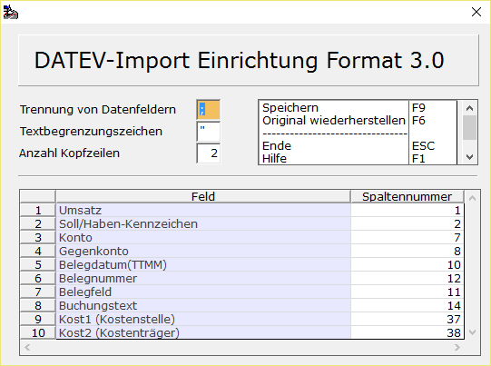

# Format 3.0 einrichten

<!-- source: https://amic.de/hilfe/format30einrichten.htm -->

Hauptmenü > Abschlussarbeiten > DATEV / Import / Export > Datev\-Import Lohndaten > Funktion „Format 3.0 einrichten“

Bei dem Format3.0 handelt es sich um eine Datei im CSV-Format (Comma Separated Values). Im DATEV-Standard werden Textfelder in Doppelt Hochkomma gesetzt und die Daten mit Semikolon getrennt, Die Daten haben eine feste Position innerhalb einer Zeile. Diese Werte sind bereits von AMIC vorgegeben, können jedoch angepasst werden:

Die Funktion „Original wiederherstellen“ F6 setzt die Werte wieder auf die Vorgaben zurück.
