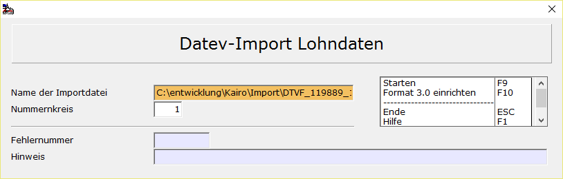

# DATEV-Import Lohndaten

<!-- source: https://amic.de/hilfe/datevimportlohndaten.htm -->

Hauptmenü > Abschlussarbeiten > DATEV / Import / Export > Datev\-Import Lohndaten

Der Import der Daten im DATEV-Format ist nicht in den Standardimport integriert. Man findet diesen im Menü Abschlussarbeiten. Voraussetzungen sind:

Bei dem Import der Lohndaten wird davon ausgegangen, dass es sich nur um Sachkontenbuchungen ohne Steuerbuchungen handelt.

Die in der Datei übergebenen Sachkonten müssen in A.eins eingerichtet sein. Eine Prüfung findet vor der Einspielung nicht statt.

Die Kostenstelle muss in A.eins eingerichtet sein. Wird keine Kostenstelle übergeben, so wird die im Sachkontenstamm hinterlegte Kostenstelle verwendet.

Wird eine Belegnummer übergeben, wird diese in der Referenznummer (FiBuV_FremdNr) gespeichert.

  
    
Im Feld **Name der Importdatei** muss der Dateiname der DATEV-Datei angegeben werden. Es wird davon ausgegangen, dass nicht die Steuerungsdatei, sondern die Datei mit den Buchungsdaten angegeben wird (zur Info: die Daten der DATEV bestehen jeweils aus einer Steuerdatei und einer bzw. mehreren Dateien mit Daten). Die Datei kann mit F3 ausgewählt werden. Pfad und Dateiname werden sich gemerkt und beim nächsten Aufruf erneut vorgeschlagen. Über den Dateinamen wird gleichzeitig das Format erkannt. Mögliche Formate/Dateinamen sind:

• **DATEV-Format 3.0  
**hierbei handelt es sich um eine Datei im CSV.Format. Die Standardreinrichtung für das DATEV-Format 3.0 ist vorgegeben, kann jedoch mit der Funktion „Format 3.0 einrichten“ F10 individuell angepasst werden.

**DATEV-Format mit Ordnungsbegriffserweiterung (OBE)  
**Dateiformat DV01 – hierbei handelt es sich um die Steuerungsdatei, die Informationen zum Einlesen der Dateien DE001 bis DE0\*\* enthält. Jede dieser Datei kann Stammdaten oder Bewegungsdaten enthalten. Zum Import sind sowohl Steuerungs- als auch Datendateien notwendig.

**DATEV-Format mit Kontonummernerweiterung (KNE)**  
Dateiformat EV01 – hierbei handelt es sich um die Steuerungsdatei, die Informationen zum Einlesen der Dateien ED00001 bis ED000\*\* enthält. Jede dieser Datei kann Stammdaten oder Bewegungsdaten enthalten. Zum Import sind sowohl Steuerungs- als auch Datendateien notwendig.

**Sonstige**  
Dateiformat KF\* - hierbei handelt es sich um die Steuerungsdatei, die Informationen zum Einlesen der Dateien ER001 bis ER0\*\* enthält- Jede dieser Datei kann Stammdaten oder Bewegungsdaten enthalten. Zum Import sind sowohl Steuerungs- als auch Datendateien notwendig.

Der **Nummernkreis** muss in den Stammdaten existieren. Er kann mit F3 ausgewählt werden.  
    
Sind Datei und Nummernkreis angegeben, kann der Vorgang mit F9 gestartet werden. Im ersten Schritt wird dann geprüft, ob die Datei im korrekten Format vorliegt und ob die Kontrollsumme stimmt. Ist dies nicht der Fall, wird eine Fehlernummer und ein Texthinweis ausgegeben und der Import abgebrochen.  
Anschließend werden die Belege erstellt, so dass sie in der Primanota weiterverarbeitet bzw. gebucht werden können.  
    

Nach erfolgreichem Import wird der Text „Kein Fehler aufgetreten. Nnn Belege verarbeitet“ angezeigt und es wird die Datei umbenannt. Der Dateiname wird um Uhrzeit und Datum erweitert und erhält die Endung „.Done“.  
    
**Hinweis**:

Es werden keine Folgebuchungen oder Kurzbuchungen erkannt.

Siehe auch:

- [Format 3.0 einrichten](./format_3_0_einrichten.md)
