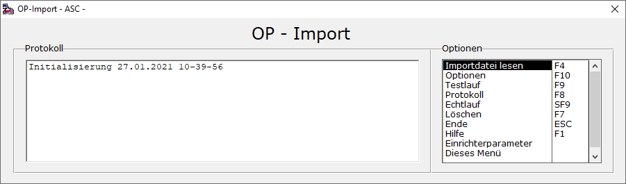
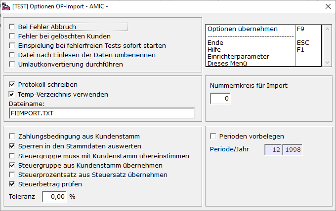
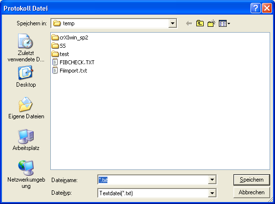
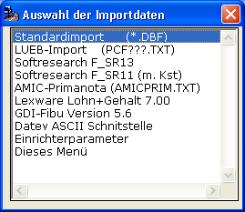
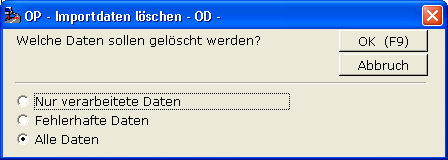
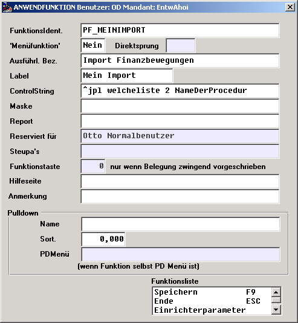

# Importverfahren der Finanzbuchhaltung

<!-- source: https://amic.de/hilfe/importverfahrenderfinanzbuchha.htm -->

Hauptmenü > Abschlussarbeiten > DATEV / Import / Export > Import

Direktsprung **[FIIM]**

Bei der Verwendung der Standardimportschnittstelle muss die Relation Fibuimport gefüllt werden. Das Füllen kann über eine bereits im korrekten Format vorliegende DBF-Datei geschehen, über eine JPL-Prozedur oder über ein vorgeschaltetes Makroskript. Die Daten dieser Relation werden anschließend auf ihre Gültigkeit getestet. Bei erfolgreichem Test werden sie dann in Belege umgewandelt, die in der Primanota kontrolliert werden können. Alle Optionen für den Import findet man unter **F9** ***"Und los...."***

Feldbeschreibung

| Feld | Beschreibung |
| --- | --- |
| IDENT | Integer Zahl zur eindeutigen Identifizierung. Interne Verwendung. Es genügt eine einfache Durchnummerierung. Es ist auch möglich, Belege mit mehreren Gegenpositionen zu erfassen. Dabei müssen zusammengehörende Zeilen in IDENT, BELKALSSE, BELDATUM, HAUPTKONTO, (SOLLHABEN) JAHR und PERIODE übereinstimmen.  |
| POSZAEHLER   | Zähler für die Positionen, falls Belege mit mehreren Gegenpositionen verwendet werden. Wenn nicht angegeben, dann wird er standardmäßig auf 1. gesetzt. Dies bedeutet dann aber gleichzeitig, dass das Feld IDENT nur eindeutige Werte annehmen darf, da der Primarschlüssel auf den Feldern **IDENT** und **POSZAEHLER** liegt.  |
| FIIMPART | Hiermit wird gesteuert, welche Werte aus den Stammdaten von A.eins vorbelegt bzw. errechnet werden sollen. Mögliche Ausprägungen sind:  0 Standardmethode: Steuerwert wird nicht berechnet 1 Lagerlandmethode: Einspielung mit Neuberechnung der Steuer 2 Nur Sachkontenbuchungen 3 Nur Sachkontenbuchungen mit Verarbeitung der Kostenstelle 4 Import GDI-FIBU  |
| BELKLASSE   | Integer Zahl. Die Belegklasse, so wie sie von A.eins vergeben wird. Belegklasse und Sollhaben sind für AR, AG, ER und EG eng miteinander verknüpft. Siehe [SOLLHABEN](./index.md#SollHaben) Für die Belegklasse sind folgende Werte erlaubt: 1 Zahlungen 2 Ausgangsrechnung 3 Ausgangsgutschriften 4 Eingangsrechnung 5 Eingangsgutschriften 6 Sonstige Belege 15 Eröffnungsbuchungen (wie ER;AR, nur dass keine Steuer gebucht wird, obwohl Steuerinformationen  z.B. für Skontorückrechnungen mit übergeben werden)   |
| BELDATUM | Belegdatum in der Form TT-MM-JJJJ  |
| EINDATUM | Eingangsdatum in der Form TT-MM-JJJJ. Dieses Feld ist optional und kann für die Belegklassen „Eingangsrechnungen“, „Eingangsgutschriften“ und „Sonstige Belege“ übertragen werden. Ob eine Prüfung des Eingangsdatums gegen das Belegdatum vorgenommen wird, lässt sich mit dem Steuerparameter 1130 „Eingangsdatum muss hinter dem Belegdatum liegen“ einstellen. Vorbelegung ist **Ja**.  |
| VALDATUM   | Valutadatum in der Form TT-MM-JJJJ   |
| REFNUMMER | Referenznummer bzw. Belegnummer im alten System. Sie ist vom Typ CHAR(20) und unterliegt keiner Prüfung und wird so wie sie ist ins System übernommen.   |
| PAGINIERNR   | Sogenannte Paginiernummer bzw. Archiv-Referenz. Sie ist vom Typ CHAR(40) und unterliegt keiner Prüfung und wird so wie sie ist ins System übernommen.   |
| HAUPTKONTO | Numerische Kontonummer. Muss in A.eins existieren Bei BELKLASSE=1 oder 6 als Sachkonto sonst als Personenkonto. Bereits wieder in A.eins gelöschte Personenkonten werden nicht als Fehler ausgewiesen, wenn es unter [Optionen](../../fibu_reorganisator/optionen_des_fibu_reorganisators.md) so eingestellt ist.   |
| HAUPTTEXT | Textzeile zum Hauptkonto. Freigestellt.   |
| HAUPTKST | [Kostenstelle](../../kostenrechnung/kostenstellen.md), die dem Hauptkonto zugeordnet ist. Freigestellt, ist jedoch ein Wert ungleich 0 eingetragen, so muss diese Kostenstelle in den Stammdaten von A.eins existieren.   |
| HAUPTKSTRNUMMER | [Kostenträger](../../kostenrechnung/kostentraeger.md), der dem Hauptkonto zugeordnet werden soll. Freigestellt, ist jedoch ein Wert ungleich 0 eingetragen, so muss dieser Kostenträger in den Stammdaten von A.eins existieren.   |
| HAUPTKSOBJNUMMER | [Kostenobjekt](../../kostenrechnung/kostenobjekte/index.md), das dem Hauptkonto zugeordnet werden soll. Freigestellt, ist jedoch ein Wert ungleich 0 eingetragen, so muss dieses Kostenobjekt in den Stammdaten von A.eins existieren.   |
| GEGENKONTO   | Kontonummer des Gegenkontos. Muss in A.eins existieren. Bei BELKLASSE=1 als Personenkonto, bei Belegklasse=6 als Sach- oder Personenkonto, sonst nur als Sachkonto. Bereits wieder in A.eins gelöschte Personenkonten werden nicht als Fehler ausgewiesen, wenn es unter [Optionen](../../fibu_reorganisator/optionen_des_fibu_reorganisators.md) so eingestellt ist.   |
| GEGENTEXT | <ul><li>&nbsp;&nbsp;&nbsp; Textzeile zum Gegenkonto. Freigestellt.  </li></ul> |
| KOSTSTEL   | Nummer [Kostenstelle](../../kostenrechnung/kostenstellen.md). Freigestellt, ist jedoch eine Kostenstelle angegeben, muss sie in A.eins existieren.   |
| KSTRNUMMER   | Nummer des [Kostenträgers](../../kostenrechnung/kostentraeger.md). Freigestellt, ist jedoch ein Kostenträger angegeben, muss sie in A.eins existieren.   |
| KSOBJNUMMER | Nummer des [Kostenobjekts](../../kostenrechnung/kostenobjekte/index.md). Freigestellt, ist jedoch ein Kostenobjekt angegeben, muss es in A.eins existieren.   |
| BETRAG   | Ob dieser Betrag netto oder brutto ist, wird über STEUKLASSE (s.u.) bestimmt.   |
| SOLLHABEN   | Integer. Sollhabenkennzeichen, wobei 1 = Soll und 2 = Haben. Bei Belegklasse 1 gibt das Sollhabenkennzeichen an, ob es sich um einen Zahlungsausgang oder Eingang handelt. Belegklasse 2 ⇨ Sollhaben = 2 Belegklasse 3 ⇨ Sollhaben = 1 Belegklasse 4 ⇨ Sollhaben = 1 Belegklasse 5 ⇨ Sollhaben = 2 Belegklasse 6 ⇨ Sollhaben = 1 oder 2 Belegklasse 15 ⇨ Sollhaben = 2 ⇨ Behandlung wir AR  Sollhaben = 1 ⇨ Behandlung wie ER   **Hinweis:** *Wird bei der Belegklasse 2 (AR),3 (AG),4 (ER) oder 5 (EG) das falsche Sollhabenkennzeichen angegeben, so wird die zum Sollhabenkennzeichen passende Belegklasse verwendet. Wird also z.B: bei der Belegklasse 4 (ER) das Sollhabenkennzeichen 2 (Haben) angegen, geht das System davon aus, dass die Belegklasse die 5 (EG) sein sollte.*  |
| PERINUMMER | Integer Periode, wie in A.eins hinterlegt.   |
| JAHRNUMMER | Integer Jahr wie in A.eins hinterlegt. Diese Periode muss existieren und offen sein. Es kann jedoch per [Optionen](../../fibu_reorganisator/optionen_des_fibu_reorganisators.md) fest eine Periode vorgegeben werden, dann muss hier keine Periode eingetragen werden. Buchungsadministratoren dürfen auch für Perioden, die bereits auf Buchungsschluss stehen, noch Belege importieren.  |
| STEUKLASSE | Integer Steuerklasse, wie sie in A.eins verwendet wird: 0 ⇨ keine Steuer. Nicht erlaubt bei ER, AR, EG, AG, EB 1 ⇨ Mehrwert Betrag ist netto 2 ⇨ Mehrwert Betrag ist brutto 101 ⇨ Vorsteuer Betrag ist netto 102 ⇨ Vorsteuer Betrag ist brutto   |
| STEUSCHL | Steuerschlüssel wie in A.eins hinterlegt. Er muss als Steuerschlüssel existieren und die Kombination aus Klasse Gruppe Schlüssel muss als Steuersatz in den Stammdaten von A.eins eingerichtet sein.   |
| STEUERGRNUMMER(veraltet) und STEUGR | Wird in **STEUGR** ein Wert eingetragen – wobei 0 auch ein gültiger Wert ist – so wird dieser als auch in **STEUERGRNUMMER** eingetragen. Er überschreibt den Wert im Feld **STEUERGRNUMMER**. Dieses Feld (**STEUGR**) wurde nachträglich eingeführt, um auch bei Daten im DBASE-Format eine andere Steuergruppe als die aus dem Kundenstamm angeben zu können. Man kann unter Optionen einstellen, ob die Steuergruppe mit dem Wert im Kundenstamm geprüft werden soll. Die **STEUERGRNUMMER** wird je nach Einstellung in den Optionen beim Import verwendet. Entweder dient sie nur zur Sicherheit um eine vorherige Prüfung des Steuersatzes zu ermöglichen oder sie übersteuert die aus dem Kunden/Lieferantenstamm.   |
| STEUSATZ   | Prozentsatz der Steuer. Muss mit dem Steuersatz wie in A.eins hinterlegt übereinstimmen.   |
| STEUWERT   | Dieser Steuerwert wird in A.eins übernommen. Man hat jedoch die Möglichkeit, unter [Optionen](../../fibu_reorganisator/optionen_des_fibu_reorganisators.md) einen Test vorzugeben. (Falsche Steuerklasse bzw. Dreher brutto netto würde dadurch auffallen.)   |
| ZBEDNR   | Nummer der Zahlungsbedingung, wie sie in A.eins hinterlegt ist. Wird hier ein Wert ungleich 0 hinterlegt, wird beim Testlauf geprüft, ob die Stammdaten hierzu existieren.   |
| SKOSATZ | Skontosatz. Freigestellt, sonst 0.   |
| SKOBETRAG   | Skontobetrag. Freigestellt, sonst 0   |
| SKODATUM   | Skontodatum. Freigestellt, sonst BELDATUM   |
| MAHNDATUM   | Letztes Mahndatum. Freigestellt.   |
| MAHNSTUFE   | Freigestellt, sonst 0.   |
| BELEGMAPPE   | Freigestellt. Ist hier ein Wert eingetragen, dann werden alle Belege dieser [Mappe](../../belegerfassung/belegmappen.md) zugeordnet. Pro Import ist nur eine Mappe zugelassen. Es wird nicht geprüft, ob mehrere Mappen vorhanden sind, sondern der erste Eintrag bestimmt die Mappe.   |
| WAEHRNUMMER   | Optional. Wird jedoch einmal ein Wert eingetragen, so muss in jeder Zeile ein Wert stehen. Das Eintragen eines Wertes bewirkt, dass die Belege mit Währungsinformationen gefüllt werden. Es sollten dann auch mindestens die Felder **WBetrag**, **WKurs** und **WTyp** mit dem korrekten Werten gefüllt sein.   |
| WBETRAG   | Der Betrag in Fremdwährung ist Pflicht, wenn das Feld **Waehrnummer** ungleich NULL ist.   |
| WKURS   | Der Währungskurs, der Verwendet wurde. Wenn das Feld **Waehrnummer** ungleich NULL ist, so ist es sinnvoll hier den korrekten Wert einzutragen. Ansonsten wird das Feld mit dem hinterlegten Währungskurs gefüllt.   |
| WTYP   | 0 = Ohne Fremdwährung 1 = Buchwährung erfasst ⇨ Fremdwährung errechnet 2 = Fremdwährung erfasst ⇨ Buchwährung errechnet   Pflicht, wenn das Feld **Waehrnummer** ungleich NULL ist.   |
| WRECHFORMEL   | 0 oder 1, je nachdem ob sich der Kurs auf die Buchwährung oder die Fremdwährung bezieht. Bei Übergabe von NULL wird der Wert aus dem Währungsstamm gezogen.   |
| WFAKTOR:   | Der Faktor der der Währung zugrunde gelegt wird. Bei Übergabe von NULL wird der Wert aus dem Währungsstamm gezogen   |
| WSTEUER   | Freigestellt. Steuer in Fremdwährung. Wird ggf. errechnet, wenn NULL   |
| FIBUV_NUMMER | Wird in diesem Feld ein Wert eingetragen, so wird dieser als die FiBuV_Nummer übernommen. Dieses Feld wird nur bei der [Standardmethode](./index.md#TAB_FIIMPART) ausgewertet. Wird in das Feld Null eingetragen, so wird die FiBuV_Nummer automatisch bestimmt.   |
| FIBUV_NUMNUMMER | Wird in diesem Feld ein Wert eingetragen, so wird dieser als die FiBuV_NumNummer übernommen. Dieses Feld wird nur bei der [Standardmethode](./index.md#TAB_FIIMPART) ausgewertet. Wird in das Feld Null eingetragen, so wird die FiBuV_NumNummer automatisch bestimmt.   |

Optionen

Hier lassen sich einige Optionen zur Steuerung des Imports einstellen.

Nach dem Ändern der Optionen werden ggf. bereits durchgeführte Tests wieder vom Status „Test OK“ auf den Status „Neu“ zurückgesetzt.

| Option | Beschreibung |
| --- | --- |
| Bei Fehler Abbruch  | Dies bezieht sich auf den Testlauf. Setzt man hier den Haken, würde der Testlauf beim ersten auftretenden Fehler abbrechen. Sinnvoller ist es, alle mit zu protokollieren und den Test vollständig durchzuführen. Man kann dann anhand des Protokolls die Stammdaten bzw. die eingespielten Daten überprüfen.   |
| Fehler bei gelöschten Kunden  | Bereits gelöschte Kunden sollten bei Importen eigentlich zu Fehlern führen, da man sonst Belege für nicht existierende Kunden in die Finanzbuchhaltung importiert. Es kann aber in bestimmten Fällen sinnvoll sein ( z.B. bei Zusammenführung zweier Mandanten ) diesen Import zuzulassen, wenn der Kunde einen Saldo von 0 hat.  |
| Einspielung bei fehlerfreien Tests sofort starten  | Der Ablauf des Imports ist: Zwischenrelation Fibuimport füllen Test starten Echtlauf starten Um nun einen Schritt zu sparen, kann man hier einen Haken setzen. Dann werden nach erfolgreichem Test die Daten sofort weiterverarbeitet und zu Belegen weiterverarbeitet  |
| Datei nach Einlesen Umbenennen  | Diese Option ist dafür gedacht, ein versehentlich doppeltes Einspielen der Daten zu verhindern. Sind die Daten in die Zwischenrelation eingespielt worden, wird die Datei umbenannt. Die neue Datei so wie die alte gefolgt von dem Datum, der Uhrzeit und der Erweiterung ".Done".  |
| Umlautkonvertierung durchführen  | Umlaute werden unter Windows und unter DOS unterschiedlich dargestellt. Wenn die Datei also z.B. aus einem DOS-System kommt, kann es nötig sein, die Umlaute auszutauschen. Ist hier ein Haken gesetzt, wird diese Konvertierung bei allen eingebauten Importverfahren automatisch durchgeführt.  |
| Protokoll schreiben  | Die Fehler, die beim Test auftreten, lassen sich in eine Datei schreiben, um sie später alle gleichzeitig abarbeiten zu können. Den Pfad und Dateinamen kann man in dem Feld darunter auswählen. Mit **F3** ist eine Dateiauswahl über einen Dialog möglich.   |
| Temp-Verzeichnis verwenden   | Wird hier der Haken gesetzt, so wird als Verzeichnis immer das aktuelle TEMP-Verzeichnis von Windows genommen. Dies wird bei jedem Programmstart neu bestimmt, da es sich - z.B. bei Terminalserverlösungen - ändern kann. Der Dateiname wird dann ohne Verzeichnisangabe gespeichert.  |
| Zahlungsbedingung aus Kundenstamm  | Ist hier ein Haken gesetzt, wird die Zahlungsbedingung immer aus dem Kundenstamm gelesen. Aus kompatibilitätsgründen wird jedoch geprüft, ob überhaupt eine Zahlungsbedingung in den Importdaten übergeben wird. Ist dies nicht der Fall, so wird immer die entsprechende Zahlungsbedingung aus dem Kundenstamm gezogen, unabhängig ob diese Option gewählt wurde oder nicht.  |
| Sperren in den Stammdaten auswerten | Im Sachkontenstamm kann man auf dem Reiter „Vorbelegung Belegerfassung“ Sperren für Kostenstellen, Kostenträger, Kostenobjekte und Steuerklasse/Steuerschlüssel setzen. Hat man diesen Haken gesetzt, werden die Kennzeichen wie folgt ausgewertet:   **Gesperrt**: Für das Sachkonto dürfen Werte ungleich 0 nicht angegeben werden. **Muss:** Es muss ein Wert ungleich 0 angegeben werden **Fest:** Es darf nur der im Sachkonto eingetragene Wert für dieses Konto verwendet werden.   **Beispiel:** Im Sachkonto hat man als Kostenträgervorbelegung den Kostenträger 100 eingetragen und als Sperre den Wert *„Fest“*. Nun wird versucht diesem Konto im Import einen Kostenträger 200 zuzuordnen. Der Datensatz wird dann mit dem Fehler „Sperre Kostenträger im Sachkontenstamm“ abgewiesen   Für [Kostenstellen](../../kostenrechnung/kostenstellen.md), [Kostenträger](../../kostenrechnung/kostentraeger.md) und [Kostenobjekte](../../kostenrechnung/kostenobjekte/index.md) können in den Stammdaten einfache Sperren gesetzt sein. Diese werden bei gesetztem Haken auch überprüft. Ist z.B. in der Kostenstelle 2000 die Sperre gesetzt, so wird der Datensatz mit dem Fehler „Kostenstelle gesperrt“ abgewiesen.   |
| Steuergruppe muss mit Kundenstamm übereinstimmen | Ist hier ein Haken gesetzt, so wird geprüft, ob die Steuergruppe mit der im Kundenstamm übereinstimmt.  |
| Steuergruppe aus Kundenstamm übernehmen | Hier kann man einstellen, ob man immer mit der Steuergruppe des Personenkontos arbeiten will. Ist dies der Fall, wird die Steuergruppe in der Importrelation ignoriert und die Steuergruppe des zugehörigen Personenkontos verwendet. Um die Abwärtskompatibilität zu gewährleisten, steht diese Option bei der Initialisierung auf **Ja**.  |
| Steuersatz aus Schlüssel  | Ist diese Option ausgewählt, so braucht das Feld STEUSATZ nicht in der Importrelation gefühlt zu werden. Es wird dann beim Testlauf mit dem über STEUKLASSE, STEUSCHL, STEUGR sowie BELDATUM aus den in A.eins gepflegten Steuersätzen gelesen. Wenn diese Option nicht gesetzt ist, wird ein Test durchgeführt, ob der in den Daten stehende Steuersatz mit dem über STEUKLASSE, STEUSCHL, STEUGR sowie BELDATUM ermittelten Steuersatz übereinstimmt.  |
| Steuerbetrag prüfen  | Hier wird eingestellt, ob beim Test der Steuerbetrag noch einmal nachgerechnet werden soll. Wenn dies der Fall ist, wird anhand des Betrags und der über STEUKLASSE, STEUSCHL, STEUGR sowie BELDATUM ermittelten Steuerinformationen die Steuer nochmals errechnet und mit der in der Importrelation enthaltenen STEUWERT geprüft. Dies ist sinnvoll, wenn man sich z.B. nicht sicher ist, ob die Brutto/Netto Zuordnung über die Steuerklassen richtig eingetragen ist.  |
| Toleranz | Soll der STEUWERT noch einmal überprüft werden, so kann man angeben, wie groß die Toleranz in der Berechnung sein soll.  |
| Nummernkreis für Import | Beim Import wird den Belegen eine Belegnummer aus A.eins heraus neu generiert. Dies geschieht über das übliche Nummernkreisverfahren. Hier wird der zu verwendende Nummernkreis angegeben. **Anmerkung**: *Eine Übernahme der Belegnummer wird deswegen nicht vorgenommen, weil es ansonsten nicht möglich ist, eine Eindeutigkeit der Belegnummern in A.eins zu gewährleisten.*  |
| Perioden vorbelegen  | Man kann hier bestimmen, ob man eine feste Periode für den Import vorgeben will. Dies kann bei einmaligem OP-Import für Eröffnungsbuchungen sinnvoll sein. Dann werden in JAHRNUMMER und PERINUMMER stehenden Werte ignoriert und die hier eingetragenen Werte verwendet.  |

Daten einlesen über vordefinierte Importverfahren

Wird im Menü die Funktion ***Importdatei lesen* F4** ausgewählt, dann erscheint dieser Dialog, in dem man eines der vordefinierten Verfahren auswählen kann. Eine genauere Beschreibung dieser Verfahren findet man in den entsprechenden Kapiteln weiter unten.

Testlauf

Bevor die eigentliche Einspielung erfolgen kann, muss erst ein ***Testlauf*** **F9** erfolgen. Bei diesem Test werden folgende Felder je nach Einstellung in den Optionen automatisch vom Programm gesetzt:

Steuergrnummer (siehe [Optionen](../../fibu_reorganisator/optionen_des_fibu_reorganisators.md))

Steuerabdatum

Steuersatz (siehe [Optionen](../../fibu_reorganisator/optionen_des_fibu_reorganisators.md))

Es werden folgende Tests durchgeführt

Existiert der unter Optionen angegebene Nummernkreis?

Hauptkonto Ok?

Sachkonto Ok?

Sperre Kostenstelle OK (siehe [Option](../../fibu_reorganisator/optionen_des_fibu_reorganisators.md) “Sperren im Sachkontenstamm auswerten“)

Sperre Kostenträger OK (siehe [Option](../../fibu_reorganisator/optionen_des_fibu_reorganisators.md) “Sperren im Sachkontenstamm auswerten“)

Sperre Steuer OK (siehe [Option](../../fibu_reorganisator/optionen_des_fibu_reorganisators.md) „Sperren im Sachkontenstamm auswerten“)

SollHaben Ok?

Periode offen bzw. existiert diese Periode?

Steuersatz Ok?

Evtl. (Optional) Steuerbetrag Ok?

Belegart ok

Zahlungsbedingung OK

Kontonummer 0 eiungetragen?

Existieren die Kostenstellen?

Existieren die Kostenträger?

Ist der Steuerwert richtig gerundet?

Hauptkonto ungleich Gegenkonto?

Stimmt die Steuergruppe mit der des Personenkontos überein)

Echtlauf

Nur wenn bei diesem Testlauf keine Fehler auftreten, kann die eigentliche Einspielung erfolgen. Dazu muss für alle Datensätze in der Tabelle Fibuimport der Status auf "Test Ok" stehen. Man kann unter Optionen eine Einstellung vornehmen, so dass nach erfolgreichem Testlauf die Belegverarbeitung automatisch startet. Die Einspielung startet man mit der Funktion ***Echtlauf* F8** 

Löschen

Die Funktion ***Löschen* F7** lässt zu, diese Daten mit einem bestimmten Status zu löschen. Einige vordefinierte Exportverfahren lassen eine erneute Einspielung nur zu, wenn die Tabelle Fibuimport leer ist.

Eigene Importverfahren einbinden

Wenn man sich ein Makro oder eine JPL-Prozedur zum Befüllen der Relation Fibuimport erstellt hat, so kann man es so einbinden, dass die Optionen für das Umbenennen der Datei, die Umlautkonvertierung und die Aktualisierung der Auswahlliste automatisch wie unter Optionen eingestellt vorgenommen werden. Dazu geht man wie folgt vor:  
Man wählt den Direktsprung **[PF]** für "***Private Funktionen***" an und erstellt sich eine Funktion in folgender Art.

Wichtig ist hier der Kontrollstring. Er beginnt immer mit dem Aufruf der Prozedur "welcheliste" (Groß und Kleinschreibung beachten). Gefolgt von einer Zahl, die angibt, welche Art die eigentliche verarbeitende Prozedur ist:

Es wird eine DBF-Datei eingelesen. Hierfür braucht man sich keinen eigenen Menüpunkt zu erstellen, sondern kann die Daten über Standardimport einlesen. Der zweite Parameter wird nicht verwendet.

Es wird eine Makro ausgeführt, mit dessen Hilfe man die Relation Fibuimport füllt. Der zweite Parameter ist hier der Name des Makros

Es wird eine JPL-Prozedur ausgeführt. Der zweite Parameter ist hier der Name der Prozedur.

Eine VBA-Prozedur (Direktsprung [**VBA**] wird ausgeführt. Der zweite Parameter ist hier der Name der Prozedur.

Nachdem man diese Funktion angelegt hat, muss man sie noch mal mit **F5** "***Ändern***" aufrufen und den Funktion "***Verbinden***" **F10** auswählen. Bei "***Verbinden mit***" trägt man "Option Box" ein und bei der Zeile für die Option Box muss "**OB_FIIMPART**" eingetragen werden.

Das war's auch schon. Jetzt kann man seinen eigenen Import genau wie den vordefinierten Import über das Menü "Importdatei" aufrufen.

Siehe auch:

- [Softresearch Lohn-XL/XXL](./softresearch_lohn_xl_xxl.md)
- [Lexware Lohn & Gehalt Plus](./lexware_lohn_gehalt_plus.md)
- [GDI-Fibu](./gdi_fibu.md)
- [DATEV ASCII-Schnittstelle](./datev_ascii_schnittstelle.md)
- [BWG-Schnittstelle](./bwg_schnittstelle.md)
- [Quadriga Anlagenbuchhaltung](./quadriga_anlagenbuchhaltung.md)
- [DATEV-Import Lohndaten](./datev_import_lohndaten/index.md)
- [Datenübernahme-Schnittstelle](./datenuebernahme_schnittstelle/index.md)
- [Buchungssatz XML Import](./buchungssatz_xml_import.md)
