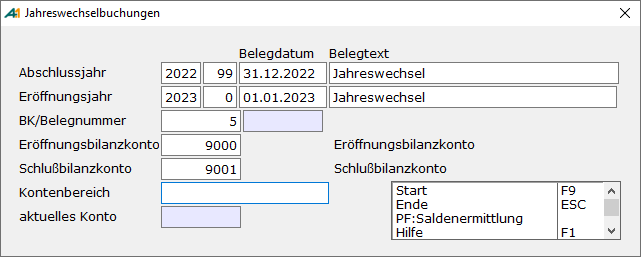

# Jahreswechsel durchführen

<!-- source: https://amic.de/hilfe/jahreswechseldurchfhren.htm -->

Hauptmenü \> Abschlussarbeiten \> Jahreswechsel \> Jahreswechsel

Direktsprung **[JAHRW]**

| | Beschreibung |
| --- | --- |
| Abschlussjahr | Hier werden die Informationen für den Beleg, der die Abschlussbuchungen enthält hinterlegt. Hat man das Jahr angegeben, werden die Abschlussperiode und das Belegdatum laut Stammdaten vorgeschlagen.  |
| Eröffnungsjahr | Das Jahr wird als Abschlussjahr + 1 vorgeschlagen. Eröffnungsperiode und Belegdatum ergeben sich aus den Stammdaten.  |
| BK/Belegnummer | Hier wird der Nummernkreis vorgeschlagen wie er unter „[Fibu-Vorgangszuordnung](./stammdaten_jahreswechsel.md)“ (Direktsprung NKF) hinterlegt ist.  |
| Eröffnungsbilanzkonto | Kontonummer des zu verwendenden Kontos für die Eröffnungsbuchung. Wird aus dem [Mandantenstamm](./stammdaten_jahreswechsel.md) vorbelegt.  |
| Schlussbilanzkonto | Kontonummer des zu verwendenden Kontos für die Abschlussbuchung. Wird aus dem [Mandantenstamm](./stammdaten_jahreswechsel.md) vorbelegt.  |
| Kontenbereich | Hier kann man den Bereich angeben, für den der Jahreswechsel durchgeführt werden soll. Folgende Bereiche sind möglich: • Bilanzkonten • Debitoren • Kreditoren • Kontokorrent • Personen- und Bilanzkonten  |

Hat man alle Angaben gemacht, kann man mit **F9** den Jahreswechsel starten. Es werden vor dem Start noch Test vom Programm vorgenommen, damit nicht versehentlich Fehler beim Jahreswechsel auftreten:

• Die Abschlussperiode muss existieren und offen sein.

• Das Eröffnungsjahr muss hinter dem Abschlussjahr liegen.

• Die Eröffnungsperiode muss existieren und offen sein.

• Eröffnungs- und Abschlussbilanzkonto muss existieren und als Vortragskonto gekennzeichnet sein.

• Es dürfen keine ungebuchten Belege im abzuschließenden Jahr existieren.

• Wenn man im Sachkontenstamm die Option „[Ist Unterkonto von](../stammdaten_der_fibu/sachkonten.md#IstUnterKontoVon)“ verwendet, muss die letzte Normalperiode offen sein.

• Wenn der Steuerungsparameter 968 „Forderungskonten umbuchen“ auf **Ja** steht, dann dürfen keine Änderungen an Forderungsgruppen existieren, die noch nicht durch die Reorganisation gelaufen sind.

• Wenn der Steuerungsparameter 968 „Forderungskonten umbuchen“ auf **Ja** steht und Änderungen an den Forderungsgruppen vorgenommen wurden, muss die letzte Normalperiode offen sein.

• Sind die Steuerkonten noch nicht ausgebucht, wird man darauf hingewiesen und kann hier den Jahreswechsel noch abbrechen.

• Der vorangegangene Jahreswechsel muss vollständig durchgeführt worden sein.

• Wenn zu Sachkonten Hauptkonten eingetragen sind – für den automatischen Abschluss von Unterkonten über die entsprechenden Hauptkonten (z.B. Privat an Eigenkapital) – muss die letzte Normalperiode offen sein.  
    

Ist keiner dieser Tests fehlgeschlagen, so startet das Programm. Es werden zwei Belege mit der Belegart JW (Jahreswechsel) erzeugt, einer in der Abschlussperiode und einer in der Eröffnungsperiode. Diese Belege müssen anschließend noch gebucht werden.

*GuV-Konten werden nicht in die Eröffnungsperiode übertragen. Es erfolgt kein automatischer Gewinn-/Verlustvortrag.*
