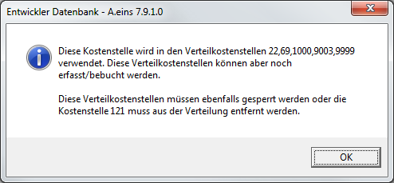
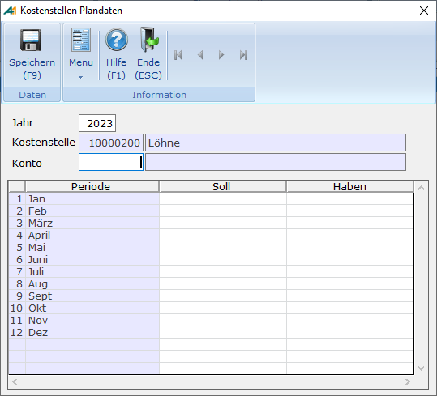
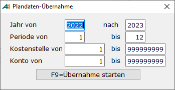

# Kostenstellen

<!-- source: https://amic.de/hilfe/kostenstellen.htm -->

Hauptmenü \> Kostenrechnung \> Kostenstellenstamm \> Kostenstellen

Direktsprung **[KST]**

Um mit Kostenstellen zu arbeiten, gibt es folgende Vorbedingungen bzw. Einstellungsvoraussetzungen:

1. Der Steuerparameter "**Kostenstellenrechnung angeschlossen**" muss gesetzt sein.

2. Die Kostenstellen müssen eingerichtet sein. Hierzu gibt es zwei Stammdatenpfleger

• Kostenstellen (ohne Verteilung)

• Verteilkostenstellen (mit Verteilung)

3. Im [Sachkontenrahmen](../stammdaten_der_fibu/sachkonten.md) Direktsprung **[SKS]** muss bei den in Frage kommenden Aufwandskonten im Feld „Sperre Kostenstelle“ aus folgenden Möglichkeiten gewählt werden

• **Gesperrt**: Es wird keine Kostenstelle abgefragt

• **Kann**: Es kann eine Kostenstelle eingeben werden, muss aber nicht

• **Muss**: Es muss eine Kostenstelle eingegeben werden

• **Fest**: Es muss die im Sachkontenstamm festgelegte Kostenstelle verwendet werden

Im Feld Kostenstelle kann hier die Nummer einer Kostenstelle eingegeben werden, die dann bei der Belegerfassung automatisch vorgeschlagen wird.

4. Damit auch Rechnungen aus der Warenwirtschaft beim Fibu-Übertrag automatisch in die Kostenstellenrechnung eingetragen werden können ist es nötig, [Kostenstellengruppen](./kostenstellengruppe.md) zu definieren, in denen die Kostenstellen des Artikels für Einkauf und Verkauf angegeben werden können.  
Diese werden dann im Artikel über die Funktion Kostenst./Statistik/Abteil gepflegt, und wenn dann der Artikel im Vorgang angesprochen wird, wird die jeweilige Kostenstelle bebucht.

5. Im Mandantenstamm sollte eine Fehlerkostenstelle eingerichtet werden. Diese Kostenstelle wird herangezogen, wenn zu GuV-Konten keine Kostenstelle hinterlegt ist und die „Sperre Kostenstelle“ des angesprochenen Kontos nicht auf Gesperrt oder Fest seht.

Erfassung der Kostenstellen

Folgende Felder können in dem folgenden Eingabebildschirm erfasst werden

| | Beschreibung |
| --- | --- |
| Kostenstelle  
    
 | Nummer der Kostenstelle. Es ist zwar möglich eine Kostenstelle mit der Nummer 0 zu erfassen, jedoch wird diese nicht als Kostenstelle ausgewertet. 0 bedeutet immer „Keine Kostenstelle“  
 |
| Bezeichnung | Bezeichnung der Kostenstelle (sprechende und eindeutige Namen erleichtern hier die spätere Suche (Bsp.: KFZ-KI-QM-12345).  
 |
| Matchcode | Kurzbezeichnung der Kostenstelle  
 |
| Erfassungssperre  
    
 | Diese Sperre gilt für die Belegerfassung der Finanzbuchhaltung. Steht diese auf **Ja**, so kann die Kostenstelle dort nicht mehr verwendet werden. Auch ist es nicht mehr möglich diese Kostenstelle als Verteilkostenstelle oder in den Kostenstellengruppen zu verwenden. Ist sie bereits in irgendeiner Verteilkostenstelle eingetragen, so erscheint die Meldung:  
  
Die hier angesprochenen Arbeitsschritte müssen manuell durchgeführt werden.  
Wird in einem Beleg eine gesperrte Kostenstelle verwendet - dies ist z.B. dann möglich, wenn die Sperre erst nach der Verwendung der Kostenstelle gesetzt wurde -, so wird der Beleg nicht gebucht. Es erscheint die Meldung „**Kostenstelle … ist gesperrt!**“ im Buchungsprotokoll.  
    
 |
| Druckpositionen | Im Feld Druckposition muss eine Kostenstellen-Druckposition (Direktsprung ist **[FIDRK]**) eingetragen werden, die den Ausdruck der Kostenstellenauswertung steuert.  
Kostenstellen mit gleicher Kostenstellen-Druckposition werden gemeinsam mit einer Zwischensumme ausgedruckt.  
 |
| Externe Aw. Positionen  
    
 | Hier können für eigene Auswertungen Druckpositionen hinterlegt werden. Es ist jedoch möglich, eigene Itemboxen zu hinterlegen. Dafür muss man die Einrichterparameter „Itembox für externe Auswertungsposition 1-5“ und (optional) „Bezeichnungsfeld für ext. Auswertungsposition 1-5“ und (auch optional) „Label für externe Auswertungsposition 1-5“ hinterlegen. Beispielsweise könnte man als Itembox für ext. Auswertungsposition 1 „IB_LAGERSTAMM“ hinterlegen. Um dann hinter der externen Auswertungsposition die Bezeichnung zu sehen, muss man das Bezeichnungsfeld aus der Itembox in „Bezeichnungsfeld für ext. Auswertungsposition 1“ angeben. Dies wäre dann in diesem Fall „Lagerbezeich“.  
   
In der GuV nach Kostenstellen werden die externen Auswertungspositionen dann mit abgefragt, wenn man in den Einrichterparametern beim Label Einträge vorgenommen hat.  
 |
| Bemerkungen | Hier kann ein wahlfreier Text zu der jeweiligen Kostenstelle erfasst werden.  
 |

Löschen der Kostenstellen

Wenn Kostenstellen gelöscht werden, werden sie nicht sofort physikalisch gelöscht, sondern als gelöscht gekennzeichnet. Diese gelöschten Kostenstellen sind dann für die Belegerfassung gesperrt, erscheinen aber trotzdem – soweit sie bebucht sind – auf den Auswertungen.

Bevor eine Kostenstelle jedoch als gelöscht gekennzeichnet werden kann, wird vorher getestet, ob sie noch verwendet wird.

• Wird die Kostenstelle noch als Vorbelegung für die Belegerfassung im Sachkontenstamm verwendet?

• Ist sie als Kostenstelle für die automatischen Buchungen der Mahngebühren/Zinsen im Mahnsatz hinterlegt?

• Ist sie als Fehlerkostenstelle im Mandantenstamm hinterlegt?

• Wird sie in der Tabelle ARTIKOSTSTGRUPPE verwendet?

• Wird sie als Kostenstelle für die automatischen Buchungen der Zinsrechnung in den Zinsgruppen verwendet?

• Wird sie als Kostenstellenvorbelegung in den Wechselkosten verwendet?

• Ist diese Kostenstelle einer Verteilkostenstelle zugeordnet? Bei dieser Prüfung wird unterschieden, ob die Verteilkostenstelle bereits gelöscht worden ist oder nicht. Bei gelöschten Verteilkostenstellen erfolgt ein Hinweis darauf mit einer Abfrage, ob  
tatsächlich gelöscht werden soll. Bei Verwendung in nicht gelöschten Verteilkostenstellen wird das Löschen nicht durchgeführt.

• Wird diese Kostenstelle in den Periodischen Buchungen hinterlegt?

• Bei Kostenstellen, die bereits bebucht wurden, erfolgt ein Hinweis mit Abfrage, ob tatsächlich gelöscht werden soll.

Wurden diese Tests durchlaufen, wird die Kostenstelle als gelöschte Kostenstelle gekennzeichnet. Alle so gekennzeichneten Kostenstellen finden sich in der Variante „Gelöschte...“ wieder. Dort stehen dann – nachdem man eine Kostenstelle markiert hat – zwei Funktionen zur Verfügung.

• ***Wiederherstellen*  
**Hier öffnet sich dann die Maske mit den Daten der Kostenstelle und nach erneutem **F7** wird die Kostenstelle wieder als nicht gelöscht gekennzeichnet.

• ***endgültig löschen*  
**Die Kostenstelle wird ohne weitere Prüfung physikalisch gelöscht. Bei bereits bebuchten Kostenstellen führt dies auch dazu, dass sie nicht mehr auf Auswertungen erscheinen.

Erfassung der Planzahlen

Die Erfassung der Planzahlen für Kostenstellen erreicht man über:

Hauptmenü \> Kostenrechnung \> Kostenstellenstamm \> Kostenstellen \> Funktion „Plandaten“ F10

Direktsprung **[KST]**

Planzahlen für Kostenstellen müssen pro Jahr, Periode und Konto erfasst werden. Hat man die Funktion „Plandaten erfassen“ ausgewählt, so erscheint folgende Erfassungsmaske:

Neben der manuellen Erfassung stehen noch zusätzliche Funktionen zur Verfügung:

• Vorjahresplandaten: Die zu dieser Kostenstelle und diesem Konto im Vorjahr erfassten Werte werden automatisch in die Soll und Habenspalte übernommen.

• Plandaten aus 1.Periode: Die Werte, die in Periode 1 eingetragen wurden, werden in alle anderen Perioden übernommen.

• Löschen Plandaten: Alle Werte dieser Kostenträger/Jahr/Kontonummern-Kombination werden auf 0.0 gesetzt.

• Übernahme Plandaten: Es öffnet sich eine weiter Maske, in der der Bereich abgefragt wird, aus dem die Planzahlen übernommen werden sollen:

