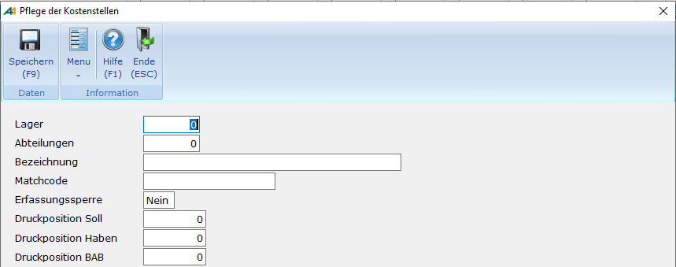
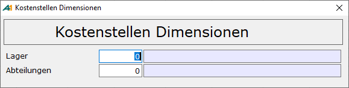

# Kostenstellendimensionen

<!-- source: https://amic.de/hilfe/kostenstellendimensionen.htm -->

Hauptmenü \> Kostenrechnung \> Kostenstellenstamm \> Kostenstellen \> Funktion ***Kostenstellendimensionen***

Direktsprung **[KST]**

Als Dimension bezeichnen wir ein frei wählbares Kriterium, das für die Kostenrechnung einer Firma von Belang ist. Dimensionen sind frei definierbar und ihre konkreten Inhalte pflegbar.

Wenn man sich dafür entschieden hat, die Kostenstellen über das Dimensionsmodel zu verwalten, so muss man den Steuerungsparameter „**Kostenstellen Dimensionen aktiv**“ auf **Ja** stellen, um dem System mitzuteilen, dass der Zugriff auf die Kostenstellen jetzt über eine Kombination aus bis zu 10 Dimensionen erfolgt. Es steht dann in der Anwendung zum Pflegen der [Kostenstellen](./index.md) (Direktsprung **[KST]**) eine weitere Funktion ***Kostenstellendimensionen*** zur Verfügung.

Hier kann man nun die Dimensionen erfassen. Dabei sollte man aber von vornherein festlegen, wie diese auszusehen haben. Man kann zwar später noch Änderungen vornehmen, jedoch werden bereits erfasste Daten davon nicht mehr berührt.

| | Beschreibung |
| --- | --- |
| Label  
    
 | Vor den eigentlichen Eingabefeldern muss zur Identifikation der Dimension eine Bezeichnung stehen. Diese wird hier eingetragen  
 |
| Tabelle | Auf welche Tabelle soll sich diese Dimension beziehen. Es ist hier auch möglich, private Tabellen anzugeben. Diese Tabellen müssen eine Integer Feld zur eindeutigen Identifikation und ein Bezeichnungsfeld besitzen.  
 |
| Feldname | Der Name des Integerfeldes zur eindeutigen Identifikation des Datensatzes. Eine Auswahl der Felder vom Typ Integer ist mit **F3** möglich.  
 |
| Name Bezeichnungsfeld  
    
 | Hier muss man den Namen des Feldes aus der Tabelle angeben, das die Bezeichnung enthält. Eine Auswahl der Felder vom Typ Character ist mit **F3** möglich. Dieses Feld wird in allen zugehörigen Erfassungsbildschirmen als Bezeichnung neben der Nummer angezeigt.  
 |
| Itembox | Dem Feld muss eine Itembox zugeordnet werden.  
 |
| Parameter | Bei den Dimensionen kann es sein, dass eine Dimension sich auf eine andere Dimension bezieht: Beispiel: In Abteilung A gibt es die Unterabteilung 1, 2 und 3 und in Abteilung B gibt es die Unterabteilung 1 und 2. Damit nun die Itembox zur Unterabteilung nur die Werte anzeigt, die der bereits angegebenen Abteilung zugehören, gibt es hier die Felder Parameter und Parameterwert. In Parameter muss der Parameter aus der Itembox stehen, der für diese Einschränkung gültig ist. In der Itembox IB_ABTUNTER lautet diese z.B.: PAR1. |
| Parameterwert | Welcher Wert soll dem Parameter zugeordnet sein? Um sich auf eine bestimmte Kostenstellendimension zu beziehen, muss man als Feldname:h.KostStelDimension1$ eingeben. Die Zahl vor dem $ (hier 1) gibt die Zeile an, aus der der Wert geholt werden soll (hier also der Wert der ABTEILUNGID aus ABTEILSTAMM). In dieser Itembox (IB_ABTUNTER) muss nur der Feldname eingetragen werden (Doppelpunkt nicht vergessen!).  
 |

Bei der Anzeige der Kostenstellen in diversen Erfassungsmasken werden nach wie vor die ursprüngliche Kostenstellennummer und der Text angezeigt. Um nun vom Text auf die Dimensionen schließen zu können, ist es sinnvoll, dass dieser sich auf die einzelnen Dimensionen bezieht. So kann man sich vorstellen, dass man einfach die numerische Darstellung der Dimensionen abbildet oder die Bezeichnung so definiert, dass aus den ersten Stellen ein eindeutiger Code generiert wird. Damit bei der Generierung der Kostenstellen-Stammdaten dann auch sofort der einmal definierte Text vorbelegt wird ist es möglich, eine Datenbankfunktion anzugeben. Von AMIC wird eine einfache Datenbankfunktion vorgegeben, die die Nummern der Dimensionen zu einem Textstring zusammenfasst und zurückgibt. Diese Funktion kann durch eine eigene ***Datenbankfunktion*** **F10** ersetzt werden.

create FUNCTION AMIC_FIBUF_KSTDIMTEXT( in in_d1 integer,

 in in_d2 integer default 0,

 in in_d3 integer default 0,

 in in_d4 integer default 0,

 in in_d5 integer default 0,

 in in_d6 integer default 0,

 in in_d7 integer default 0,

 in in_d8 integer default 0,

 in in_d9 integer default 0,

 in in_d10 integer default 0)

returns char(40)

begin

 declare retval char(40);

 declare intval integer;

 declare Cnt integer;

 select count(\*) into Cnt from KostStelDimension

 where isnull(KstDiTabelle,'') !='';

 set retval='';

 set intval=1;

 While intval &lt;= Cnt LOOP

 case intval

 when 1 then set retval = in_d1;

 when 2 then set retval = retval ||'|'|| in_d2;

 when 3 then set retval = retval ||'|'|| in_d3;

 when 4 then set retval = retval ||'|'|| in_d4;

 when 5 then set retval = retval ||'|'|| in_d5;

 when 6 then set retval = retval ||'|'|| in_d6;

 when 7 then set retval = retval ||'|'|| in_d7;

 when 8 then set retval = retval ||'|'|| in_d8;

 when 9 then set retval = retval ||'|'|| in_d9;

 when 10 then set retval = retval ||'|'|| in_d10; 

 end case;

 set intval=intval+1

 end loop;

 return retval; 

end

Als Parameter werden der Funktion die verwendeten Dimensionen übergeben. Wenn man also z.B. drei Dimensionen definiert hat, so werden die Parameter in_d1, in_d2 und in_d3 versorgt. Wenn eine eigene Funktion geschrieben wird, so muss der Funktionskopf dem aus dem oben gezeigten Beispiel entsprechen und einen Wert vom Typ Character muss zurückgeliefert werden.  
    

Arbeiten mit Kostenstellendimensionen

Hat man die Kostenstellendimensionen definiert, so ändert sich die Erfassungsmaske der Kostenstellen. Es wird nicht mehr die Kostenstellennummer abgefragt, sondern die Werte der eingegebenen Dimensionen. Jede Kombination darf nur einmal existieren. Dies wird bei der Erfassung vom Programm überprüft.

Die ehemalige Kostenstellennummer wird dann automatisch vergeben. Als Text wird derjenige vorgeschlagen, der durch die Datenbankfunktion (s.o.) zurückgeliefert wird.

In allen Bereichen, in denen es notwendig ist, eine Kostenstelle anzugeben (z.B. Belegerfassung, Zinsgruppen, Mahnsätze, ...), erscheint nach wie vor die Abfrage der Kostenstelle. Man kann hier - falls bekannt – auch nach wie vor die Kostenstellennummer angeben. Wird hier jedoch **F3** aufgerufen, so erscheint an Stelle der Itembox eine Abfragemaske in folgender Form:

  
    

Hier kann man nun zu jeder eingerichteten Dimension die Werte erfassen oder per **F3** in den eingerichteten Itemboxen auswählen. Die zugehörige Kostenstelle wird anschließend in die Erfassungsmaske übernommen. Existiert die Kostenstelle nicht, so wird diese automatisch **OHNE NACHFRAGE** angelegt. Der Text wird dabei mit Hilfe der Datenbankfunktion erstellt.
