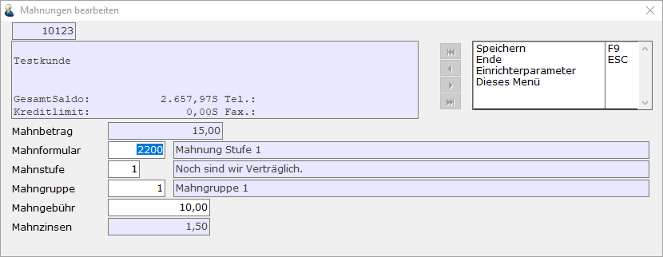
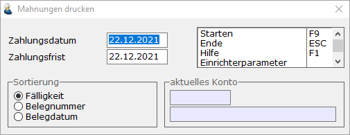
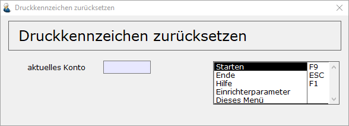
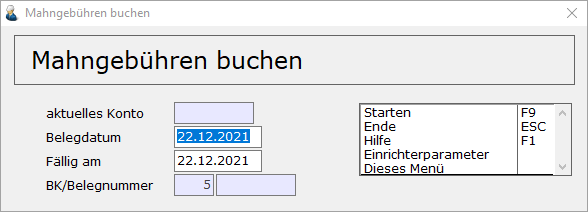

# Mahnungen bearbeiten

<!-- source: https://amic.de/hilfe/mahnungenbearbeiten.htm -->

Hauptmenü > Mahn-, Zahl-, Zinswesen > Mahnwesen > Mahnungen bearbeiten

Direktsprung **[MHB]**.

Die eigentliche Aufgabe besteht darin, die Mahnungen zu drucken. Auch auf dieser Ebene gibt es weitere Bearbeitungsfunktionen:

***Mahnliste Druck***

Die Mahnliste wird als Protokoll gedruckt

Bei den Varianten (Mahnungen bearbeiten, Mahnungen gedruckt, Mahnungen ungebucht, Mahnungen ungedruckt) stehen zusätzlich die folgenden Funktionen zur Verfügung

***Ansehen* F6**

Eine Auswahlliste mit den Daten der markierten Mahnungen wird auf dem Bildschirm angezeigt. Eine weitere Bearbeitungsmöglichkeit besteht hier nicht mehr.

***Formularänderung* F5**

Unter Formularänderung können noch verschiedene Parameter geändert werden. Dazu gehören das Formular, mit dem diese Mahnung gedruckt werden soll, die Mahngruppe und Stufe, der die Mahnung zugeordnet ist sowie die Mahngebühr. Zinsen lassen sich hier nicht mehr ändern. Dies ist nur unter Mahnvorschläge bearbeiten möglich.

***Drucken* F9**

Die Mahnschreiben werden ausgedruckt. Welches Formular herangezogen wird, wurde zuvor in den Mahn-Stammdaten festgelegt (Mahnstamm).

Nach Eingabe von Zahlungsdatum und Zahlungsfrist, die lediglich als Hinweistext für das Mahnschreiben gedacht sind, und nach Festlegung der Sortierung beginnt der Ausdruck. Im Mahnschreiben besteht auch die Möglichkeit, auf das letzte Zahlungsdatum des Kunden hinzuweisen. Unter Einrichtungsparameter (**Shift F2**) lässt sich zusätzlich einstellen, wie die Darstellung des Sollhabenkennzeichens sein soll und ob die Restposten aufgelöst dargestellt werden sollen.

**ACHTUNG:** *Sobald die Mahnung gedruckt wird, werden die Mahnstufen in den Belegen hochgesetzt und es wird das Datum der letzten Mahnung vermerkt.*

Eine Mahnung wird nicht gedruckt, wenn der fällige zu mahnende Saldo, der fällige Saldo oder der gesamt auf dem Mahnschreiben ausgegebene Saldo im Haben steht.

Die hier hinterlegten Mahnungen können nicht als Archiv betrachtet werden, da bezahlte Rechnungen nicht mehr auf der Mahnung gedruckt werden. Dadurch ist die Wahrscheinlichkeit, eine bereits bezahlte Rechnung versehentlich zu mahnen, geringer.

Man kann Mahnungen auch so einrichten, dass sie per [Mail versendet](./mahnungen_mailversand.md) werden.

***Druckkennzeichen löschen* F10**

Wurde eine Mahnung bereits gedruckt, so kann mithilfe der Funktion ***Druckkennzeichen löschen*** das Druckkennzeichen der Mahnung von „Ja“ auf „Nein“ zurückgesetzt werden. Dabei wird das Mahndatum und die Mahnstufe der offenen Posten zurückgesetzt.

***Löschen* F7**

Mahnungen können gelöscht werden. Ungedruckte Mahnungen werden also nicht wirksam. Da zur Information auch die gedruckten Mahnungen angezeigt werden, kann es sinnvoll sein, diese periodisch zu löschen oder in der Auswahlliste eine Variante/Profil **"aktive"** und **"abgearbeitete"** Mahnungen zu erstellen.

***Übernahme in die Primanota* F8**

Die Buchungssätze für Mahngebühren, Zinsen etc. werden erstellt.

Abgefragt werden das Beleg- und das Fälligkeitsdatum. Der Nummernkreis wird, wie in der Nummernkreiszuordnung Finanzbuchhaltung (Direktsprung **[NKF]**) für Ausgangsrechnungen hinterlegt, vorgeschlagen. Durch auslösen der Funktion ***Starten*** **F9** wird der Vorgang gestartet.

Den Text der Hauptposition kann im [Mahnstamm](./mahnstamm.md) im Feld Buchungstext hinterlegen. Ist dort kein Text eingetragen, dann wird der im Einrichterparameter „**Text Hauptzeile bei Übernahme der Mahnungen in die Primanota**“ hinterlegte Text verwendet. Ist auch hier kein Text eingerichtet, so wird der Standardtext „Mahngebühren und Mahnzinsen verwendet.

Vor dem Erstellen der Belege werden noch einige Tests durchgeführt:

- Ist ein gültiger Steuersatz hinterlegt? Im Fehlerfall wird ein Hinweis auf die fehlende Schlüsselkombination ausgegeben.
- Ist das Steuerkonto in diesem Steuersatz hinterlegt? Im Fehlerfall wird ein Hinweis auf die fehlende Schlüsselkombination ausgegeben.
- Wenn Zinsen angefallen sind, so muss für auch eine Zinsgruppe hinterlegt sein. Die Stammdaten für Mahnungen ( im [Mahnsatz](./mahnsaetze.md) ) müssen daraufhin überprüft werden.
- Ist die eingetragene Zinsgruppe nicht vorhanden oder ist dort kein Konto eingetragen, wird eine entsprechende Meldung ausgegeben. Diese Zinsgruppe ist dann zu überprüfen.
- Ist für diese Mahngruppe ein Mahnsatz eingetragen?
- Ist das Konto im Mahnsatz eingetragen? Die Stammdaten zur angezeigten Schlüsselkombination müssen überprüft werden.
