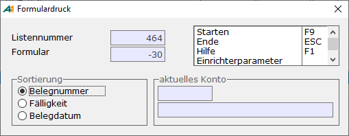
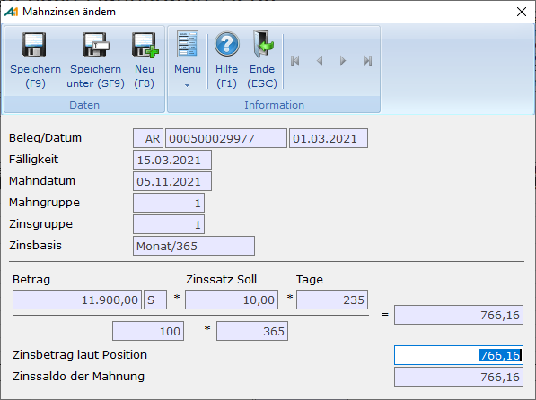

# Mahnvorschläge bearbeiten

<!-- source: https://amic.de/hilfe/mahnvorschlgebearbeiten.htm -->

Hauptmenü > Mahn-, Zahl-, Zinswesen > Mahnwesen > Mahnvorschläge bearbeiten

Direktsprung **[MHVB]**.

Die automatisch und manuell erstellten Mahnvorschläge können dann bearbeitet werden.  
Im Auswahlbildschirm stehen die Vorschläge nach Listennummern und Kontonummer geordnet zur Verfügung. Nach Anwahl eines Vorschlags bestehen u.a. folgenden Möglichkeiten:

***Löschen*** **F7**

Der komplette Mahnvorschlag kann gelöscht werden.

***Freigabe*** **F6**

Der Mahnvorschlag wird zur Mahnung übernommen

***Mahnvorschlagsliste* F10**

Drucken einer Crystal-Liste sämtlicher Mahnvorschläge. Dort wird in der letzten Spalte die Mahnstufe angedruckt. Dies ist entweder die neue Mahnstufe oder die Mahnstufe die im OP steht, falls diese Rechnung nur der Vollständigkeit halber mit angedruckt wird (Einstellmöglichkeit in Mahngruppen "Wie Mahnen“). Dann steht hinter der Mahnstufe ein Stern "\*". Ist die Rechnung noch nicht fällig, ist also der Mahnstichtag kleiner als das Fälligkeitsdatum, so werden diese Belege grau hinterlegt.

    
***Liste über Formular* F8**

Drucken einer Mahnvorschlagsliste über ein Formular. Es wird das Formular –30 "Mahnvorschlagsliste" mit ausgeliefert.

Es wird - im Gegensatz zum Druck mit Crystal-Report - nur die Mahnvorschlagsliste gedruckt, die auf der Maske angezeigt wird. Hier ist es möglich, die Sortierung der Belege pro Kunde festzulegen.

***Ändern* F5**

Um **Mahnvorschläge zu ändern, werden i**n einer weiteren Anwendung zu den ausgewählten Vorschlägen je Konto die zu mahnenden Belege angezeigt. Folgende Bearbeitungsmöglichkeiten stehen dann zur Verfügung:

Mit **&lt;, >** wird zwischen den Konten geblättert.

**F5****:** Es können weitere Belege zu dieser Mahnung hinzugefügt werden, die bisher nicht hinzugefügt worden sind (Siehe Einstellung in den Mahngruppen).

**F6****: Freigabe des gesamten Vorschlags.**

**F7****:** Es können einzelne Positionen oder der gesamte Vorschlag gelöscht werden.

**Umschalt F5****:** Nur hier hat man noch die Möglichkeit, Zinsen manuell zu ändern. Dies muss pro Position geschehen.

**F8**: Beleginfo. Der Beleg mit seinen einzelnen Positionen wird angezeigt (Siehe [Einzelbeleganzeige](../op_verwaltung/einzelbeleganzeige.md)).
