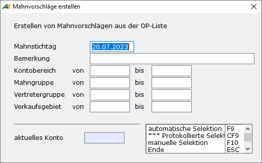

# Mahnvorschläge erstellen

<!-- source: https://amic.de/hilfe/mahnvorschlgeerstellen.htm -->

Hauptmenü > Mahn-, Zahl-, Zinswesen > Mahnwesen > Mahnvorschläge erstellen

Direktsprung **[MHVE]**.

Nach Anwahl des Programmpunktes öffnet sich folgenden Bildschirm:

Der **Mahnstichtag** steuert, welche Positionen auf welcher Mahnstufe einbezogen werden. In den Stammdaten des Mahnwesens ist hinterlegt, wie groß der Mahnabstand in Tagen von der Fälligkeit zur 1. Mahnung, von der ersten Mahnung zur zweiten, etc. ist. In Abhängigkeit vom Mahnstichtag und dem Mahnabstand werden also Belege einbezogen oder nicht.

**Bemerkung** ist lediglich ein Text für den Vorschlag.

Danach wird der **Kontobereich** bestimmt, für den die Vorschlagsliste erstellt werden soll.

In der **automatischen Selektion** werden dann alle mahnbaren Belege je Konto laut Einstellung in den Mahngruppen in die Vorschlagsliste übernommen. Ausgeschlossen bleiben hier alle Kunden, die mit Mahnsperre versehen sind oder deren Mahngruppe 0 ist, sowie alle Belege die mit einer Mahnsperre versehen sind.

Bei der **manuellen Selektion** werden dagegen alle mahnbaren Belege ohne Mahnsperre je Konto – ohne Kunden mit Mahngruppe 0 - interaktiv vorgeschlagen:

Die ausgewählten Belege werden dunkel dargestellt. In der Rechenzeile unterhalb des Anschriftenfeldes wird links der Gesamtbetrag der ausgewählten Positionen inkl. Nebenkosten angezeigt. Die Summe setzt sich zusammen aus den ausgewählten Positionen, der Mahngebühr (z.B. € 10.-) und den aufgelaufenen Zinsen (z.B. bei 10 % Zinsen und dem angegebenen Zeitraum € 101,92.-).

Mit Betätigung von **F9** werden die Positionen in den Mahnvorschlag übernommen.

Der zu mahnende Betrag ergibt sich als Summe aus allen fälligen Belegen, die laut Einstellung in der Mahngruppe auf der Mahngruppe erscheinen sollen. Also werden gegebenenfalls auch Habenbeträge mit verrechnet. Dasselbe gilt für die Mahnzinsen. Ist der Mahnbetrag kleiner als der im Mahnsatz hinterlegte kleinste Mahnbetrag, wird kein Mahnvorschlag erstellt.

Hat ein offener Posten bereits eine Mahnstufe erreicht, für die die Stammdaten (Mahnsatz bzw. Mahnstamm) nicht mehr eingerichtet sind, so wird jeweils der nächste kleinere Mahnsatz bzw. Mahnstamm herangezogen.

<strong>ACHTUNG:</strong> <em>Werden zwischen Mahnvorschlägen erstellen und dem Druck der Mahnung fällige OP’s, die auf der Mahnung waren, ausgeziffert, so verschwinden diese aus der Mahnung und der Saldo der Mahnung wird angepasst. Die unter „Mahnungen bearbeiten“ zu findenden Mahnungen sind also nicht als Archiv zu betrachten, da sie sich auch nach dem Druck noch verändern können.</em>
