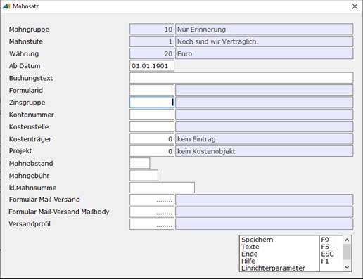
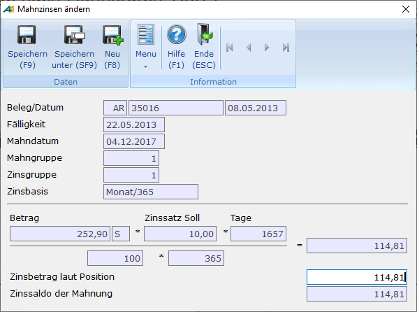

# Mahnzinsen

<!-- source: https://amic.de/hilfe/mahnzinsen.htm -->

Neben den Kontokorrentzinsen gibt es auch die Möglichkeit Mahnzinsen zu berechnen. Mahnzinsen werden nur in Buchwährung geführt. Diese werden Tag genau nach einem individuellen Zinssatz, der in den Stammdaten(Zinsgruppen) hinterlegt ist, errechnet. Bitte beachten Sie, dass ein Mixen von Kontokorrent- und Mahnzinsen für einen Kunden unsinnig ist.

Folgende Stammdaten müssen dabei berücksichtig werden:

- Im [Mandantenstamm](../../firmenstamm/firmenkonstanten/mandantenstamm.md#MND_FIBU) wird die Zinsbasis hinterlegt, d.h. man entscheidet sich Firmenweit, welche Monatseinteilung man bei der Zinsabrechnung verwenden will. In A.eins gibt es drei Möglichkeiten:
  - 30 Tage im Monat beim 360 Tagen im Jahr
  - Monatstage (Jan=31;Feb=28;...) bei 365 Tagen im Jahr
  - Monatstage (Jan=31;Feb=28;...) bei 360 Tagen im Jahr
- In der Zinsgruppe sollte mindestens ein Eintrag für Verzugszinsen aus Mahnungen existieren. Bei der Einrichtung dieser Zinsgruppe ist zu beachten, dass bei der Berechnung der Mahnzinsen nur der Soll-Zinssatz herangezogen wird.  
- Diese Zinsgruppe muss dann für die Mahngruppe im [Mahnstamm](./mahnsaetze_einrichten.md) hinterlegt werden. Man kann dort für jede Mahnstufe eine eigene Zinsgruppe hinterlegen  

- Es gibt zwei Möglichkeiten, wie die Mahnzinsen behandelt werden können. Entweder man bucht bei jeder Mahnung die Zinsen, dann dürfen die Zinsen nur von einer Mahnung bis zur nächsten Mahnung berechnet werden. Oder man bucht die Zinsen erst, wenn die Mahnung inklusive Zinsen gezahlt bzw. die Forderung dem Anwalt übergeben wurde. Dann muss die Mahnung den gesamten Zinsbetrag ausweisen, also Berechnung ab Fälligkeitsdatum. Dies wird in den [Mahngruppen](./mahngruppen.md) unter „**Zinsen immer ab Fälligkeit“** hinterlegt

Sind alle Stammdaten korrekt eingerichtet, werden beim Erstellen der Mahnvorschläge die Zinsen berechnet. Bei der Berechnung der Zinsen werden nur die Positionen herangezogen, die laut der Einstellung „**Wie mahnen**“ in den [Mahngruppen](./mahngruppen.md) auf der Mahnung erscheinen sollen. Dann werden auch nur die Positionen verzinst, die fällig sind. Bei der Bestimmung, ob die Positionen Fällig sind, wird auch der Mahnabstand berücksichtigt und dies sowohl für Soll- als auch für Habenposten.  
Die so errechneten Zinsen können dann unter [Mahnvorschläge bearbeiten](./mahnvorschlaege_bearbeiten.md) mit der Funktion ***Ändern* F5** angesehen und ggf. geändert werden. In den von AMIC bereitgestellten Varianten werden pro Mahnposition die errechneten Zinsen, die Tage und der Zinssatz, der zur Berechnung herangezogen wurde mit ausgegeben. Wenn man die Mahnzinsen ändert, geschieht dies pro Position:

Dort öffnet sich dann ein Dialogfenster, in dem die Berechnung der Zinsen für diesen Beleg angezeigt wird. Dort sind alle Informationen zu sehen, aus denen sich der Zinsbetrag ergibt.

Nach der Freigabe der Mahnungsvorschläge kann man die Mahnzinsen unter „Mahnung anzeigen“ ansehen. Sie lassen sich jedoch nicht mehr ändern. Dies ist dann nur noch möglich, indem man die Mahnung zurücksetzt und erneut einen Mahnvorschlag für diesen Kunden erstellt.

Im [Mahnformular](./mahnungen_ueber_mahnformulare_drucken.md) stehen in den Bereichen für die Zinsen folgende Felder zur Verfügung:

**HINWEIS:** *Steht in der Mahngruppe die Option „Zinsgutschrift zulassen“ auf **Nein** und ist der Zinssaldo negativ - also eine Gutschrift – werden alle folgenden Felder mit 0 ausgewiesen.*

Die Bereiche 301,303,305,306

| Bezeichnung | Typ | Nr | Beschreibung |
| --- | --- | --- | --- |
| MahnZinsen | Numerisch | 4 | Zinsen |
| MahnungZinsen | | | S.o. |
| MahnungSumme | Numerisch | 4 | Betrag + Gebühr + Zinsen |
| MahnungSaldoZinsen | Numerisch | 4 | Zinsen dieser Mahnung ( mit Verrechnung Soll und Haben ) |
| MahnungSaldoSumme | Numerisch | 4 | Saldo + Zinsen |
| MahnungWSaldoZinsen | Numerisch | 4 | Zinsen in Fremdwährung dieser Mahnung (mit Verrechnung Soll und Haben) Keine Gruppierung nach Währung! |
| MahnungWSaldoSumme | Numerisch | 4 | Saldo + Zinsen in Fremdwährung keine Gruppierung nach Währung! |
| GesamtMahnZinsen | Numerisch | 4 | Zinsen |
| GesamtMahnSumme | Numerisch | 4 | GesamtMahnBetrag+Zinsen+Gebühr |

Bereich 304 Mahnposition

| Bezeichnung | Typ | Nr | Beschreibung |
| --- | --- | --- | --- |
| PosZinsen | Numerisch | 4 | Zinsen zu dieser Mahnung |
| MahnPosZinsen | | | S.o. |
| MahnPosZinsSatz | Numerisch | 4 | Mit welchem Satz wurden die Zinsen berechnet |
| MahnPosZinsTage | Numerisch | 4 | Mit wie viel Tagen wurden gerechnet |

Bereich 307 Mahnsummenzeile

| Bezeichnung | Typ | Nr | Beschreibung |
| --- | --- | --- | --- |
| MahnPosZinsen | Numerisch | 4 | Summe aller mahnbare Zinsen dieser Mahnstufe |

Bereich 309 Mahnsummenfuß

| Bezeichnung | Typ | Nr | Beschreibung |
| --- | --- | --- | --- |
| MahnPosZinsen | Numerisch | 4 | Summe aller mahnbaren Zinsen |
