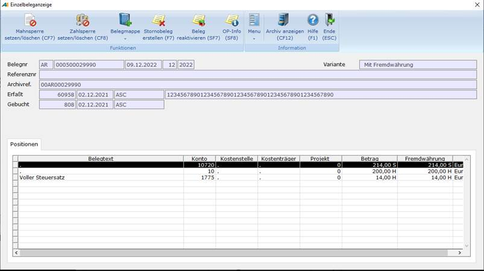
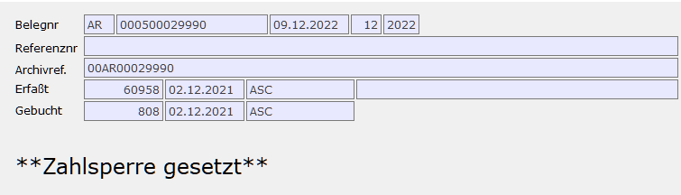
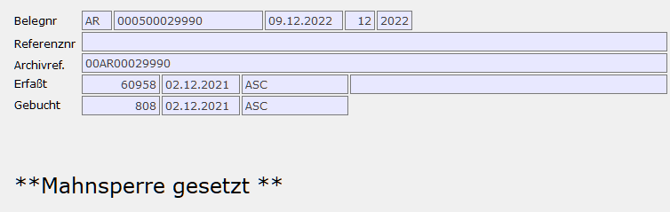
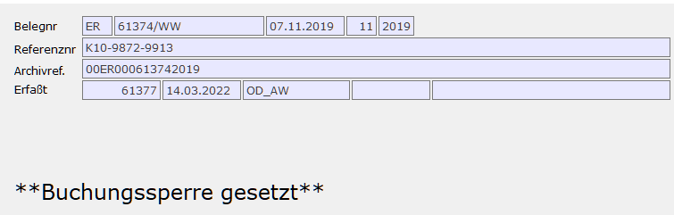
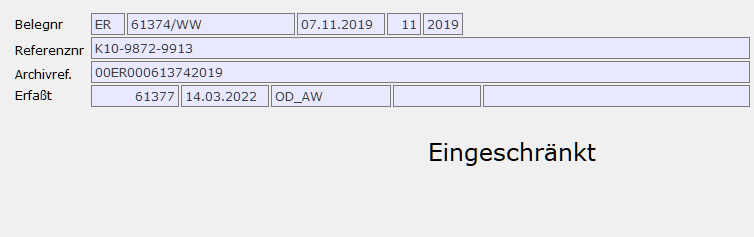
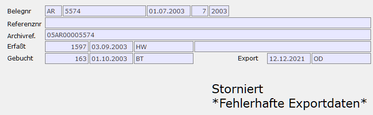
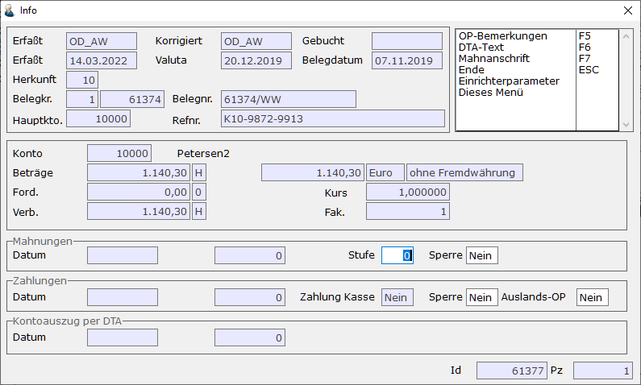
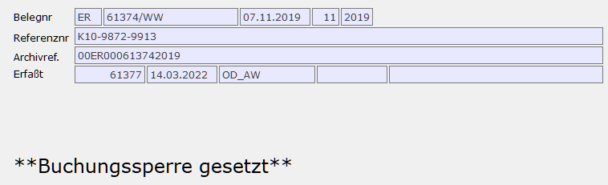

# Einzelbeleganzeige

<!-- source: https://amic.de/hilfe/einzelbeleganzeige.htm -->

Hiermit wird der einem OP zugrundeliegende vollständige Buchungssatz angezeigt. Dieser Bildschirm ist der zentrale Informationsbildschirm, der überall zur Anzeige von Belegen verwendet wird.

  
    
Im Informationsbereich oben rechts stehen in der ersten Zeile die Belegart, die Belegnummer, das Belegdatum, die Referenznummer und die Archivreferenz (Paginiernummer). In der zweiten Zeile stehen Informationen darüber, wann und von wem der Beleg erfasst wurde sowie die Bezeichnung der Belegmappe. Die dritte Zeile ist nur zu sehen, wenn der Beleg bereits gebucht worden ist. Sie enthält das Datum, an dem der Beleg gebucht wurde, die Nummer des Buchungsjournals und den Bediener, von dem der Beleg gebucht worden ist.

Unter diesen Zeilen werden noch weitere Informationen angezeigt.

1. Der Zahlungsstatus:  
Wenn ein OP über den automatischen Zahlungsverkehr beglichen wird so kann man hier verfolgen, in welchem Status er sich gerade befindet.  
    
  
Mögliche Stati sind:

   - \*\*Zahlsperre gesetzt\*\*  
Die Zahlsperre kann hier über die Funktion OP-Info oder direkt in der OP-Verwaltung gesetzt werden. Wird die Zahlsperre gesetzt, wird der OP ggf. aus den Zahlungsvorschlägen entfernt.

   - in Zahlungsvorschlag
   - zur Zahlung freigegeben
   - Scheckdruck / DTA ausgeführt
   - \*\*Scheckdruck / DTA abgewiesen\*\*  
Dieser Status besagt, dass versucht wurde einen Scheck zu drucken oder einen DTA auszuführen, jedoch die Informationen in den Stammdaten nicht ausreichend waren (z.B. fehlende Bankverbindung). Die genaue Fehlerursache wurde beim, Scheckdruck bzw. beim DTA ausgegeben. Nach Behebung des Problems kann der Scheckdruck / DTA wiederholt werden.

   - \*\*Zahlung unvollständig\*\*  
Dieser Status besagt, dass zwar der Scheck gedruckt wurde bzw. der DTA ausgeführt wurde, aber der Zahlungsbeleg gelöscht wurde, bevor er in die Primanota geschrieben worden ist. Dadurch bleibt der Beleg als OP stehen, darf aber nicht ohne weiteres wieder im automatischen Zahlungsverkehr einfließen. Belege, die nicht vollständig den Zahlungslauf durchlaufen haben findet man in der Anwendung „Zahlungen bearbeiten“ (Direktsprung **[ZHB]**) in der Variante „Gesperrte OP’s“.

   - Rücklastschrift  
Bei Rücklastschriften handelt es sich meist um Bankeinzüge, die von der Bank nicht eingelöst wurden. In A.eins stellt sich das wie folgt dar: Die Belege sind bereits durch den automatischen Zahlungsverkehr gegangen und per Scheckdruck / DTA ausgeglichen und der so entstandene Zahlungsbeleg in die Primanota übertragen worden. Aufgrund der Nichteinlösung wurde die Auszifferung wieder zurückgesetzt und der Zahlungsbeleg als Rücklastschrift markiert. So markierte Belege werden beim nächsten automatischen Zahlungsverkehr wieder mit herangezogen.

   - Gesperrte Rücklastschrift  
Bei gesperrten Rücklastschriften handelt es sich um Belege, die genau wie eine Rücklastschrift behandelt wurden, nur wurde der Zahlungsbeleg nicht als Rücklastschrift markiert. Dadurch werden diese Belege beim automatischen Zahlungsverkehr **nicht** erneut herangezogen. Um sie trotzdem erneut einzuziehen, kann man entweder die Belege manuell zu einem Zahlungsvorschlag hinzufügen oder den Zahlungsbeleg nachträglich als Rücklastschrift markieren.  
    

  2. Der Status der Mahnung  
Wird oder wurde ein OP gemahnt, so wird der aktuelle Status direkt angezeigt.

  
    

  Mögliche Stati sind:

- \*\*Mahnsperre gesetzt\*\*
- in Mahnvorschlagsliste
- Mahnung freigegeben
- Mahnung gedruckt
- In Mahnung verrechnet

  3. Die Buchungssperre  
Die Buchungssperre kann bei ungebuchten Belegen über die Funktion „Buchsperre setzen/löschen“ gesetzt bzw. aufgehoben werden. Der Status wird angezeigt.  
  
    
Über den Einrichterparameter 971 „Buchsperre setzen für Bedienerklasse“ kann man Bedienerklassen hinterlegen, für die die Buchungssperre automatisch bei der Erfassung gesetzt werden soll. Die Buchungssperre wird dann bei diesen Bedienerklassen sowohl bei der manuellen Erfassung, beim Fibuübertrag aus der Warenwirtschaft und auch beim Import innerhalb von A.eins gesetzt. Sie kann hier in der Einzelbeleganzeige aufgehoben werden oder in der Primanota (Direktsprung **[PRIMA]**) in der Variante „Primanota mit Buchungssperre“ mit der Funktion „Buchungssperre aufheben“.

  4. Die Bearbeitungssperre  
Es können Belege so gekennzeichnet werden, dass sie nicht manuell änderbar sind.  
  
    
Es existieren dabei vier Ausprägungen:  
    

- Normal änderbar: Man kann diesen Beleg in der Belegerfassung wie gewohnt ändern. 
- Eingeschränkt änderbar: Man kann nur Konto, [Kostenstelle](../kostenrechnung/kostenstellen.md), [Kostenträger](../kostenrechnung/kostentraeger.md), [Kostenobjekt](../kostenrechnung/kostenobjekte/index.md) und den Text ändern.
- Nicht änderbar: In der Belegerfassung lässt sich dieser Beleg nicht mehr ändern. Nach wie vor ist jedoch die Änderung des Skontos in der OP-Verwaltung möglich.
- Nicht änder-/löschbar: Wie nicht „Nicht änderbar“, nur dass der Beleg auch gegen Löschen gesperrt ist.

  Diese Sperre lässt sich in folgenden Programmbereichen per Einrichterparameter automatisch setzen:

- Zinsen: [Übernahme in die Primanota.](../zahlungsverkehr/zahlungen_bearbeiten/zahlungsverkehr_uebernahme_in_die_primanota.md)
- Automatischer Zahlungsverkehr [Übernahme in die Primanota](../zahlungsverkehr/zahlungen_bearbeiten/zahlungsverkehr_uebernahme_in_die_primanota.md).
- Stornobelege, die in der Einzelbeleganzeige erstellt werden. Hierzu existiert ein [Einrichterparameter](../../firmenstamm/einrichterparameter/einzelbeleganzeige_epa_fikinfoe.md).

  Des Weiteren kann eine Bearbeitungssperre für Belege im [Sachkonto](../stammdaten_der_fibu/sachkonten.md#BelegBearbeitungskennz) festgelegt werden.  
    

  5. Der Exportstatus

  Wenn Belege exportiert werden, so ist nicht immer sichergestellt, ob diese auch im Fremdsystem eingelesen werden können. Wenn das Fremdsystem die Datensätze zurückmeldet, die nicht eingelesen werden können, kann dieses Kennzeichen programmtechnisch gesetzt werden. Zum manuellen Setzen bzw. Zurücksetzen, steht die Funktion „Exportstatus setzen/löschen“ zur Verfügung.

  6. Storniert

  Neben den Sperren wird zusätzlich noch angezeigt, ob dieser Beleg ggf. in der Fibu bereits Storniert wurde. [Stornieren](../belegerfassung/stornieren_gebuchter_belege.md) eines Beleges in der Fibu bewirkt bei Warenwirtschaftsbelegen, dass das Übertrags-Kennzeichen wieder zurückgesetzt wird.

Zusätzlich stehen dann folgende Funktionen zur Verfügung:

- ***Texte ändern*:** Es können die Texte der einzelnen Belegzeilen geändert werden. Dies ist unabhängig davon, ob ein Beleg bereits gebucht wurde oder nicht, möglich.
- ***Bemerkungstexte*:** Es können zu Belegen Bemerkungen erfasst werden, die auf allen OP-Listen und auf der Mahnvorschlagsliste angezeigt werden können (per **F2**\-Auswahl einzustellen). Sind zu einem Beleg Bemerkungstexte erfasst erscheinen sie auch auf der Einzelbeleganzeige. Für den Beleg oben wurde „Diese Gutschrift nicht verrechnen.“ erfasst.
- ***Referenznummer ändern:*** Mithilfe dieser Funktion kann die Referenznummer geändert werden. Nach dem Ändern der Referenznummer erscheint beim Betätigen der **ESC**\-Taste oder beim Verlassen des Feldes eine Speicherabfrage.
- <strong>Archivreferenz ändern:</strong> Mithilfe dieser Funktion kann die Archivreferenz (Paginiernummer) geändert werden. Nach dem Ändern der Archivreferenz erscheint beim Betätigen der **ESC**\-Taste oder beim Verlassen des Feldes eine Speicherabfrage.
- ***OP Info*:** Zu der Belegzeile werden die OP-Informationen - soweit vorhanden – angezeigt und können geändert werden. Diese Funktion erscheint nur, wenn es sich bei der Position des Beleges auch um einen offenen Posten handelt.  

  Hier lassen sich auch einige Werte ändert:

| | Beschreibung |
| --- | --- |
| Mahnstufe | Hier kann die Mahnstufe geändert werden. Die Änderung wird auch in den Mahnvorschlägen berücksichtigt.  |
| Mahndatum | Das letzte Mahndatum lässt sich ändern, solange der OP nicht in einem aktuellen Mahnlauf berücksichtigt ist.  |
| Mahnsperre | Einzelne OP’s können mit Mahnsperren versehen werden, damit sie nicht mehr auf Mahnungen erscheinen.  |
| Zahlsperre | Man kann einzelne OP’s für den automatischen Zahlungsverkehr sperren. Sie erscheinen dann nicht in Zahlungsvorschlägen bzw. werden aus der Zahlungsvorschlagsliste gelöscht. OP’s die schon im automatischen Zahlungsverkehr gedruckt oder per DTA versandt wurden, können nicht mehr gesperrt werden.  |
| Auslands-OP | Wenn eine Lizenz für den Auslandszahlungsverkehr vorliegt und der OP noch nicht im automatischen Zahlungsverkehr bearbeitet wurde.  |

- ***OP-Bemerkungen:*** Hier können zu einem offenen Posten Bemerkungen erfasst werden. Diese verschwinden jedoch, wenn der Beleg ausgeziffert wird. Diese Bemerkungen werden in der Einzelbeleganzeige unterhalb der OP-Zeile angezeigt. In dem Beispiel oben wurde „Die Höhe des Betrages muss mit Herrn W. noch abgestimmt werden.“ als Bemerkung zum OP erfasst.  
- ***Buchsperre Setzen/Löschen:*** Für ungebuchte Belege können Buchsperren gesetzt werden. Dies kann sinnvoll sein, wenn noch Fragen zu klären sind und man sicherstellen will, dass dieser Beleg erst verbucht wird, wenn er vollständig richtig erfasst wurde. Ist eine Buchsperre gesetzt, erscheint  
  
der Text “\*\*Buchungssperre gesetzt\*\*” in fetter Schrift auf dem Bildschirm.  
    

- ***Belegmappenzuordnung bzw. Belegmappe entfernen:*** Belege können in sogenannten Belegmappen zusammengefasst werden. Diese wird in der zweiten Zeile rechts angezeigt. Hier kann man den Beleg einer Mappe zuordnen oder ihn aus einer Mappe entfernen. In den Anwendungen Primanota und Standardvorgänge Fibu kann man die Belege nach Mappen eingrenzen.  
- ***Beleg Löschen bzw. Beleg stornieren:*** Ungebuchte Belege können hier gelöscht werden. Ist der Beleg bereits verbucht, steht die Funktion „Beleg stornieren“ zur Verfügung. Ist die Periode des Originalbelegs noch offen, so wird der Stornobeleg automatisch dieser Periode zugeordnet, ansonsten wird die Periode abgefragt. Zusätzlich lässt sich für den Stornobeleg unter dem [Einrichterparameter](../../firmenstamm/einrichterparameter/einzelbeleganzeige_epa_fikinfoe.md) „Darf ein Stornobeleg geändert werden?“ einstellen, ob er im Nachhinein geändert bzw. gelöscht werden darf. Die stornierten Belege werden als Storniert gekennzeichnet, damit sie nicht versehentlich ein zweites Mal storniert werden. In dem [Einrichterparameter](../../firmenstamm/einrichterparameter/einzelbeleganzeige_epa_fikinfoe.md) „Textersetzung des Stornobelegs. Leer = Originaltext" kann man einen Text eintragen, der dann den Text des Beleges ersetzt, z.B. „Stornobeleg“  
- ***Beleg reaktivieren:*** Gebuchte Belege können nicht mehr geändert werden. Wurde jetzt ein Beleg gebucht und muss anschließend doch noch geändert werden, muss man ihn im Normalfall stornieren und neu erfassen. Die Funktion ***Beleg reaktivieren*** übernimmt diese beiden Aktionen. Es wird also – soweit möglich – ein Stornobeleg erstellt (s.o.) und eine Kopie des Ursprünglichen Belegs. Für Belege aus der Warenwirtschaft steht diese Funktion nicht zur Verfügung.  
- ***Rücklastschrift:*** Bei Zahlungsbelegen aus dem automatischen Zahlungsverkehr steht eine Funktion „*Rücklastschrift*“ zur Verfügung. Wurde von der Bank eine Zahlung nicht eingelöst, so kann man mit dieser Funktion eine einzelne Zahlungsposition stornieren und die Rechnungen wieder zu OP’s machen, die dann wieder beim automatischen Zahlungsverkehr herangezogen werden.
- ***Scheckeinreicher drucken:*** Belege vom Typen Scheckeinreicher (Belegart SE) können hier gedruckt werden.  
- ***Ansehen AKZ:*** Für ausgezifferte Positionen eines Beleges können hier alle miteinander verrechneten Belege angezeigt werden.  
- ***Ansehen Anlagenzuordnung:*** Belege, die ein Anlagenkonto ansprechen, können direkt einem oder mehreren Anlagegütern zugeordnet sein. Mit der Funktion „Ansehen Anlagenzuordnung“ können die zugeordneten Anlagegüter angesehen werden.  
- ***Kostenstellenverteilung / Kostenträgerverteilung:*** Sind einer Position [Kostenstellen](../kostenrechnung/kostenstellen.md) bzw. [Kostenträger](../kostenrechnung/kostentraeger.md) zugeordnet, kann bei verteilten Kostenstellen/Kostenträgern hier die Verteilung angesehen werden.  
- ***Warenbeleg anzeigen:*** Wenn es sich um einen Beleg aus der A.eins-Warenwirtschaft handelt, der über Fibuübertrag in die Finanzbuchhaltung gelangt ist, so kann man sich hiermit den Originalbeleg ansehen. Dies geschieht über das aus der Warenwirtschaft bekannte Standard-Vorschaufenster.  
- ***Archiv anzeigen:*** Sollte dieser Beleg bereits gedruckt und somit im Formulararchiv gelandet sein, kann man sich hier diesen Beleg anzeigen. Nähere Informationen zum Thema Archiv findet man in der Dokumentation unter dem Thema Formulararchiv.
