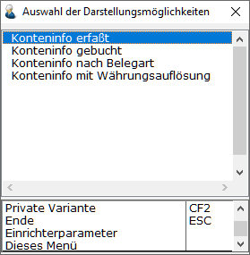
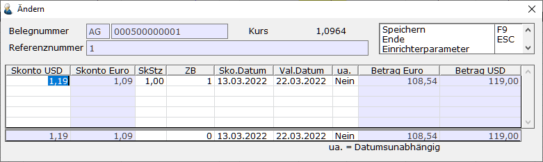
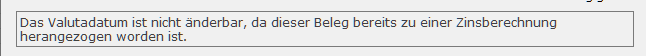
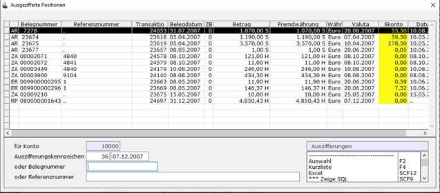
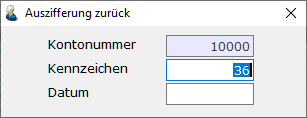

# Funktionen in der OP-Verwaltung

<!-- source: https://amic.de/hilfe/funktioneninderopverwaltung.htm -->

Hauptmenü > OP-Verwaltung > OP-Bearbeitung > OP-Verwaltung

Direktsprung **[OPV]**.

Um mit der OP Verwaltung zu arbeiten gibt es verschiedene Funktionen. Diese sind im Einzelnen:

Darstellung der Offenen Posten - F2

Für unterschiedliche Fragestellungen gibt es verschiedene Darstellungsformen der Offenen Posten. Sie können mittels **F2** - Auswahl abgerufen werden:

Es werden die für den Benutzer / das Unternehmen zugelassenen Varianten angezeigt. Alle mit „OP’s“ beginnenden Varianten beziehen sich auf noch nicht verrechnete Belege, alle anderen Varianten beinhalten auch bereits verrechnete Belege. Bei diesen Varianten ist zu beachten, dass in der OP-Verwaltung keine weitere Eingrenzung – außer nach Kontonummer – vorgesehen ist.

Wechsel der Kontos – F3

Mit Betätigung von **F3** wird in das Feld zur Eingabe der Kontonummer gewechselt und es kann ein neues Konto angewählt werden.

Ändern eines OP – F5

Die Skonto- und Valutadaten eines OP können verändert werden. Nach Auswahl des OP wird die Funktion mit **F5** ausgelöst:

Die Eingabe von Skontobetrag oder -satz löst eine Berechnung des Skontosatzes bzw. Skontobetrages aus. Die Zahlungsbedingung kann eingetragen werden und Skonto- sowie Valutadatum überschrieben werden.

**HINWEIS:** *Das Valutadatum ist nicht änderbar, wenn der Beleg bereits zur Zinsberechnung herangezogen wurde. Es erscheint dann ein Hinweis auf der Maske:  
*

Dann wird noch ggf. bei Änderung des Valutadatums geprüft, ob der Beleg sich bereits in einer Mahnliste befindet. Wie reagiert werden soll kann per Einrichterparameter eingestellt werden. Es stehen folgende Einstellungen zur Auswahl:

• *Ignorieren*: Es wird kein Test durchgeführt (dies ist das alte Verhalten)

• *Fehler*: Das Datum kann nicht geändert werden, wenn der OP bereits in einem Mahnvorschlag existiert

• *Warnung*: Es wird geprüft, ob der OP bereits in einer Mahnvorschlagsliste existiert. Es erfolgt ein entsprechender Hinweis. Eine Änderung des Datums ist jedoch möglich - dieses ist die Standardeinstellung

• *Zurücksetzen*: Es wird in diesem Fall abgefragt, ob die Mahninformationen zurückgesetzt werden sollen. Wird mit **Nein** geantwortet, so wird weiter verfahren wie bei „*Warnung*“. Ansonsten wird das letzte Mahndatum auf das Valutadatum, die Mahnvorschlagslistennummer ggf. auf 0 und die Mahnstufe auf 0 zurückgesetzt. Der OP wird dann beim nächsten Mahnlauf so behandelt, als ob er noch nie gemahnt wurde. Ist der OP bereits Teil einer Mahnung, so bleibt er dort stehen, unabhängig davon, ob die Mahnung bereits gedruckt wurde oder nicht. In der Einzelbeleganzeige erscheint dann der Hinweis „**In Mahnung verrechnet**“.

Eine Änderung des Betrages ist hier grundsätzlich nicht möglich.

Die Funktion "Ändern" kann nur bei nicht ausgezifferten Belegen durchgeführt werden.  
    

Auszifferungskennzeichen ansehen – F6

Mit **F6** wird es ermöglicht, sich über das Auszifferungskennzeichen zusammenhängende Belege anzeigen zu lassen.

Man gibt in dem Anzeigebildschirm das Auszifferungskennzeichen oder eine der betroffenen Belegnummern ein. Somit ist es also möglich, die Historie einer Buchung vollständig auf den Bildschirm zu holen. Einzige Bedingung ist natürlich, dass die Belege miteinander verrechnet (ausgeziffert) wurden. Neben dem oben beschriebenen Auslösen der Funktion kann auch folgendermaßen verfahren werden:

Im der OP-Verwaltung wird die gewünschte Position markiert, anschließend **F6** ausgelöst und die miteinander verknüpften Zeilen werden angezeigt: Wie schon bei der [Konteninformation](../konteninformationen/index.md) beschrieben, kann jetzt wieder für eine Zeile der zugrundeliegende Buchungssatz dargestellt werden, und danach noch weiter vertiefende Informationen abgerufen werden.

Auszifferungskennzeichen zurücksetzen – F7

Hiermit wird die Verknüpfung zwischen ausgezifferten Belegen wieder aufgehoben. Das Auszifferungskennzeichen (kurz AZK) hat danach wieder den Wert 0. Anschließend können die Belege wieder bearbeitet werden (Korrektur, neue Verrechnung, etc.).

Hat man einen Beleg markiert und löst diese Funktion aus, so wird das AZK dieses Beleges vorgeschlagen; wurde kein Beleg markiert, muss das AZK eingegeben werden. Es wird dann das letzte Auszifferungsdatum zu diesem Auszifferungskennzeichen vorgeschlagen. Beim Zurücksetzen der Auszifferung werden automatisch erzeugte Belege – z.B. Skonto, Restposten, Kursdifferenzbuchungen, interne Umbuchungen – wieder entfernt. Wurden diese Belege noch nicht gebucht, werden sie einfach gelöscht ansonsten wird ein Stornobeleg zu diesem Beleg erstellt und automatisch mit diesem Beleg ausgeziffert. Bei der Erstellung der Stornobelege kann es vorkommen, dass die Periode, der der Ursprungsbeleg zugeordnet war, bereits geschlossen ist (vorläufiger Buchungsschluss oder permanent Abgeschlossen). Dann öffnet sich ein Fenster, in der die Periode abgefragt wird, der der Beleg zugeordnet werden soll. Je nach Einstellung des [SPA´s 1134](../../firmenstamm/steuerparameter/optionen_finanzwesen/bei_automatischen_stornobelegen_perioden_mit_buchungsschluss.md) „Bei automatischen Stornobelegen Perioden mit Buchungsschluss zulassen“ ist es ggf. möglich auch Perioden mit Buchungsschluss zu verwenden.

Konteninformation – Shif+Strg+F10

Ruft die Konteninfo auf und belegt gleich die Kontonummer vor.

Kunden/Lieferanten anzeigen – Shift+Strg+F11

Ruft den Kundenstammpfleger zur Ansicht der Daten auf.

Bemerkungstext SF6

Diese Bemerkungstexte beziehen sich auf den gesamten markierten Beleg. Dies kann z.B. bei Zahlungsbelegen auch mehrere OP‘s bzw. unterschiedliche OP-Konten betreffen.

OP-Info SF8

Es werden zu dem markierten Beleg alle [Informationen](./einzelbeleganzeige.md#OPInfo) angezeigt, die den OP betreffen.

Einzelbeleganzeige – F8

Hiermit wird der einem OP zugrundeliegende vollständige Buchungssatz angezeigt. Dieser Bildschirm ist der zentrale [Informationsbildschirm](./einzelbeleganzeige.md), der überall zur Anzeige von Einzelbelegen verwendet wird.

Ausziffern – F9

Mit „Ausziffern“ wird die Verrechnung von offenen Posten bezeichnet. Belege, die verrechnet werden sollen, werden mit der Tastatur (Cursortasten und Bestätigung mit Return oder der Leertaste) oder Maus ausgewählt. Sie werden dann dunkel dargestellt und haben ein Doppelkreuz (#) am Anfang der Zeile stehen. Es lassen sich alle Belege markieren, jedoch wird vor der Auszifferung noch separat geprüft, ob die Auszifferung zulässig ist.

• Bereits ausgezifferte Belege werden nicht mit verrechnet.

• Bei OP’s mit Zahlsperre wird vor der Weiterverarbeitung gefragt, ob dies wirklich beabsichtigt ist. Hier kann man die Auszifferung noch abbrechen.

• Sind die Belege vom Programm-Modul „eClearing“ oder vom Kassensystem bereits zur Auszifferung vorgesehen? Wie und ob hier eine Prüfung stattfindet kann man unter Einrichterparameter „¨eClearing¨/¨Kasse¨ beim Ausziffern überprüfen?“ einstellen. Bei **Warnung** wird man gefragt, ob man diese Belege ausziffern möchte und kann gegebenenfalls die Auszifferung abbrechen, bei **Fehler** wird ist das Ausziffern dieser Belege auf keinen Fall möglich.

• Sind diese OP’s bereits im Modul „Automatischer Zahlungsverkehr“ zur Zahlung freigegeben? Wie hier geprüft werden soll, lässt sich über den Einrichtungsparameter „Zahlungsliste beim Ausziffern überprüfen?“ einstellen. Auch hier gibt es wieder die drei Möglichkeiten **Ignorieren**, **Warnung** und **Fehler**. Standardeinstellung ist „**Warnung**“.

• Sind diese OP’s bereits im Modul „Automatischer Zahlungsverkehr“ zur Zahlung freigegeben und **dort schon gedruckt** worden? Sollen diese OP‘s auch automatisch verbucht werden, so wäre es ein Fehler, die Auszifferung manuell vorzunehmen. Um diesen Fehler zu vermeiden, gibt es den Einrichterparameter „Per DTA oder per Scheck verarbeitetet OP’s für Auszifferung sperren?“. Die Standardeinstellung ist **Nein**.

• Analog zu bereits zur Zahlung freigegebenen OP‘s werden OP‘s auch daraufhin untersucht, ob sie in Zahlungsvorschlägen enthalten sind. Hierfür gibt es den Einrichterparameter „Zahlungsvorschläge beim Ausziffern überprüfen?“, der die Voreinstellung „Warnung“ hat.

• Wenn die Buchungsperiode eines ausgewählten Beleges hinter dem Perdatum (das Datum, welches man mit **F10** auswählen kann und das in der obersten Zeile angezeigt wird) liegt, so kann es bei der Abgrenzung der historischen OP-Liste zu Problemen kommen. Daher werden die Buchungsperioden mit dem Perdatum überprüft. Dieses Verhalten lässt sich auch mit einem Einrichterparameter einstellen: „Perdatum beim Ausziffern mit Belegperioden prüfen?“. Auch hier gibt es wieder die drei Möglichkeiten „Ignorieren“, „Warnung“ und „Fehler“. Standardeinstellung ist Warnung.

Unterhalb der Kontoinformation befindet sich eine Rechenzeile, die beim Verrechnen der OP’s laufend aktualisiert wird.  
In der Rechenzeile wird der Zahlungsbetrag rechts vom **"= "** Zeichen angezeigt, daneben der noch ziehbare Skontobetrag; im linken Feld werden die Beträge der ausgewählten OP’s aufsummiert. Wenn die Verrechnung beendet ist, gibt es folgende Alternativen:

• Der Betrag ist vollständig verrechnet; es können weitere Positionen bearbeitet werden.

• Der Betrag ist vollständig berechnet; es verbleibt jedoch ein nicht vollständig ausgeglichener Offener Posten. Nach Betätigung von **F9** gibt es folgende Eingabemöglichkeiten:

o A.eins bildet automatisch einen Restposten oder Teilzahlungsbelege in der Höhe des unausgeglichenen Restbetrages. Ein Restposten hat im Gegensatz zur Teilzahlung keinen Bezug mehr zu den Rechnungen. Es wird nur der Gesamtbetrag festgehalten, der noch übrig ist. Bei Teilzahlungen wird pro Rechnung hinterlegt, wie viel noch zu zahlen ist. Auch werden die OP-Informationen (Mahndatum, Mahnstufe, Mahnsperre und Zahlsperre ) der Rechnung in die Teilzahlungsbelege übernommen. Teilzahlungsbelege enthalten also mehr Informationen als Restposten.

o Alternativ dazu besteht die Möglichkeit, die Differenz automatisch ausbuchen zu lassen: Mit den Funktionen Ausbuchen ohne Steuer **F4** oder Ausbuchen mit Steuer **F6** kann ein verbliebener Restbetrag auch direkt ausgebucht werden.  
Es ist dann lediglich das Konto anzugeben, gegen das die Buchung erfolgen soll, z.B. **"Forderungsverlust"**, und alle mit dieser Ausbuchung zusammenhängenden Buchungssätze werden automatisch gebildet.

o Für kleine Differenzen kann es sinnvoll sein, sie als Skonto automatisch auszubuchen. Mit ***Skonto*** **F5** wird die Funktion aufgerufen. Es öffnet sich ein Bearbeitungsfenster:  
Die obere Zeile zeigt den eingegebenen Zahlungsbetrag an, darunter wird der auszubuchende Beleg in der Gesamtsumme aufgeteilt nach Skonto-/ Steuersätzen angezeigt. Manuell können jetzt Änderungen in den Skontobedingungen vorgenommen werden, z.B. indem höhere Skontobeträge eingegeben werden. Mit Beendigung der Korrekturen werden die Werte übernommen.

o Wenn man in der OP-Verwaltung arbeitet - also nicht aus der Belegerfassung heraus die OP-Verwaltung aufgerufen hat -, besteht die Möglichkeit, Zahlungsbelege über den Restbetrag zu erstellen. Es wird dabei zwischen Zahlung Bank und Zahlung Kasse unterschieden. Diese Unterscheidung wird vorgenommen um ein Konto vorzuschlagen, das in den Einrichterparametern unter „Vorbelegung Kassenkonto“ und „Vorbelegung Bankkonto“ hinterlegt werden kann.

Die miteinander verrechneten Belege werden dann mit einem Kennzeichen und einem Datum als zusammengehörend markiert. Über dieses Kennzeichen und Datum kann die Verrechnung der Belege wieder aufgehoben werden (s.o. ***Auszifferungskennzeichen zurücksetzen*** **-** **F7****).  
Bei der Verrechnung der OP’s werden die OP-Informationen gelöscht und die zugehörigen Einträge aus Mahnvorschlägen, Zahlungsvorschlagslisten und** **nicht gebuchten** **Zahlungen herausgelöscht.**

Periode – F10

Hiermit wird der Periodenwechsel ermöglicht. Ob dieses Fenster beim Einstieg in die OP-Verwaltung erscheint oder nicht lässt sich mit Hilfe des Einrichterparameters „Periodenfenster bei Einstieg?“ festlegen. Vorbelegt ist dieser standardmäßig mit **Ja**.

Das hier abgefragte Datum dient als Vorbelegung des Belegdatums für eventuell zu bildende Belege, als Auszifferungsdatum bzw. als Datum mit dem der Ablauf des Skontos geprüft wird.

Die Periode und das Jahr werden bei Belegen, die erstellt werden, als Buchungsperiode verwendet.

Hinzufügen/löschen Zahlvorschlag – Strg F5

Die markierten Belege werden entweder aus der Zahlungsvorschlagsliste, in der sie sich befinden, gelöscht oder, wenn sie noch nicht zur Zahlung freigegen worden sind zu einer Zahlungsvorschlagsliste hinzugefügt. Wenn das Konto bereits einer Zahlungsvorschlagsliste zugeordnet ist, so wird diese genommen, ist keine entsprechende Liste vorhanden, so wird eine neue Liste erzeugt. Ist das Personenkonto in keiner Liste vorhanden und existieren mehrere Listen, so öffnet sich ein Abfragefenster, in dem man die Listennummer auswählen kann.

• Nur Belege, die noch nicht ausgeziffert worden sind, dürfen zu Zahlungsvorschlagslisten hinzugefügt werden.

• Die Belege dürfen nicht gegen Zahlung gesperrt sein

• Dem Kunden muss eine Bank zugeordnet sein. Dieser Test lässt sich per Einrichterparameter einstellen. Standardeinstellung ist „Ignorieren“. D.h. dieser Test findet nicht statt.

• Der Beleg darf nicht schon zur Zahlung freigegeben sein!

• Der Beleg darf nicht vom Modul eClearing verwendet werden!

• Der Beleg darf nicht vom Modul Kasse verwendet werden!

Zusätzlich existiert noch ein Einrichterparameter „**Beim Hinzufügen der OP´s zu Zahlungsvorschlägen die Bank abfragen?**“, der steuert, ob beim Hinzufügen zu Zahlungsvorschlägen vorher die Bank abgefragt werden soll. Steht dieser Einrichterparameter auf **Ja** und sind beim Kunden mehrere Banken hinterlegt, so öffnet sich die eine Maske in der man die Bank auswählen kann. Dort kann man den Balken mit den Pfeiltasten auf eine Zeile positionieren und dann mit **F9** diese Bank auswählen. Eine weitere Möglichkeit ist ein Doppelklick auf die Zeile mit der auszuwählenden Bankverbindung. Beendet man die Auswahl mit ESCAPE, so werden keine OP’s einer Zahlungsvorschlagsliste hinzugefügt.

Hinweis: *Ein erfassen eine neuen Bank ist hier nicht möglich. Das muss separat üb die Funktion „Kundenbank ändern“* F9 *geschehen.*

Hinzufügen/löschen Mahnvorschlag – Strg F9

Die markierten Belege werden entweder aus der Mahnvorschlagsliste gelöscht oder zu einer Mahnvorschlagsliste hinzugefügt. Existiert noch keine Mahnvorschlagsliste, so wird eine neue Mahnvorschlagsliste angelegt. Man kann nur Belege zu Mahnungsvorschlägen hinzufügen, die auch die Kriterien von zu mahnenden Belegen erfüllen:  
    

• Der Beleg darf keine Mahnsperre haben.

• Das Valutadatum muss vor dem Mahndatum – die ist das Datum aus der Mahnliste, dem dieser Beleg zugeordnet wird – liegen, ansonsten wird der Beleg nur Informatorisch hinzugefügt.

• Der Gesamtsaldo des Kunden darf nicht im Haben stehen.

• Die Summe der Mahnung muss auch nach hinzufügen der OP’s im Soll stehen. Ansonsten wird der gesamte Mahnvorschlag dieses Kunden wieder entfernt.

Wenn eine dieser Situationen auftritt wird am Ende dieser Aktion ein Fenster geöffnet und es werden dort die entsprechenden Meldungen ausgegeben.

**Beendigung der OP – Bearbeitung**

Mit **"ESC"** wird die OP-Bearbeitung verlassen.
