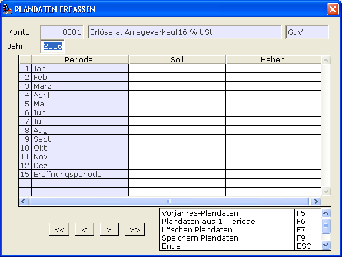
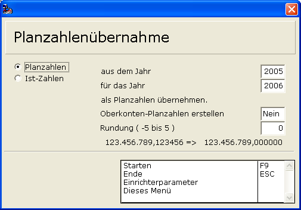
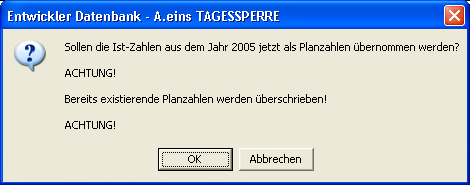

# Plandaten Sachkonten

<!-- source: https://amic.de/hilfe/plandatensachkonten.htm -->

Hauptmenü > Finanzbuchhaltung > Stammdaten > Sachkonten > Funktionen ***Plandaten*** und ***Plandatenübernahme***

Direktsprung **[SKS]**

Für jedes Sachkonto können Plandaten je Periode angelegt werden. Diese werden in der Tabelle Kontosummen mit den Periodenwerten abgespeichert und stehen so für Auswertungen zur Verfügung.

Manuelle Übernahme pro Konto

Diese Funktionalität erreicht man über die Funktion ***Plandaten*** **F10**:

Die Periodeneinteilung entspricht der Vorgabe im Firmenstamm. Je Periode werden die Planwerte eingegeben. Bei gleichen Werten genügt die Eintragung in der ersten Periode und Auslösung der Funktion ***Periodenwerte aus 1. Periode***.  
Die Plandaten des Vorjahres können mittels ***Vorjahreswerte übernehmen*** übernommen werden.

Automatische Übernahme für alle Konten

Diese Funktionalität erreicht man über die Funktion ***Plandaten übernehmen*** **SH+F10**.

| | Beschreibung |
| --- | --- |
| Planzahlen/Ist-Zahlen    | Sollen die Planzahlen oder die Ist Zahlen als Grundlage verwendet werden?  |
| Aus dem Jahr  | Hier gibt man das Jahr an, das als Grundlage dienen soll.  |
| Für das Jahr  | Für dieses Jahr werden die Planzahlen neu generiert.  |
| Oberkonten-Planzahlen erstellen  | Die Werte für Oberkonten ergeben sich bekanntlich aus den Werten der Sachkonten. Deswegen existiert hier die Möglichkeit, die Planzahlen gleich für die Oberkonten mit zu generieren. Die Verteilung wird dann anhand der Struktur der Oberkonten vorgenommen.  |
| Rundung  | Bei Planzahlen sind im Allgemeinen kleine Beträge nicht von Bedeutung. Hier kann man angeben, wie genau die Daten übernommen werden sollen. Werden Werte größer 0 angegeben, so bezieht sich die Rundung auf die Nachkommastellen, bei Werten kleiner 0 werden die Zahlen vor dem Komma gerundet. Gibt man beispielsweise als Rundungsfaktor –2 an, so werden die Werte auf voll 100 Euro gerundet: 123456789,123456 => 123456800,00 In der Zeile unter dem Eingabefeld für die Rundung, wird immer gezeigt, wie sich der eingegebene Wert auswirkt.  |

Nach dem Starten mit **F9** erscheint noch einmal eine Sicherheitsabfrage:

Hier ist zu beachten, dass evtl. manuell erfasste Planzahlen überschrieben werden.
