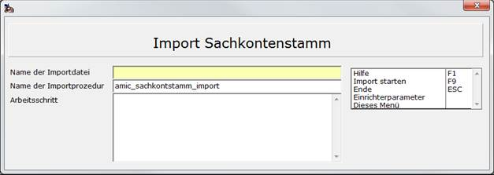

# Sachkonten importieren

<!-- source: https://amic.de/hilfe/sachkontenimportieren.htm -->

Hauptmenü > Finanzbuchhaltung > Stammdaten > Sachkonten > Funktion ***Sachkonten importieren***

Direktsprung **[SKS]**

In der Auswahlliste Sachkonten, existiert die Funktion ***Sachkonten importieren.*** Wählt man sie aus, so erscheint folgender Bildschirm:

Die Importdatei muss eine Exceldatei sein. Die erste Zeile wird nicht mit importiert, da sie für gewöhnlich die Überschrift enthält. Welche Informationen in den Spalten zu finden sind, ist nicht fest vorgegeben, da man sich eine eigene Datenbankprozedur schreiben kann, die die Zuweisung zur Tabelle Sachkontstamm macht. Die Kontonummer und die Kontobezeichnung sollten jedoch existieren. Startet man den Import, so werden folgende Schritte ausgeführt:

- Prüfen, ob die Tabelle SachKontstamm leer ist. Ist dies nicht der Fall, so wird eine entsprechende Meldung ausgegeben und der Import nicht gestartet.
- Die Datei, die unter „Name der Importdatei“ angegeben wurde, wird in eine Zwischentabelle mit dem Namen temp_xls_import eingespielt. Diese Tabelle enthält die Felder col_A char(255) bis col_V(255).
- Anschließend wird die unter „Name der Importprozedur“ eingetragene Prozedur aufgerufen. Der verwendeter Aufrufsyntax ist: „call procedurename()“. Die Prozedur hat also keine Parameter.
- Am Ende wird gezählt, wie viele Datensätze importiert wurden und als Ergebnis ausgegeben.

In der folgenden Beispielprozedur wird davon ausgegangen, dass in col_B die Kontonummer steht, und col_C enthält die Kontobezeichnung:

create procedure AMIC_SACHKONTSTAMM_IMPORT()

begin

 declare de_err_notfound exception for sqlstate value '02000';

 declare dc_konto integer;

 select first KontoNummer into dc_konto from SachKontStamm;

 \-- Nur was machen, wenn SachKontstamm leer!

 if sqlstate = de_err_notfound then

 \-- SachKontenStamm

 insert into SACHKONTSTAMM (

ChefDruGruppe,

ChefDruNummer,

KontoNummer,

KontoNummerHaupt,

KontoNummerOber,

KontoNummerOberHaben,

KostStelVorbel,

KSTRVorbel,

LiquidGrupNummer,

SachKontAnlaKennz,

sachkontbeakennz,

SachKontBezeich,

SachKontBuchWaehr,

SachKontErfSperr,

SachKontJWKKennz,

SachKontKostStel,

SachKontKSTR,

sachkontloekennz,

SachKontMatch,

SachKontOPKennz,

SachkontPosBAB,

SachKontPosBGV_H,

SachKontPosBGV_S,

SachKontPosIFRS_H,

SachKontPosIFRS_S,

SachKontPosSuSa,

SachKontPosUSGAAP_H,

SachKontPosUSGAAP_S,

SachKontROIKennz,

SachKontSteuKenn,

SachKontSteuSchl,

SachKontTextKennz,

SachKontTyp,

SachKontUnterTyp,

SachKontVerdAnz,

SachKontVerdDru,

SachKontWxlKennz,

SachKontZinsKenn,

SteuKlasVorbel,

SteuSchlVorbel,

WaehrNummer

) select

0, // ChefDruGruppe

0, // ChefDruNummer

cast (col_B as integer), // KontoNummer

0, // KontoNummerHaupt

0, // KontoNummerOber

0, // KontoNummerOberHaben

0, // KostStelVorbel

0, // KSTRVorbel

0, // LiquidGrupNummer

0, // SachKontAnlaKennz

0, // sachkontbeakennz

col_C, // SachKontBezeich

1, // SachKontBuchWaehr

0, // SachKontErfSperr

0, // SachKontJWKKennz

1, // SachKontKostStel = Kann

1, // SachKontKSTR =kann

0, // sachkontloekennz

'', // SachKontMatch

0, // SachKontOPKennz

0, // SachkontPosBAB

0, // SachKontPosBGV_H

0, // SachKontPosBGV_S

0, // SachKontPosIFRS_H

0, // SachKontPosIFRS_S

0, // SachKontPosSuSa

0, // SachKontPosUSGAAP_H

0, // SachKontPosUSGAAP_S

0, // SachKontROIKennz

0, // SachKontSteuKenn

1, // SachKontSteuSchl = Kann

0, // SachKontTextKennz

0, // SachKontTyp (0=Bilanz / 1 = GuV )

0, // SachKontUnterTyp (o=Aktiva / 1=Passiva oder 0=Aufwand / 1=Ertrag )

0, // SachKontVerdAnz (Einzelbelege)

0, // SachKontVerdDru (Einzelbelege)

0, // SachKontWxlKennz

0, // SachKontZinsKenn

0, // SteuKlasVorbel

0, // SteuSchlVorbel

0 // WaehrNummer (Kann 0 bleiben, da SachKontBuchWaehr=1 alkso immer buchwaehrung!

from temp_xls_import a

where isnumeric(col_B)=1

 and not exists ( select col_B from temp_xls_import b where b.col_B=a.col_B group by col_B having count(\*)>1) ;

 \-- Finaly

 insert into KontoStamm ( KontoNummer, KontoTyp, KontoBezeich )

 select KontoNummer, 1, SachKontBezeich from SachKontStamm;

 end if;

end
