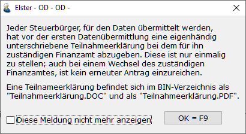
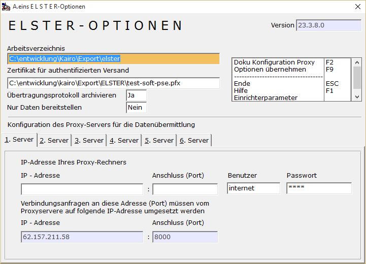
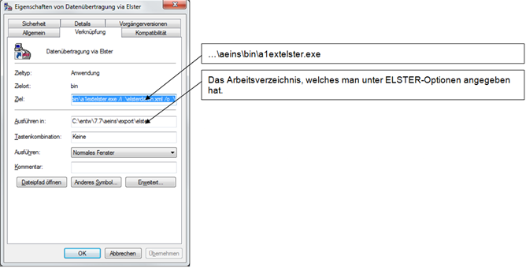
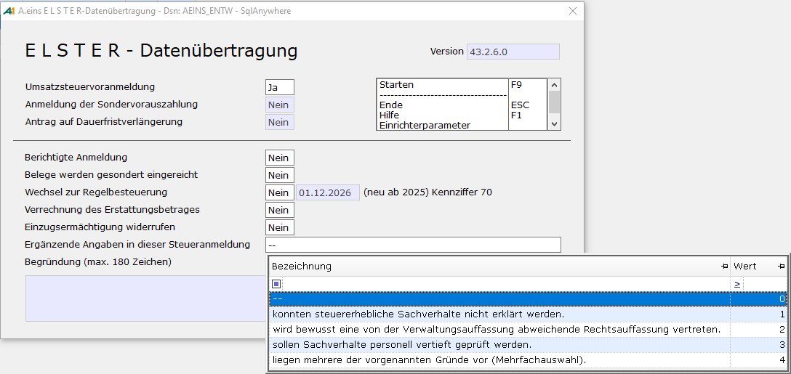
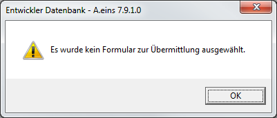

# ELSTER

<!-- source: https://amic.de/hilfe/elster.htm -->

Hauptmenü > Abschlussarbeiten > Umsatzsteuer > Umsatzsteuerwerte

Direktsprung **[UVA]**

**Wichtiger Hinweis zum Sicherheitsstick:**

Der Sicherheitsstick "G&D Starsign USB Token" wird nur noch bis 28.02.2019 unterstützt. Sollten Sie diesen Sicherheitsstick nutzen, achten Sie bitte darauf, rechtzeitig einen neuen Sicherheitsstick zu beschaffen ([www.sicherheitsstick.de](http://www.sicherheitsstick.de)), um bei der Verlängerung Ihres Zugangs im Februar 2019 auf diesen neuen Sicherheitsstick wechseln zu können. Im Rahmen der Verlängerung Ihres Zugangs ist daher ein Stickwechsel durchzuführen. Eine Verlängerung Ihres Zugangs mit dem aktuell eingesetzten Sicherheitsstick ist nicht möglich.

**Wichtiger Hinweis zur Datenschutz-Grundverordnung:**

*ELSTER schreibt vor, dass vor dem Versand der Daten die Informationen zur* [Datenschutz-Grundverordnung](https://download.elster.de/download/dokumente/Informationen_zu_Artikel_12_bis_14_Datenschutz-Grundverordnung.pdf) *einmal akzeptiert werden. Um dies zu gewährleisten, wird jeder ELSTER-Anwender vor dem Versand einer Umsatzsteuervoranmeldung oder der Zusammenfassenden Meldung einmal aufgefordert aktiv zu bestätigen, dass er die Datenschutzgrundverordnung gelesen und akzeptiert hat.*

Elster ist die Abkürzung für **El**ektronische **St**euer **Er**klärung.

Die von Ihnen erstandene Software enthält Programm-Module, die von der bayerischen Steuerverwaltung entwickelt wurden. Diese Module ermöglichen Ihnen die Abgabe von **Umsatzsteuer-Voranmeldungen**, **Anträgen auf Dauerfristverlängerung** und **Anmeldungen von Sondervorauszahlungen** per Datenfernübertragung via Internet.

Mit der Datenübermittlung ersparen Sie sich das Übersenden der amtlichen Vordrucke an das zuständige Finanzamt.

Jeder Steuerbürger, für den Daten übermittelt werden, hat vor der ersten Datenübermittlung eine eigenhändig unterschriebene Teilnahmeerklärung bei dem für ihn zuständigen Finanzamt abzugeben. Diese ist nur einmalig zu stellen; auch bei einem Wechsel des zuständigen Finanzamtes ist kein erneuter Antrag einzureichen. Nach Abgabe einer Teilnahmeerklärung, können die o.g. Steueranmeldungen wahlweise per Datenfernübertragung via Internet oder auf dem amtlich vorgeschriebenen Vordruck abgegeben werden.

Eine Teilnahmeerklärung befindet sich im Verzeichnis Dokumentation als „Teilnahmeerklärung.RTF“ und als „Teilnahmeerklärung.PDF“.

Der Hinweis auf die Teilnahmeerklärung erscheint beim Aufruf des Elstermoduls und kann dort abgeschaltet werden

Bekanntermaßen ändert sich der Aufbau der Umsatzsteuervoranmeldung fast jährlich. Vom Bayerischen Landesamt für Steuern werden diese Änderungen in das Elster-Telemodul aufgenommen und an alle Teilnehmenden Softwarehäuser ausgeliefert. Diese Änderungen werden von AMIC sofort in das Programm A.eins übernommen.

Für die Anwender ist es notwendig, am Ende eines Kalenderjahres bzw. vor der ersten Voranmeldung im neuen Kalenderjahr eine aktuelle A.eins-Version zu installieren.

Stammdaten für ELSTER

Die Ermittlung der Werte für die Umsatzsteuervoranmeldung mit ELSTER erfolgt wie bereits für das Umsatzsteuervoranmeldungsformular über die im Steuersatz eingerichteten [Auswertungspositionen](./steuersaetze_einrichten/stammdaten_auswertungspositionen.md).

Zusätzlich sind Stammdaten im Mandantenstamm zu beachten. Dort gibt es ein neues Feld „Finanzamt-Nummer“. Hier ist die Nummer ihres Finanzamtes einzutragen. Eine aktuelle Liste der Finanzämter und ihrer zugehörigen Nummern kann über **F3** abgerufen werden. In dem übermittelten Datensatz kann ein Berater mit angegeben werden. Dieser wir im Mandantenstamm unter der Adresse „***Ansprechpartner ZM/UVA***“ gepflegt.

ELSTER-Optionen

**Arbeitsverzeichnis:**

Hier wird das Verzeichnis angegeben, auf dem die Daten bereitgestellt werden sollen. Außerdem werden sämtliche Log-Dateien hier gespeichert.

**Zertifikat für den authentifizierten Versand**

Die Daten dürfen ab dem 01.01.2013 nur mit Authentifizierung übertragen werden. Unter [www.elster.de](http://www.elster.de/) findet man Informationen zur Authentifizierung.

Es existieren drei verschiedene Möglichkeiten der Authentifizierung

- Software-Zertifikat:  
Angabe des Dateiname - inklusive des vollständigen Verzeichnisses - des Software-Zertifikats (i.d.R. mit der Endung .pfx).  
    

- Sicherheitsstick:  
Angabe des Dateinamens des Treibers. Bitte beachten, dass der Treiber betriebssystemabhängig sein kann. Aktuell werden folgende Sticks von Elster unterstützt:  
    

  - „**G&D StarSign Crypto USB Token (S)“** für ELSTER. Dies ist der Nachfolger des Sticks „**G&D StarSign USB Token**“. Obwohl dieser Sicherheitsstick selber keine Treiber-Dll benötig, muss an die ERiC API der Name des Treibers übergeben werden. Er lautet hier aetpkss1.dll. Diesen Treiber erhält man, indem man von [www.sicherheitsstick.de](http://www.sicherheitsstick.de/) die Treiber für „**G&D StarSign USB Token**“ installiert.  
    
Um den Sicherheitsstick " **G&D StarSign Crypto USB Token (S)**" mit dem ERiC zu verwenden, brauchen der unter https://www.sicherheitsstick.de genannte ElsterAuthenticator und die optionalen Registry-Einträge für Windows-Nutzer nicht installiert zu werden.  
    

  - **„StarSign Token USB 500 mit SmartCafeExpert 3.1 Chip“ für ELSTER**. Hier heißt die Treiber-DLL **starsignpkcs11_w64.dll**  
    

Unter [www.sicherheitsstick.de](http://www.sicherheitsstick.de/) stehen weitere Informationen in der Anleitung zum Sicherheitsstick.

- Signaturkarte:  
Angabe des Dateinamens des Treibers, welcher einen Zugriff auf die Signaturkarte ermöglicht. Weitere Informationen in der Anleitung zur Signaturkarte.

**Übertragungsprotokoll archivieren**

Diese Möglichkeit erscheint dann, wenn eine Archiv-Lizenz vorliegt. Ist diese Option aktiviert, wird nach der erfolgreichen Datenübermittlung das PDF-Dokument sofort in das Archiv gestellt und anschließend das Dokument aus dem Archiv heraus geöffnet. Die zugehörige Belegklasse im Archiv ist „ELSTER-UVA“.

Die Standardeinstellung ist **Ja,** es sei denn man hat „Nur Daten bereitstellen“ aktiviert.

**Nur Daten bereitstellen:**

Wenn man auf dem Arbeitsplatz, auf dem die Umsatzsteuervoranmeldung erstellt wird, keinen Internetzugang hat, so besteht trotzdem die Möglichkeit die Daten zu übertragen. Wenn hier **Ja** einträgt, dann werden lediglich die für den Versand benötigten Daten bereitgestellt und es erscheint nach Fertigstellung die Meldung „Die Datei … wurde bereitgestellt!”

**Achtung:** *Werden die Daten nur bereitgestellt, so besteht keine Möglichkeit die automatische **Archivierung des** **Übertragungsprotokolls** zu aktivieren.*

Um die Daten dann von einem anderen Rechner zu übertragen, muss man das dort das Programm A1EXTELSTER.EXE ausführen. Dazu legt man sich am besten einer Verknüpfung auf dem Desktop an:

Um sich zu gehen, dass man die richtigen Daten überträgt, sollte man diese einmal mit „Vorschau“ kontrolieren.

**Konfiguration des Proxy-Servers für die Datenübermittlung:**

Sollte die Verbindung zum Internet über einen Proxyserver laufen, so können hier die Einstellungen vorgenommen werden. **ACHTUNG: Der FIREWALL muss die Verbindung zulassen.  
**  
Zur Unterstützung der Einrichtung von Elster stehen zwei PDF-Dateien auf dem Dokumentation-Verzeichnis von A.eins:

- KonfigurationProxy.pdf
- Konfiguration_AVMKEN_Jana.pdf  
 

Die hier vorgenommenen Einstellungen für den Proxy-Server gelten auch für das Elster Modul zur Übertragung der Zusammenfassenden Meldung.  
    

Aufruf des ELSTER - Moduls

Hauptmenü > Abschlussarbeiten > Umsatzsteuer > Umsatzsteuerwerte

Direktsprung **[UVA]**

Das Modul befindet sich – wie das zugelassene Formular – unter dem Programmpunkt Umsatzsteuerwerte. Die Funktion „***USTVA via Elster***“ kann nicht von mehreren Plätzen gleichzeitig aufgerufen werden. Nach Auswahl dieser Funktion erscheint folgender Bildschirm.

Hier können drei verschiedene Formulare –„Umsatzsteuervoranmeldung“, „Anmeldung der Sondervorauszahlung“ oder „Antrag auf Dauerfristverlängerung“ – ausgewählt werden.

Ab 2026 wird die Kennziffer 23 durch die Kennziffer 500 „Ergänzende Angaben zur Steueranmeldung“ ersetzt. Zu dieser muss, wenn man dort etwas einträgt, ein Text mit maximal 180 Zeichen erfasst werden.

Eines dieser Formulare („Umsatzsteuervoranmeldung“, „Anmeldung zur Sondervorauszahlung“ oder „Antrag auf Dauerfristverlängerung“) muss ausgewählt sein, sonst erscheint beim Versuch die Datenübertragung zu starten folgende Meldung:

Für die Verarbeitung stehen folgende Funktionen zur Verfügung.

**Vorschau:** 

Die Daten werden verschlüsselt und eine Plausibilitätsprüfung wird durchgeführt. Sind Fehler enthalten, werden diese auf dem Bildschirm angezeigt. Ist die Prüfung fehlerfrei durchgeführt worden, werden die Daten so angezeigt, wie sie später übertragen werden würden. Diese Vorschau dient lediglich zu Kontrolle der Daten.

**Versand und Druck**:

Nachdem man die Frage, ob die Daten ins Rechenzentrum übertragen werden sollen, mit **Ja** beantwortet hat, werden die Daten einmal auf ihre formelle Richtigkeit geprüft und anschließend ins Rechenzentrum übertragen. Die Anschriftsdaten werden aus dem Mandantenstamm gelesen: Die Informationen zum Finanzamt sind auf dem Register **Finanzbuchhaltung** zu finden, die Informationen „Übermittelt von“ unter Adresse und „Bei Rückfragen wenden sie sich bitte an“ unter der Funktion **Ansprechpartner UVA**.

**Zur Absicherung des Steuerzahlers wird ein Übertragungsprotokoll gedruckt, das vom Steuerzahler auf die übertragenen Werte zu prüfen und als Nachweis aufzubewahren ist.**

Das Protokoll wird in einem PDF-Dokument mit dem Name ElsterUSTVA.pdf abgelegt, das in dem Arbeitsverzeichnis zu finden ist, das unter Optionen angegeben wurde. Das PDF- Dokument wird automatisch geöffnet und kann dann ausgedruckt werden. Eine automatische Archivierung erfolgt nur wenn es unter Optionen !

**Modul testen:**

Sollte es zu Problemen bei der Übertragung kommen, kann das Telemodul getestet werden. Die Ergebnisse erscheinen zum einem auf dem Bildschirm, zum anderen werden sie in der Datei eric.log protokolliert.

**XML-Dokument**

Die Daten werden über ein Dokument im XML-Format versendet. Dies kann mit dieser Funktion eingesehen werden.

**Protokolle**

Wählt man diesen Punkt an, so werden die Log-Datei sowie die XML-Dateien in die ZIP-Datei „Elstersupport.zip“ geschrieben. Diese Datei kann dann bei Problemfällen zusammen mit der Datei Eric.log und einer kurzen Problembeschreibung an die AMIC-Hotline gesendet werden.

Anmeldung zur Sondervorauszahlung

Die Anmeldung zur Sondervorauszahlung sucht für den Bereich alle Steuerdaten zusammen, bei denen im Steuersatz die Auswertungsposition mit der Kennzahl **39** (wegen der doppelten Verwendung für die Anmeldung zur Sondervorauszahlung und für die USTVA) für Steuer hinterlegt ist. Die Anmeldung zur Sondervorauszahlung beinhaltet automatisch den Antrag auf Dauerfristverlängerung.

Sonder-/Problemfälle

**Wie korrigiere ich eine bereits gesendete Voranmeldung?**

**Antwort:** Übertragen Sie denselben Fall nochmals, allerdings stellen Sie den Wert bei „Berichtigte Anmeldung“ auf **Ja**.

**Ich habe eine Voranmeldung für den gleichen Zeitraum zweimal (identisch oder unterschiedlich) an die Finanzverwaltung übertragen. Wie verhalte ich mich?**

**Antwort:** Prinzipiell stößt die Übermittlung von ein und demselben Steuerfall in den Rechenzentren der einzelnen Bundesländer auf Verarbeitungsprobleme. Es könnte sein, dass Sie von Seiten der Finanzverwaltung kontaktiert werden. Geben Sie dann an, welche der beiden Erklärungen Ihrem Abgabewillen entspricht.

**Ich habe meine Voranmeldung per ELSTER übertragen und erhalte nun einen Verspätungszuschlag vom Finanzamt. Was ist zu veranlassen?**

**Antwort:** Bitte wenden Sie sich an die zulassende Stelle, die Ihnen den Zulassungsbescheid erteilt hat. Bitte geben Sie dort Ihre Steuernummer, Zulassungsnummer, betroffener Zeitraum, Übermittlungsdatum und v.a. den Hashcode mit an, der auf Ihren Protokollausdruck links oben hochkant gedruckt ist. Mit diesen Angaben kann festgestellt werden, ob Ihr Fall tatsächlich die Finanzverwaltung erreicht hat, und wenn ja, wo er geblieben ist.

**Was muss man im Rahmen der Teilnahme berücksichtigen?**

**Antwort:** Jeder Steuerpflichtige muss zu Beginn des Verfahrens einmalig eine Teilnahmeerklärung bei dem örtlich zuständigen Finanzamt abgeben. Ab diesem Zeitpunkt kann er die Daten per ELSTER an die Finanzverwaltung übermitteln. Für jede Steuernummer ist eine eigene Teilnahmeerklärung abzugeben. Ab diesem Zeitpunkt kann beliebig zwischen elektronischer Übermittlung und Abgabe auf Papier gewechselt werden.

Mindestsystemanforderungen

Diese Anforderungen werden von dem Programm-Modul der bayerischen Steuerverwaltung gestellt und können von AMIC nicht beeinflusst werden.

<table class="AMICOlavsTabelle" style="WIDTH: 100%; BORDER-COLLAPSE: collapse" cellspacing="0" cellpadding="0" width="100%" border="0"><tbody><tr><td style="WIDTH: 16.88%; PADDING-BOTTOM: 0pt; PADDING-TOP: 0pt; PADDING-LEFT: 5.4pt; PADDING-RIGHT: 5.4pt" valign="top" width="16%">•&nbsp;&nbsp;&nbsp;&nbsp;&nbsp; Betriebssystem</td><td style="WIDTH: 83.12%; PADDING-BOTTOM: 0pt; PADDING-TOP: 0pt; PADDING-LEFT: 5.4pt; PADDING-RIGHT: 5.4pt" valign="top" width="83%">Windows 8.1 oder Windows 10</td></tr><tr><td style="WIDTH: 16.88%; PADDING-BOTTOM: 0pt; PADDING-TOP: 0pt; PADDING-LEFT: 5.4pt; PADDING-RIGHT: 5.4pt" valign="top" width="16%">•&nbsp;&nbsp;&nbsp;&nbsp;&nbsp; Internetzugang</td><td style="WIDTH: 83.12%; PADDING-BOTTOM: 0pt; PADDING-TOP: 0pt; PADDING-LEFT: 5.4pt; PADDING-RIGHT: 5.4pt" valign="top" width="83%">Via ISDN oder DSL ist notwendig, ein Breitbandzugang wird empfohlen.</td></tr><tr><td style="WIDTH: 16.88%; PADDING-BOTTOM: 0pt; PADDING-TOP: 0pt; PADDING-LEFT: 5.4pt; PADDING-RIGHT: 5.4pt" valign="top" width="16%">•&nbsp;&nbsp;&nbsp;&nbsp;&nbsp; Software</td><td style="WIDTH: 83.12%; PADDING-BOTTOM: 0pt; PADDING-TOP: 0pt; PADDING-LEFT: 5.4pt; PADDING-RIGHT: 5.4pt" valign="top" width="83%">PDF-Reader mind. Adobe Acrobat Reader 9.x oder vergleichbar für verschlüsselte PDFs</td></tr></tbody></table>

Die WinRT API wird nicht unterstützt.  
Terminalserver-Lösungen werden zum derzeitigen Zeitpunkt nicht offiziell unterstützt.
