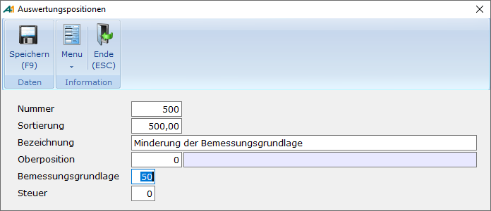
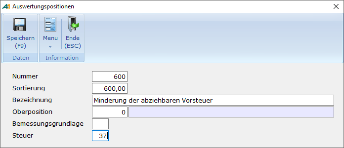
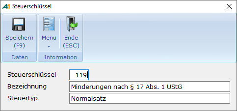
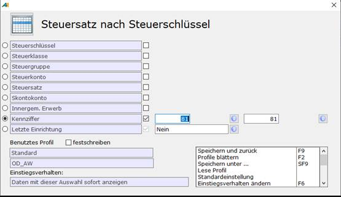
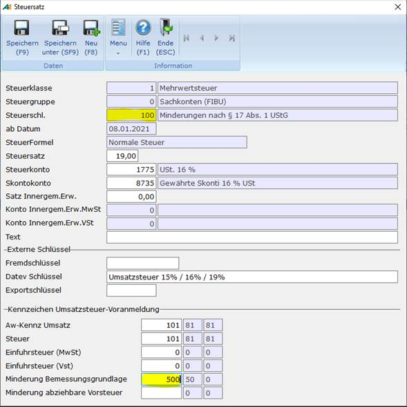

# Kennziffern für Ergänzende Angaben

<!-- source: https://amic.de/hilfe/kennzifferMinderung.htm -->

Ab 2021 sind neue Kennziffern für Ergänzende Angaben zu Minderungen nach§ 17 Abs. 1 Sätze 1 und 2 i.V.m. Abs. 2 Nr. 1 Satz 1 UstG hinzugekommen.

Hat sich die Bemessungsgrundlage für den Vorsteuerabzug bei dem Unternehmer, an den dieser Umsatz ausgeführt wurde, geändert, ist der Vorsteuerabzug nach § 17 Abs. 1 Satz 2 UStG zu berichtigen. Erfolgt die Änderung nach § 17 Abs. 1 Satz 2 i. V. m. Abs. 2 Nr. 1 Satz 1 UStG, weil das vereinbarte Entgelt für einen steuerpflichtigen Umsatz uneinbringlich geworden ist, ist die Minderung der abziehbaren Vorsteuerbeträge zusätzlich im Vordruckmuster USt 1 A in Zeile 74 (Kz 37) einzutragen.  
    

Um diese Kennziffern für Elster und das Umsatzsteuervoranmeldungsformular zu versorgen, müssen neue Auswertungspositionen, neue Steuerschlüssel und zusätzliche Steuersätze eingerichtet werden.

Schritt 1: Auswertungspositionen

Es müssen zwei Auswertungspositionen angelegt werden, eine für Kennziffer 50 und eine für Kennziffer 37. Dazu gibt man den Direktsprung **[FIAWP]** ein und gelangt so in die Anwendung zur Pflege der Auswertungspositionen.

Vorgehen:

• Sachkonto mit der Funktion **F8** für ***„Neu“***\-Erfassung aufrufen

• Es müssen mindestens die Felder Nummer und  
für die Kennziffer 50 das Feld Bemessungsgrundlage und  
für die Kennziffer 37 das Feld Steuer  
eingetragen werden

• Anschließend die Daten mit **F9** oder ***„Speichern“*** übernehmen.

Kennziffer 50

Da nur die Minderung der Bemessungsgrundlage relevant ist, muss das Feld hinter Steuer leer bleiben.

Kennziffer 37

Im Bereich Vorsteuer wird die Bemessungsgrundlage nicht benötigt. Dieses Feld bleibt also leer.

Schritt 2: Zusätzliche Steuerschlüssel anlegen

Dazu ruft man den Direktsprung **[STS]** auf und geht am besten direkt in die Auswahlliste für [Steuerschlüssel](./stammdaten_steuerschluessel.md) **F7**. Hier ruft man den Pfleger mit mit ***Neu*** **F8** auf und vergibt eine neue Steuerschlüssel-Nummer und eine dazu passende Bezeichnung. Anschließend speichert man die Änderungen mit der Funktion ***„Speichern“*** **F9.**

**Es muss für jeden betroffenen Steuersatz (19%, 16%, 7%, 5%) ein eigener Steuerschlüssel angelegt werden.**

Schritt 3: Neue Steuersätze anlegen

Nachdem die Auswertungspositionen und der neue Steuerschlüssel angelegt wurden, müssen jetzt **neue** Steuersätze für die Geschäftsvorfälle angelegt werden, die zur Minderungen nach § 17 Abs. 1 Sätze 1 und 2 i.V.m. Abs. 2 Nr. 1 Satz 1 UstG führen. Dazu ruft man den Direktsprung **[STS]** auf und geht am besten direkt in die Auswahlliste für [Steuersätze](./stammdaten_steuersaetze.md) **F8**. Dort kann man über **F2** die Auswahl so eingrenzen, dass nur die Steuersätze mit den betroffenen Kennziffern angezeigt werden. Das macht man am besten, indem man nach der Kennziffer für 19% USt eingrenzt (in diesem Beispiel 81).

**Wichtig:** Um wie hier beschrieben arbeiten zu können, muss der Einrichterparameter „Bei ¨Speichern unter¨ alle Schlüsselfelder freigeben“ auf „**Ja**“ stehen.

Vorgehen:

• Den betroffen Datensatz markieren und mit der Funktion **F5** zum ***„Ändern“*** aufrufen.

• Mit der Funktion ***„Speichern unter“*** oder **(Shift + F9)** einen neuen Datensatz anlegen.

• Den neuen Steuerschlüssel eintragen

• Für Minderungen der Bemessungsgrundlage im Feld „Minderung Bemessungsgrundlage“ zusätzlich die Auswertungsposition für die Kennziffer 50 eintragen.  
    
Oder  
    
Für Minderung der abziehbaren Vorsteuerbeträge im Feld „Minderung abziehbare Vorsteuer“ zusätzlich die Auswertungsposition für die Kennziffer 37 eintragen.  
    
Hinweis: *Die Kennziffern für Umsatz und Steuer werden nicht geändert.*

• Anschließend die Änderungen mit **F9** oder ***„Speichern“*** übernehmen.

Schritt 4: Anwendung der Steuersätze

Um eine Forderung als uneinbringlich auszuweisen, muss der entsprechende Beleg mit dem neuen Steuersatz ausgebucht werden. Dabei ist der Steuersatz, bei dem die **Kennziffer** **50** (Minderung der Bemessungsgrundlage) hinterlegt ist, zu verwenden. Um eine Rechnung auszubuchen, die uneinbringlich geworden ist, kann der Beleg in der OP-Verwaltung **[OPV]** ausgewählt und mit der Funktion ***Ausziffern*** **F9** verarbeitet werden. **Anschließend ist dann die** Funktion ***Ausb. mit Steuer*** **F6** **auszuwählen. Für die Ausbuchung ist der Steuersatz mit der** **Kennziffer 50** **zu verwenden.**

**Um eine Vorsteuer-Minderung auszuweisen kann das gleiche Vorgehen wie bei einer Forderung angewendet werden. Hierbei ist zu beachten, dass der Steuersatz mit der** **Kennziffer 37** **(Minderung abziehbare Vorsteuer) ausgewählt wird.**

**In der Belegerfassung** **[FIBE]** **ist die Auswahl von Steuersätzen mit der Kennziffer 37 oder 50 nur für Minderungen erlaubt. Diese Prüfung wird in der Belegerfassung über den Einrichterparameter „Steuersatz mit den Kennziffern 37 oder 50 nur für Minderungen erlauben?“ gesteuert.**

