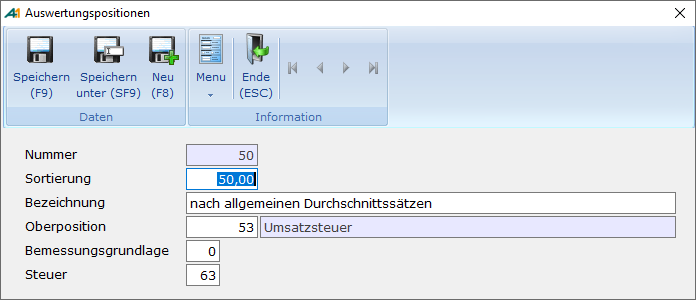

# Stammdaten Auswertungspositionen

<!-- source: https://amic.de/hilfe/stammdatenauswertungspositione.htm -->

Hauptmenü > Abschlussarbeiten > Umsatzsteuer > Auswertungspositionen

Direktsprung **[FIAWP]**

Bei der Einrichtung der Auswertungspositionen sollte man das Formular der Umsatzsteuervoranmeldung immer vor Augen haben. Wenn der zugelassene Vordruck verwendet werden soll, müssen für alle Kennzahlen (fett gedruckte Zahlen auf dem Formular) Auswertungspositionen eingerichtet werden - unabhängig davon, ob in Ihrem Betrieb diese Steuervorfälle stattfinden oder nicht -, da vor dem Ausdruck ein Testlauf stattfindet, der die Stammdaten auf Vollständigkeit prüft. Dieser Test kann auch jederzeit über den [Fibureorganisator](../../fibu_reorganisator/fibu_reorganisator_allgemein.md) (Direktsprung **[FIREO]**) mit "Test Stammdaten" aufgerufen werden.

Die Sortierung gibt an, in welcher Reihenfolge die Daten bei der Auswertung auf dem Bildschirm dargestellt werden. Wenn man sich bei dem Feld Sortierung an die Positionsnummer links auf dem Umsatzsteuervoranmeldungs-Formular hält, ist es leicht, die Reihenfolge so wie sie auf dem Formular vorgegeben ist, einzurichten.

Der Text (Bezeichnung) ist für den Vordruck nicht von Belang, jedoch erleichtert eine korrekte Bezeichnung die Übersicht über die Einrichtung. In dem Menü "Umsatzsteuerwerte" (Direktsprung UVA) werden diese Texte bei der Auswertung nach Auswertungspositionen mit angezeigt.

Die Oberposition dient zur Summierung der einzelnen Zeilen für die Summenfelder in den Zeilen 53,62,65 und 67 (bezogen auf das Umsatzsteuer-voranmeldungs- Formular 2007). Soll der zugelassene Vordruck verwendet werden, braucht hier nichts eingetragen zu werden, da die Summen über die Kennziffern automatisch gebildet werden. Ansonsten müssen dort für alle Zeilen mit einem Feld für die Steuer eine existierende Auswertungsposition eingetragen werden. Die Auswertungspositionen für die Zeilen 53 muss dann auch wieder eine Oberposition eingetragen haben, die die Summe in der Zeile 62 darstellt. Die Zeile 67 (Kennzahl 83) weist somit das Ergebnis der Umsatzsteuervoranmeldung aus. 

Die Kennzahlen Bemessungsgrundlage und Steuer müssen die den Zeilen zugeordneten Kennzahlen enthalten. Wenn Sie Ihre Einrichtung an das Formular angelehnt haben, muss also für die Auswertungsposition 21 die Kennzahl für die Bemessungsgrundlage 41 lauten und die für die Steuer kann leer (0) bleiben. Die einzige Kennzahl, die nicht existieren muss, ist 83, da die Summen direkt im Vordruck gebildet werden.

 Die Einrichtung der Auswertungspositionen könnte wie folgt aussehen. Diese Kennziffern beziehen sich auf das Umsatzsteuer-Voranmeldungsformular des Jahres 2007

| | Kennziffern |
| --- | --- |
| Zeile | Bezeichnung | Oberp | Bem.  
Grund. | Steuer |
| 210 | EU Lief. an Abnehmer mit Ust-IdNr. | 0 | 41 | 0 |
| 220 | EU Lief. neuer Fahrzeuge ohne Ust-IdNr. | 0 | 44 | 0 |
| 230 | EU Lief. n. Fahrz. außerh. Unternehmen | 0 | 49 | 0 |
| 240 | weitere Steuerfreie Umsätze | 0 | 43 | 0 |
| 250 | Umsätze nach §4 Nr. 8 bis 28 UStG | 0 | 48 | 0 |
| 270 | zum Steuerumsatz von 19 v. H. | 530 | 81 | 81 |
| 290 | zum Steuersatz von 7 v.H. | 530 | 86 | 86 |
| 300 | Umsätze, mit anderen Steuersätzen | 530 | 35 | 36 |
| 310 | Lief. an Abnehmer mit Ust-IdNr. | 0 | 77 | 0 |
| 320 | Umsätze mit Steuer nach §24 UStG | 530 | 76 | 80 |
| 340 | Erwerbe nach §4b UStG | 0 | 91 | 0 |
| 350 | zum Steuersatz von 19 v.H. | 530 | 89 | 89 |
| 360 | zum Steuersatz von 7 v.H. | 530 | 93 | 93 |
| 370 | zu anderen Steuersätzen | 530 | 95 | 98 |
| 380 | Lieferungen **ohne** Ust-IdNr. | 530 | 94 | 96 |
| 400 | Innergemeinschaftliches Dreiecksgeschäft | 0 | 42 | 0 |
| 410 | Steuerpflichtige Umsätze im Sinne des § 13b Abs 1. Satz 1 Nr. 1 bis 5 | 0 | 60 | 0 |
| 415 | Nicht steuerbare sonstige Leistungen gem. § 18b Satz 1 Nr. 2 UStG | 0 | 21 | 0 |
| 420 | Im Inland nicht steuerbare Umsätze | 0 | 45 | 0 |
| 470 | Im Inland steuerpfl. sonstige Leistungen von im übrigen Gemeinschaftsgebiet ansässigen Unternehmern | 530 | 46 | 47 |
| 480 | Leistungen eines im Ausland ansässigen Unternehmers | 530 | 52 | 53 |
| 490 | Lieferungen sicherungsübereigneter Gegenstände und Umsätze die unter das GrESTG fallen | 530 | 73 | 74 |
| 500 | Bauleistungen eines im Inland ansässigen Unternehmers | 530 | 84 | 85 |
| 520 | Wechsel der Besteuerungsform/Nachsteuer | 530 | 0 | 65 |
| **530** | **Umsatzsteuer** | **620** | **0** | **0** |
| 550 | Vorsteuerbeträge aus Rechnungen von anderen Unternehmern... | 620 | 0 | 66 |
| 560 | Vorsteuerbeträge aus dem innergemeinschaftlichen Erwerb von Gegenständen. | 620 | 0 | 61 |
| 570 | Entrichtete Einfuhrumsatzsteuer(§15 Abs. 1 Nr. 3 UstG ) | 620 | 0 | 62 |
| 580 | Vorsteuerbeträge aus Leistungen im Sinne des § 13b Abs.1 UstG. | 620 | 0 | 67 |
| 590 | nach allgemeinen Durchschnittssätzen | 620 | 0 | 63 |
| 600 | Berichtigung des Vorsteuerabzugs | 620 | 0 | 64 |
| 610 | Vorsteuerabzug Innergemeinschaftliche L. | 620 | 0 | 59 |
| **620** | **Verbleibender Betrag** | **650** | **0** | **0** |
| 640 | geschuldete Steuerbeträge | 650 | 0 | 69 |
| **650** | **Umsatzsteuervorauszahlung/Überschuss** | **670** | **0** | **0** |
| 570 | Anrechnung der Sondervorauszahlung | 670 | 0 | 39 |
| **670** | **Verbleibende Umsatzsteuer-Vorauszahlung** | **0** | **0** | **83** |
| | | | | | |

Die in Fettschrift dargestellten Zeilen dienen nur für die Summendarstellung auf dem Bildschirm. Sie werden weder im Formular noch von Elster verwendet.

Die Sondervorauszahlung – also Kennziffer Steuer 39 – wird nur noch in dem Zeitraum ausgewertet, der den Dezember mit berücksichtig (also z.B. bei vierteljährlicher Voranmeldung nur im letzten Quartal). Dann werden die Werte des gesamten Jahres herangezogen, so dass die Buchung in dem Zeitraum erfolgen kann, in dem die Sondervorauszahlung erfolgt. Dies ist für das neue Verfahren ELSTER notwendig, da dort auch die Anmeldung zur Sondervorauszahlung erfolgen kann.
