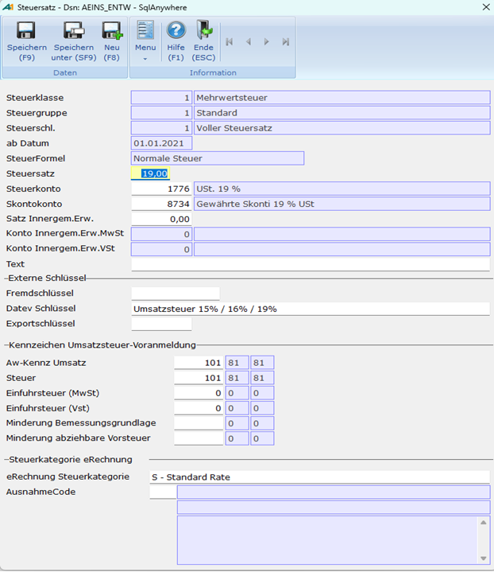

# Stammdaten Steuersätze

<!-- source: https://amic.de/hilfe/stammdatensteuerstze.htm -->

Hauptmenü > Abschlussarbeiten > Umsatzsteuer > Steuern

Direktsprung **[STS]**.

Die Pflege der Steuersätze kann an zwei unterschiedlichen Stellen erfolgen. Ruft man den Steuersatzpfleger auf, so erreicht man einen Kreuzpfleger, der die einzelnen Bestandteile eines Satzes gruppiert ausgibt und so versucht, eine übersichtlichere Darstellung zu bieten. Durch Anklicken der entsprechenden Spalte kann man die dazugehörigen Daten pflegen. Es existiert dazu noch ein Pfleger, der über die bekannte Auswahllistenmechanik die Daten anzeigt. Dieser ist von hier aus über das Menü zu erreichen (***Steuersätze* F8**).

Das System bestimmt den passenden Satz über eine Kombination von 4 Elementen:

• Steuerklasse. Umsatzsteuer oder Vorsteuer, Brutto oder Netto.

• Steuergruppe. Inlandskunde, Auslandskunde...

• Steuerschlüssel. Steuerfrei, Voller Steuersatz, verminderter Steuersatz...

• Steuerabdatum. Ab und an ändert sich der Steuersatz. Letztes Beispiel war die Erhöhung des vollen Steuersatzes auf 19% zum 01.01.2007. Dann ist es nur nötig, für das Änderungsdatum einen neuen Satz zu hinterlegen, damit das System weiß, welcher Steuersatz gültig ist. Dazu gibt es im Kreuzpfleger eine Funktion "***Speichern unter* Shift+F9**"

Zu den oben genannten Kombinationen müssen jetzt noch weitere Daten hinterlegt werden.

| | Beschreibung |
| --- | --- |
| Steuerformel | Hier gibt es vier Möglichkeiten:  
    
Normale Steuer. Hier wird die Steuer nach der gebräuchlichen Formel für Vorsteuer bzw. Umsatzsteuer berechnet.  
Steuer 100%. Mit dieser Einstellung können Steuerkonten in der Finanzbuchhaltung direkt bebucht werden. Es bedeutet, dass der gesamte eingegebene Betrag dem Steuerkonto zugeordnet wird. Siehe dazu "Steuerkonten bebuchen"  
Reisekosten: Die Angabe der Steuersätze für Reisekosten erfolgt "in Hundert". Das bedeutet, dass nicht die normale Steuerformel verwendet werden kann.  
Innergemeinschaftlicher Erwerb: Wird ein Beleg mit einem Steuersatz erfasst, der diese Steuerformel beinhaltet, so wird bei der Erfassung keine Steuerzeile erzeugt. Beim Buchen werden, wenn die Konten für den innergemeinschaftlichen Erwerb angegeben wurden, zwei Steuerzeilen dem Beleg hinzugefügt.  
 |
| Steuersatz | Hier wird der Steuersatz eingetragen, z.B. 19,00.  
 |
| Steuerkonto | Das zugehörige Steuerkonto in der Finanzbuchhaltung, auf dem die bei der Fakturierung oder in der Buchhaltung ermittelten Beträge verbucht werden sollen. Vor der Anlage von Steuersätzen muss also ein Steuerkonto im Sachkontenstamm erfasst werden. Es ist nur der Eintrag von Konten möglich, bei denen das Kennzeichen "Steuerkonto" auf **Ja** steht.  
 |
| Skontokonto | Das dem Steuerkonto zugeordnete Skontokonto, auf dem die bei der Fakturierung oder in der Buchhaltung ermittelten Skontobeträge verbucht werden sollen. Vor der Anlage von Steuersätzen muss also auch ein Skontokonto erfasst werden.  
 |
| Steuersatz | Hier wird der Steuersatz eingetragen, z.B. 19,00.  
 |
| Steuerkonto | Das zugehörige Steuerkonto in der Finanzbuchhaltung, auf dem die bei der Fakturierung oder in der Buchhaltung ermittelten Beträge verbucht werden sollen. Vor der Anlage von Steuersätzen muss also ein Steuerkonto im Sachkontenstamm erfasst werden. Es ist nur der Eintrag von Konten möglich, bei denen das Kennzeichen "**Steuerkonto**" auf **Ja** steht.  
 |
| Skontokonto | Das dem Steuerkonto zugeordnete Skontokonto, auf dem die bei der Fakturierung oder in der Buchhaltung ermittelten Skontobeträge verbucht werden sollen. Vor der Anlage von Steuersätzen muss also auch ein Skontokonto erfasst werden.  
 |
| Satz innergem.Erw. | Der für "Innergemeinschaftliche Erwerbe" zu verwendende Steuersatz  
 |
| Konto innergem.Erw.MwSt. | Der Umsatzsteueranteil "Innergemeinschaftliche Erwerbe" wird diesem Konto zugeordnet  
 |
| Konto innergem.Erw.VSt. | Der Vorsteueranteil "Innergemeinschaftliche Erwerbe" wird diesem Konto zugeordnet.  
 |
| Text | Dieser Text kann beim Formulardruck in der Warenwirtschaft mit angedruckt werden.  
 |
| Fremdschlüssel | Hier kann man für den Steuersatz ein Kürzel angeben, welches ihn lesbar macht. Z.B.“VB19“ für „Vorsteuer Brutto 19%“. Diese Kürzel kann auf dem Kontoblatt (Formulardruck) als „Steuersatzfremd“ gedruckt werden.  
 |
| DATEV-Schlüssel | Wenn man die Daten zur DATEV übertragen will, wird hier der von der DATEV verwendetet Steuerschlüssel hinterlegt. Es ist zum einen dann notwendig, wenn der Einrichtungsparameter „Datevschlüssel im Textfeld übergeben“ auf **Ja** steht, oder dann, wenn man im [DATEV-Firmenstamm](../../fibu_schnittstellen/exportverfahren_der_finanzbuchhaltung/datev/datev_firmenstamm.md) als Übertragungs-Format „Übertragung des Umsatzsteuerschlüssels“ gewählt hat. Für die Steuerformel „Steuer 100%“ muss der DATEV-Schlüssel leer bleibe. Mögliche Schlüssel lassen sich mit **F3** auswählen.  
 |
| Exportschlüssel | Wenn man Belege aus der Finanzbuchhaltung in ein Fremdsystem exportieren möchte, kann es nötig sein, die Kennzeichnung des Steuerschlüssels der Fremdfibu zu hinterlegen. Beim Export in das IBM-Finanzwesen (siehe EXPORT) wird dieser Schlüssel verwendet.  
 |
| Aw-Kennz Umsatz | Hier muss die Auswertungsposition für die Auswertung nach Auswertungspositionen bzw. für den Ausdruck über das Umsatzsteuer-Voranmeldungsformular eingerichtet werden. Für alle Steuersätze, deren **Bemessungsgrundlage** auf dem Umsatzsteuerformular eingetragen werden muss, müssen hier die entsprechenden Zeilen hinterlegt werden.  
 |
| Aw-Kennz Steuer | Hier muss die Auswertungsposition für die Auswertung nach Auswertungspositionen bzw. für den Ausdruck über das Umsatzsteuer-Voranmeldungsformular eingetragen werden. Für alle Steuersätze, deren **Steuerbetrag** auf dem Umsatzsteuerformular eingetragen werden muss, muss hier die entsprechende Zeile hinterlegt werden.  
 |
| Aw-Kennz Einfuhrsteuer (MwSt) | Innergemeinschaftliche Erwerbe unterliegen bekanntlich einer besonderen Ausweispflicht auf dem Umsatzsteuerformular.  
Weist die anfallende Erwerbssteuer anhand dem unter „**Satz innergem.Erw.**“ hinterlegten Steuersatz aus.  
 |
| Aw-Kennz Einfuhrsteuer (VSt) | Zieht die Erwerbssteuer in Zeile 56 / Kennziffer 61 anhand dem unter „Satz innergem.Erw.“ hinterlegten Steuersatz wieder ab.  
 |
| Aw-Kennz Minderung Bemessungsgrundlage | Seit 2021: [Ergänzende Angaben](./kennziffern_fuer_ergaenzende_angaben.md) zu Minderungen nach § 17 Abs. 1 Sätze 1 und 2 i.V.m. Abs. 2 Nr. 1 Satz 1 UstG.  
 |
| Aw-Kennz Minderung abziehbare Vorsteuer |
| eRechnung Steuerkategorie | Kategorie der Steuer für die Ausgabe in der eRechnung. In der Regel wird dies „S“-Standard sein, jedoch sind hier Steuerbefreiungen, oder spezielle Steuern zu pflegen  
 |
| Ausnahmecode | Wenn die Steuerkategorie eine Ermäßigung oder Steuerbefreiung enthält, muss eine Begründung in Form eines Ausnahmecodes angegeben werden. Diese Ausnahmen sind in den [VATEX](https://www.xrepository.de/details/urn:xoev-de:kosit:codeliste:vatex_1) beschrieben.  
 |

Die Funktion „***Steuersatz sperren“* SF7** sperrt den Steuersatz, der unter der Kombination aus Klasse, Gruppe und Schlüssel ausgewählt wurde. Wenn man die Funktion auswählt, öffnet sich eine Maske zur Erfassung des Datums. Dort gibt man das Datum an, ab dem der Steuersatz gesperrt werden soll. Belege, die nach diesem Datum erfasst werden, können dann diesen Steuersatz nicht mehr verwenden.

Die Funktion „***Speichern Unter“*** **Shift+F9** dient normalerweise dazu, denselben Steuersatz unter einem anderen Datum abzuspeichern. Daher wir nur das Steuerabdatum freigegeben. Mit dem Einrichterparameter „Bei „Speichern unter“ alle Schlüsselfelder freigeben“ wird diese Funktionalität aufgehoben und man kann auch Steuerklasse, Steuerschlüssel und Steuergruppe ändern.
