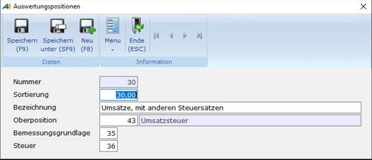
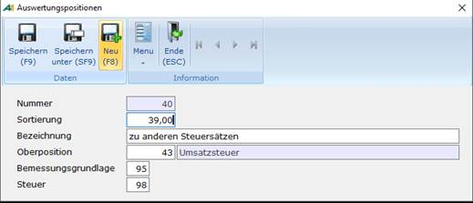
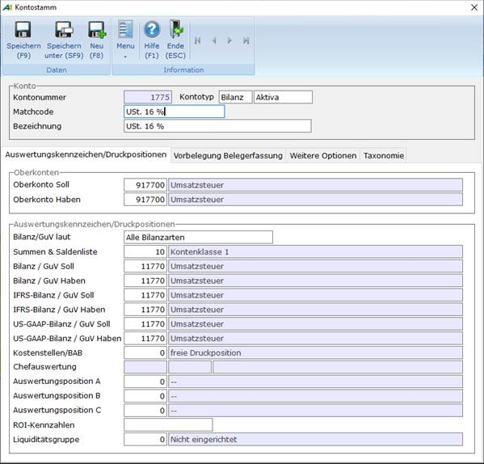
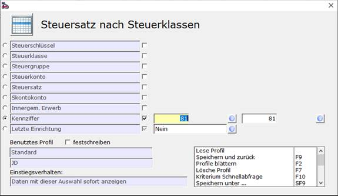
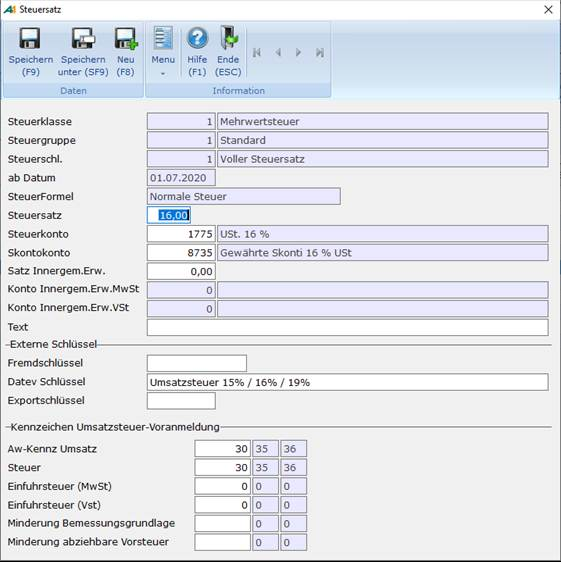
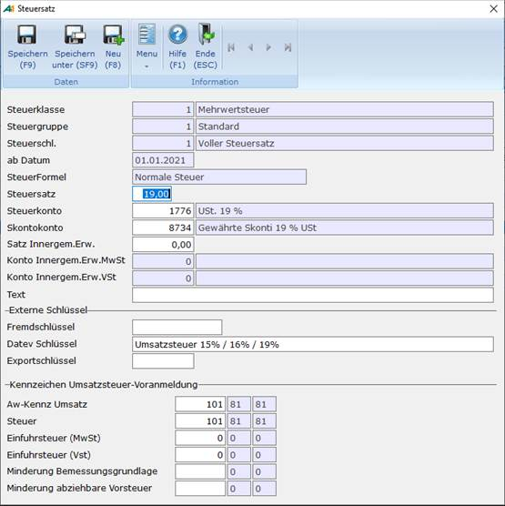

# Steuersatzänderung

<!-- source: https://amic.de/hilfe/steuersatznderung.htm -->

Es kommt hin und wieder vor, dass sich die Steuersätze ändern und es somit notwendig wird, die Stammdaten daraufhin anzupassen. Anhand der zum 01.07.2020 anstehenden Änderung des Steuersatzes von 19% auf 16 % werden hier beispielhaft die einzelnen Schritte gezeigt, die für die Änderung der Steuer notwendig sind, damit sie auf den Umsatzsteuerformularen erscheinen. Da die Vordruckkommissionssitzung entschieden hat, dass die Umsätze zu den neuen Steuersätzen (16 % und 5 %) gesammelt in den Kennzahlen für Umsätze zu anderen Steuersätzen eingetragen werden, werden keine neuen Auswertungspositionen benötigt. Es wird daher auch keine neue Version von Elster geben.

Die zum 01.07.2020 anstehende Änderung des Steuersatzes von 7% auf 5% muss analog geschehen.

Schritt 1: Auswertungspositionen bearbeiten

Die neuen Steuersätze sollen in unter dem Bereich „Umsätze, die anderen Steuersätzen unterliegen“ (Kennziffer 35/36) bzw. beim innergemeinschaftlichen Erwerb unter „zu anderen Steuersätzen“ (Kennziffer 95/98) erscheinen. Hier ist zu prüfen ob für diese Bereiche Auswertungspositionen eingerichtet sind.

Dazu gibt man den Direktsprung **[FIAWP]** ein und gelangt so in die Anwendung zur Pflege der Auswertungspositionen. Dort sucht man nach der Kennziffern 35 in der Spalte Bemessungsgrundlage.

Wichtig ist hier, dass zu der Kennziffer 35 bei Bemessungsgrundlage die 36 bei Steuer eingetragen ist.

Und anschließende sucht man nach der Kennzahl 95.

 

Hier muss in der Kennziffer für Steuer die 98 zugeordnet sein. Sind beide Auswertungsposition vorhanden kann man mit Schritt 2 weiter machen, ansonsten muss man sie mit ***Neu*** **F8** anlegen. Für die Umsatzstzsteuervoranmeldung und für Elster ist nur die korrekte Zuordnung der Kennziffern Bessungsgrundlage bzw. Steuer wichtig.

Schritt 2: Kontostamm anpassen

Für die neuen Steuersätze werden ggf. auch neue Sachkonten (Steuerkonto, Erlös-/Aufwandskonten und Skontokonten) benötigt. Mit dem Direktsprung **[SKS]** gelangt man in die Anwendung zur Pflege des Sachkontenstamm. Hier grenzt man den Bereich so ein, dass man das entsprechende Sachkonto mit 19% bearbeiten kann.

**Hinweis:** *Sollte man schon vor der Erhöhung des Steuersatzes von 16% auf 19% mit A.eins gearbeitet haben, dann sollten die Konnten für 16% bereits existieren. Es müssen dann nur alle Konten für den neuen Steuersatz von 5% angelegt werden.*  
    
Vorgehen:

• Sachkonto mit der Funktion **F5** zum ***„Ändern“*** aufrufen.

• Mit der Funktion ***„Speichern unter“*** oder **(Shift + F9)** einen neuen Datensatz anlegen.

• Für den neuen Datensatz muss mindestens die Kontonummer und die Bezeichnung geändert werden.

• Anschließend die Änderungen mit **F9** oder ***„Speichern“*** übernehmen.

Diese Arbeitsschritte müssen für alle betroffenen Konten analog geschehen.

Schritt 3: Steuersatz ändern

Nachdem die Auswertungspositionen und die Sachkonten angelegt wurden, müssen jetzt alle betroffenen Steuersätze angepasst werden. Dazu ruft man den Direktsprung **[STS]** auf und geht am besten direkt in die Auswahlliste für [Steuersätze](./stammdaten_steuersaetze.md) **F8**. Dort kann man über **F2** die Auswahl so eingrenzen, dass nur die Steuersätze mit den betroffenen Kennziffern angezeigt werden. Das macht man am besten, indem man nach der Kennziffer für 19% USt eingrenzt (in diesem Fall 81).

Alle angezeigten Datensätze müssen bearbeitet werden. Dazu geht man wie folgt vor:

• Die Datensätze mit **F5** aufrufen und die Funktion ***„Speichern unter…“*** auswählen. Man kann nun im Feld „ab Datum“ das gewünschte Datum (in diesem Fall 01.07.2020) eintragen.

• Für den neuen Datensatz müssen mindestens die Felder „ab Datum“(s.o.), Steuersatz, Steuerkonten, Skontokonto sowie die Kennzeichen für die Umsatzsteuervoranmeldung geändert werden.

• Anschließend die Änderungen mit **F9** oder ***„Speichern“*** übernehmen.

Alter Steuersatz:

Bearbeiteter Steuersatz

Diese Arbeitsschritte müssen so lange wiederholt werden, bis man alle betroffenen Steuersätze von 19% auf 16% geändert hat.

Kommt es zu der Meldung, dass der Steuersatz nicht zurückdatiert werden darf, so sollte man per Direktsprung [VRUE] nach Belegen suchen, welche nach dem 30.06.2020 gebucht wurden und diese anpassen.

Schritt 4: Alten Steuersatz wiederherstellen

Da der Steuersatz sich am 01.01.2021 wieder auf 19% bzw. 7% ändert, kann man direkt den „Alten Steuersatz“ wie in Schritt 3 mit ***„speichern unter…“*** oder **(Shift + F9)** neu anlegen und muss lediglich das Datum auf den 01.01.2021 ändern.

Schritt 5: Wiederholung

Für die Steuersätze „Innergemeinschaftlicher Erwerb“ – Kennziffer 89 – müssen alle unter Punkt drei erwähnten Arbeitsschritte wiederholt werden. Hier muss die Auswertungsposition mit den Kennziffern 95 und 98 verwendet werden.

Schritt 6: Vorsteuerbeträge

Für die Kennziffern 66 bzw. 61, also für abziehbare Vorsteuerbeträge, geht man ähnlich vor. Es müssen jedoch keine neuen Auswertungspositionen angelegt oder geändert werden, da auf dem Umsatzsteuerformular für Vorsteuer keine Änderungen vorliegen. Man muss also nur Schritt 2 und Schritt 3 beachten.

Schritt 7: EKZZ

Üblicherweise werden Wareneinkauf / Umsatzerlöse in der Finanzbuchhaltung getrennt nach Steuersätzen verbucht. Ist dies der Fall, müssen zusätzlich ab 01.07. Anpassungen an der Erlöskennziffer-Kontozuordnung (Direktsprung **EKZZ**) vorgenommen werden. Die dort derzeit für 19 und 7 % befindlichen Einstellungen, müssen analog auf 16 und 5 % ab Datum 01.07. gepflegt werden.

