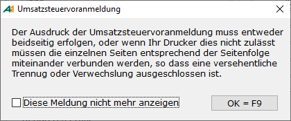
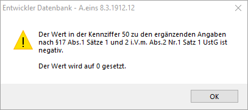

# Umsatzsteuervoranmeldung

<!-- source: https://amic.de/hilfe/umsatzsteuervoranmeldung.htm -->

Hauptmenü > Abschlussarbeiten > Umsatzsteuer > Umsatzsteuerwerte

Direktsprung **[UVA]**

Das Finanz- und Warenwirtschaftssystem A.eins unterstützt Sie bei der Erstellung Ihrer Umsatzsteuervoranmeldung mit einem von der OFD Schleswig-Holstein zugelassenen Vordruck für die Umsatzsteuervoranmeldung.

Der Zulassungsvermerk wird auf der Umsatzsteuervoranmeldung nicht mehr mit ausgedruckt, da der offizielle Weg inzwischen via [Elster](./elster.md) erfolgt.

Dieses Formular bezieht die Daten über die Steuersätze und die dort eingerichteten Auswertungspositionen. Bevor dieses Formular gedruckt wird, werden vom System einige Prüfungen durchgeführt, ob bestimmte Zuordnungen und Einrichtungen fehlerfrei sind. Diese Prüfungen können Sie auch schon bei der Einrichtung der Stammdaten durchführen. Sie finden diese Tests unter dem Direktsprung FIREO und dort ist es der Menüpunkt "Test Stammdaten".

Speziell hierfür sind folgende Einrichtungen nötig:

Im Mandantenstamm müssen die Felder **Bundesland, Anschrift Finanzamt, Steuernummer** sowie **Voranmeldezeitraum** eingetragen sein.

Es müssen die [Auswertungspositionen](./steuersaetze_einrichten/stammdaten_auswertungspositionen.md) so eingerichtet sein, dass alle Kennzahlen vorhanden sind, die für das Unternehmen von Belang sind. In den Steuersätzen müssen die "Kennzeichen Umsatzsteuer-Voranmeldung" so eingetragen werden, dass sie die Bemessungsgrundlage bzw. die Steuer auf dem Umsatzsteuervoranmeldungsvordruck widerspiegeln.

Den Aufruf des Umsatzsteuervoranmeldungsformulars findet man unter dem Menüpunkt Umsatzsteuerwerte (Direktsprung **[UVA]**). In der Variante „Umsatzsteuer nach Auswertungspositionen“ werden die Daten mit Zwischensummen ausgegeben. Mit der Funktion „Einzelpositionen“ werden die Belege angezeigt, die den Auswertungspositionen zugeordnet sind. Mit der Funktion **"Druck Umsatzsteuervoranmeldung"** kann der Report sofort gedruckt werden. Vor dem Ausdruck kommt noch eine Meldung, in der man aufgefordert wird, die zwei Seiten zusammenzuheften:  
    

Bekanntermaßen ändert sich der Aufbau der Umsatzsteuervoranmeldung fast jährlich. Sobald diese Änderungen bekannt sind, werden diese von AMIC sofort in das Programm A.eins übernommen und ein entsprechender Report zur Verfügung gestellt. Über das angesprochene Geschäftsjahr wird der entsprechende Report bestimmt. Eventuell notwendige Änderungen an den Auswertungspositionen müssen jedoch vom Anwender selbstständig durchgeführt werden.

**Wichtiger Hinweis:** ab 2021 sind zwei neue Kennziffern für Ergänzende Angaben zu Minderungen nach § 17 Abs. 1 Sätze 1 und 2 i.V.m. Abs. 2 Nr. 1 Satz 1 UStG hinzugekommen. Um diese Kennziffern korrekt mit Daten zu versorgen, ist es notwendig, die [Stammdaten](./steuersaetze_einrichten/kennziffern_fuer_ergaenzende_angaben.md) anzupassen.

**Kennziffern 37 und 50 bei negativen Werten**

Die Kennziffern 37 (Minderungen der abziehbaren Vorsteuer) und 50 (Minderungen der Bemessungsgrundlage) dürfen keinen negativen Wert aufweisen. Daher werden beim Aufruf der Funktion ***UStVA via Elster***, ***UStVA drucken*** und ***Liste drucken*** die Werte für die Kennziffer 37 oder 50 auf **0** gesetzt, wenn diese negativ sind. Es erscheint dann folgende Meldung:

