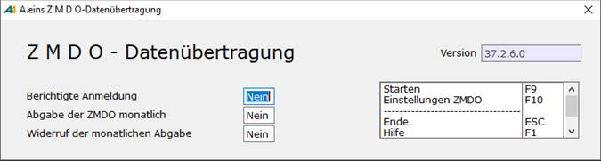
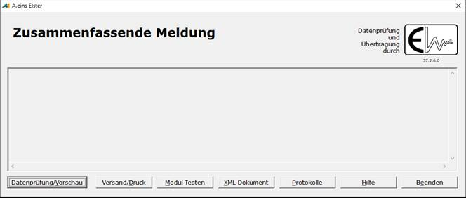

# Ablauf ZMDO

<!-- source: https://amic.de/hilfe/ablaufzmdo.htm -->

Hauptmenü > Abschlussarbeiten > Zusammenfassende Meldung > Variante ZM nach AW.Position

Direktsprung **[UVZM]**

In dieser Auswahlliste werden die Daten, die für den Versand vorgesehen sind dargestellt. Für die ZMDO werden die Steuersätze herangezogen, für die die Auswertungspositionen mit den Kennzahlen für "Innergemeinschaftliche Lieferung "(bisher 41) bzw. "Lieferungen des ersten Abnehmers bei innergemeinschaftlichen Dreiecksgeschäften" (bisher 42) und – seit Januar 2010 – „Nicht steuerbare sonstige Leistungen gem. § 18b Satz 1 Nr. 2 UStG“ ( 21 ) eingetragen sind. Diese Kennzahlen sowie der Zeitraum werden in der zugrundeliegenden F2-Bereichsauswahl abgefragt.

Für die Art, wie die Daten aufbereitet werden, existiert der Steuerungsparameter „ZMDO mehrere Kunden mit gleicher USTID akzeptieren“ (SPA 934). Die Auswahlliste generiert pro Konto die Daten. Dies ist die Standardeinstellung dieses Steuerungsparameters. Wenn zu unterschiedlichen Konten dieselbe UDTID hinterlegt ist – weil es sich z.B. um verschiedene Filialen handelt – kommt es bei der Übertragung zu Problemen, da dieselbe USTID nicht mehrfach ( es sei denn mit anderen Kennzeichen für Dreiecksgeschäft / Sonstige Leistung) vorkommen darf. Stellt man den Steuerungsparameter auf **Ja**, so werden die Daten nach der USTID gruppiert. Die Konten werden dann nur noch Informatorisch angezeigt.

Wurden Daten angezeigt, so kann mit der Funktion „ZMDO via ELSTER“ der Versand vorbereitet werden.

**Berichtigte Anmeldung**

Handelt es sich um eine Erstmeldung, so ist hier **Nein** einzutragen. Bei einer berichtigten Anmeldung muss hier **Ja** stehen.

**Abgabe der ZMDO Monatlich**

Bei Abgabe einer Monatsmeldung in Meldezeiträumen ab 01.07.2010 kann der Benutzer anzeigen, dass er zukünftig monatlich seine Zusammenfassende Meldung abgeben möchte.

**Widerruf der monatlichen Abgabe**

Bei Abgabe einer Monatsmeldung in Meldezeiträumen ab 01.07.2010 kann der Benutzer die monatliche Abgabe seiner Zusammenfassenden Meldung widerrufen.

Mit der Funktion Starten F10 wird dann das Modul zum Versenden der Daten gestartet.

Bei dieser **Datenprüfung** handelt es sich um eine von Elster entwickelte Prüfung des Datenformats und der inhaltlichen Zusammenhänge. Das Ergebnis der Prüfung wird im Anzeigefenster dargestellt und im Arbeitsverzeichnis in der Datei zmdo.log mitprotokoliert. Diese Log-Datei wird täglich neu begonnen und die alten werden umbenannt in zmdo.log.nnn wobei nnn eine Nummer ist, die automatisch hochgezählt wird. Die aktuelle Log-Datei kann über das „**Protokoll**“ aufgerufen werden. Dort sind dann alle Ausgaben, die an diesem Tag gemacht wurden, zu finden.  
Diese Datenprüfung findet vor dem tatsächlichen Versand automatisch statt um das Versenden fehlerhafter Daten zu vermeiden!

Vor dem **Versand** wird ein sechsstelliger Pin abgefragt. Diesen erhält man zusammen mit dem Zertifikat. Nach Eingabe der Pin werden zuerst die Daten noch einmal geprüft und nur bei erfolgreicher Prüfung startet der Versand. Nach erfolgreicher Übertragung der Daten wird ein PDF-Dokument geöffnet. Diese Datei (zmdo.pdf) befindet sich in dem Ordner, den man als Arbeitsverzeichnis in den „[Einstellungen-Datentransfer](./einstellung_datentransfer_zmdo.md)“ festgelegt hat. Sie wird nicht separat gespeichert.
