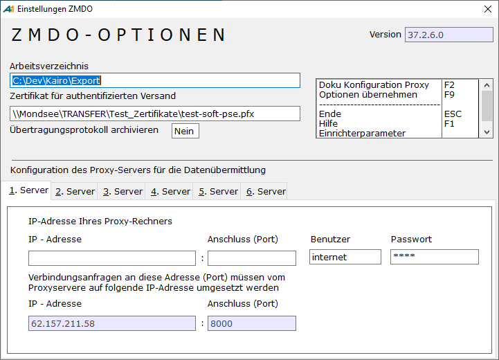

# Einstellung Datentransfer ZMDO

<!-- source: https://amic.de/hilfe/einstellungdatentransferzmdo.htm -->

Hauptmenü > Abschlussarbeiten > Zusammenfassende Meldung > Einstellungen ZMDO.

Direktsprung **[ZMDOO]**

**Arbeitsverzeichnis ZMDO**

Bei der Bearbeitung der Daten müssen Dateien zwischengespeichert werden. Dies geschieht auf dem hier eingetragenen Arbeitsverzeichnis. Dort finden sich auch alle LOG-Dateien, falls es zu Problemen bei der Übertragung kommt.

Zertifikat für den authentifizierten Versand

Die ZMDO kann nur mit Authentifizierung übertragen werden. Informationen zur Authentifizierung findet man unter [www.elster.de](http://www.elster.de/).

Es existieren drei verschiedene Möglichkeiten der Authentifizierung:

- Software-Zertifikat:  
Angabe des Dateiname - inklusive des vollständigen Verzeichnisses - des Software-Zertifikats (i.d.R. mit der Endung .pfx).  
    

- Sicherheitsstick:  
Angabe des Dateinamens des Treibers. Bitte beachten, dass der Treiber betriebssystemabhängig sein kann. Aktuell werden folgende Sticks von Elster unterstützt:  
    

  - G&D StarSign USB Token für ELSTER. Hier heißt die Treiber-DLL **starsignpkcs11_w32.dll**
  - G&D StarSign Crypto USB Token für ELSTER. Hier heißt die Treiber-DLL **aetpkss1.dll**  
    

    Weitere Informationen in der Anleitung zum Sicherheitsstick stehen unter [www.sicherheitsstick.de](http://www.sicherheitsstick.de). 

- Signaturkarte:  
Angabe des Dateinamens des Treibers, welcher einen Zugriff auf die Signaturkarte ermöglicht. Weitere Informationen in der Anleitung zur Signaturkarte.

**Übertragungsprotokoll archivieren**

Diese Möglichkeit erscheint dann, wenn eine Archiv-Lizenz vorliegt. Die Standardeinstellung ist **Ja**. Ist diese Option aktiviert, wird nach der erfolgreichen Datenübermittlung das PDF-Dokument sofort in das Archiv gestellt und anschließend das Dokument sofort aus dem Archiv heraus geöffnet. Die zugehörige Belegklasse im Archiv ist „ELSTER-ZMDO“.

**Konfiguration des Proxy-Servers für die Datenübermittlung:**

Sollte die Verbindung zum Internet über einen Proxyserver laufen, so können hier die Einstellungen vorgenommen werden. <strong>ACHTUNG: </strong><em>Die FIREWALL muss die Verbindung zulassen.</em>  
    
Zur Unterstützung der Einrichtung von Elster stehen zwei PDF-Dateien auf dem Verzeichnis Dokumentation von A.eins:

- KonfigurationProxy.pdf
- Konfiguration_AVMKEN_Jana.pdf

Die hier vorgenommenen Einstellungen für den Proxy-Server gelten auch für das Elster Modul zur Übertragung der Umsatzsteuervoranmeldung.  
    

**Steuerparameter**  
Es existiert ein [Steuerparameter](../../../firmenstamm/steuerparameter/optionen_finanzwesen/zmdo_mehrere_kunden_mit_gleicher_ustid_akzeptieren_spa_934.md) „ZMDO mehrere Kunden mit gleicher USTID akzeptieren“ (Nummer 934)
