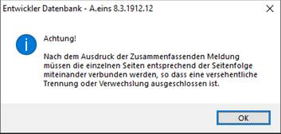

# Zusammenfassende Meldung über zugelassenen Vordruck

<!-- source: https://amic.de/hilfe/zusammenfassendemeldungberzuge.htm -->

**Achtung:**

***Seit dem 01.01.2007 ist die Zusammenfassende Meldung a**uf elektronischem Weg nach Maßgabe der Steuerdaten-Übermittlungs-Verordnung zu übermitteln******. Siehe dazu weiter unten unter* „[Zusammenfassende Meldung Excel Export](./zmdo_zusammenfassende_meldung_via_elster/index.md)“.

In A.eins kann die Zusammenfassende Meldung über ein vom Bundesamt für Finanzen zugelassenes Formular ausgedruckt werden. Zwar wird im Zulassungsbescheid darauf hingewiesen, dass Unternehmer, die ein von Dritten erstelltes Verfahren zur Erstellung ihrer Zusammenfassenden Meldung verwenden, dies erneut beim Bundesamt für Finanzen zulassen müssen. Auf den Ausdruck der Daten der Zulassung auf dem Vordruck kann jedoch verzichtet werden, wenn im Zusammenhang darauf hingewiesen wird, dass die abweichenden Vordrucke mit der von der Software Company AMIC GmbH hergestellten Software erstellt werden. Die Einsendung der ZM mit einem bereits zugelassenen abweichenden Vordruck gilt bereits als Antrag.

Der Zulassungsvermerk (Software Company AMIC GmbH – BfF vom 31. Okt. 2003, S 7427 a – St l 322 – SW/258) wird auf der Zusammenfassenden Meldung immer mit ausgedruckt.

Dieses Formular bezieht die Daten über die Steuersätze und die dort eingerichteten Auswertungspositionen. Für die Zusammenfassende Meldung werden die Steuersätze herangezogen, für die die Auswertungspositionen mit den Kennzahlen für "Innergemeinschaftliche Lieferung "(bisher 41) bzw. "Lieferungen des ersten Abnehmers bei innergemeinschaftlichen Dreiecksgeschäften" (bisher 42) und – seit Januar 2010 – „„Nicht steuerbare sonstige Leistungen gem. § 18b Satz 1 Nr. 2 UStG“ ( 21 ) eingetragen sind. Diese Kennzahlen werden in der zugrundeliegenden Auswahl abgefragt.

Bevor dieses Formular gedruckt wird, werden vom System einige Prüfungen durchgeführt, ob bestimmte Zuordnungen und Einrichtungen fehlerfrei sind. Diese Prüfungen können Sie auch schon bei der Einrichtung der Stammdaten durchführen. Sie finden diese Tests unter dem Direktsprung FIREO und dort ist es der Menüpunkt "Test Stammdaten".

Wo findet man den Vordruck?

Unter dem Menü Umsatzsteuer gibt es die Anwendung "Zusammenfassende Meldung". Dort kann man zur Variante "**Zusammenfassende Meldung nach AWPosition"** eine Funktion **"Zugelassener Vordruck"** finden**.** Hier werden die Daten analog dieser Variante zusammengesucht und dem Vordruck bereitgestellt. Bevor man den Vordruck drucken kann, wird geprüft, ob alle nötigen Stammdaten erfasst wurden.

• Mandantenstamm: Hier muss die Umsatzsteuer Identifikationsnummer (Ust-IdNr.), sowie der  
Ansprechpartner (Mindestangabe ist der Name) hinterlegt sein.

• Kundenstamm: Zu jedem auf der Zusammenfassenden Meldung erscheinenden Kunden muss  
eine Ust-IdNr. hinterlegt sein.

• Die Auswertungspositionen mit den Kennzahlen 41,42 und 21 im Feld Bemessungsgrundlage  
müssen eingerichtet sein.

Sind diese Tests erfolgreich durchgeführt worden, erscheint eine Meldung, in der Sie aufgefordert werden, die Seiten zusammenzuheften.

Im Folgenden wird noch abgefragt, ob es sich um eine berichtigte Anmeldung handelt. Es werden dann trotzdem alle Daten für den Meldezeitraum wiederholt. Die berichtigten Angaben sind in diesem Fall zu kennzeichnen.
