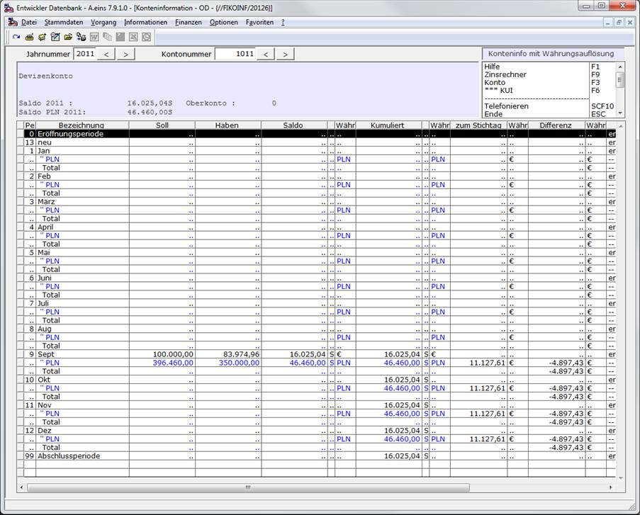
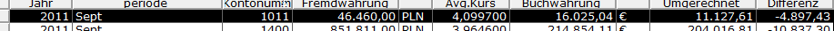
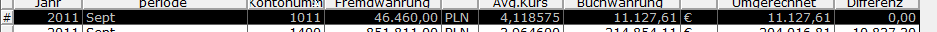

# Führung von Devisenkonten.

<!-- source: https://amic.de/hilfe/fhrungvondevisenkonten.htm -->

Devisenkonten sind Bankkonten, die in einer anderen als der Buchwährung geführt werden. Um ein Konto als Devisenkonto zu führen, sollte man in den [Sachkonten](../stammdaten_der_fibu/sachkonten.md)\-Stammdaten (Direktsprung [**SKS]**) den Schalter „Buchwährung vorbelegen“ auf **Nein** stellen und die Währung auf die Währung des Kontos einstellen. Dies bewirkt folgendes:  
    

1. In der Belegerfassung der Finanzbuchhaltung wird, wenn als Hauptkonto dieses Sachkonto verwendet wird, sofort die Währung für jede Position mit dieser Währung vorbelegt.

2. Wenn der Steuerungsparameter „Anzeige des Fremdwährungssaldo in der Fibu“ auf **Ja** steht, so wird zusätzlich der Saldo des Kontos in der im Sachkontostamm angegebene Währung angezeigt.

3. In der Konteninformation wird im Informationsbereich der Saldo zusätzlich in dieser Währung angezeigt. Das Standardformular ( -99 ) ist darauf angepasst. In privaten Formularen können folgende Druckpositionen verwendet werden:  
    

   - Saldotext Fremdwährung (2478)
   - Saldo erfasst Fremdwährung (2481)
   - SaldoSH erfasst in Fremdwährung (2482)

Diese Felder werden nur angezeigt, wenn die oben beschriebenen Bedingungen erfüllt sind, ansonsten werden diese Felder automatisch ausgeblendet.

Die Besonderheit der Devisenkonten sind die entstehenden Kursdifferenzen und das Buchen dieser. Beim Einkauf der Devisen liegt ein bestimmter Währungskurs zum Tage X zugrunde. Zum Zeitpunkt der Verwendung der eingekauften Devisen hat sich der Kurs jedoch sehr wahrscheinlich verändert. Die Differenz muss dann als Kursdifferenz ausgebucht werden:

| | EUR | Kurs | PLN |
| --- | --- | --- | --- |
| Deviseneinkauf | 100.000,00 | 3,9646 | 396.460,00 |
| Zahlung einer Rechnung | 47.939,79 | 4,1719 | 200.000,00 |
| Zahlung einer Rechnung | 36.035,17 | 4,1626 | 150.000,00 |
| Differenz | 16.025,04 | | 46.460,00 |
| Bewertung Perioden | 11.127,61 | ç 4,1752 | 46.460,00 |
| Kursdifferenz | 4.897,43 | | 0,00 |

Am Ende der Periode befinden sich also noch 46.460,00 PLN auf dem Devisenkonto. Diese werden dann mit dem Tageskurs laut den in A.eins eingetragenen Währungskursen bewertet. Im obigen Beispiel also mit einem Kurs von 4,1752 was somit 11.127,61 Euro ergibt. Laut Eurokontoführung hätten jedoch noch 16.025,05 Euro auf dem Konto sein müssen. Die Differenz aus diesen beiden Werten ist dann die auszubuchende Kursdifferenz.

So wie in diesem Beispiel skizziert funktioniert die Variante „Konteninfo mit Währungsauflösung“. Sie gibt zu jedem Zeitpunkt Aufschluss über die Kursdifferenzen.

Es wird pro Periode das Konto in Buchwährung und in Fremdwährung dargestellt. In der Spalte zum Stichtag findet man den Kumulierten Fremdwährungsbetrag zum Stichtag (Periodenende) in Euro Umgerechnet (46.460,00 / 4,17520 = 11.127,61). In der Spalte „Differenz“ wird die Differenz zwischen diesem Betrag und dem Kumulierten Betrag in Euro ausgewiesen.

Um diese Kursdifferenzen automatisch zu buchen findet man unter der Rubrik „Abschlussarbeiten“ unter Fremdwährung die Auswahlliste „Währungsabgrenzung“. Dort werden, ähnlich wie in der Konteninformation alle Differenzen pro Bilanzkonto oder Personenkonto und Währung dargestellt:

Alle dort markierten Positionen können mit der Funktion „Übernahme Primanota“ als Kursdifferenzbuchung in die Primanota übernommen werden. Es werden nur Buchungen erstellt, für Konten, bei denen die Differenz ungleich Null ist. Die Kursgewinn- und Kursverlustkonten werden aus dem Währungsstamm gezogen. Die so entstanden Buchung lautet dann:  
    

  <table>
    <tbody>
      <tr>
        <td>
          
2150

        </td>
        <td>
          
4.897,43

        </td>
        <td></td>
      </tr>
      <tr>
        <td>
          
an 1011

        </td>
        <td></td>
        <td>
          
4.897,43

        </td>
      </tr>
    </tbody>
  </table>

Schaut man sich anschließend die Auswahlliste wieder an, so ist jetzt die Differenz 0,00.

Bei der Währungsabgrenzung gibt es zwei Besonderheiten:

1. Bei der Übernahme in die Primanota wird eine Belegmappe abgefragt. Hier kann man einen Text angeben, über den man dann alle Belege einfach wiederfinden kann. In der zweiten Variante dieser Auswahlliste wird diese Bezeichnung verwendet, um alle Belege eines Arbeitsganges wieder zu finden. Wenn man wie in dem Beispiel oben, am Ende einer Periode die Abgrenzung vorgenommen hat, so muss zum Anfang der nächsten Periode diese Abgrenzung wieder aufgelöst werden. Bei der Auflösung wird dann ein weiterer Beleg erstellt. Belegdatum und Periode werden mit dem Folgetag bzw. Folgeperiode vorbelegt. Es entsteht folgende Kursdifferenzbuchung :  
    

  <table>
    <tbody>
      <tr>
        <td>
          
1011

        </td>
        <td>
          
4.897,43

        </td>
        <td></td>
      </tr>
      <tr>
        <td>
          
an 2150

        </td>
        <td></td>
        <td>
          
4.897,43

        </td>
      </tr>
    </tbody>
  </table>

2. Forderungskonten dürfen grundsätzlich nicht direkt bebucht werden. Um nun auch für Forderungskonten eine periodengerechte Abgrenzung vorzunehmen, kann man diesen Konten Ersatzkonten zuordnen. Den Pfleger erreicht man aus dieser Auswahlliste heraus über die Funktion „Kontozuordnung Währungsabgrenzung“. Es wird bei den Buchungen dann das Ersatzkonto anstelle des Forderungskontos verwendet. Diese Konten müssen dann immer bei der Währungsabgrenzung zusammen betrachtet werden.
