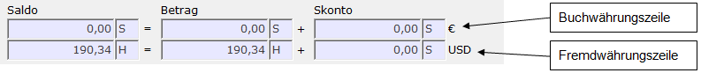
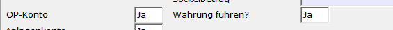
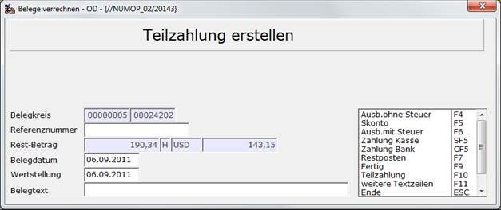

# OP-Führung in Fremdwährung

<!-- source: https://amic.de/hilfe/opfhrunginfremdwhrung.htm -->

Hauptmenü > OP-Verwaltung > OP-Bearbeitung > OP-Verwaltung

Direktsprung **[OPV]**

Offene Posten können für Personenkonten und unter bestimmten Vorrausetzungen (siehe unten) auch für Sachkonten in Fremdwährung geführt werden. Dabei gilt grundsätzlich:

Wenn man OP’s in Fremdwährung führt, so muss bei der Verrechnung der Betrag in Fremdwährung aufgehen. Die ggf. entstehende Differenz in Buchwährung wird automatisch als Kursdifferenz ausgebucht.

In den Standardvarianten werden die Beträge in Fremdwährung und die Währung mit angezeigt und Blau eingefärbt, wenn der Steuerungsparameter „Anzeige Fremdwährung in Auswahllisten“ auf **Ja** steht. Oberhalb der Liste befinden sich zwei Zeilen, in denen der Betrag in Buchwährung und in Fremdwährung angezeigt wird.

Wählt man einen OP aus, der in einer anderen als der Buchwährung erfasst wurde, wird in der zweiten Zeile sofort die Fremdwährung dargestellt. Dabei werden bei Personenkonten auch in Buchwährung erfasste Beträge in diese Fremdwährung umgerechnet. Der Kurs wird aus der Währungskurstabelle gezogen. Bezugsdatum ist das Belegdatum des umzurechnenden Beleges.

Um Sachkonten in Fremdwährung zu führen, muss das Kennzeichen „Währung führen“ im Sachkontenstamm auf **Ja** gestellt werden.

Im Gegensatz zu den Personenkonten können bei Sachkonten nur OP’s verrechnet werden, die in der gleichen Währung erfasst wurden, d.h. es findet keine automatische Umrechnung von der Buchwährung in die Fremdwährung statt.

Auszifferung geht in Fremdwährung auf:

Beim Ausziffern kann es durch Kursdifferenzen dazu kommen, dass zwar der Betrag in Fremdwährung aufgeht, die Buchwährung jedoch eine Differenz aufweist:

| | USD | Kurs | EUR |
| --- | --- | --- | --- |
| Rechnung | 4.000,00 S | 1,2693 | 3.151,34 S |
| Zahlung | 4.000,00 H | 1,3297 | 3.008,20 H |
| Differenz | 0,00 | | 143,14 S |

Diese Differenz wird automatisch auf das im Währungsstamm eingetragene Kursgewinn- oder Kursverlustkonto gebucht. Es wird dabei eine Kursdifferenzbuchung - Belegart KD – erstellt. Diese Belege haben die Besonderheit, dass sie nur den Betrag in Buchwährung enthalten und der Betrag in Fremdwährung immer null ist.

Auszifferung geht in Buchwährung auf:

Es kann jetzt auch vorkommen, dass vereinbart war, dass der Betrag in Buchwährung gezahlt werden sollte, obwohl die Rechnung in Fremdwährung gestellt wurde. Dann kommt es zu folgender Auszifferung:

| | USD | Kurs | EUR |
| --- | --- | --- | --- |
| Rechnung | 4.000,00 S | 1,2693 | 3.151,34 S |
| Zahlung | 4.190,34 H | 1,3297 | 3.151,34 H |
| Differenz | 190,34 S | | 0,00 S |

Wenn man jetzt die Auszifferung vornimmt, so öffnet sich das Fenster zum Verrechnen der Differenz.

Als Restbetrag stehen die 190,35 USD, jedoch ein Betrag von 143,15 Euro und nicht wie in der Buchwährungszeile 0 Euro. Der Grund ist der, das in der OP-Verwaltung nur die Summe der einzelnen Belege angezeigt wird. Hier muss jetzt aber der Betrag von 190,35 USD in die Buchwährung umgerechnet werden.

Da man vereinbart hatte, den Betrag in Euro zu zahlen, so muss man jetzt diese Differenz ausbuchen. Dazu schaltet man die Verrechnung auf „Ausbuchen ohne Steuer“ um und bucht diese Differenz auf ein dafür vorgesehenes Konto. Die gesammte Auszifferung sieht dann wie folgt aus:

| | USD | Kurs | EUR |
| --- | --- | --- | --- |
| Rechnung | 4.000,00 S | 1,269300 | 3.151,34 S |
| Zahlung | 4.190,34 H | 1,329700 | 3.151,34 H |
| Ausbuchung | 190,34 S | 1,329700 | 143,15 S |
| Kursdifferenzbuchung | 0,00 H | | 143,15 H |
