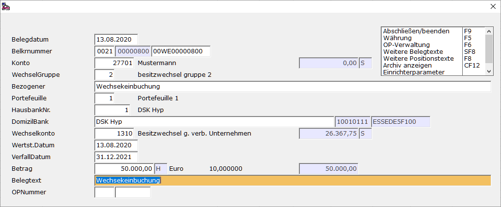
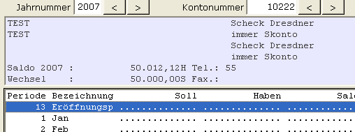

# Beispielablauf bzw. Beispielbuchungen

<!-- source: https://amic.de/hilfe/beispielablaufbzwbeispielbuchu.htm -->

Hauptmenü \> Finanzbuchhaltung \> Erfassung > Belegerfassung

Direktsprung **[FIBE]**

Die Erfassung eines Wechsels in die Finanzbuchhaltung erfolgt über die Belegerfassung. Dort wählt man die Belegart **WE (**Wechsel erfassen) aus. Als Besitzwechsel stellt er eine Forderung für den jeweiligen Remittenten dar. Wir als Remittent buchen daher:

Besitzwechsel an Kunde

oder

Lieferant an Schuldwechsel

Da ein Wechsel im Wirtschaftsleben als Zahlungs- bzw. als Kreditmittel Verwendung findet, wird er auch vom Programm ähnlich wie ein Zahlungsbeleg behandelt. Man gelangt somit wie unter ZA auch direkt in die OP-Verwaltung und kann dort die mit dem Wechsel beglichenen OPs direkt ausziffern.

In der OP-Verwaltung **[OPV]** und Konteninformation **[KOI]** steht der Wechsel als Summe im Infofenster.

