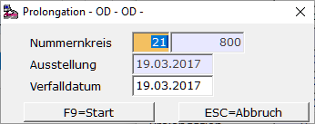

# Prolongation / Verlängerung eines Wechsels bei nicht weitergebebenen Wechseln

<!-- source: https://amic.de/hilfe/prolongationverlngerungeineswe.htm -->

Hauptmenü \> Finanzbuchhaltung \> Mahn-/Zahl-/Zinswesen \> Wechselbuchhaltung > Wechsel bearbeiten

Direktsprung **[WEB]**

Kann der Bezogene am Verfalltag die Wechselsumme nicht bezahlen, dann besteht die Möglichkeit der Prolongation, also der Verlängerung der Zahlungsfrist. Dazu muss man in der Anwendung **Wechsel bearbeiten** den Wechsel auswählen und mit F5 ändern. Dort steht einem die Funktion **F9** für **Prolongation** zur Verfügung

Es wird im Wechselstamm ein neuer Wechsel mit dem ehemaligen Verfallsdatum als Ausstellungsdatum hinterlegt. Es erfolgt jedoch ***keine Buchung in der FiBu****!* 

Der alte Wechsel wird als verlängert gekennzeichnet. Folgende Prolongationsstati sind implementiert:

| 0 | Originalwechsel nicht verlängert | Gültig |
| --- | --- | --- |
| 1 | Originalwechsel verlängert | Verfallener Wechsel aus Status 0 |
| 2 | Verlängerter (neuer) Wechsel | (folgt auf Status 0 oder 3) |
| 3 | Erneut verlängert | Verfallener Wechsel aus Status 2 |
