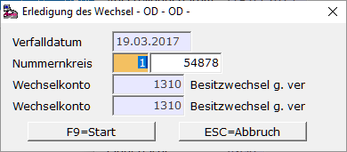

# Verfall / Erledigung eines Wechsels!

<!-- source: https://amic.de/hilfe/verfallerledigungeineswechsels.htm -->

Wie schon bei der Weitergabe eines Besitzwechsels gibt es auch hier zwei Abwicklungsmöglichkeiten.

Möglichkeit 1:

Hauptmenü \> Finanzbuchhaltung \> Erfassung \> Belegerfassung

Direktsprung **[FIBE]**

Belegart Zahlungsverkehr Bank anwählen und Buchung erfassen, wobei als Gegenkonto das Besitz- bzw. das Schuldwechselkonto angegeben werden muss. Da diese Konten als Wechselkonto gekennzeichnet sind, werden bei Eingabe des Gegenkontos die zur Verfall / Erledigung fähigen Wechsel in einem Auswahlbildschirm aufgelistet. Nach Auswahl werden der Betrag und das **S/H**\-Kennzeichen richtig vorbelegt.

Möglichkeit 2:

Hauptmenü \> Finanzbuchhaltung \> Mahn-/Zahl-/Zinswesen \> Wechselbuchhaltung > Wechsel bearbeiten

Direktsprung **[WEB]**

In der Anwendung ***Wechsel bearbeiten*** kann der Verfall automatisch gebucht werden. Hierbei geht man wie folgt vor:

Wechsel markieren und ***Ändern* F5**. Der Wechsel wird angezeigt. Mit **F7 *Wechselverfall*** und **F9 *Start*.**

Die Buchung erfolgt mit dem Verfalldatum. Der Wechsel verschwindet aus der Auswahlliste **"Wechsel bearbeiten".**

Bei diesen Buchungen werden drei Fälle unterschieden:

**Besitzwechsel nicht weitergegeben:**

Bank 10.000,00  
an  
Besitzwechsel 10.000,00

**Besitzwechsel** **weitergegeben:** (nur wenn Wechselkonto ungleich Obligokonto)

Besitzwechselobligo 10.000,00

an  
Besitz Wechsel 10.000,00

**Schuldwechsel:**

Schuldwechsel 10.000,00  
an  
Bank 10.000,00
