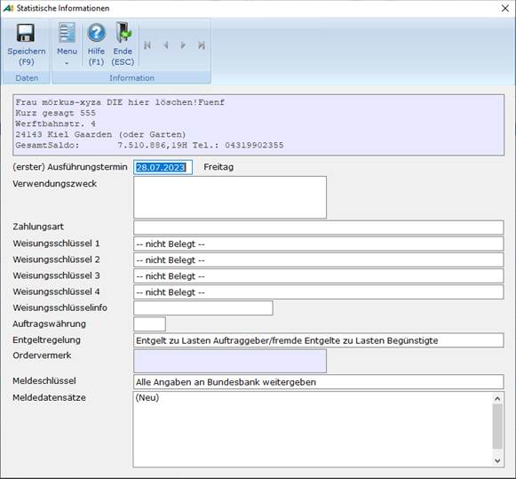
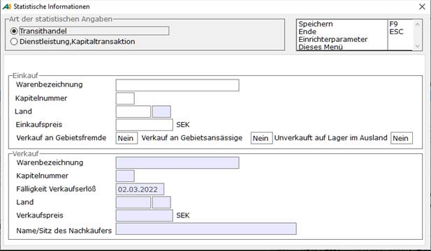
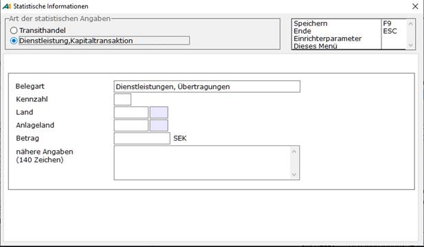

# Statistische Merkmale

<!-- source: https://amic.de/hilfe/statistischemerkmale.htm -->

Hauptmenü > Mahn-,Zahl-, Zinswesen > Zahlungsverkehr > Zahlungen bearbeiten > Funktion ***Statistische Merkmale* SF5**

Direktsprung **[ZHB]**

Sind die Zahlungen erstellt, müssen mit der Funktion ***Statistische Merkmale*** SF5 weitere Informationen für den Auslandszahlungsverkehr hinterlegt werden.

  <table>
    <tbody>
      <tr>
        <td></td>
        <td>
          
<strong>Beschreibung</strong>

        </td>
      </tr>
      <tr>
        <td>
          
Ausführungstermin

        </td>
        <td>
          
Er darf nicht kleiner als das Erstelldatum des DTA's sein und höchstens 15 Kalendertage nach dem Erstelldatum liegen. Der Ausführtermin wird bei der Freigabe der Zahlungsvorschläge mit dem kleinsten Fälligkeitstag vorbelegt. Ist dieses Datum kleiner als das Tagesdatum, so wird es mit diesem vorbelegt. Bei der Freigabe der Zahlungsvorschläge kann man festlegen, dass immer das Tagesdatum als Ausführtermin verwendet werden soll. Dazu trägt man bei „Bei Auslandszahlungen Ausführdatum immer auf Tagesdatum setzen“ ein <b>Ja</b> ein.

        </td>
      </tr>
      <tr>
        <td>
          
Verwendungszweck

        </td>
        <td>
          
frei zu vergebender Text. Dieser wird mit den Belegnummern – bei Eingangsrechnungen mit den Referenznummern – vorbelegt.

          
Man kann diesen Verwendungszweck (4 Zeilen a 35 Zeichen) auch individuell gestalten. Dazu muss eine private Datenbankfunktion mit dem Namen &gt;p_opausland_Verwendungszweck&lt; existieren. Sie hat als Übergabeparameter die Zahlungsid und muss einen char(140) zurückliefern. Liefert die Funktion null zurück, dann wird

          
Beispiel:

          

            <pre><code>CREATE FUNCTION p_opausland_Verwendungszweck (in in_zahlungid integer)
returns char(140)
--
BEGIN
  declare dc_ergebnis long varchar;
  set dc_ergebnis = ……
  return substring(dc_ergebnis,1,140);
--
EXCEPTION
  when others then
    call amic_exception( ERRORMSG() || CHAR(10) || CHAR(13) || TRACEBACK(), SQLCODE , SQLSTATE , 'p_opausland_Verwendungszweck' , -1 );
END</code></pre>
          

        </td>
      </tr>
      <tr>
        <td>
          
Zahlungsart

        </td>
        <td>
          
Die Zahlungsartschüssel zur Kennzeichnung der Zahlungsart. Dieses Feld wird vorbelegt mit der unter Auslandskunden hinterlegten Zahlungsart. Je nach Zahlungsart werden die anderen Felder, die nicht zu belegen sind, ausgeblendet. Folgende Zahlungsarten sind möglich:

          <ul>
            <li>0 Standartübermittlung (z.B. brieflich, SWIFT-Normal)</li>
            <li>10 Telex-Zahlung oder SWIFT-Eilig</li>
            <li>11 Taggleiche Eilüberweisung in Euro(EUE-Überweisung)</li>
            <li>13 EU-Standardüberweisung</li>
            <li>15 Grenzüberschreitende Überweisung</li>
            <li>20 Scheckziehung, Versandform freigestellt</li>
            <li>21 Scheckziehung, Versandform per Einschreiben</li>
            <li>22 Scheckziehung, Versandform per Eilboten</li>
            <li>23 Scheckziehung, Versandform per Einschreiben/Eilboten</li>
            <li>30 Scheckziehung an Auftraggeber, Versandform freigestellt</li>
            <li>31 Scheckziehung an Auftraggeber, Versandform Einschreiben</li>
            <li>32 Scheckziehung an Auftraggeber, Versandform Eilboten</li>
            <li>33 Scheckziehung an Auftraggeber, Versandform Einschreiben/Eilboten Zahlungsart 11 und 13 sind nur zugelassen, wenn die Auftragswährung EURO ist Bei der EU-Standardüberweisung (13) wird geprüft, ob das Land der Kundenbank zu den für EU-Standardüberweisungen zulässigen Ländern gehört. Zulässige Länder für die EU Standardüberweisung sind zurzeit:</li>
          </ul>
          <table>
            <tbody>
              <tr>
                <th>Land</th>
                <th>ISO-Ländercode</th>
              </tr>
              <tr>
                <td>Belgien</td>
                <td>BE</td>
              </tr>
              <tr>
                <td>Dänemark</td>
                <td>DK</td>
              </tr>
              <tr>
                <td>Estland</td>
                <td>EE</td>
              </tr>
              <tr>
                <td>Finnland</td>
                <td>FI</td>
              </tr>
              <tr>
                <td>Frankreich</td>
                <td>FR</td>
              </tr>
              <tr>
                <td>Französisch Guyana</td>
                <td>GF</td>
              </tr>
              <tr>
                <td>Gibraltar</td>
                <td>GI</td>
              </tr>
              <tr>
                <td>Griechenland</td>
                <td>GR</td>
              </tr>
              <tr>
                <td>Guadeloupe</td>
                <td>GP</td>
              </tr>
              <tr>
                <td>Irland</td>
                <td>IE</td>
              </tr>
              <tr>
                <td>Island</td>
                <td>IS</td>
              </tr>
              <tr>
                <td>Italien</td>
                <td>IT</td>
              </tr>
              <tr>
                <td>Lettland</td>
                <td>LV</td>
              </tr>
              <tr>
                <td>Liechtenstein</td>
                <td>LI</td>
              </tr>
              <tr>
                <td>Litauen</td>
                <td>LT</td>
              </tr>
              <tr>
                <td>Luxemburg</td>
                <td>LU</td>
              </tr>
              <tr>
                <td>Malta</td>
                <td>MT</td>
              </tr>
              <tr>
                <td>Martinique</td>
                <td>MQ</td>
              </tr>
              <tr>
                <td>Niederlande</td>
                <td>NL</td>
              </tr>
              <tr>
                <td>Norwegen</td>
                <td>NO</td>
              </tr>
              <tr>
                <td>Österreich</td>
                <td>AT</td>
              </tr>
              <tr>
                <td>Polen</td>
                <td>PL</td>
              </tr>
              <tr>
                <td>Portugal einschließlich Azoren und Madeira</td>
                <td>PT</td>
              </tr>
              <tr>
                <td>Réunion</td>
                <td>RE</td>
              </tr>
              <tr>
                <td>Schweden</td>
                <td>SE</td>
              </tr>
              <tr>
                <td>Slowakei</td>
                <td>SK</td>
              </tr>
              <tr>
                <td>Slowenien</td>
                <td>SI</td>
              </tr>
              <tr>
                <td>Spanien einschließlich Kanarische Inseln</td>
                <td>ES</td>
              </tr>
              <tr>
                <td>Tschechische Republik</td>
                <td>CZ</td>
              </tr>
              <tr>
                <td>Ungarn</td>
                <td>HU</td>
              </tr>
              <tr>
                <td>Vereinigtes Königreich von Großbritannien und Nordirland</td>
                <td>GB</td>
              </tr>
              <tr>
                <td>Zypern</td>
                <td>CY</td>
              </tr>
            </tbody>
          </table>
        </td>
      </tr>
      <tr>
        <td>
          
Weisungsschlüssel 1 bis 4

        </td>
        <td>
          
Die Weisungsschlüssel müssen / können je nach Zahlungsart belegt werden. Folgende Weisungsschlüssel sind möglich

          <ul>
            <li>0 -- nicht Belegt --</li>
            <li>2 Nur mit Scheck zahlen</li>
            <li>4 Nur nach Identifikation zahlen</li>
            <li>6 Bank des Begünstigten per Telefon avisieren</li>
            <li>7 Bank des Begünstigten per Telekommunikation avisieren</li>
            <li>9 Begünstigten per Telefon avisieren</li>
            <li>10 Begünstigten per Telekommunikation avisieren</li>
            <li>11 Deckung z.b. für Devisen- oder Wertpapier-Geschäft</li>
            <li>12 Konzern-interne Zahlung Weisungsschlüssel 4 kann noch 91 "Euro – Gegenwertzahlung" sein.</li>
          </ul>
        </td>
      </tr>
      <tr>
        <td>
          
Weisungsschlüsselinfo

        </td>
        <td>
          
Zusatzinformation zum Weisungsschlüssel z.B. Telex, Tel.-Nr, Kabelanschrift). Ist nicht belegbar bei Scheckziehung.

        </td>
      </tr>
      <tr>
        <td>
          
Entgeltregelung

        </td>
        <td>
          
Mögliche Werte sind

          <ul>
            <li>0 Entgelt zu Lasten Auftraggeber/fremde Entgelte zu Lasten Begünstigter</li>
            <li>1 Alle Entgelte und Auslagen zu Lasten Auftraggeber</li>
            <li>2 Alle Entgelte und Auslagen zu Lasten Begünstigter</li>
          </ul>
        </td>
      </tr>
      <tr>
        <td>
          
Ordervermerk

        </td>
        <td>
          
ist nur bei Scheckziehung zu belegen

        </td>
      </tr>
      <tr>
        <td>
          
Meldeschlüssel

        </td>
        <td>
          
Der Meldeschlüssel kann folgende Werte annehmen:

          <ul>
            <li>0 Alle Angaben an Bundesbank weitergeben</li>
            <li>1 Nur Statistische Information an Bundesbank weitergeben</li>
          </ul>
        </td>
      </tr>
      <tr>
        <td>
          
Meldedatensätze

        </td>
        <td>
          
Hier können bis zu 8 Meldedatensätze für Transithandel bzw. Dienstleistungen/ Kapitaltransaktionen hinterlegt werden. Zahlungen, die Wareneinfuhr betreffen, sind seit 2001 nicht mehr meldepflichtig. Klickt man mit der Maus auf (Neu) oder bestätigt man dieses Feld mit ENTER, öffnet sich ein weiteres Fenster, in dem die entsprechenden Informationen angeben kann.

        </td>
      </tr>
    </tbody>
  </table>

Zahlungen für Wareneinfuhren

Zahlungen, die nur Wareneinfuhren betreffen, sind nicht meldepflichtig. Sofern Zahlungen außer Wareneinfuhren jedoch auch meldepflichtige Sachverhalte betreffen, sind entsprechend zu melden. Zu beachten ist, dass Nebenleistungen im Warenverkehr, wie z.B. Rabatte bei Exporten, Kennzahl 600, auch weiterhin meldepflichtig sind.

Meldedatensatz für Transithandel

Zahlungen im Transithandel sollen gesammelt mit Vordruck Z4 bzw. mit entsprechenden Datensätzen gemeldet werden. Sie können auch einzeln mit dem **Meldetatensatz Transithandel** in diesem Datenträgeraustausch oder dieser Datenfernübertragung gemeldet werden.

| | Beschreibung |
| --- | --- |
| Warenbezeichnung  | der eingekauften Transithandelsware  |
| Kapitelnummer  | des Warenverzeichnisses für die eingekaufte Transithandelsware gemäß Warenverzeichnis für Außenhandelsstatistik  |
| Land  | beinhaltet die Kurzbezeichnung gemäß Länderverzeichnis für die Zahlungsbilanzstatistik. Siehe Stammdaten Staatstamm.  |
| Einkaufspreis  | ohne Nachkommastellen. Angabe in Auftragswährung, bei Euro- Gegenwertzahlung in Euro. Steht **Verkauf an Gebietsfremde** auf **Ja**, werden die alle Felder bis auf "Name/sitz des Nachkäufers" im Bereich Verkauf aktiviert. Steht **Verkauf an Gebietsansässige** auf **Ja**, wird Name wird das Feld "Name/sitz des Nachkäufers" aktiviert  |
| Unverkauft auf Lager im Ausland  | |
| Warenbezeichnung  | der verkauften Transithandelsware. Nur zu belegen bei Verkauf an Gebietsfremde. Wird vorbelegt mit der Bezeichnung im Einkaufsbereich.  |
| Kapitelnummer | des Warenverzeichnisses für die verkaufte Transithandelsware gemäß Warenverzeichnis für Außenhandelsstatistik  |
| Fälligkeit Verkaufserlös  | Transithandel  |
| Land  | beinhaltet die Kurzbezeichnung gemäß Länderverzeichnis für die Zahlungsbilanzstatistik. Siehe Stammdaten Staatstamm.  |
| Verkaufspreis  | ohne Nachkommastellen. Angabe in Auftragswährung, bei Euro- Gegenwertzahlung in Euro.  |
| Name und Sitz des Nachkäufers  | ist nur bei gebrochenem Transithandel (Verkauf an Gebietsfremde) anzugeben.  |

Meldedatensatz für Dienstleistung/Kapitaltransaktion

Bei meldepflichtigen Zahlungen für Dienstleistungen, Übertragungen, Kapitalverkehrstransaktionen sind grundsätzlich sowohl bei Datenträgeraustausch als auch bei Datenfernübertragung die Meldedatensätze zu belegen und zusammen mit dem Zahlungsauftrag beim beauftragten Kreditinstitut einzureichen.

| | Beschreibung |
| --- | --- |
| Belegart  | Kann folgende Werte annehmen: <ul><li>&nbsp;&nbsp;&nbsp; 2 Dienstleistungen, Übertragungen</li><li>&nbsp;&nbsp;&nbsp; 4 Kapitaltransaktionen und Kapitalerträge &nbsp;</li></ul> |
| Kennzahl  | Für sie gilt das Leistungsverzeichnis (Anlage LV zur AWV) sowie das Verzeichnis über die erweiterten Kennzahlen. Hinweise finden Sie in der Homepage der Deutschen Bundesbank ([http://www.Bundesbank.de](http://www.Bundesbank.de) \->Meldewesen ->Außenwirtschaft -> Schlüsselverzeichnisse \-> Spezielles Verzeichnis ausgewählter Kennzahlen für die Statistik des Zahlungsverkehrs mit fremden Wirtschaftsgebieten für ausgehende Zahlungen im DTAZV). Gepflegt werden die Kennzahlen in A.eins in den [Stammdaten für Zahlungsverkehr](./stammdaten_des_auslandszahlungsverkehrs.md#KennzahlenDTAZV). Falls keine zutreffende Kennzahl (Leistungsart) gefunden wird, kann hier die Sammelkennzahl 900 eingetragen werden und die zugrunde liegende Leistung im Feld "nähere Angaben" detailliert beschrieben werden.  |
| Land  | Beinhaltet die Kurzbezeichnung gemäß Länderverzeichnis für die Zahlungsbilanzstatistik. Siehe Stammdaten Staatstamm. In der Regel ist hier anzugeben: <ul><li>&nbsp;&nbsp;&nbsp; Land, in dem der Gläubiger der Zahlung ansässig ist; davon abweichend gilt:</li><li>&nbsp;&nbsp;&nbsp; bei ausländischen Wertpapieren: Land des Emittenten;</li><li>&nbsp;&nbsp;&nbsp; bei ausländischen Finanzderivaten: Land des Börsensitzes bzw. des Stillhalters;</li><li>&nbsp;&nbsp;&nbsp; bei Darlehensauszahlung und Ankauf von Auslandsforderungen: Land des Schuldners;</li><li>&nbsp;&nbsp;&nbsp; bei Direktinvestitionen im Ausland: Land, in dem sich das Investitionsobjekt befindet;</li><li>&nbsp;&nbsp;&nbsp; bei Grundstücken im Ausland: Land, in dem sich das Grundstück befindet;</li><li>&nbsp;&nbsp;&nbsp; bei Zahlungen für Objekt(e) im Ausland: Land des Objektes</li><li>&nbsp;&nbsp;&nbsp; bei unentgeltlichen Zuwendungen (Schenkungen): Land des Begünstigten. &nbsp;</li></ul> |
| Anlageland  | Beinhaltet die Kurzbezeichnung gemäß Länderverzeichnis für die Zahlungsbilanzstatistik. Siehe Stammdaten Staatstamm.  |
| Betrag  | Für Dienstleistungen, Kapitalverkehr, Sonstiges. Angabe in Auftragswährung, bei Euro- Gegenwertzahlung in Euro.  |
| Nähere Angaben  | Die Leistungen, die der Zahlung zugrunde liegen, sind in diesem Feld ausführlich und aussagefähig zu beschreiben. Bei Wertpapiergeschäften ist die genaue Wertpapierbezeichnung, möglichst mit der Wertpapier-Kenn-Nummer oder ISIN(laut Verlag Wertpapier-Mitteilung), anzugeben.  |
