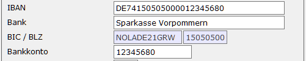

# SEPA-Kennzeichen im Hausbankenstamm

<!-- source: https://amic.de/hilfe/sepakennzeichenimhausbankensta.htm -->

Hauptmenü > Finanzbuchhaltung > Stammdaten > [Hausbanken](../stammdaten_zahlungsverkehr/hausbanken.md)

Direktsprung **[BNKH]**

2) Das SEPA-Verfahren unterliegt einer ständigen Weiterentwicklung. So kann es vorkommen, dass unterschiedliche Banken auch unterschiedliche Versionen verwenden. In A.eins ist die Übertragung für folgende Versionen implementiert und kann im Hausbankenstamm hinterlegt werden:  
    

| Format | Gültig ab | Gültig bis | |
| --- | --- | --- | --- |
| Version 2.5 | 01.11.2010 | 11.2021  | |
| Version 2.7 | 04.11.2013 | 11.2022 | Hierbei handelt es sich um dasselbe Format wie „Version 2.7 pain.001.003.03 / 008.003.02 gültig ab November 2013“, nur dass bei Bankverbindungen, bei denen die IBAN mit DE beginnt, die BIC grundsätzlich nicht mit übertragen wird, da die Identifikation der Bank innerhalb Deutschlands bereits mit der IBAN erfolgen kann.  |
| Version 3.0 | 20.11.2016 | 11.2023 | Es gibt folgende Änderungen zur Vorgängerversion: • Die Vorlauffristen sind jetzt für Erst-, Folge-, Letzt- und Einmallastschriften bei Basislastschriften einheitlich 1 Tag lang. Sobald bei einer Hausbank die neue Version eingetragen ist, wird beim automatischen Zahlungsverkehr bei Basislastschriften die Einstellung der Eillastschrift gezogen. • Es wird nicht mehr zwischen „Basislastschrift“ und „Basislastschrift mit Verkürzter Laufzeit“ („Eillastschrift“) unterschieden. Es ist nicht notwendig die Stammdaten zu ändern, da bei Verwendung der Version 3.0 die eingestellten Werte vom Programm gleich richtig interpretiert werden. Die Mandatsreferenz darf jetzt theoretisch Leerzeichen enthalten, es wird aber von den Kreditinstituten empfohlen, keine Leerzeichen zu verwenden, da sie auf papierhaften Mandat nicht immer eindeutige dargestellt werden können  |
| Version 3.1 bis 3.2 | 19.11.2017 | 11.2023  | pain.001.001.03_GBIC_2 / 008.001.02_GBIC_2 |
| Version 3.3 bis 3.6 | 17.11.2019 | 11.2025  | pain.001.001.03_GBIC_3 / 008.001.02_GBIC_3 |
| Version 3.7 bis 3.8 | 17.03.2024 |   | pain.001.001.09_GBIC_4 / 008.001.08_GBIC_4 |
| Version 3.9 | 05.10.2025 |   | pain.001.001.09_GBIC_5 / 008.001.08_GBIC_5 |

Zusätzlich existiert noch eine Version für „**Österreich gemäß RULEBOOK 6**“

Nähere Informationen zu den Formaten findet man unter [www.EBICS.de](http://www.EBICS.de) (EBICS => Electronic Banking Internet Communication Standard)

3) SEPA-Zeichensatz  
In den XML-Dateien darf nur ein eingeschränkter Zeichensatz verwendet werden. Hier kann A.ens zwischen zwei System unterscheiden:

• Einfacher Zeichensatz mit 0-9, a-z, A-Z sowie den Sonderzeichen ":", "?", ",", "-", " ", "(", "+", ".", ")", "/". Umlaute werde umgewandelt: Beispiel Ä=AE.

• Erweiterter Zeichensatz. Wie der einfache Zeichensatz, aber zusätzlich mit den Zeichen "&", "\*", "$", "%". Umlaute werden NICHT umgewandelt.

Zeichen, die nicht in diesem Zeichensätzen enthalten sind, werden mit einem Leerzeichen überschrieben.

4) Sammel-/Einzelauftrag.  
Das SEPA-Verfahren sieht ein Kennzeichen vor, mit dem man der Bank mitteilen kann, ob man Sammel- oder Einzelaufträge im Kontoauszug der Bank erhalten möchte. In A.eins kann das Verhalten pro Hausbank festgelegt werden. Unter Umständen wird das Kennzeichen vom Institut nicht ausgewertet, da jede Bank die Verarbeitung unterschiedlich handhabt (die Deutsche Bank ignoriert z.B. dieses Kennzeichen und führt immer Sammelbuchungen aus.).

• laut Vereinbarung mit der Hausbank. Diese ist die Standardeinstellung.

• Sammelbuchung durchführen

• Einzelbuchung durchführen

5) Der Hausbankenstamm wurde um das Feld IBAN erweitert:

   
Bei der Neuerfassung der Banken wird aus der IBAN die Bank und die Kontonummer vorgeschlagen. Kennt man die IBAN nicht kann man nach wie vor die Bank und die Kontonummer erfassen und aus dieser wird dann eine Nummer generiert und vorgeschlagen. Man kann in den [Steuerparametern](../../../firmenstamm/steuerparameter/optionen_finanzwesen/iban_test_nach_standard_pruefziffernverfahren_spa_897.md) (Direktsprung **[SPA]**) die IBAN-generierung abschalten. Wird die IBAN trotz korrekt gesetztem SPA nicht vorgeschlagen, so kann dies daran liegen, dass der im Bankenstamm hinterlegte Staat nicht Deutschland, Österreich bzw. Belgien ist oder der eingetragene ISO-Code im Staatenstamm (Direktsprung **[Staat]**) nicht DE, AT bzw. BE ist.  
Diese vorgeschlagene Nummer ist in jedem Fall zu überprüfen, da es sich hier nur um einen Vorschlag handelt. Die IBAN wird ausschließlich von der kontoführenden Bank vergeben. Sollte es notwendig sein, die vorgeschlagene IBAN zu ändern, da eine abweichende IBAN vom Kreditinstitut vergeben wurde, so ist dies durchaus möglich. Sie wird jedoch noch einmal anhand des Prüfzifferverfahrens geprüft und es erscheint ggf. eine Warnung, dass die IBAN laut Prüfziffernberechnung falsch ist. Die Daten werden jedoch trotz dieser Warnmeldung gespeichert.
