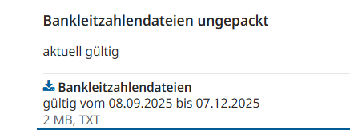
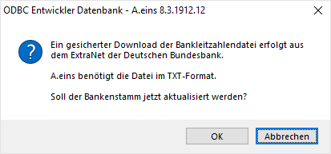

# Bankenstamm

<!-- source: https://amic.de/hilfe/bankenstamm.htm -->

Hauptmenü > Finanzbuchhaltung > Stammdaten > Bankenstamm

Direktsprung **[BNK]**.

Hierbei handelt es sich um die Grunddaten der Banken; sie sind Grundlage der Kunden- und Hausbanken. Folgende Felder werden im Bankenstamm geführt:

  <table>
    <tbody>
      <tr>
        <td></td>
        <td>
          
<strong>Beschreibung</strong>

        </td>
      </tr>
      <tr>
        <td>
          
Nummer

        </td>
        <td>
          
Vergabe einer - laufenden - Nummer für die Bank. Sie dient als verweis in anderen Tabellen auf diese Bank.

        </td>
      </tr>
      <tr>
        <td>
          
Swift / BIC

        </td>
        <td>
          
Hier werden der BIC (Bank Identifier Code) der Bank hinterlegt.

        </td>
      </tr>
      <tr>
        <td>
          
Bezeichnung

        </td>
        <td>
          
Bezeichnung der Bank, z.B. Postbank Hamburg

        </td>
      </tr>
      <tr>
        <td>
          
Matchcode

        </td>
        <td>
          
Kurzsuchbegriff nach freier Wahl, z.B. PB HH.

        </td>
      </tr>
      <tr>
        <td>
          
Staat

        </td>
        <td>
          
Kennzeichen für den Staat bei Auslandsbanken. Für Banken, bei denen nicht Deutschland als Staat eingetragen ist – der Staat Deutschland wird am ISO-Code DE erkannt -, wird die Bankleitzahl zwar auf Eindeutigkeit geprüft und eine Hinweis wird ausgegeben, aber sie werden trotzdem gespeichert. Bei Banken in Deutschland ist das Speichern dieser neuen Bank dann nicht möglich.

        </td>
      </tr>
      <tr>
        <td>
          
PLZ/ORT

        </td>
        <td>
          
Postleitzahl und Ort, an dem diese Bank ihren Sitz hat.

        </td>
      </tr>
      <tr>
        <td>
          
Bankleitzahl

        </td>
        <td>
          
Als Voraussetzung für die Automatisierung des bargeldlosen Zahlungsverkehrs sind die Spitzenverbände des Kreditgewerbes und die Deutsche Bundesbank mit Wirkung vom 1.Oktober 1970 überein gekommen, im Girogeschäft tätige Kreditinstitute im Bundesgebiet durch Bankleitzahlen zu kennzeichnen, die nach einem einheitlichen System aufgebaut sind. Die Bankleitzahl ist numerisch und umfasst acht Stellen.

          
&nbsp;In A.eins dient sie unter anderem als Suchkriterium und steht für Ausdrucke, Datenträgeraustausch etc. zur Verfügung. Aus der Bankleitzahl werden die Bankregion (Bankplatz/Ortsnummer) und die Bankgruppe (Netznummer) ermittelt.

        </td>
      </tr>
      <tr>
        <td>
          
Bankgruppe

        </td>
        <td>
          
Die Bankengruppe (Netznummer) soll dazu dienen, Banken zu kennzeichnen, die zu einem Verbund (z. B. die Volks- und Raiffeisenbanken) gehören, weil es oft der Valutierung zuträglich ist, Überweisungen innerhalb einer Bankengruppe durchzuführen, wo es möglich ist. Es gelten z.Zt. folgende Einteilungen:

          <table>
            <tbody>
              <tr>
                <th>Nr.&nbsp;&nbsp;&nbsp;&nbsp;&nbsp;&nbsp;&nbsp;</th>
                <th>Institut</th>
              </tr>
              <tr>
                <td>0</td>
                <td>Deutsche Bundesbank</td>
              </tr>
              <tr>
                <td>1-3</td>
                <td>Kreditinstitute, soweit nicht in einer der anderen Gruppen erfasst</td>
              </tr>
              <tr>
                <td>4</td>
                <td>Commerzbank</td>
              </tr>
              <tr>
                <td>5</td>
                <td>Girozentralen und Sparkassen</td>
              </tr>
              <tr>
                <td>6+9</td>
                <td>Genossenschaftliche Zentralbanken, Kreditgenossenschaften sowie ehemalige Genossenschaften.</td>
              </tr>
              <tr>
                <td>7</td>
                <td>Deutsche Bank</td>
              </tr>
              <tr>
                <td>8</td>
                <td>Deutsche Bank</td>
              </tr>
            </tbody>
          </table>
        </td>
      </tr>
      <tr>
        <td>
          
Bank Region

        </td>
        <td>
          
Auch die Regionalgruppe kann Valutatage einsparen, wenn Banken am gleichen Ort bevorzugt bedient werden. Üblicherweise ergibt sich das in Deutschland aus den ersten drei Stellen der Bankleitzahl dem sogenannten Bankplatz bzw. Ortsnummer. Die erste Stelle ist dabei das sogenannte Clearing-Gebiet. Für das Clearing-Gebiet gilt z.Zt. folgende Einteilung:

          <table>
            <tbody>
              <tr>
                <th><b>Nr.</b></th>
                <th><b>Land/Landesteil</b></th>
              </tr>
              <tr>
                <td>1</td>
                <td>Berlin, Brandenburg, Mecklenburg-Vorpommern</td>
              </tr>
              <tr>
                <td>2</td>
                <td>Bremen, Hamburg, Niedersachsen, Schleswig-Holstein</td>
              </tr>
              <tr>
                <td>3</td>
                <td>Rheinland( Regierungsbezirke Düsseldorf, Köln)</td>
              </tr>
              <tr>
                <td>4</td>
                <td>Westfalen</td>
              </tr>
              <tr>
                <td>5</td>
                <td>Hessen, Rheinland-Pfalz, Saarland</td>
              </tr>
              <tr>
                <td>6</td>
                <td>Baden-Württemberg</td>
              </tr>
              <tr>
                <td>7</td>
                <td>Bayern</td>
              </tr>
              <tr>
                <td>8</td>
                <td>Sachsen, Sachsen-Anhalt, Thüringen</td>
              </tr>
            </tbody>
          </table>
        </td>
      </tr>
      <tr>
        <td>
          
IBAN Prüfung

        </td>
        <td>
          
Die IBAN wird für Hausbanken und Kundenbanken nach dem Standard-Prüfziffernverfahren getestet. Da einige Banken ein abweichendes Verfahren verwenden kann der Test hier für diese Banken abgestellt werden.

          
Die Prüfung kann auch global per <a href="../../../firmenstamm/steuerparameter/optionen_finanzwesen/iban_test_nach_standard_pruefziffernverfahren_spa_897.md">Steuerparameter</a> abgeschaltet werden.

        </td>
      </tr>
      <tr>
        <td>
          
EDIFACT-Kennung

        </td>
        <td>
          
Dieses Feld steht nur dann zur Verfügung, wenn man den Steuerungsparameter „DTA Format“ auf „Österreich“ gesetzt hat. In Österreich wird der Datenträgeraustausch über EDIFACT-Transaktionen vorgenommen. Die Banken haben eine EDIFACT-Kennung, die in diesem Verfahren zur Identifikation verwendet wird.

        </td>
      </tr>
      <tr>
        <td>
          
Bemerkungen

        </td>
        <td>
          
Freier Text für Notizen

        </td>
      </tr>
    </tbody>
  </table>

Banken aktualisieren

Die Funktion ***Banken aktualisieren*** dient dazu, Änderungen bei Banken (z.B. durch Zusammenschluss) nachzutragen. Als Grundlage dient eine periodisch von der Deutschen Bank herausgegebene Datei. Diese muss als erstes von der Internetseite der Deutschen Bundesbank heruntergeladen werden:

[Download – Bankleitzahlen &#124; Deutsche Bundesbank](https://www.bundesbank.de/de/aufgaben/unbarer-zahlungsverkehr/serviceangebot/bankleitzahlen/download-bankleitzahlen-602592)

A.eins benötigt die Bankleitzahlendatei im ungepackten TXT-Format.

Hat man diese Datei heruntergeladen, kann man die Funktion „***Banken aktualisieren***“ aufrufen.

    

Bestätigt man die Frage mit Ok, öffnet sich ein Filedialog, in dem die Bankleitzahlendatei ausgewählt werden kann.

Banken, die nicht mehr existieren, werden hier nicht gelöscht, sondern werden gekennzeichnet und können in der Variante „nicht mehr existierende Banken“ angesehen und gegebenenfalls manuell gelöscht werden. Nur Banken, die nirgends verwendet werden, lassen sich löschen.
