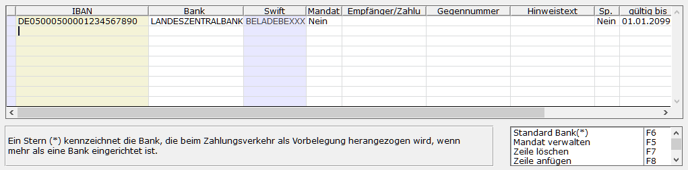
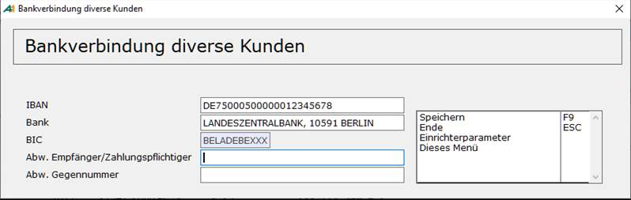

# Kundenbanken für den Zahlungsverkehr

<!-- source: https://amic.de/hilfe/kundenbankenfrdenzahlungsverke.htm -->

Hauptmenü > Stammdaten > Kunden-/Lieferanten > Kundenstamm bzw. Lieferantenstamm

Direktsprung **[KU]** bzw. **[LF]**

Kundenbanken sind die Bankverbindungen der Kunden und Lieferanten, die im Zahlungsverkehr verwendet werden. Der Stern in der ersten Spalte kennzeichnet die Bank, die beim automatischen Zahlungsverkehr herangezogen wird, falls mehrere Banken eingerichtet sind. e-Clearing verwendet diese Banken, um das Kundenkonto zu bestimmen.

Im Kunden- /Lieferantenstamm ruft man das Personenkonto mit **F5** auf und gelangt dort über die Funktion ***Bankverbindungen*** **Shift+Strg F8** in die Erfassungsmaske. Zusätzlich existiert eine Auswahlliste (Direktsprung **[KUBA]**), in der sämtliche Kundenbanken angezeigt und bearbeitet werden können.

BLZ und Bankkontonummer werden hier nicht mehr angezeigt bzw. abgefragt, da der Zahlungsverkehr in Deutschland nur noch über BIC und IBAN abgewickelt wird. Sollte es doch notwendig sein, hier eine Bankkontonummer zu erfassen, so kann man mit dem [Steuerparameter](../../../firmenstamm/steuerparameter/optionen_global/bankleitzahl_und_kontonummer_anzeigen_spa_1121.md) 1121 „Bankleitzahl und Kontonummer anzeigen“, diese Felder wieder aktivieren.

Im automatischen Zahlungsverkehr kann diese Maske an vielen Stellen direkt aufgerufen werden.

| | Beschreibung |
| --- | --- |
| IBAN  
 | Die „International Bank Account Number“ - kurz IBAN- wird im Zahlungsverkehr immer wichtiger. In dem ab dem 28.01.2008 gestarteten SEPA Verfahren wird sie an Stelle der Kontonummer verwendet. Bei der Erfassung der Kundenbanken wird die IBAN für deutsche, österreichische und belgische Banken anhand eines Prüfzifferverfahrens überprüft.  
Der Test der IBAN kann entweder für jede [Bank](./bankenstamm.md) oder global per [Steuerparameter](../../../firmenstamm/steuerparameter/optionen_finanzwesen/iban_test_nach_standard_pruefziffernverfahren_spa_897.md) abgeschaltet werden.  
In der IBAN ist die Bankleitzahl und Kontonummer enthalten. Anhand der Bankleitzahl wird der Bankenstamm durchsucht und dann die Bank und Kontonummer eingetragen. Wird keine Bank vorgeschlagen ist entweder der Bankenstamm nicht korrekt gepflegt oder die IBAN ist nicht korrekt aufgebaut.  
Die IBAN kann nachträglich über ein Funktion „Generiere IBAN“ im Pfleger für [Kundenbanken](../../../kunden_und_lieferanten/konstanten_bearbeitung/kundenbanken.md) (Direktsprung **[KUBA]**) für alle Kundenbanken mit eingetragener Bank und Kontonummer erzeugt werden.  
 |
| Bank  
 | Verweis auf die im [Bankenstamm](./bankenstamm.md) festgelegte Bank. Man kann direkt die Bezeichnung oder die BLZ eingeben. In der F3-Auswahl kann zusätzlich auch nach BIC oder der Banknummer gesucht werden. Es wird die BIC(Swift) dieser Bank angezeigt.  
 |
| Kontonummer  
 | Kann über den [Steuerparameter](../../../firmenstamm/steuerparameter/optionen_global/bankleitzahl_und_kontonummer_anzeigen_spa_1121.md) 1121 „Bankleitzahl und Kontonummer anzeigen“ aktiviert werden.  
Kontonummer des Bankkontos des Kunden/ Lieferanten. Hier wird die 10-stellige Kontonummer erwartet. Wenn noch keine IBAN angegeben wurde, wird sie versucht automatisch zu bilden ( Für Deutschland, Österreich und Belgien). Die Vorbelegung der IBAN kann per [Steuerparameter](../../../firmenstamm/steuerparameter/optionen_finanzwesen/iban_vorbelegung_nach_standardverfahren_spa_896.md) abgeschaltet werden.  
Die IBAN wird ausschließlich von der kontoführenden Bank vergeben. Daher ist die vorgeschlagene IBAN ist in jedem Fall zu überprüfen.  
 |
| Empfänger / Zahlungspflichtiger  
 | Dies ist der Empfänger/Zahlungspflichtige der beim automatischen Zahlungsverkehr verwendet wird. Ist dieses Feld leer, dann wird der im Kundenstamm hinterlegte Wert für den Zahlungsempfänger/Zahlungspflichtigen (Register Fibu-Merkmale) verwendet. Ist auch dieses Feld leer, dann wird die Kundenbezeichnung verwendet.  
Änderungen in diesem Feld werden nicht sofort in Zahlungsvorschläge bzw. in den Zahlungsbeleg übernommen. Ist es notwendig für bereits erstellte Zahlungsvorschläge den Empfänger nachträglich zu ändern, kann man dies unter „Zahlungsvorschläge bearbeiten“ (Direktsprung **[ZHVB]**), dort dann den Eintrag des Personenkontos mit **F5** bearbeiten und anschließend „Kundenbank ändern“ (**SHF9**) die Bankverbindung auswählen. Für noch nicht verarbeitete Zahlungsbelege kann man den Empfänger in der Anwendung „Zahlungen bearbeiten“ (Direktsprung **[ZHB]**) und dort F5 ändern.  
Beim Scheckdruck kann das neue Feld “EmpfBezeich“ verwendet werden. Dies enthält – analog zum DTA – entweder die Kundenbezeichnung oder die hier eingetragene Bezeichnung.  
 |
| Gegennummer | Analog zum Empfänger/Zahlungspflichtigen kann eine abweichende Gegennummer erfasst werden, die dann im DTA oder beim Scheckdruck an Stelle der Gegennummer aus dem Kundenstamm erscheint.  
    
 |
| Hinweistext  
 | Hier kann ein Informationstext hinterlegt werden, um ggf. anderen Mitarbeitern die Bedeutung der Bank zu erläutern.  
 |
| Mandat  
 | Für das Lastschriftverfahren ist ein gültiges Mandat notwendig. Dieses [Mandat](../sepa/sepa_mandat_fuer_lastschriften.md) kann pro Kundenbank und Kundenkonto hinterlegt werden.  
 |
| Sp. (Sperre)  
 | Wenn **Ja**, ist diese Bankverbindung für weitere Verarbeitungen gesperrt.  
 |
| Gültig bis  
 | Termin, zu dem die Bankverbindung gültig ist. Sie wird nach diesem Termin nicht mehr verwendet.  
 |
| Maximaler Soll- und Habenbetrag  
 | Maximale Zu- und Abbuchung auf ein Kunden-/Lieferantenkonto. Bei mehreren Konten werden die Beträge ggf. geteilt. Ist nur ein Konto vorhanden, erfolgt die Gesamtbuchung auf jedem Fall auf das eine Konto.  
 |
| Währung  
 | Währung, in der diese Bankverbindung geführt wird.  
 |

Es existiert drei Einrichterparameter für den Pfleger der Kundenbanken.

1. „Bestehende Bankverbindungen dürfen nicht mehr geändert werden.“.  
Die Voreinstellung ist „Nein“, so dass alle einmal erfassten Banken auch wieder geändert werden können. Stellt man diesen Einrichterparameter auf **Ja**, so kann man die Bank noch als **Standard-Bank** verwenden, jedoch alle anderen Felder bis auf Sperre (Sp.) nicht mehr ändern. Die Sperre kann auch nur gesetzt werden. Steht sie auf „Ja“, kann sie nur noch zurückgesetzt werden, wenn der Einrichterparameter auf „Nein“ steht.  
Die Kundenbank ist auch dann nicht änderbar, wenn bei dem Kunden ein SEPA-Mandat hinterlegt ist, welches bereits verwendet wird.  
    

2. „Im autom. Zahlungsverkehr bei diversen Kunden die Bankverbindung nicht speichern“  
Im automatischen Zahlungsverkehr lassen sich für Zahlvorschläge für einzelne Kunden die Bankverbindungen ändern. Dabei wird normalerweise der Pfleger für die Kundenbanken (s.o.) aufgerufen. Die hier erfassten Banken werden zum Kunden gespeichert. Dies will man aber bei Diversen Kunden nicht unbedingt. Setzt man hier dann den Einrichterparameter auf **Ja**, so wird die Bankverbindung nur im Zahlungsvorschlag hinterlegt und später in den Zahlungsbeleg übertragen. Der Einrichterparameter wirkt erst, wenn die Maske einmal verlassen wurde. Bei Diversen Kunden erscheint dann folgende Maske:  
  
BLZ und Kontonummer werden nur noch angezeigt bzw. abgefragt, wenn der Steuerparameter 1121 „Bankleitzahl und Kontonummer anzeigen“ auf **Ja** steht.

3. „Im autom. Zahlungsverkehr Sperre und Ablaufdatum bei manueller Auswahl ignorieren“  
Dieser Parameter gilt nur für die manuelle Auswahl der Kundenbank, z.B. wenn man die Kundenbank nach Erstellen der Zahlungsvorschläge manuell ändert.

Neben der direkten Erfassung im Kunden und Lieferantenstamm existiert eine Anwendung Kundenbanken (Direktsprung **[KUBA]**) in der alle Kundenbanken aufgelistet werden. In den Varianten „Kundenbank“ und „Mandatsverwaltung“ werden einige Plausibilitätsprüfungen gemacht:

1) Blaue Schrift auf weißem Grund: Es handelt sich um einen gelöschten Kunden.

2) Die IBAN wird in roter Schrift auf weißem Grund dargestellt: Die IBAN ist laut Prüfziffernberechnung falsch.

3) Die IBAN wird in schwarzer Schrift auf gelben Grund dargestellt: Die IBAN passt nicht zur Kontonummer. Hierbei wird die Standardberechnung verendet. Dies kann ein Fehler sein, muss aber nicht.

4) Bei bereits abgelaufenen Mandaten wird die Spalte letzte Lastschrift mit roter Schrift auf gelben Grund dargestellt. Ein Mandat läuft dann ab, wenn es 36 Monate nicht benutz wurde.

Die Variante „Abgelaufene Mandate“ listet nur die abgelaufenen Mandate bzw. die Mandate, die in soundso viel Tagen abläuft. Die Anzahl der Tage kann in der Bereichsauswahl eingegrenzt werden.
