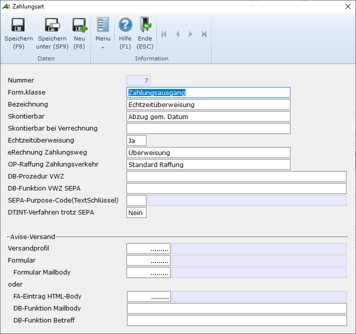

# Zahlungsart

<!-- source: https://amic.de/hilfe/zahlungsart.htm -->

Hauptmenü > Mahn-, Zahl-, Zinswesen > Stammdaten > Zahlungsarten

Direktsprung **[FIZAH]**.

Die Zahlungsart ist ein im Kunden- und Lieferantenstamm eingetragenes Kennzeichen, über das gesteuert wird, wie die Zahlung im automatischen Zahlungsverkehr bei Ein- und Ausgang erfolgen soll.

| | Beschreibung |
| --- | --- |
| Nummer | Eindeutige Nummer der Zahlungsart, wie sie später im Kunden/Lieferantenstamm hinterlegt wird. Die nächste freie Nummer wird vorgeschlagen.  |
| Formularklasse | Wahlweise „Zahlungseingang“ oder „Zahlungsausgang“. Eine Auswahl mit **F3** ist möglich. Beim Wechseln der Formularklasse wird im Feld eRechnung Zahlungsweg der sinnvollste eRechnungs-Zahlungsweg neu vorbelegt.  |
| Bezeichnung | Bezeichnung der Zahlungsart zur einfacheren Identifikation in Auswahllisten oder F3-Auswahlen. Ist der Steuerungsparameter 34 "Mehrsprachigkeit aktiv“ in A.eins gesetzt, so hat man auf diesem Feld die Möglichkeit mit F3 [sprachabhängige Bezeichnungen](../../../firmenstamm/a_eins_sprache/sprachabhaengige_bezeichnung_in_den_stammdaten.md) zu pflegen.  |
| Skontierbar | Hier kann der Skontotyp eingetragen werden. Eine Auswahl mit **F3** ist möglich   • **immer Skonto**: Skonto wir unabhängig vom Skontodatum immer gewährt/gezogen • **nie Skonto:** Selbst, wenn im Beleg Skonto vorgesehen ist und die Skontofrist noch nicht abgelaufen ist, wird kein Skonto gewährt. • **Abzug gem. Datum**: Dies ist die Vorbelegung. Skonto wird dann gewährt, wenn die Frist noch nicht abgelaufen ist.  |
| Skontierbar bei Verrechnung | Werden Rechnungen mit Gutschriften verrechnet, so kann es wünschenswert sein, bei den Gutschriften Skonto anders zu behandeln. Ist hier kein Wert eingetragen, so wird bei Gutschriften der Wert, der bei „Skontierbar“ eingetragen ist, verwendet.  |
| DTA-Typ | Zahlungsart bei Zahlung per Datenträgeraustausch. Der DTA-Typ wird nur bei der Formularklasse „Zahlungseingang“ abgefragt bzw. im Datenträgeraustausch verwendet. Bei Zahlungsausgang wird dieses Feld ausgeblendet. Der Hausbank muss beim DTA mitgeteilt werden, ob es sich bei den Lastschriften um eine **Einzugsermächtigung** oder um eine **Abbuchung** handelt.   Hinweis: *Für das SEPA-Verfahren wird der Typ beim Mandat hinterlegt.*  |
| Echtzeitüberweisung | Dieses Feld wird nur für Formularklasse „Zahlungsausgang“ abgefragt. Wir hier **Ja** eingetragen, so entfällt beim Erstellen der Zahlungsvorschläge die Vorlauf Frist von einem Tag und als Ausführungsdatum wird der verwendete Stichtag verwendet. Es werden bei der Berechnung keine Bankarbeitstage mehr berücksichtigt, da Echtzeitüberweisungen auch am Wochenende und an Feiertagen ausgeführt werden.  |
| eRechnung Zahlungsweg   | Dieses Feld ist nur sichtbar, wenn die eRechnungs-Lizenz erworben wurde.  In diesem Feld steht der Zahlungsweg, der beim eRechnungs-Export für diese Zahlungsart gewählt werden soll. Die Vorbelegung erfolgt anhand der Formularklasse. Bei Zahlungseingang wird der eRechnungs-Zahlungsweg mit Bankeinzug vorbelegt, bei Zahlungsausgang, wird er mit Überweisung vorbelegt.  |
| OP-Raffung Zahlungsverkehr | • **Standard Raffung**. Alle OPs werden wie bisher in einem Zahlungsbeleg zusammengefasst. • **Einzel – OP.** Es wird pro OP ein Zahlungsbeleg erstellt.  |
| DB-Prozedur VWZ  | Hier kann man eine private Datenbankprozedur hinterlegen, die den Verwendungszwecktext individuell zusammengestellt. Sie hat drei Parameter:   1. die csatz_id aus der Tabelle AMIC_DTAUS_CSATZ   2. die Arte des DTA-Verfahrens. Mögliche Werte sind: #define DTAVERFAHREN_UNDEF -1 #define DTAVERFAHREN_NODTA 0 #define DTAVERFAHREN_DTA 1 #define DTAVERFAHREN_DTINT 2 #define DTAVERFAHREN_DTAKASSE 8 #define DTAVERFAHREN_SEPA 16   3. die Anzahl der erlaubten Zeilen. Im DTA sind maximal 13 Zeilen a 27 Zeichen zulässig. Werden diese Grenzen überschritten, so wird der Rest ignoriert.   Die Prozedur muss ein Resultset vom Typen Character der Länge 27 zurückgeben. Trägt man in dem Feld einen Namen einer Prozedur ein, die noch nicht existiert, dann wird ein Template mit den korrekten Parametern angelegt und zum Bearbeiten geöffnet. Eine Datenbankprozedur zur Erstellung des Verwendungszwecks könnte so aussehen: <pre><code>create procedure&#10; p_dta_vwz( in in_csatz_id integer,&#10; &#10; in in_DTAVerfahren integer,&#10; &#10; in in_AnzahlZeilen integer )&#10;result&#10;(&#10; vwz&#10; char(27)&#10;)&#10;BEGIN&#10; declare dc_zahlungid&#10; integer;&#10; declare dc_count integer;&#10; &#10; select count(*),&#10; c.ZahlungId into dc_count, dc_Zahlungid&#10; &#10; from amic_dtaus_csatz c&#10; &#10; join zahlungsposition p on p.zahlungid =&#10; c.ZahlungId&#10; &#10; where csatz_id= in_csatz_id group by c.ZahlungId;&#10; &#10;&#10; if dc_count&gt;in_AnzahlZeilen then&#10;--&#10;-- Bei Überschreitung&#10; der maximalen Länge nur den Text „AUSGL. Nnn BELEGE LT.AVIS“&#10;-- ausgeben. Und&#10; WICHTIG dem Programm mitteilen, dass eine Avise gedruckt werden&#10; soll.&#10;--&#10; &#10; Update Zahlungsbeleg set&#10; ZahlungAvise =&#10; 1&#10; &#10; where ZahlungId = dc_ZahlungId;&#10; &#10; select cast ( ‘AUSGL.’&#124;&#124;&#10; dc_count &#124;&#124;’ BELEGE LT.AVIS’&#10; as char(27));&#10; else&#10;--&#10;-- Und hier dem&#10; Programm mitteilen, dass keine Avise gedruckt werden soll&#10;--&#10; &#10; Update Zahlungsbeleg set&#10; ZahlungAvise =&#10; 0&#10; &#10; where ZahlungId = dc_ZahlungId;&#10; &#10; select&#10; &#10; cast(&#10; Left( ‘RNR ‘ &#124;&#124;&#10; &#10; trim(&#10; &#10; if (&#10; fibuv_klasse=4 or fibuv_klasse=5 ) and&#10; isnull(fibuv_FremdNr,’’)!=’’&#10; &#10; then fibuv_FremdNr&#10; &#10; else fibuv_nummer&#10; &#10; endif&#10; )&#10; &#124;&#124;&#10; &#10; ‘ ‘ &#124;&#124;&#10; &#10; dateformat(fibuv_datum,’dd.mm’) &#124;&#124;&#10; repeat(‘ ‘ , 27 ) , 27 – length(trim(amic_fstr(ZahlPosBetrag&#10; ,15,2)) ) -1&#10; ) &#124;&#124;&#10; ‘ ‘ &#124;&#124;&#10; &#10; trim(amic_fstr(ZahlPosBetrag ,15,2)) as&#10; char(27)&#10; &#10; )&#10; &#10; from zahlungsposition p&#10; &#10; left outer join fibuvorgstamm s on&#10; s.Fibuv_id=p.Fibuv_id&#10; &#10; where zahlungid=dc_zahlungid;&#10; end if;&#10;END</code></pre>   **Wichtig:** Das Feld Zahlungsavise in der Tabelle Zahlungsbeleg muss auf 1 gesetzt werden, um dem Programm mitzuteilen, dass eine Avise gedruckt werden muss. Ansonsten muss das Feld auf 0 gesetzt werden.  |
| DB-Funktion VWZ SEPA  | Dieses Feld erscheint nur, wenn der Steuerungsparameter „DTA-Ausgabeformat“ auf „SEPA“ steht. Hier kann man eine private Datenbankfunktion hinterlegen, die den Verwendungszwecktext individuell zusammengestellt. Sie erhält als Parameter die csatz_id aus der Tabelle AMIC_DTAUS_CSATZ. Die Funktion muss einen Wert vom Typen Character zurückgeben. SEPA unterstützt nur Verwendungszwecktexte bis zu einer Länge von 140 Zeichen. Trägt man in dem Feld einen Namen einer Prozedur ein, die noch nicht existiert, dann wird ein Template mit den korrekten Parametern angelegt und zum Bearbeiten geöffnet. Eine Datenbankfunktion zur Erstellung des Verwendungszwecks könnte so aussehen: <pre><code>create function p_sepa_vwz( in in_csatz_id&#10; integer )&#10;returns char(255)&#10;begin&#10; declare out_character char(255);&#10; declare out_avise char(255);&#10; declare dc_zahlungid&#10; integer;&#10; &#10; select List&#10; (&#10; &#10; ‘BNr. ‘ &#124;&#124;&#10; &#10; trim(&#10; &#10; if (&#10; fibuv_klasse=4 or fibuv_klasse=5 ) and&#10; isnull(fibuv_FremdNr,’’)!=’’&#10; &#10; then fibuv_FremdNr else&#10; fibuv_nummer &#10;&#10; &#10; endif ) &#124;&#124; ‘ ‘ &#124;&#124;&#10; &#10; dateformat(fibuv_datum,’dd.mm.yy’) &#10; &#124;&#124; ‘ ‘ &#124;&#124; &#10; &#10; trim(amic_fstr(ZahlPosBetrag ,15,2))&#10; ,&#10; ‘ ‘ order by p.fibuv_id,p.fibuv_poszaehler ) ,&#10; &#10; ‘AUSGL.’&#124;&#124;count(*)&#124;&#124;’ BELEGE&#10; LT.AVIS’,&#10; &#10; c.ZahlungId&#10; into out_character,&#10; out_avise,dc_ZahlungId&#10; from amic_dtaus_csatz c &#10; join zahlungsposition p on p.zahlungid =&#10; c.ZahlungId &#10; join fibuvorgstamm s&#10; on s.Fibuv_id=p.Fibuv_id &#10; where csatz_id=in_csatz_id&#10; group by c.zahlungid;&#10;--&#10;-- Bei&#10; Überschreitung der maximalen Länge nur den Text „AUSGL. Nnn BELEGE&#10; LT.AVIS“&#10;-- ausgeben. Und&#10; !!WICHTIG!! dem Programm mitteilen, dass eine Avise gedruckt&#10;-- werden&#10; soll.&#10;--&#10; if (&#10; length(out_character)&gt;140) then&#10; &#10; set out_character = out_avise;&#10; &#10; Update Zahlungsbeleg set&#10; ZahlungAvise =&#10; 1&#10; &#10; where ZahlungId = dc_ZahlungId;&#10; else&#10; &#10; Update Zahlungsbeleg set&#10; ZahlungAvise =&#10; 0&#10; &#10; where ZahlungId = dc_ZahlungId;&#10; end if;&#10; return out_character;&#10;end</code></pre>   **Wichtig:** Das Feld Zahlungsavise in der Tabelle Zahlungsbeleg muss auf 1 gesetzt werden, um dem Programm mitzuteilen, dass eine Avise gedruckt werden muss. Ansonsten muss das Feld auf 0 gesetzt werden.  |
| SEPA-Purpose-Code(TextSchlüssel) | Hier können nur Daten eingegeben werden, die in der Tabelle [SEPAPurposeCode](./sepa_purpose_code.md) hinterlegt wurden. Eine Auswahl mit **F3** ist möglich **ACHTUNG:** Ist in diesem Feld ein Wert eingetragen, so wird beim SEPA-Verfahren dieser Wert mit übertragen.  |
| DTINT-Verfahren trotz SEPA | Dieses Feld erscheint nur, wenn der Steuerungsparameter „DTINT-Verfahren aktiv“ auf **Ja** steht. Ob Belege im [SEPA-Verfahren](../sepa/index.md) abgewickelt werden wird Anhand von diversen Einstellungen entschieden. Setzt man dieses Feld jedoch auf **Ja**, werden alle diese Einstellungen ignoriert und die Zahlungsbelege werden im DTINT-Verfahren abgewickelt.  |
| **Alle folgenden Felder erscheinen nur bei aktiver Belegversand-Lizenz** |
| Versandprofil | Versandprofil aus dem [Versandprofilstamm](../../../zusatzprogramme/mailversand_allgemein/einrichtung_mailversand/versandprofilstamm.md), welches zur Versendung dieser Belege verwendet werden soll. Wird hier nichts angegeben, so wird auch keine Avise versendet.  |
| Formular | Man kann hier ein vom Standard abweichendes Formular vom Typ Avise (Formulartyp=290) angeben um die Versandausgabe anders als die Druckausgabe zu formatieren. In der F3-Auswahl werden nur Formulare angeboten, bei denen die Archivierung aktiviert ist. Ist hier kein Formular angegeben, so wird dasselbe Formular wie beim Druck verwendet.  |
| Formular Mailbody | Avisen werden immer als Anhang an eine Mail versendet. Um die Mail selber zu gestalten, kann dafür hier ein Formular vom Typ Avise (Formulartyp=290) hinterlegt werden. Hier kann zusätzlich der Formularbereich „Avise Mail Betreffzeile“ für die Betreffzeile eingerichtet werden. Dieser Bereich wird nur beim Mailversand ausgewertet. Ein Beispielformular ist unter der Nummer -1100 zu finden. **HINWEIS:** *Um Grafiken in das Formular mit einzubinden, kann man den bekannten HTML-Syntax &lt;img src="cid:XXXXXX" alt="mein bild" /> verwenden. Für XXXXXX muss die GUID aus dem Formulararchiv, in dem die Grafik hinterlegt sein muss, angegeben werden.*  |
| Anstelle des Formulars für den Mailbody können auch Datenbankprozeduren verwendet werden. Ist in dem Feld „DB-Funktion Mailbody“ etwas eingetragen, dann werden die Prozeduren verwendet und das „Formular Mailbody“ wird ignoriert |
| FA-Eintrag Mailbody | FA-ID des Formulararchiv-Eintrags eines Mailbody-Templates, das mit Hilfe der Body-Funktion zu einem Mailbody verarbeitet werden kann. Der Eintrag hier ist optional, jedoch muss, wenn kein Template verwendet werden soll, die DB-Funktion das Dokument komplett aufbauen.  |
| DB-Funktion Mailbody | Wird hier eine Funktion hinterlegt, dann wird das „**Formular Mailbody**“ ignoriert und die Funktion liefert den Text der Mail. Sie erhält als Parameter die Zahlungsid aus der Tabelle ZAHLUNGSBELEG. Die Funktion muss einen Wert vom Typ „long varchar“ zurückgeben. Trägt man in dem Feld einen Namen einer Prozedur ein, die noch nicht existiert, dann wird ein Template mit den korrekten Parametern angelegt und zum Bearbeiten geöffnet.   <pre><code>--&#10;-- Funktion zum&#10; Erzeugen des Verwendungszwecks für SEPA.&#10;--&#10;CREATE FUNCTION&#10; p_fibu_Belegversand_Avise1 (in in_ZahlungId integer)&#10; returns long&#10; varchar&#10; BEGIN&#10; declare&#10; dc_return long varchar;&#10; declare&#10; dc_statustext long varchar;&#10; declare&#10; dc_fa_id integer;&#10;&#10; -- hier&#10; dc_return mit Inhalt füllen. Auslesen des Mailbodys aus dem&#10; Formulararchiv&#10; set&#10; dc_fa_id = (select VersandBodyFaId from zahlungsbeleg b join zahlungsart a&#10; on a.zahlartid=b.zahlartid where zahlungid = in_zahlungid);&#10; if&#10; (dc_fa_id !=0) then&#10; set dc_return = (select&#10; cast(AMICBLOB as long varchar) from&#10; amic_fa_get_from_key(dc_fa_id));&#10; &#10; endif;&#10;&#10; -- hier ggf.&#10; Platzhalter ersetzen&#10; return&#10; dc_return;&#10;&#10;exception when others&#10; then&#10; set&#10; dc_StatusText = errormsg()&#124;&#124;' '&#124;&#124;traceback();&#10; call&#10; fehlerprotokoll ( in_text = '&#10; p_fibu_Belegversand_Avise1'&#124;&#124;dc_StatusText);&#10;-- WICHTIG: Dem System&#10; mitteilen, dass etwas schiefgegangen ist;&#10; &#10; resignal;&#10;END</code></pre>   Die Mailbody Funktion sollte in jedem Fall eventuell auftretende Fehler abfangen und ins Fehlerprotokoll schreiben und anschließend **resignal** ausführen, weil ansonsten das verarbeitende Programm nicht mitbekommt, ob ein Fehler aufgetreten ist.  |
| DB-Funktion Betreff | Diese Funktion wird nur ausgeführt, wenn auch die Funktion für den Mailbody angegeben wurde. Es existiert eine einfache Funktion AMIC_BELEGVERSAND_BETREFF_AVISE, die Verwendet werden kann. Gibt man einen Namen einer nichtexistierenden Funktion an, um eine neue Funktion zu erstellen, dann wird die Funktion AMIC_BELEGVERSAND_BETREFF_AVISE als Vorlage verwendet und man kann seine Erweiterungen einbauen.   <pre><code>create function&#10; "admin"."AMIC_Belegversand_Betreff_AVISE"(in in_ZahlungId&#10; integer)&#10; &#10;returns long&#10; varchar&#10; &#10;BEGIN&#10; DECLARE&#10; dc_StatusText long varchar;&#10; DECLARE dc_res&#10; long varchar;&#10; &#10; set dc_res =&#10; (select 'Avise' &#124;&#124; in_ZahlungId &#124;&#124; ' für Zahlung vom ' &#124;&#124; zahlungdatum&#10; from Zahlungsbeleg where Zahlungid = in_ZahlungId);&#10; return&#10; dc_res;&#10; &#10;exception when others&#10; then&#10; set&#10; dc_StatusText = errormsg()&#124;&#124;' '&#124;&#124;traceback();&#10; call&#10; fehlerprotokoll ( in_text =&#10; 'AMIC_BELEGVERSAND_BETREFF_AVISE'&#124;&#124;dc_StatusText);&#10; return&#10; dc_res;&#10; &#10;END</code></pre>   Tritt hier ein Fehler auf und ist das Ergebnis leer, wird der Festtext Avise als Betreff eingetragen. |

**Organisatorisch sollen die Zahlungsarten für eRechnung so angelegt werden, dass diese nicht mit FIBU-Zahlungsarten verwechselt werden können.**
