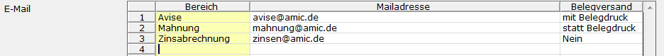

# Avis als Mail versenden

<!-- source: https://amic.de/hilfe/avisalsmailversenden.htm -->

Eine Avise sollte immer dann versendet werden, wenn der Platz im Verwendungszweck nicht ausreicht, um die notwendigen Informationen dort unterzubringen. Die von AMIC vorgegebene Aufbereitung des Verwendungszecks kann durch eine eigene Datenbankfunktion in den [Zahlungsarten](../stammdaten_zahlungsverkehr/zahlungsart.md) überschrieben werden.  
    

Um die Avise direkt per Mail zu versenden müssen folgen Voraussetzungen gegeben sein:

1) Der Belegversand Lizenz muss aktiv sein.

2) Ein [Versandprofil](../../../zusatzprogramme/mailversand_allgemein/einrichtung_mailversand/versandprofilstamm.md) muss eingerichtet sein.

3) In den Stammdaten für [Zahlungsarten](../stammdaten_zahlungsverkehr/zahlungsart.md) müssen zusätzliche Felder gepflegt werden.

• Ein abweichendes Formular für den Mailversand. Dieses Formular kann z.B. zusätzliche Grafiken enthalten, die bei der Druckversion nicht enthalten sind. In der F3-Auswahl werden nur Formulare angeboten, bei denen die Archivierung aktiviert ist. Wird hier kein Formular hinterlegt, dann wird das beim Druck angegebene verwendet.

• Zur Steuerung des Mailbodys für die eigentliche Mail kann entweder ein HTML-Formular oder eine [Datenbankfunktion](../stammdaten_zahlungsverkehr/zahlungsart.md#ZahlArtMailVersand), die den HTML-Aufbau übernimmt, verwendet werden. In dem Formular müssen HTML-Tags für die Formatierung verwendet werden. Hier existiert ein Formular mit der Nummer -1100, das so wie es ist verwendet werden kann oder als Vorlage benutzt werden kann. In diesem Formular stehen alle Felder und Bereiche der Standard Avis zur Verfügung. Zusätzlich existiert ein Bereich „AVIS Betreffzeile“, in dem man die Betreff-Zeile der Mail einrichten kann. Ist kein Formular und keine Datenbankfunktion hinterlegt, so erscheint als Betreff und als Mailinhalt lediglich der Text „Avis“.  
    
**HINWEIS:** *Um Grafiken in das Formular mit einzubinden, kann man den bekannten HTML-Syntax &lt;img src="cid:XXXXXX" alt="mein bild" /> verwenden. Für XXXXXX muss die GUID aus dem Formulararchiv, in dem die Grafik hinterlegt sein muss, angegeben werden.  
    
*

• Ist das Versandprofil nicht eingerichtet, wird für alle Personenkonten mit dieser Zahlungsart kein Mailversand durchgeführt.  
    

4) In den Hauptanschriften oder den Ansprechpartnern muss eine Mailadresse für die Avis eingerichtet sein. Dazu wählt man in der Auswalliste Anschriften, die man z.B. über den Direktsprung **[ANSCH]** erreicht, in der Variante „Ansprechpartner“ die Anschrift des Kunden, der man die Mail zuordnen will, zum bearbeite aus(**F5**). Dies kann die Hauptadresse sein oder die eines Ansprechpartners. Die Adressdaten, die im HTML-Formular verwendet werden, beziehen sich immer auf die Adresse, an die auch die Mail geht, während in der Avis selber nach wie vor die Hauptadresse verwendet wird.

Zu diesen Mailadressen muss man dann noch angeben ob sie „mit Belegdruck“ oder „statt Belegdruck“ versendet werden sollen. Gibt man „nein“ an, wird die eingetragene Mail nicht verwendet.

5) An wen die Mails für einen Kunden gehen, kann auch immer in den Fibu-Merkmalen eingesehen werden.

6) Es existiert ein Steuerparameter „Mailversand bestätigen“ in der Gruppe „Optionen Finanzwesen“, der steuert, ob erst eine Liste mit den zu versendenden Avisen geöffnet wird um dort noch einmal zu kontrollieren oder ggf. eine Kurzliste zu drucken. Dieser steht standartmäßig auf **Nein**. Hat man diesen Steuerparameter auf **Ja** gestellt, so kann man mit der Funktion „***Daten übernehmen***“ den Mailversand für die markierten Nachrichten sofort starten. Nachrichten, die nicht markiert wurden, werden nicht versendet, bleiben aber weiterhin erhalten. In der Anwendung „Mailversand Finanzbuchhaltung“ (Direktsprung **[FMV]**) sind diese als „offene Versandaufträge“ zu finden. Sie können hier dann angesehen oder nachträglich versendet werden.

Ist die Belegversandlizenz aktiv erscheint bei der Druckerabfrage neben dem „Druck“-Button ein weiterer Button mit der Aufschrift „Versand/Druck“. Der Druck-Button druckt lediglich die Avise, der Versenden-Button arbeitet so, wie es in den Daten eingerichtet wurde (s.o.). Am Ende erscheint entweder ein Bildschirm, in dem aufgelistet wird, welcher Kunde eine Mail erhalten hat oder eine Meldung „Keine Mail versendet.“.
