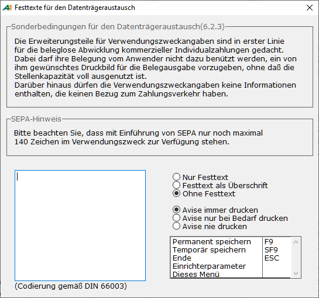

# DTA-Textänderung

<!-- source: https://amic.de/hilfe/dtatextnderung.htm -->

Hauptmenü > Mahn-,Zahl-, Zinswesen > Zahlungsverkehr > Zahlungen bearbeiten > DTA F9 > Text/Avise erfassen

Direktsprung **[ZHB]**

Die von AMIC vorgegebene Art und Weise der Verarbeitung des Verwendungszwecks kann bei aktivem Steuerungsparameter „**DTA-Textänderung aktiv**“ geringfügig beeinflusst werden. Es steht dann die Funktion „Text/Avise erfassen“ im DTA zur Verfügung. Dort kann man einen Festtext hinterlegen, der entweder an Stelle des Verwendungszwecks genommen werden kann oder als Überschrift vor dem erzeugten Text erscheinen kann. Hier kann auch beeinflusst werden, wie die Avise gedruckt werden soll: „Nie“, „immer“ oder „bei Bedarf“. Standarteinstellung ist „bei Bedarf“.

