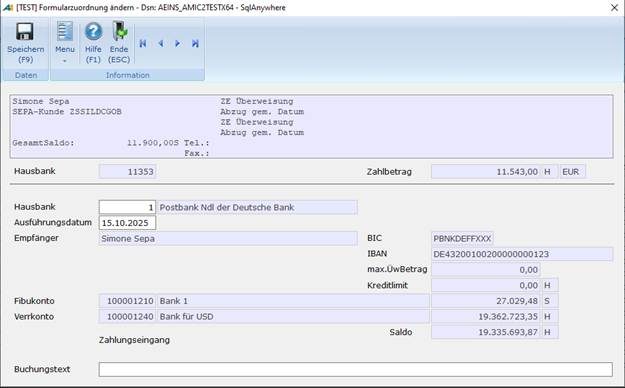
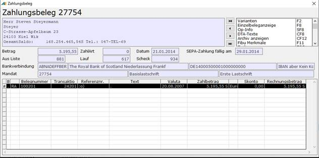

# Zahlungen bearbeiten

<!-- source: https://amic.de/hilfe/zahlungenbearbeiten.htm -->

Hauptmenü > Mahn-,Zahl-, Zinswesen > Zahlungsverkehr > Zahlungen bearbeiten

Direktsprung **[ZHB]**

Hier erfolgt die endgültige Verarbeitung der Zahlungsbelege. Es stehen hierfür diverse Funktionen zur Verfügung.

**Zahlungsliste (Druck)**

Ein Report kann als Protokoll gedruckt werden:

**Formularänderung** **(F5)**

**Hier kann für die einzelnen Zahlungsbelege die Hausbank, (bei nicht verarbeiteten Zahlungsbelegen) der Empfänger oder das Formular, mit dem der Scheck gedruckt wird, geändert werden. Handelt es sich um SEPA-Zahlungen, so kann auch das Ausführungsdatum hier geändert werden.**

**Hinweis:** ***Bei SEPA-Zahlungen gelten je nach Lastschriftverfahren (Erstlastschrift, Folgelastschrift, Basislastschrift, Firmenlastschrift) unterschiedliche Fristen. Diese können im Modul „Zahlungsvorschläge erstellen“ (Direktsprung*** ***[ZHVE]******) eingestellt werden. Wird hier ein Wert eingetragen, der diese Frist unterschreitet, so wird automatisch das korrekte Datum (Erstelldatum + Frist) beim DTA ermittelt und verwendet.***

**In die Zeile Buchungstext kann der Text eingetragen werden, der bei der** [Übernahme in die Primanota](./zahlungsverkehr_uebernahme_in_die_primanota.md) **verwendet werden soll.**

**Anzeige der Zahlungen (F6)**

Die Zahlungen werden mit den wichtigsten Informationen angezeigt:

Mit &lt; > kann zwischen den Konten geblättert werden.

**Drucken** (Strg F9)

Über diese Funktion könne Schecks oder Lastschriftformulare ausgedruckt werden.

Avise drucken

Eine Avise kann jederzeit für Zahlungsbelege nachträglich bzw. einzeln gedruckt werden.

Zahlungen löschen

Zahlungen können gelöscht werden. Löscht man sie, bevor sie gedruckt, gebucht oder per DTA weiterverarbeitet wurden, werden die OP's wieder freigeben und die Zahlung gelöscht. Sind sie jedoch schon weiterverarbeitet, so bleibt der offene Posten als gezahlt markiert. Dies ist auch richtig so, da ja der Scheck gedruckt bzw. das DTA durchgeführt wurde und sie somit nicht ein zweites Mal zur Zahlung herangezogen werden sollen. Diese "gesperrten" OPs kann man sich über die Variante **Gesperrte OP's** ansehen und dort gegebenenfalls wieder freigeben. Wenn man diese verarbeiteten Zahlungen so löschen möchte, dass sie sofort wieder zur nächsten Zahlung mit herangezogen werden können geschieht dies durch:

Zahlungen zurücksetzen

Hier werden Zahlungen gelöscht und die offenen Posten wieder freigegeben, selbst wenn die Zahlung bereits gedruckt bzw. per DTA weiterverarbeitet wurde. Bei bereits gebuchten Zahlungen wird nur die Zahlung gelöscht. Die durch die Übernahme in die Primanota erstellten Zahlungsbelege werden nicht gelöscht. Dies ist nur in der Belegerfassung möglich und dies auch nur so lange, wie der Zahlungsbeleg nicht gebucht ist.

Übernahme in die Primanota

bei der [Übernahme in die Primanota](./zahlungsverkehr_uebernahme_in_die_primanota.md) werden aus Zahlungsbelegen Buchungssätze erstellt. Ist der [Steuerparameter 716](../../../firmenstamm/steuerparameter/optionen_finanzwesen/vieraugenprinzip_zahlungen_spa_716.md) „Vieraugenprinzip beim DTA-Verfahren“ gesetzt, steht diese Funktion nur in der Variante „[Zahlungen nach DTA-Laufnr. Vieraugen](./vieraugenprinzip_beim_dta_verfahren.md)“ zur Verfügung.

Druckkennzeichen zurücksetzen

Bereits gedruckte bzw. per DTA übertragene Zahlungen können nicht ein zweites Mal übertragen werden. Ist man gezwungen dies trotzdem zu tun, kann man die Zahlungen durch zurücksetzen des Druckkennzeichens wieder freigeben, so dass ein erneutes Drucken bzw. Übertragen der Zahlung möglich wird. Dazu wählt man die Funktion Duckkennzeichen zurücksetzen F10.  
    

Rücklastschriften

Es kann dazu kommen, dass Lastschriften von der Bank nicht eingelöst werden. Die ursprüngliche Lastschrift muss also mit der Rücklastschrift der Bank verrechnet und die Rechnungen müssen wieder zu OP‘s werden. Es existieren zwei Verfahren, wie man Rücklastschriften behandeln kann:  
    

1 ) In der Einzelbeleganzeige:

In der Einzelbeleganzeige steht für Zahlungsbelege, die aus dem automatischen Zahlungsverkehr in die Primanota übernommen wurden, eine Funktion „Rücklastschrift“ zur Verfügung. Voraussetzung ist dafür, dass der Einrichterparameter „*Beim Löschen der Auszifferung Rücklastschriftbehandlung aktivieren?* “ auf Ja oder Automatisch steht (s.u.). Wählt man hier eine Zeile aus, die nicht beglichen wurde, und führt die Funktion aus, wird man gefragt, ob für diese Position eine Rücklastschrift erstellt werden soll. Es wird anschließend für diese Zeile die Auszifferung zurückgesetzt, nur für diese Zeile ein Stornobeleg erstellt und die Rechnungen werden als Rücklastschrift gekennzeichnet.

2 ) Durch zurücksetzen der Auszifferung:

Dazu muss die Auszifferung zurückgesetzt werden, so dass alle beteiligten Belege wieder als offene Posten existieren. Wie nun die Offenen Posten im automatischen Zahlungsverkehr behandelt werden, lässt sich durch den Einrichterparameter „*Beim Löschen der Auszifferung Rücklastschriftbehandlung aktivieren?* “in der OP-Verwaltung einstellen.

• Nein: Die beteiligten Rechnungen sind jetzt zwar wieder OP’s, werden aber nicht sofort wieder im automatischen Zahlungsverkehr mit herangezogen. Um diese Rechnungen erneut im automatischen Zahlungsverkehr zu verarbeiten, kann man in der Anwendung „Zahlungen bearbeiten“ (Direktsprung [ZHB]) Variante „Rücklastschriften“ diese Belege wieder mit der Funktion Rücklastschrift F10 so kennzeichnen, dass sie im automatischen Zahlungsverkehr erscheinen. Man kann diese Rechnungen aber auch jederzeit manuell den Zahlungsvorschlägen hinzufügen.

• Ja: Dies ist die Standardeinstellung. Entstand diese Auszifferung durch die Übernahme einer bereits an die Bank gegangenen Zahlungsanweisung in die Primanota, so wird abgefragt, ob diese als Rücklastschrift gekennzeichnet werden soll.

• Automatisch: Es erfolgt keine Abfrage und der Zahlungsbeleg wird sofort als Rücklastschrift gekennzeichnet.

Für beide Verfahren gilt: Die Rechnungen werden nur dann als Rücklastschrift gekennzeichnet, wenn sie bereits per DTA oder Scheckdruck als verarbeitet gekennzeichnet wurden. Zahlungsbelege, die zwar in die Primanota übernommen wurden, jedoch nicht an die Bank gegangen sind werden als gesperrte Rücklastschrift gekennzeichnet und müssen in der Anwendung „Zahlungen bearbeiten“ (Direktsprung [ZHB]) Variante „Rücklastschriften“ manuell mit der Funktion Rücklastschrift F10 als Rücklastschrift gekennzeichnet werden. Dies entspricht dem Verfahren, als würde der Einrichterparameter auf Nein stehen.

Siehe auch:

- [Scheckdruck](./scheckdruck.md)
- [Zahlungsverkehr: Übernahme in die Primanota](./zahlungsverkehr_uebernahme_in_die_primanota.md)
- [DTA](./dta.md)
- [DTA-Textänderung](./dta_textaenderung.md)
- [Avis als Mail versenden](./avis_als_mail_versenden.md)
- [Vieraugenprinzip beim DTA Verfahren](./vieraugenprinzip_beim_dta_verfahren.md)
- [DTA-Archiv](./dta_archiv.md)
