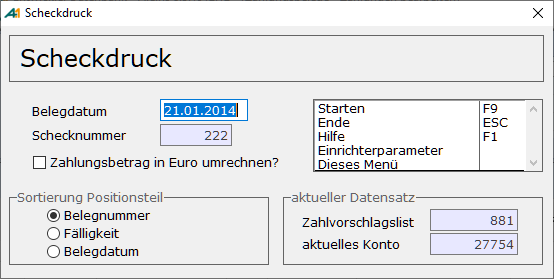
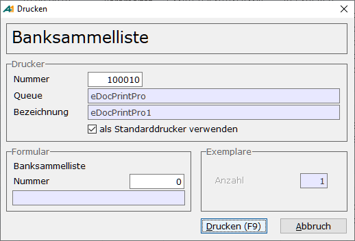
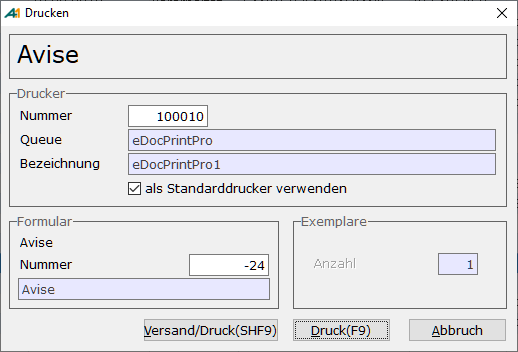

# Scheckdruck

<!-- source: https://amic.de/hilfe/scheckdruck.htm -->

Hauptmenü > Mahn-,Zahl-, Zinswesen > Zahlungsverkehr > Zahlungen bearbeiten > Drucken

Direktsprung **[ZHB]**

Der Scheckdruck wird über mehrere Einrichterparameter und Steuerparameter sowie über die eingerichteten Stammdaten gesteuert. Neben den dieser Maske zugeordneten Einrichterparametern existiert in der Anwendung DTA ein Einrichterparameter „Ersteller der Zahlung darf DTA/Scheckdruck ausführen?“. Dieser gilt auch für den Scheckdruck. Es ist im Standardfall hier ein **Ja** eingetragen, so dass keine Einschränkungen vorgenommen werden. Wenn man hier ein **Nein** einträgt, kann niemals ein und dieselbe Person die Zahlung erstellen und den Druck ausführen. Dieser Einrichterparameter ist für das [Vieraugenprinzip](./vieraugenprinzip_beim_dta_verfahren.md) von Bedeutung.

Vor dem Ausdruck erscheint diese Dialogmaske, in der die nötigen Angaben abgefragt werden. Das Belegdatum kann als **Datum** auf das Scheckformular gedruckt werden. Ist ein Feld "Schecknummer" auf dem Formular vorgesehen, kann die nächste Schecknummer hier eingegeben werden. Vorgeschlagen wird die höchste bereits erstellte Schecknummer. Ist im Hausbankenstamm eine Nummernkreisnummer für Scheckdruck hinterlegt, wird die Schecknummer aus dem Nummernkreis gezogen. Dann ist ein Ändern der Schecknummer auch nur über ändern des Zählerstandes der Zählkreise (Direktsprung **[NKZ]**) möglich.

    
Auf dem Formular kann ein Positionsteil (503) eingerichtet werden. Die Sortierung der Zeilen kann unter „Sortierung Positionsteil“ individuell eingestellt werden.

Im Inlandszahlungsverkehr sind nur Zahlungen in Euro zugelassen. Hat man jedoch Belege, die noch in DM sind und will diese begleichen, so können diese umgerechnet werden. Dazu muss bei „Zahlungsbetrag in Euro umrechnen?“ der Haken gesetzt werden. Es wird nur der zu zahlende Betrag umgerechnet. Die Beträge der einzelnen zu begleichenden Rechnungen, die im Positionsteil erscheinen können, werden nicht umgerechnet.

Vor dem Druck werden noch einige Tests durchgeführt:

• Hat man die Option „Zahlungsbetrag in Euro umrechnen“ ausgewählt, muss der Euro im Währungsstamm eingerichtet sein. Der Druckauftrag wird sonst nicht ausgeführt.

• Wenn der Steuerparameter „automatischer Zahlungsverkehr ohne Formularzuordnung“ auf **Nein** steht, muss ein [Zahlungsformular](../stammdaten_zahlungsverkehr/zahlungsformulare.md) für die Hausbank hinterlegt sein und in den Stammdaten existieren.

• Wenn die Auswahl bei nicht gesetztem Steuerparameter „automatischer Zahlungsverkehr ohne Formularzuordnung“ unterschiedliche Formularzuordnungen enthält, erscheint eine Frage, ob trotzdem gedruckt werden soll und man kann den Druckauftrag noch abbrechen.

• Bereits gedruckte Zahlungen können nicht noch einmal gedruckt werden. Es erscheint ein entsprechender Hinweis und der Druckauftrag wird abgebrochen. Will man den Druck wiederholen muss zuerst das [Druckkennzeichen zurückgesetzt](./index.md#DruckkenzeichenZurueck) werden.

• Wenn die Auswahl sowohl Zahlungseingänge als auch Zahlungsausgänge enthält wird man darauf hingewiesen und man kann den Druckauftrag noch abbrechen.

• Wenn die Auswahl unterschiedliche Hausbanken umfasst, wird darauf hingewiesen und der Druckauftrag kann noch abgebrochen werden.

Anschließend erscheint das Druckerauswahlfenster, in dem sowohl der Drucker also auch das Formular noch abgeändert werden können. Der Aufbau des Formulars muss zuvor in den Stammdaten (Direktsprung **[FRM])** festgelegt werden. Für den Bereich Scheckdruck ist der [Formulartyp 201](../schecks_ueber_formulartyp_201_drucken.md) vorgesehen. Steht der Steuerparameter „automatischer Zahlungsverkehr ohne Formularzuordnung“ auf **Ja**, so ist hier die einzige Stelle, an der das Formular für den Druck festgelegt werden kann. Es wird dann das Formular vorgeschlagen, dass bei der Hausbank für die Zahlungsform (Zahlungseingang/Zahlungsausgang) hinterlegt wurde. Nach dem Start wird noch geprüft, ob das Formular eventuell eine Schecknummer enthält und ob diese im Feld **Schecknummer** korrekt eingegeben wurde. Der Druckauftrag lässt sich dann noch abbrechen.

    
Nach dem Belegdruck kann die Banksammelliste erstellt werden. Vor dem Druck der Banksammelliste erhält man erneut die Möglichkeit den Drucker zu wechseln bzw. das Formular für die Banksammelliste auszuwählen. Der Druck der Banksammelliste kann per Einrichterparameter „Banksammelliste beim Scheckdruck anbieten?“ unterdrückt werden.

Wenn das Formular keinen Regulierungsteil (Positionsteil) enthält, jedoch der Alternativbereich 504 im Formular eingerichtet ist, kann anschließend die Avise gedruckt werden. Auch vor dem Druck der Avise erhält man die Möglichkeit den Drucker zu wechseln bzw. das Formular für die Avise auszuwählen.

Nach erfolgtem Druck wird der Zahlungsbeleg als gedruckt gekennzeichnet.
