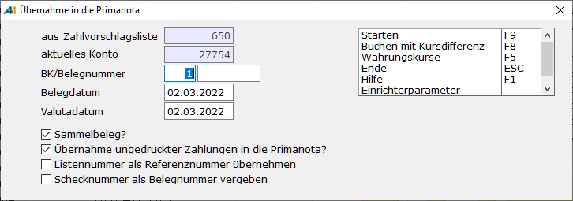

# Zahlungsverkehr: Übernahme in die Primanota

<!-- source: https://amic.de/hilfe/zahlungsverkehrbernahmeindiepr.htm -->

Hauptmenü > Mahn-,Zahl-, Zinswesen > Zahlungsverkehr > Zahlungen bearbeiten > Übernahme in die Primanota

Direktsprung **[ZHB]**



Die Buchungssätze für Zahlungsbelege werden erstellt. Dabei werden die angesprochenen offenen Posten mit dem neu erstellten Beleg ausgeziffert. Die Funktion „***Buchen mit Kursdifferenz***“ **F8** erzeugt genau wie der Menüpunkt „***Starten***“ **F9** die Buchungssätze, nur werden hier die Kursdifferenzen für Belege in Fremdwährung errechnet und ausgewiesen.  
Vor dem Erstellen der Belege müssen noch ein paar Angaben gemacht werden:  
    
Wenn nicht in der Systemeinstellung (Direktsprung **[NKF]**) vorgesehen und vorgeschlagen, kann hier ein **Belegnummernkreis** angegeben werden, über den die Verwaltung der Belege erfolgen soll. Hat man den Einrichterparametern „Nummernkreis der Hausbank verwenden“ aktiviert, werden diese Felder ausgeblendet und der in der Hausbank unter „**Nummernkreis autom. Zahlungsverkehr**“ eingetragene Nummernkreis wird verwendet. Ist die Option „Schecknummer als Belegnummer vergeben“ gesetzt und eine Schecknummer vergeben, dann wird nach wie vor die Schecknummer verwendet.

Das **Belegdatum** und das **Valutadatum** für den Zahlungsbeleg werden hier als erstes abgefragt. Sie werden mit dem Datum der zuerst in der Auswahl markierten Zahlung vorbelegt. Mit dem Einrichterparameter „Vorbelegung des Belegdatums mit dem Tagesdatum?“ kann das Verhalten so geändert werden, dass diese Felder mit dem Tagesdatum vorbelegt werden wird. Anschließend kann man noch einige Einstellungen vornehmen.

**Sammelbuchung:**  
Es wird pro Zahlung ein Zahlungsbeleg erstellt oder, wenn der Haken gesetzt ist, pro im Hausbankenstamm hinterlegtem Konto ein Zahlungsbeleg.

**Buchen ungedruckter Zahlungen:**  
Normalerweise sollten Zahlungen erst dann in die Primanota übernommen werden, wenn sie auch verarbeitet worden sind. Ist es aus betrieblichen Gründen nun nötig, unverarbeitete Zahlungen bereits in die Primanota zu übernehmen, so lässt sich dies hier einstellen.

**Listennummer als Referenznummer übernehmen:**

Um einen Überblick zu haben, aus welcher Liste dieser Zahlungsbeleg kommt, kann man hier festlegen, dass die Listennummer als Referenznummer herangezogen wird. Ist der Haken nicht gesetzt, so wird die Schecknummer als Referenznummer vergeben.

**Schecknummer als Belegnummer vergeben:**

Hat man im Hausbankenstamm einen Nummernkreis für Schecks hinterlegt, erscheint zusätzlich diese Abfrage. Wird hier der Haken gesetzt, so wird der eingegebene Nummernkreis ignoriert, der im Hausbankenstamm hinterlegte verwendet und die Schecknummer als Belegnummer vergeben. <strong>ACHTUNG:</strong><em> dieses Verfahren funktioniert nur, wenn man erst die Schecks druckt und anschließend bucht. Man sollte also hier den Haken bei „Buchen ungedruckter Zahlungen“ nicht setzen.</em>

Der **Buchungstext** des so erzeugten Beleges wird je nach Einstellung bzw. Datenmaterial gebildet. Dabei gelten folgende Prioritäten:

1. Bei Akontozahlungen, die über das Modul „Zahlungen erfassen“ erstellt wurden, wird immer der dort eingetragene Text verwendet. Hier kann nur der Text für die Sammelposition über die Datenbankfunktion gesetzt werden.

2. Ist in den Einrichterparameter eine „Datenbankfunktion zur Bestimmung des Belegtextes“ eingetragen, so wird der hier generierte Text verwendet. Die Datenbankfunktion hat als Übergabeparameter die Zahlungsid und eine Kennzeichen das besagt, ob es die erste Position des Zahlungsbeleges ist (Kennzeichen = 1) – also die Position mit dem Kassen/Bankkonto - oder ob es eine Folgeposition (Kennzeichen = 0) ist – also eine Position mit Debitoren/Kreditoren. Die Funktion muss einen Text Typ Character zurückliefern. Ist dieser Text leer oder ist die Datenbankfunktion nicht eingerichtet, ziehen die weiter unten folgenden Bedingungen.

Beispiel:

```sql
create function p_Buchungstext( in in_ZahlungId integer, in in_SammelPosition integer)
returns char(100)
BEGIN
  declare out_character     char(100);
  if in_SammelPosition = 1 then
    set out_character     = 'Automatische Zahlung vom '||TODAY(*);
  else
    set out_character     = 'Automatische Zahlung aus Zahlungslauf '|| (select ZahlLaufId from Zahlungsbeleg where ZahlungId=in_ZahlungId);
  endif;
  return out_character;
END
```

3. Wurde in den Zahlungsbeleg ein [Text manuell](./index.md#Formularaenderung) eingetragen, so wird dieser verwendet.

4. Wenn keine Texte manuell eingetragen wurden, so werden die Texte die über die Funktion „***Text/Avise erfassen***“ eingetragen wurden, verwendet.

5. Ansonsten der Text „autom.Zahlung“ gefolgt von der Schecknummer vergeben.

Die Belege, die dann erstellt werden, sind in der Primanota nachträglich änderbar. Es kann jedoch mit dem Einrichterparameter „Beleg darf nicht geändert werden?“ eine Bearbeitungssperre für diese automatisch erstellten Belege gesetzt werden. Diese Sperre kann später in der [Einzelbeleganzeige](../../op_verwaltung/einzelbeleganzeige.md) wieder gelöscht werden.

Hat man alle Angaben vorgenommen, so kann man den Vorgang mit F9 starten. Es erscheint dann eine Sicherheitsabfrage, die noch zu bestätigen ist. Vor dem eigentlichen Erstellen der Belege werden noch einige Prüfungen vom Programm vorgenommen, damit es nicht zu unnötigen bzw. fehlerhaften Buchungen kommt. Die einzelnen Meldungen werden am Ende des Buchungslaufes in einem Fenster ausgegeben und können von dort aus auch gedruckt werden. Es können folgende Meldungen erscheinen:  
    

- Zahlungsbeleg für Konto ____ (Betrag ____) ist inkonsistent!  
Die Summe des einzelnen zu verrechnenden Beleges entspricht nicht der im Zahlungsbeleg eingetragenen Summe. Da dieser Fehler nicht korrigierbar ist, muss der Zahlungsbeleg gelöscht werden und die Zahlung entweder manuell erfasst oder ein neuer Zahlungsbeleg erstellt werden, der dann gebucht werden kann.  
    

- Steuersatz nicht eingerichtet! Kto ____ / Beleg ______/ Kl. ______ / Grp. _____ / Schl. ____ / Datum: _____  
Für die zu erstellenden Skontobelege konnte kein entsprechender Steuersatz gefunden werden. Ursache kann zum Beispiel sein, dass bereits im Ursprungsbeleg der Steuersatz nicht korrekt ist, oder dass zum Datum kein Steuersatz eingetragen ist. Es muss ein ordnungsgemäßer Steuersatz hinterlegt werden, bevor der Zahlungsbeleg verbucht werden kann.  
    

- Steuerkonto 0 nicht zugelassen! Kto _____ / Beleg ____ / Kl. ____ / Grp. ____ / Schl. ____/ Datum : ____  
In dem Steuerersatz, der für die Skontobuchung verwendet werden soll, ist kein gültiges Steuerkonto eingetragen. Nach Änderung des Steuersatzes kann dieser Zahlungsbeleg verbucht werden.  
    

- Skontokonto 0 nicht zugelassen! Kto _____ / Beleg ____ / Kl. ____ / Grp. ____ / Schl. ____/ Datum : ____  
In dem Steuerersatz, der für die Skontobuchung verwendet werden soll, ist kein gültiges Skontokonto eingetragen. Nach Änderung des Steuersatzes kann dieser Zahlungsbeleg verbucht werden.  
    

- Fehler beim Zugriff auf Hausbank ____ (Hausbankstamm)  
Die im Zahlungsbeleg hinterlegte Hausbank konnte nicht gefunden werden. Nach Überprüfung des Hausbankenstammes kann erneut versucht werden, diesen Zahlungsbeleg in die Primanota zu übernehmen.  
    

- Für die Hausbank ____ fehlt das Verrechnungskonto!  
Das Verrechnungskonto, das bei der Übernahme des Zahlungsbeleges in die Primanota verwendet wird, ist nicht eingetragen. Dies muss im Hausbankenstamm für die verwendete Hausbank eingetragen werden.  
    

- Fehler beim Erstellen einer Teilzahlung für Konto ____ ( ____/ ____ )  
Da es auch möglich ist, nur Teile eines OP’s zu bezahlen (siehe dazu „[Zahlungen erstellen](../zahlungen_erstellen.md)“), müssen in diesen Fällen Teilzahlungsbelege erstellt werden. Sollte es hierbei zu Problemen kommen (z.B. Locking durch einen anderen Benutzer), so wird der Zahlungsbeleg nicht erstellt.  
 

- Fehler beim Zugriff auf Konto ____ ( ____/ _____)  
Beim Versuch, die OP’s mit dem erstellten Beleg auszuziffern, ist es zu einem Fehler gekommen (z.B. Locking durch einen anderen Benutzer). Es wird in der Fehlermeldung das Auszifferungskennzeichen und das dazugehörige Datum mit ausgegeben. Dies muss gegebenenfalls wieder zurückgesetzt werden und die OP’s müssen manuell in der OP-Verwaltung ausgeziffert werden. Sollte dieser Fehler auftreten, kann man mit dem Hilfsprogramm „Fibu Reorganisieren“ und dort „Test Bewegungsdaten“ überprüfen, inwieweit die Daten inkonsistent sind.  
    

- Fehler beim Erstellen des Skontobeleges für Konto ____  
Der Skontobeleg konnte nicht erstellt werden. Dabei wird auch der Zahlungsbeleg nicht erstellt.  
    

- Konto ____ war bereits verbucht.  
Die Auswahl umfasst bereits gebuchte Zahlungsbelege. Man wird mit dieser Meldung lediglich darauf hingewiesen, dass dieser Arbeitsschritt bereits erfolgt ist.  
    

- Abbruch bei Konto ____ wegen Fehler ____  
Beim Erstellen des Zahlungsbeleg ist ein Fehler aufgetreten. Der gesamte Buchungslauf wird nach diesem Fehler abgebrochen. Hinter Fehler steht eine Nummer, mit der Sie sich bitte an ihren zuständigen Betreuer wenden.  
    

- Konto ____ nicht gebucht, weil Zahlsperre gesetzt ist!  
Für das Konto ist im Kundenstamm eine Zahlsperre hinterlegt worden. Der Zahlungsbeleg wird daher weder als Scheck noch als DTA-Auftrag weiterverarbeitet und somit auch nicht gebucht.  
    

- Konto ____ nicht gebucht, weil die Zahlung nicht gedruckt/per DTA verarbeitet wurde!  
Dieser Hinweis erscheint, wenn bei „Buchen ungedruckter Zahlungen“ (s.o.) kein Haken gesetzt ist und nicht alle Zahlungsbelege in der Auswahl bereits per Scheck/DTA verarbeitet wurden.  
    

Wenn keine Meldungen auftreten, wurden alle Zahlungsbelege in Fibubelege umgewandelt. Die erstellten Belege können jetzt in der Primanota angesehen und noch nachträglich bearbeitet werden.
