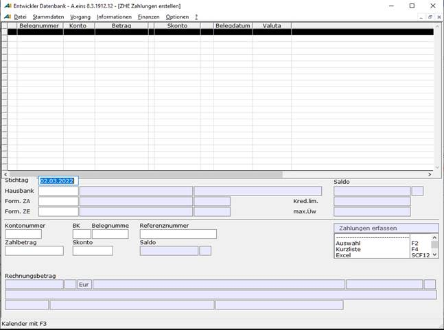

# Zahlungen erstellen

<!-- source: https://amic.de/hilfe/zahlungenerstellen.htm -->

Hauptmenü > Mahn-,Zahl-, Zinswesen > Zahlungsverkehr > Zahlungen erstellen

Direktsprung **[ZHE]**

Die Aufgabe dieser Programmfunktion besteht darin, zügig Einzelzahlungen zu erstellen. Auch können hier Akontozahlungen, also Zahlungen, die sich nicht auf einen offenen Posten beziehen durchgeführt werden. Mit Anwahl dieses Menüpunktes erscheint folgende Erfassungsmaske:

Der **Stichtag** ist der Tag, auf den sich die sich der Skonto und bei arbeiten mit Fremdwährung die Währungskurse beziehen.  
Nach Anwahl der **Hausbank**, für die der Beleg erstellt werden soll, werden Saldo, maximaler Überweisungsbetrag und Kreditlimit angezeigt.  
Anschließend können die vorgeschlagenen [Zahlungsformulare](./stammdaten_zahlungsverkehr/zahlungsformulare.md) für Zahlungseingang bzw. Zahlungsausgang geändert werden. Sind diese Angaben gemacht worden werden diese Felder blau eingefärbt und sind nicht mehr zu ändern.

Man kann die **Kontonummer** angeben, für die die Zahlung erstellt werden soll. Ist diese nicht bekannt, so kann nach Belegnummer bzw. Referenznummer gesucht werden. Es kann jeweils mittels der **F3** Auswahl nach Belegen nach verschiedenen Gesichtspunkten (Belegnummer, Betrag, Datum, Referenznummer, Bezeichnung) gesucht werden.  
Gehört der ausgewählte Kunde / Lieferant zu einer Obligogruppe, so existiert in der **F3**\-Auswahl zu der Beleg- bzw. Referenznummer eine weitere Variante „Obligokunden nach Belegnummer“. Dort werden dann alle OP’s aller Kunden dieser Obligogruppe angezeigt. Wählt man einen OP eines anderen Kunden der Obligogruppe aus, so wird die Kontonummer mit übernommen.

Will man eine Akontozahlung erfassen, so ist die Kontonummer ein Pflichtfeld. Man überspringt dann Belegnummer und Referenznummer. Es erscheint dann statt diesen Feldern ein Feld, dass es ermöglicht einen Hinweistext für die Akontozahlung einzutragen. Dieser Text muss bei Akontozahlungen angegeben werden und erscheint dann zum Beispiel beim DTA. Bleibt das Feld leer, so erscheinen wieder die Felder Belegnummer und Referenznummer.

Hat man nun die geforderten Informationen angegeben wird gegebenenfalls der Betrag des offenen Postens vorgeschlagen. Bei Akontozahlungen kann man Betrag und Sollhabenkennzeichen beliebig eingeben.  
Ändern und Löschen lassen sich die einzelnen Zeilen wieder, nachdem man Sie entweder mit der Maus oder mit Strg und den Pfeiltasten (Cursortasten) markiert hat.

In den Feldern unterhalb von **Rechnungsbetrag** werden weitere Informationen zum Beleg bzw. zum Kunden/Lieferanten angezeigt. Diese wären (von links oben beginnend): Rechnungsbetrag, Sollhaben der Rechnung, Währung, Kundenbezeichnung, Saldo des Kunden/Lieferanten, Textzeile im Beleg, Bankleitzahl, Bank Identifier Code BIC (Swift), Bankbezeichnung, Bankkontonummer sowie IBAN.

Einrichterparameter:

| | Beschreibung |
| --- | --- |
| Betragsrundung bei Sollbelegen / Habenbelegen | Hier lässt sich einstellen, auf wie viel Stellen nach dem Komma der Zahlungsbetrag gerundet werden soll. Die Differenz wird dann dem Skontobetrag zugerechnet. Diese Einstellung kann getrennt für Soll und Habenbelege vorgenommen werden.  
    
 |
| Skonto trotz Datumsüberschreitung festlegen | Diese Option sorgt dafür, ob der Skonto auch bei abgelaufenem Skontodatum angezeigt wird oder nicht.  
    
 |
| Mehrfache Belegauswahl zulassen?" | Hier kann festgelegt werden, ob man gleichzeitig einen oder mehrere Belege auswählen will.  
 |
| Stichtag und Periode prüfen | Wird hier eine Art der Prüfung angegeben, die mit **F3** ausgewählt werden kann, so wird beim Betreten der Erfassungsmaske zuerst die Periode abgefragt. Das Datum, welches man anschließend als Stichtag angibt wird dann entsprechend der Einstellung getestet.  
 |
