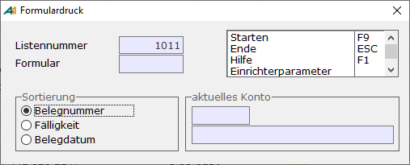

# Zahlungsvorschläge bearbeiten

<!-- source: https://amic.de/hilfe/zahlungsvorschlgebearbeiten.htm -->

Hauptmenü > Mahn-,Zahl-, Zinswesen > Zahlungsverkehr > Zahlungsvorschläge bearbeiten

Direktsprung **[ZHVB]**

In der Anwendung „Zahlungsvorschläge bearbeiten“ werden automatisch und manuell erstellte Zahlungsvorschläge aufgelistet. Für die mögliche Weiterverarbeitung geben die Spalten Verfahren und Hinweistext Auskunft. Eventuelle Probleme der Bankverbindung werden in der Spalte Hinweistext ausgegeben und können so gezielt abgearbeitet werden.

In der Spalte Verfahren können folgende Werte stehen:

- Auslandszahlungsverkehr: Die OP’S werden über den Auslandszahlungsverkehr beglichen. Im Hinweistext kann noch ein Problem in der Bankverbindung aufgelistet sein.
- SEPA: Wenn alle für SEPA erforderlichen Daten korrekt sind, werden die OP‘s im SEPA-Verfahren abgewickelt.
- Leer: Die OP’s können im DTA-, DTINT-Verfahren oder zum Scheckdruck freigegeben werden. Im Hinweistext stehen dann Hinweise, warum diese nicht mit dem SEPA-Verfahren abgewickelt werden können.

Folgende Funktionen stehen für die Bearbeitung zur Verfügung:  
    

Zahlungsvorschlagsliste

Es kann ein Crystal-Report der Zahlungsvorschläge gedruckt werden. Dieser Report lässt sich nach Listennummer und nach Kontonummer eingrenzen.

Liste über Formular – F8

Es lässt sich auch ein Formular einrichten, das dann die Zahlungsvorschläge auflistet. Innerhalb dieses Formulars, das die aktuell angewählte Liste druckt, lässt sich die Sortierung wählen.

Zahlungsvorschläge ändern – F5

Es erscheinen die Positionen des Zahlungsvorschlags in einer weiteren Auswahlliste. Dort stehen dann einige Funktionen zur Bearbeitung zur Verfügung:

- ***Löschen*** **F7****: Es** können einzelne Positionen oder der gesamte Bereich zu diesem Kunden/Lieferanten aus dem Zahlungsvorschlag gelöscht werden.
- ***OP-Auswahl*** **F6** öffnet eine Liste mit weiteren offenen Posten, die noch nicht zur Zahlung vorgesehen sind. Von hier aus können weitere OPs in den Vorschlag übernommen werden.
- ***Skonto bearbeiten*** **F5** ist die Möglichkeit, Skonto zu ändern.
- ***Kundenbank ändern*** **Shift+F9** ermöglicht es, die Bank des Kunden zu ändern oder auch neu zu erfassen. Eine Bankverbindung muss hier hinterlegt sein, wenn man Zahlungen per Datenträgeraustausch (DTA) abwickeln möchte. Hier existieren zwei Einrichterparameter:

  1. Im autom. Zahlungsverkehr Sperre und Ablaufdatum bei manueller Auswahl ignorieren: Es kann eingestellt werden, dass Inaktive Bankverbindungen mit herangezogen werden können.

  2. Im autom. Zahlungsverkehr bei diversen Kunden die Bankverbindung nicht speichern: Es wird die Bankverbindung nur im Zahlungsvorschlag hinterlegt und nicht für eine spätere erneute Verwendung in den Kundenbanken hinterlegt. Für das SEPA-Lastschriftverfahren ist dies wegen des Mandats nicht möglich.

- ***DTA-Texte*** **Strg+F8** (Muss über SPA frei geschaltet werden) hier lassen sich für den DTA einige Einstellungen vornehmen.

***•*** ***Archiv Anzeigen*** **Strg+F12**

**•** ***Fibu Merkmale*** **F11** öffnet die Ansicht der im Kundenstamm hinterlegten Merkmale dieses Kunden/Lieferanten.

- Mit &lt; **>** bzw. mit **Strg** und den **Pfeiltasten** kann zwischen den Konten geblättert werden.

Löschen – F7

Der komplette Zahlungsvorschlag kann gelöscht werden. Die OP’s werden wieder in den Status versetzt, den sie vor dem Erstellen der Zahlungsvorschläge hatten. Es kann anschließend also das Erstellen wiederholt werden.

Freigabe - F6

Wenn die Zahlungsvorschläge kontrolliert worden sind, werden sie über diese Funktion zur Zahlung freigegeben. Vor der Freigabe übernimmt das Programm noch einige Tests um den ordnungsgemäßen Ablauf der Zahlung zu gewährleisten. Da bei freigegebenen Zahlungen die Bankverbindung nicht mehr änderbar ist, muss bereits hier festgelegt werden, ob und in welcher Form sie benötigt wird. Daher wird zuerst abgefragt, wofür die Zahlungsvorschläge freigegeben werden sollen:

- Scheckdruck: Es wird nicht geprüft, ob eine Bank dem Zahlungsvorschlag zugeordnet wurde. Es werden **alle** Zahlungsvorschläge freigegeben, egal ob das Programm sie für DTA, SEPA oder Auslandszahlungsverkehr vorgesehen hat, da Scheckdruck immer möglich ist. **ACHTUNG:** Das Kennzeichen, um das es sich handelt - SEPA oder Auslandszahlung - wird zurückgesetzt, so dass der Zahlungsbeleg nicht mehr als SEPA-Zahlung bzw. Auslandszahlungsverkehr ausgeführt werden kann.
- DTA/DTINT: Alle Zahlungsvorschläge, die nicht SEPA bzw. Auslandszahlungsverkehr sind, werden freigegeben, wenn eine Bank vorhanden ist. Zahlungsvorschläge ohne zugewiesene Bank bleiben in der Zahlungsvorschlagsliste.
- SEPA: Es werden nur die bereits als SEPA-Zahlung gekennzeichneten Zahlungsvorschläge freigegeben. Die Bank muss vorhanden sein, BIC, IBAN und ggf. Mandat müssen eingerichtet sein.
- Auslandszahlungsverkehr: Es werden nur die bereits als Auslandszahlung gekennzeichneten Vorschläge freigegeben. Die Bank muss vorhanden sein und BIC und IBAN werden kontrolliert.

Anschließend muss die Hausbank angegeben werden. Hier spielt der Steuerparameter „automatischer Zahlungsverkehr ohne Formularzuordnung“ eine Rolle, wie verfahren wird:

- **Nein**: Es werden die Formularzuordnungen ausgewertet. Sind zu einer Hausbank mehrere Formulare für den Scheckdruck (Stammdaten [Zahlungsformulare](./stammdaten_zahlungsverkehr/zahlungsformulare.md), Direktsprung **[FIZAF]**) hinterlegt, so erscheint nach Angabe der Hausbank ein Fenster, in dem man das für diesen Zahlungsvorschlag zuständige Formular auswählen muss. Ist nur ein Formular hinterlegt erscheint dieses Fenster nicht. Eine Angabe des Formulars ist nur dann notwendig, wenn bei Zahlungsart „Scheckdruck“ ausgewählt wurde.
- **Ja**: Es wird die Formularzuordnung ignoriert und eine Auswahl ist hier nicht möglich. Dieses Verfahren wurde eingeführt da der Scheckdruck im Zuge des elektronischen Zahlungsverkehrs immer mehr an Bedeutung verliert. Die Auswahl des Druckformulars erfolgt erst beim [Scheckdruck](./zahlungen_bearbeiten/index.md#Scheckdruck).

Wenn das Modul „Auslandszahlungsverkehr“ verwendet wird, wird zusätzlich noch abgefragt, ob der Ausführungstermin auf das Erstelldatum gesetzt werden soll. Weitere Informationen findet man unter „[Auslandszahlungsverkehr in A.eins](./auslandzahlungsverkehr_in_a_eins/statistische_merkmale.md)“.

Hat man unter „[Zahlungsvorschläge erstellen](./zahlungsvorschlaege_erstellen.md)“ in den Einrichterparametern eine Datenbankfunktion zur Bestimmung der Kundenbank hinterlegt, so findet vor der Freigabe ein weiterer Testlauf statt, der mit Hilfe dieser Funktion noch einmal die Bank bestimmt und diese mit der Bank im Zahlungsvorschlag vergleicht. Weichen diese Banken voneinander ab, so wird ein Fehlerhinweis ausgegeben und der Vorschlag nicht zur Zahlung freigegeben.
