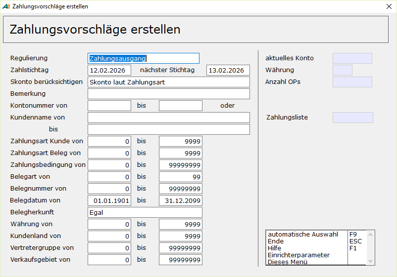

# Zahlungsvorschläge erstellen

<!-- source: https://amic.de/hilfe/zahlungsvorschlgeerstellen.htm -->

Hauptmenü > Mahn-,Zahl-, Zinswesen > Zahlungsverkehr > Zahlungsvorschläge erstellen

Direktsprung **[ZHVE]**

Der Ablauf zum Erstellen und Bearbeiten der Zahlungsvorschläge wurde überarbeitet. Die Auswahlmöglichkeit „Zahlungsausgang SEPA“ und Zahlungseingang SEPA“ sind entfallen. SEPA Zahlungen werden auch über Regulierungsart „Zahlungsausgang“ bzw. „Zahlungseingang“ abgewickelt. Die Prüfungen der Bankverbindungen führen jetzt nicht mehr dazu, dass der Zahlungsvorschlag für dieses Konto nicht erstellt wird. Stattdessen werden die Problemfälle in der Zahlungsvorschlagsliste angezeigt und man hat die Möglichkeit diese Daten direkt hier zu korrigieren. Erst bei der [Freigabe](./zahlungsvorschlaege_bearbeiten.md#Freigabe) der Zahlungsvorschläge werden die Daten entsprechend den Einstellungen noch einmal geprüft und ggf. abgewiesen.

Nach Anwahl des Programmpunktes wird sofort in einen Bildschirm verzweigt, auf dem verschiedene Werte abgefragt werden:

Über die Einstellung **Regulierung** kann man bestimmen, ob Zahlungsausgang oder -eingang behandelt werden soll. Debitorische und Kreditorische Fragen werden hierbei nicht abgegrenzt.  
Zahlungsausgang Ausland wird wie Zahlungsausgang behandelt, jedoch werden hier nur OPs herangezogen, die für den Auslandszahlungsverkehr gekennzeichnet sind. Genauere Hinweise befinden sich im Teil [Auslandszahlungsverkehr](./auslandzahlungsverkehr_in_a_eins/index.md).

Der **Zahlstichtag** steuert zusammen mit dem **nächsten Stichtag**, welche Belege vorgeschlagen werden. Dabei ist der **nächste Stichtag** das Datum, welches zusammen mit den Bankarbeitstagen aus den Epas bestimmt, wann Belege gezogen werden. Es werden die Belege gezogen, deren Valuta- bzw. Skontodatum **vor** dem **nächsten Stichtag** (plus Bankarbeitstage. Siehe unten) liegt.

Ist im Feld **Skonto berücksichtigen** der Wert „OPs nur laut Valuta heranziehen“ eingetragen, so wird die Skontofrist nicht berücksichtigt, d.h. das Skonto-Datum wird für die Auswahl ignoriert. Sollte die Skontofrist für die so ausgewählten OPs nicht abgelaufen sein, so wird trotzdem Skonto gewährt. Auch wird bei Verrechnung von Gutschriften ggf. Skonto gewährt. Zusätzlich spielen bei SEPA-Lastschriften noch folgende Einrichterparameter eine Rolle:

- SEPA-Bankarbeitstage vor Fälligkeit bei Erstlastschrift (Standardeinstellung ist 5)
- SEPA-Bankarbeitstage vor Fälligkeit bei Folgelastschrift (Standardeinstellung ist 2)
- SEPA-Bankarbeitstage vor Fälligkeit bei Firmenlastschrift (Standardeinstellung ist 1)
- SEPA-Bankarbeitstage vor Fälligkeit bei Eillastschrift (Standardeinstellung ist 1)
- SEPA-Maximale Vordatierung des Ausführdatums (Kalendertage) (Standardeinstellung ist 15)

Bei Standard-Überweisungen wird immer ein Bankarbeitstag angenommen, bei [Echtzeitüberweisung](./stammdaten_zahlungsverkehr/zahlungsart.md) wird kein Bankarbeitstag bei der Bestimmung der Fälligkeiten verwendet.

Bei Bankarbeitstagen handelt es sich um alle Tage bis auf Samstage, Sonntage sowie die Feiertage Neujahr, Karfreitag, Ostermontag, 1. Mai, 1. Und 2. Weihnachtsfeiertag. Handelt es sich bei dem ausgewählten Verfahren um SEPA-Lastschrift, so wird bei der Auswahl der fälligen OPs je nachdem um was es sich handelt, die entsprechende Anzahl zu den Stichtagen hinzugezählt. Wenn man auch die Laufzeit berücksichtigen will, so kann man hier die Werte ändern. Die hier vorgenommen Einstellung beeinflusst auch das beim SEPA-DTA verwendete Ausführungsdatum.

    
**Bemerkung** ist lediglich ein Text für den Vorschlag, der das Wiederauffinden erleichtern soll.

    
Danach wird der **Kontobereich** bestimmt, für den die Vorschlagsliste erstellt werden soll. Hierbei hat man alternativ die Möglichkeit nach Kontonummern oder nach dem Namen der Kunden den Bereich einzugrenzen.

    
Der Vorschlag kann auf bestimmte **Zahlungsarten** (z.B. Scheckzahlung) eingegrenzt werden, und zwar entweder nach der Zahlungsart, die im Kundenstamm hinterlegt ist(Zahlungsart Kunde) oder nach der Zahlungsart, die im Beleg hinterlegt ist.

**Hinweis:** *Hierbei ist zu beachten, dass immer die Zahlungsart des Kunden gezogen wird, es sei denn man grenzt die **Zahlungsart Beleg** ein – also anstelle von 0 bis 9999 z.B. von 1 bis 9999.*

    
Die restlichen Eingrenzungskriterien bis auf Kundenland, Vertretergruppe und Verkaufsgebiet sind alle auf die Belege bezogen.  
    

Alle beim Erstellen vorgenommenen Eingrenzungen werden zur besseren Rückverfolgung in der Tabelle „Zahlvorschprotokoll“ zwischengespeichert.

Automatische Auswahl

Mit der Funktion ***automatischen Auswahl*** **F9** werden dann alle zahlungsfähigen Belege je Konto und Währung in die Vorschlagsliste übernommen. In der rechten Spalte des Bildschirms werden immer das aktuelle Konto, die Währung, die Anzahl der zu *untersuchenden* OP’s und die aktuelle Nummer der Zahlungsvorschlagsliste angezeigt. Wenn hier ein Kunde erscheint, bedeutet dies nicht automatisch, dass auch alle oder Teile der OP’s in der Zahlungsvorschlagsliste erscheinen, da erst anschließende geprüft wird, ob diese den Kriterien laut Einstellungen in den [Stammdaten](./stammdaten_zahlungsverkehr/index.md) (Verrechnung u.ä.) entsprechen.

Beim Erstellen der Zahlungsvorschläge werden die Daten aus den Kundenbanken direkt in die Zahlungsvorschläge und später in die Zahlungsbelege übernommen.

Mit Einführung des SEPA-Verfahrens wird beim Lastschriftverfahren zusätzlich zwischen Basislastschrift und Firmenlastschrift unterschieden. Dies wird nicht mehr so wie früher die Einzugsermächtigung bzw. der Abbuchungsauftrag in den Zahlungsarten hinterlegt, sondern im [Mandat](./sepa/sepa_mandat_fuer_lastschriften.md).

Durch die Unterscheidung zwischen den einzelnen Währungen kann es dazu kommen, dass ein Zahlungsvorschlag erstellt wird, obwohl der Saldo des Kunden 0 ist, wenn die OPs in unterschiedlichen Währungen vorliegen. Unter Einrichterparameter gibt es für dieses Problem den Parameter „*Bei Fremdwährung auf nicht verrechnete OPs testen*“. Dieser steht standardmäßig auf **Nein**. Wenn er auf **Ja** geändert wird, so wird für jeden Kunden geprüft, ob noch Belege in einer anderen Währung vorliegen, die nicht verrechnet werden und es wird eine entsprechende Meldung ausgegeben.  
    

Manuelle Auswahl

Zusätzlich existierte bis Version 8.0.1.201 die Möglichkeit einer **manuellen Auswahl**, die jedoch schon länger nicht mehr unterstützt wird. Dieser Menüpunkt wurde jetzt komplett gestrichen. Anstelle dieses Verfahrens sollte die [Zahlmappe](./zahlmappe.md) verwendet werden.

Kundenbank

Die Bank, die für den Kunden verwendet wird, wird aus den im Kundenstamm hinterlegten Kundenbanken automatisch bestimmt und kann später geändert werden. Sind für einen Kunden mehrere Banken hinterlegt, so wird die Bank genommen, bei die als Standardbank gekennzeichnet ist. Ist keine Bank gekennzeichnet, so wird die erste nicht gesperrte gültige Bank genommen. Dieses Verfahren kann mit einer eigenen privaten Datenbankfunktion überschrieben werden. Die Datenbankfunktion wird beim Einrichterparameter „Datenbankfunktion zur Bestimmung der Kundenbank” hinterlegt.

    
Diese Datenbankfunktion hat drei Eingabeparameter und muss den BankKontoZaehler aus der Tabelle Kundenbank zurückliefern. Liefert sie einen nichtexistierenden BankKontoZaehler zurück, so wird die Meldung „Die Datenbankfunktion … liefert ungültigen Bankkontozähler“ ausgegeben und die Verarbeitung abgebrochen. Liefert sie 0 zurück, wird das Standardverfahren zur Bestimmung der Bankverbindung angewendet. Bei einem Wert kleiner als 0 wird im Protokoll „Die Datenbankfunktion … konnte für den Kunden … keine eindeutige Bank zuweisen.“ ausgegeben. Hier wird lediglich der OP nicht verarbeitet. Da die Struktur so ausgelegt ist, dass die Funktion pro OP eines Kunden eine Bank bestimmen kann, kann es auch vorkommen, dass diese Meldung für einen Kunden öfter erscheint.

create FUNCTION P_GETKUNDBANK ( in in_FiBuV_Id integer,

 in in_FiBuV_PosZaehler integer,

 in in_KundId integer)

\--

returns Integer

BEGIN

 declare dc_Ergebnis integer;

 set dc_Ergebnis \= 0;

\-- Hier die individuelle Bestimmung des Bankkontozaehler implementieren

 return dc_Ergebnis;

END

Fehler, die mit einer Zahl kleiner 0 zurückgeliefert werden, sollten ins Fehlerprotokoll geschrieben werden, damit man dort die genauere Ursache nachlesen kann.
