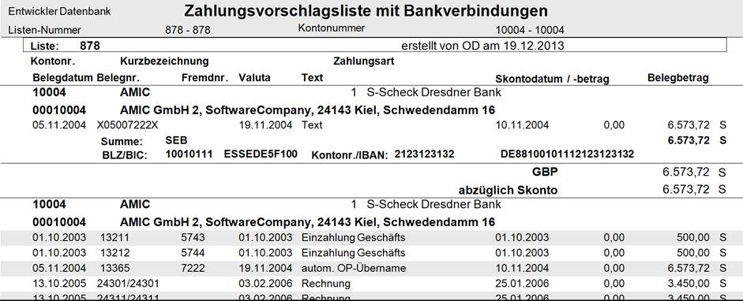

# Zahlvorschläge drucken

<!-- source: https://amic.de/hilfe/zahlvorschlgedrucken.htm -->

Hauptmenü > Mahn-,Zahl-, Zinswesen > Zahlungsverkehr > Zahlvorschlagsliste

Es ist möglich, eine Liste der Zahlvorschläge über einen Crystal –Report zu drucken. In diesem Report kann sowohl nach Liste, als auch nach Kontonummer eingegrenzt werden.

Zusätzlich existiert noch eine Möglichkeit sich über ein Formular vom Typen 201 selber eine Liste zu erstellen und zu drucken. Dafür existiert ein Vorlageformular mit der Nummer -19. Aufgerufen wird diese Liste in

Hauptmenü > Mahn-,Zahl-, Zinswesen > Zahlungsverkehr > Zahlvorschläge bearbeiten > Liste über Formular

**Hinweis:** *Diese Liste enthält keine Informationen über die Bankverbindung und wird nicht weiter gepflegt.*

Folgende Formularbereiche werden dabei verwandt!

- Zahlkopf Formularkopf
- Zahlfolgekopf Überschrift der nächsten Seiten
- Zahlposition Einzelne Zeile
- Zahlfuß Seitenende
- Zahlabschluss Seitenende der letzte Seite
- Zahlsummenkopf Überschrift Pro Konto
- Zahlsummenfuß Summenzeile Pro Konto

Folgende Variablen sind in allen Teilen (Kopf, Fuß und Zeilentyp) verfügbar. Formularbereiche, die nicht separat mit aufgeführt werden, enthalten nur Festtext oder diese Felder!

| Bezeichnung | Typ | Nr. | Bedeutung |
| --- | --- | --- | --- |
| Zahllistnummer | Numerisch | 4 | Nummer der aktuell gedruckten Zahlungsliste |
| Zahllistbezeich | Text | 3 | Bezeichnung der Zahlvorschlagsliste |
| Zahllistdatum | Datum | 5 | Erstellungsdatum |
| Bedienerid | Numerisch | 4 | Id des Bedieners, der diese Liste erstellt hat |
| Bedienerkurz | Text | 3 | Kurzbezeichnung -“- |
| Bedienername | Text | 3 | Name -“- |

- 503 Positionszeile

| Bezeichnung | Typ | Nr. | Bedeutung |
| --- | --- | --- | --- |
| Zahlartid | Numerisch | | |
| Zahlvorposbetrag | Numerisch | | Betrag der Zahlung ( Siehe FiBuVP_Betrag) |
| Zahlvorposdatum | Datum | | |
| Zahlvorposskonto | Numerisch | | Gezogener Skonto ( Siehe FiBuVP_SkoBetrag) |
| ZahlVorPosSH | Text | | Sollhabenkennzeichen |
| FiBuV_Id | Numerisch | | Intern |
| FiBuV_PosZaehler | Numerisch | | Intern |
| FiBuVP_BuchTyp | Numerisch | | Buchungstyp |
| Fibuv_klasse | Text | | Belegklasse (ZA AR AG ER EG.....) |
| FiBuV_Nummer | Text | | Belegnummer |
| NumKreisnummer | Numerisch | | Nummernkreis aus dem sich diese Nummer |
| FiBuV_NumNummer | Numerisch | | Numerischer Anteil der Belegnummer |
| FiBuV_FremdNr | Text | | Referenznummer |
| Perinumer | Numerisch | | Buchungsperiode |
| JahrNummer | Numerisch | | Jahrnummer |
| FiBuVPW_Kurs | Numerisch | | Kurs |
| FiBuV_ErfDatum | Datum | | Erfassungsdatum |
| Waehrungsnummer | Text | | Kurzbezeichnung der Währung |
| ZahlBedNummer | Numerisch | | Zahlungsbedingung |
| FiBuVP_SollHaben | Text | | Sollhabenkennzeichen Des Betrages |
| FiBuVP_SkoBetrag | Numerisch | | Skontobetrag der Rechnung |
| FiBuVPW_SkoBetrag | Numerisch | | Skontobetrag in Fremdwährung |
| FiBuVP_Betrag | Numerisch | | Betrag ( Siehe MahnVorPosBetrag) |
| FiBuVPW_Betrag | Numerisch | | Betrag in Fremdwährung falls Währung &lt;> Zentralwährung sonst wie Standardwährung |
| FiBuVP_ValDatum, | Datum | | Fäligkeitsdatum |
| FiBuVP_SkoDatum | Datum | | Skontodatum |
| FiBuVP_Text | Text | | Belegtext |
| FIBuVP_AuszKennz | Numerisch | | Auszifferungskennzeichen |
| FiBuVP_AuszDatum | Text | | Datum der Auszifferung |

- 511 Gruppenkopf

| Bezeichnung | Typ | Nr. | Bedeutung |
| --- | --- | --- | --- |
| ZahlartId | Numerisch | | Mahngruppe |
| Zahlvordatum | Datum | | Datum |
| Zahlvorbetrag | Numerisch | | Gesamtbetrag |
| Zahlvorsollhaben | Numerisch | | **S**oll oder **H**aben |
| KontoNummer | Numerisch | | |
| Kundbezeich | Text | | |
| Adressort | Text | | |
| AdressPLZ1 | Text | | |
| AdressOrtsTeil | Text | | |
| AdressStrasse | Text | | |
| AdressTelefon | Text | | |
| AdressTelefax | Text | | |
| AdressAnrede | Text | | |
| AdressVorname | Text | | |
| Adressname | Text | | |
| Saldo | Numerisch | | Gesamtsaldo zum Zeitpunkt des Druckes |
| SaldoSH | Text | | Sollhabenkennzeichen zum Zeitpunkt des Druckes |

- 512 Gruppenende (Summen)

| Bezeichnung | Typ | Nr. | Bedeutung |
| --- | --- | --- | --- |
| Summe | Numerisch | | Summe Betrag |
| SummeSH | Numerisch | | Sollhabenkennzeichen der Summe |
| SummeSko | Numerisch | | Summe Skontobeträge |
| SummeSkoSH | Numerisch | | Sollhabenkennzeichen der Skontobeträge |
| ZahlVorBetrag | Numerisch | | Gesamtbetrag |
| ZahlVorSollHaben | Numerisch | | Soll oder Haben |
| AbStufe1 bis AbStufe9 | Numerisch | | Summe aller Positionen mit Stufe größer als n (1-9) |
